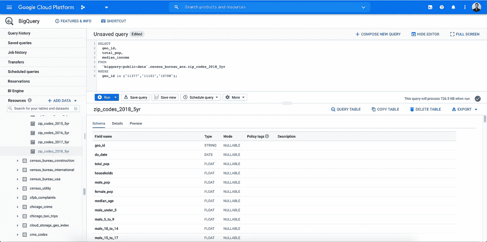
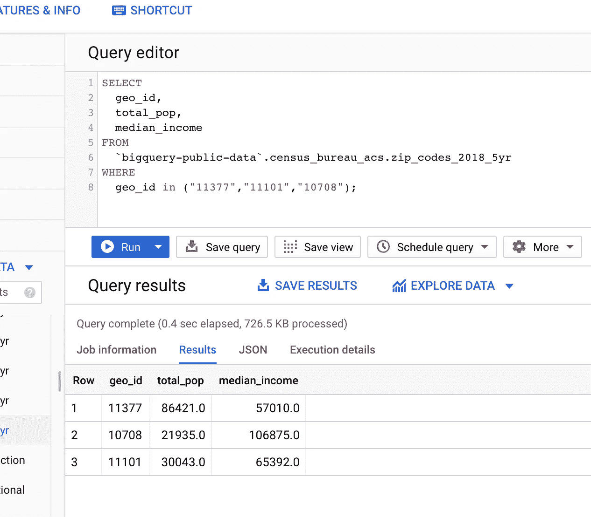
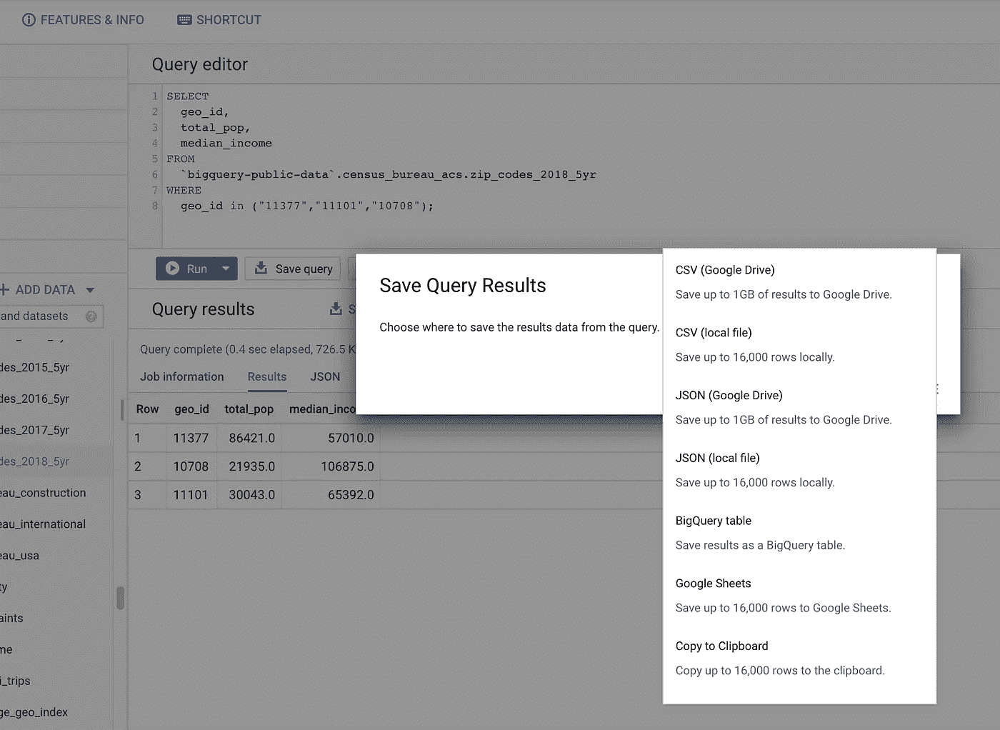

# 使用 BigQuery 轻松扩充数据

> 原文：<https://towardsdatascience.com/painless-data-augmentation-with-bigquery-da1e30002af3?source=collection_archive---------37----------------------->

## 使用 BigQuery 公共数据快速扩充数据集


由[卢卡斯·布拉塞克](https://unsplash.com/@goumbik?utm_source=medium&utm_medium=referral)在 [Unsplash](https://unsplash.com?utm_source=medium&utm_medium=referral) 拍摄的照片

对于数据科学家来说，Google Cloud 的 BigQuery 是一个很好的工具，可以快速轻松地用外部数据扩充他们的数据集。具体来说，BigQuery 有一个来自各种不同来源的公共数据集的列表。你需要的只是一个谷歌云账号和一些基本的 SQL 知识。

<https://cloud.google.com/bigquery/public-data> [## BigQuery 公共数据集|谷歌云

cloud.google.com](https://cloud.google.com/bigquery/public-data) 

以下是一些有用的公共数据集:

*   [美国人口普查局美国社区调查](https://console.cloud.google.com/marketplace/product/united-states-census-bureau/acs)
*   [来自谷歌的新冠肺炎数据](https://console.cloud.google.com/marketplace/product/bigquery-public-datasets/covid19-public-data-program)
*   [NOAA 全球天气数据](https://console.cloud.google.com/marketplace/product/noaa-public/gsod)
*   [大都会博物馆的公共领域艺术品](https://console.cloud.google.com/marketplace/product/the-metropolitan-museum-of-art/the-met-public-domain-art-works)
*   [比特币交易数据](https://console.cloud.google.com/marketplace/product/cmorqs-public/cmorq-bcd-data)

# 一个简单的例子

我认为 BigQuery 公共数据集中最有用的一个是美国人口普查 ACS 数据，它给出了按地理位置(按州、邮政编码、县等)细分的多年数据。).

它有许多重要的人口统计信息，如人口(按年龄、种族、性别、婚姻状况等细分)。)，教育水平，就业，收入等等。

例如，假设我想查询 NYC 地区三个邮政编码的总人口和家庭收入中值。有一个名为`zip_codes_2018_5yr`的表格给出了 2018 年人口普查数据的 5 年估计，按邮政编码细分。

我的查询看起来是这样的:

```
SELECT 
  geo_id, -- Where geo_id is the zip code
  total_pop,
  median_income
FROM 
  `bigquery-public-data`.census_bureau_acs.zip_codes_2018_5yr
WHERE 
  geo_id in ("11377","11101","10708");
```

我可以在 BigQuery UI 中运行它…



BigQuery UI 的屏幕截图

并得到以下结果…



在 BigQuery UI 中查看查询结果

太好了！我在 0.4 秒内得到了答案，现在我可以返回并扩展我的查询来获得多年的数据。或者，我可以将结果导出到 CSV 或 JSON 文件，将其与我的数据连接起来。



显示 BigQuery 结果导出选项的屏幕截图

最后，作为奖励，您可以通过 Python 使用以下包连接到 BigQuery:

  

# 链接/延伸阅读

*   [关于 BigQuery 的更多信息](https://googleapis.dev/python/bigquery/latest/index.html)
*   [BigQuery 的公共数据集](https://cloud.google.com/bigquery/public-data)
*   [BigQuery SQL 语法](https://cloud.google.com/bigquery/docs/reference/standard-sql/query-syntax)
*   [从 Python 查询 BigQuery 表](https://googleapis.dev/python/bigquery/latest/index.html)

感谢阅读！如果您觉得这很有帮助，如果您有任何注释、问题或者您有喜欢的 BigQuery 公共数据集，请告诉我。

你可以通过 Medium、Twitter 或 LinkedIn 联系我！