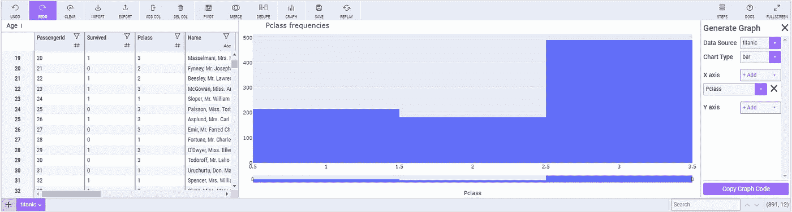

# 使用米托轻松加速 Python 中的数据分析

> 原文：<https://towardsdatascience.com/painlessly-speed-up-your-data-analysis-in-python-with-mito-2b79de4f2f46?source=collection_archive---------12----------------------->

## 一种快速清理、过滤和可视化电子表格格式 Python 数据的方法


米克·豪普特在 [Unsplash](https://unsplash.com?utm_source=medium&utm_medium=referral) 上的照片

# 您的旅程概述

1.  [设置舞台](#deb8)
2.  [安装米托](#cfb2)
3.  [mito sheets 的基础知识](#c479)
4.  [用米托清洗数据](#21eb)
5.  [用米托过滤数据](#1eea)
6.  [用米托可视化数据](#d9af)
7.  [包装](#5245)

# 1 —搭建舞台

我一直在寻找可以帮助加快数据分析探索阶段的新工具。尽管您应该对您选择的工具有信心，但是与可能改进您的过程的新工具保持同步也是很好的。

几周前，我偶然发现了米托，这是一个能让你在 Jupyter 笔记本上使用 excel 电子表格的工具。我最初的反应是，这似乎是一种倒退；如果需要 excel，那就用 excel。否则，使用更多代码繁重的工具，如 Pandas 来完成这项工作。然而，我对米托与笔记本电脑环境的融合感到惊喜😃

在这篇博文中，我想向你展示米托作为你的数据分析工具链中的一个便利工具可以做些什么。具体来说，我将使用米托着重完成以下三项任务:

*   清理数据，
*   过滤数据，
*   可视化数据。

我将把米托和你们在熊猫身上做的事情进行对比。正如您可能怀疑的那样，这两种工具各有优缺点。读完这篇博文后，你就可以决定是否要将米托的一些功能应用到你的日常工作流程中。

**声明:** *我不以任何方式赞助或隶属于米托、熊猫或与这些软件在同一领域的任何其他软件。*

# 2 —安装米托

安装米托相当简单:首先需要在终端或命令提示符下运行以下命令:

```
python -m pip install mitoinstaller
```

现在你已经下载了米托安装程序。要运行米托安装程序，请使用以下命令:

```
python -m mitoinstaller install
```

如果有问题，可以查看[常见安装错误](https://docs.trymito.io/getting-started/installing-mito/common-install-errors)页面。

**重要:** *你需要 3.6 或更高版本的 Python 才能运行米托。如果您的 Python 版本是 3.5 或更低，那么您将严重错过其他 Python 特性，如*[*data classes*](https://www.youtube.com/watch?v=OdBF3W1MIWw)*。如果可能的话，将您的 Python 发行版升级到最新的稳定版本。*

# 3 —有丝分裂表的基础

要开始使用米托，请打开一个 JupyterLab 笔记本，并编写以下代码:

```
import mitosheet
mitosheet.sheet()
```

如果上一步中的安装正确，那么您应该会在笔记本中看到以下 GUI(图形用户界面)弹出:


您现在已经打开了一个空的米托工作表。在继续之前，您可能想看看米托 GUI 中的标题。有用于导入和导出数据、添加和删除列、绘制数据、合并数据等的按钮💪

因此，正如您可能已经猜到的，将数据输入米托的一种方法是使用 GUI 中的 import 按钮。这将打开一个文件浏览器，您可以在其中选择要导入到米托的文件(如 CSV 文件)。

更常见的方法是使用 Pandas 中的导入功能，如`read_csv()`来导入数据。之后，数据帧被传入米托电子表格。让我们使用经典的泰坦尼克号数据集来探索如何处理米托的数据。这里可以下载泰坦尼克号数据集[，但是不需要手动下载！只需运行:](https://raw.githubusercontent.com/datasciencedojo/datasets/master/titanic.csv)

```
import pandas as pdtitanic = pd.read_csv("[https://raw.githubusercontent.com/datasciencedojo/datasets/master/titanic.csv](https://raw.githubusercontent.com/datasciencedojo/datasets/master/titanic.csv)")titanic.head()
```

很酷，对吧？不是每个人都知道熊猫函数`read_csv()`可以接受 URL🔥

现在你需要做的就是写下:

```
import mitosheet
mitosheet.sheet(titanic, view_df=True)
```

您应该看到以下内容:


您已成功将数据集加载到米托。不要害怕四处点击，看看你是否能自己理解米托的一些功能。事实上，米托的一个吸引力在于它提供的许多功能是不言自明的。

在接下来的部分中，您将使用米托的泰坦尼克号数据集来了解一些很酷的功能！

# 4-使用米托清理简单数据

泰坦尼克号数据集中有一些缺失的数据。让我们关注列`Embarked`，它缺少两个值。要查找丢失的值，您可以通过单击`Embarked`列标题中的过滤符号对`Embarked`列进行排序。然后，您应该会看到以下菜单:


现在，您可以选择排序选项`Ascending`并按下高亮按钮`Filter/Sort`。然后应该对已装载的列进行排序。更重要的是，您现在会发现顶部缺少`Embarked`值的两行:


缺少`Embarked`值的两个乘客是[小姐。陈月娇·伊卡德](https://www.encyclopedia-titanica.org/titanic-survivor/amelia-icard.html)和[乔治·尼尔森·斯通夫人](https://www.encyclopedia-titanica.org/titanic-survivor/martha-evelyn-stone.html)。通过他们泰坦尼克号幸存者网页的链接，你可以看到他们都是在南安普顿登上泰坦尼克号的。事实上，小姐。陈月娇·伊卡尔德是乔治·尼尔森·斯通夫人的女仆😮

你如何改变`Embarked`中缺失的两个条目来包含这个新信息？只需像在 excel 表格中一样点击条目，并使用南安普敦的`S`更新信息！当只有几个条目需要更改时，这比手动编写 pandas-query 要快。

最酷的事？如果你在米托工作表下面的单元格中查找，那么熊猫代码已经自动生成用于再现:

```
# Set column Embarked at index 829 in titanic to S
titanic.at[829, 'Embarked'] = "S"# Set column Embarked at index 61 in titanic to S
titanic.at[61, 'Embarked'] = "S"
```

米托给了我们熊猫函数`.at()`，这比更常用的`.loc()`熊猫函数更快。令人惊叹的是，像米托这样的图形工具生成的代码比许多开发人员在旅途中编写的熊猫代码更具性能。

像`age`这样的其他列有许多缺失值。在这种情况下，使用 Pandas 以适当的方式填充这些值可能会更容易，比如使用`.isna()`这样的函数。同时使用熊猫和米托进行数据清理是一种有效的组合😃

# 5-使用米托过滤数据

正如您在上一节中看到的，虽然您可以使用米托处理简单的缺失值，但米托的主要优势在于我在数据探索中的选项。想根据条件检查某一列的某些值吗？这在米托做起来既快又简单。

假设您只想查看为旅行支付超过 20 美元的乘客。这时你可以做的是点击`Fare`列标题中的过滤符号来得到过滤菜单:


您可以在这里添加一个过滤器，并指定如何进行过滤。因此，您可以创建以下过滤器:


按下突出显示的按钮`Filter/Sort`应用过滤器！在米托的电子表格单元格下面，你可以看到漂亮的熊猫布尔索引代码:

```
# Filtered Fare in titanic
titanic = titanic[titanic['Fare'] > 20]
```

对于泰坦尼克号数据集，有很多过滤选项可供选择。我建议你试着过滤掉一些，看看米托有多简单。

# 6-使用米托可视化数据

作为最后一个展示，使用米托可以非常轻松地显示数据集中的各种要素。按下米托 GUI 顶部的`Graph`按钮开始。然后，您将看到弹出以下窗口:


您现在可以选择`Chart Type`以及`X axis`和`Y axis`的值。例如，让我们尝试一个条形图(默认)，并为`X axis`选择`Pclass`(乘客等级):



上图不是世界上最美的。但是请记住，它应该主要用于数据探索，而不是最终结果数据可视化。你可以很容易地看到大多数乘客乘坐三等舱。

尝试一些其他的可视化。米托有四种内置酒吧类型:

*   条形图，
*   直方图，
*   箱线图，
*   和散点图。

所有的情节都是 Plotly 编的。*在我的选择中，这些图应仅用作初始数据勘探。对于用于演示的可视化工具，我会推荐 Seaborn 或 PowerBI 等工具。*

# 7 —总结

我发现米托有助于简单的数据清理、过滤和探索性的数据可视化。在某些情况下，米托生成的代码非常有性能，这很好。米托也可能对有更多商业分析背景的人有所帮助。

如果你需要了解更多关于米托的信息，那么请查阅米托文档。

**喜欢我写的？**查看我的其他帖子，了解更多 Python 内容:

*   [用漂亮的类型提示使你罪恶的 Python 代码现代化](/modernize-your-sinful-python-code-with-beautiful-type-hints-4e72e98f6bf1)
*   [用 Python 可视化缺失值非常简单](/visualizing-missing-values-in-python-is-shockingly-easy-56ed5bc2e7ea)
*   【SymPy 符号数学快速指南
*   [5 个能在紧要关头救你的牛逼数字功能](/5-awesome-numpy-functions-that-can-save-you-in-a-pinch-ba349af5ac47)
*   5 个专家提示，让你的 Python 字典技能一飞冲天🚀

如果你对数据科学、编程或任何介于两者之间的东西感兴趣，那么请随意在 LinkedIn 上加我[并向✋问好](https://www.linkedin.com/in/eirik-berge/)