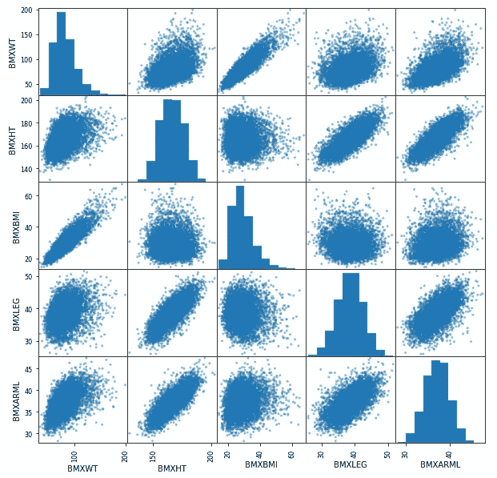

# 详细的 Pair plot 和 PairGrid

> 原文：<https://towardsdatascience.com/pair-plot-and-pairgrid-in-details-f782975032ea?source=collection_archive---------12----------------------->


Amir-abbas Abdolali 在 [Unsplash](https://unsplash.com?utm_source=medium&utm_medium=referral) 上拍摄的照片

## 用真实数据演示 Pandas 和 Seaborn 库中的配对图

当我第一次学习绘制 pairplots 时，我在每个项目中都使用了一段时间。我仍然经常使用它们。配对图是一个图中的几个二元分布，可以只用一个简单的函数来制作。即使是最基本的，在有几个连续变量的数据分析项目中也非常有用。我们知道散点图被广泛用于表示两个连续变量之间的关系。配对图将几个散点图放在一个图中，并提供对角分布。这篇文章是关于如何制作不同风格的 Pairplots 的教程。

本文将涵盖:

1.  使用 Pandas 和 Matplotlib 配对绘图
2.  使用 Seaborn 库的更时尚和信息丰富的配对图
3.  使用“PairGrid”功能制作更动态的配对图

## 资料组

我使用了这个著名的数据集，叫做“nhanes”数据集。我发现它很有用，因为它有很多连续和分类的特征。请随意从该链接下载数据集，以便跟进:

[](https://github.com/rashida048/Datasets/blob/master/nhanes_2015_2016.csv) [## rashida 048/数据集

### 在 GitHub 上创建一个帐户，为 rashida048/Datasets 开发做出贡献。

github.com](https://github.com/rashida048/Datasets/blob/master/nhanes_2015_2016.csv) 

如果这个数据集对您来说是新的，列名可能看起来有点奇怪。但是不用担心。当我使用它们时，我会解释它们的含义。

## 配对图

让我们先导入数据集

```
import pandas as pd
df = pd.read_csv("nhanes_2015_2016.csv")
```

数据集相当大。因此，我不能在这里显示截图。这些是数据集中的列:

```
df.columns
```

输出:

```
Index(['SEQN', 'ALQ101', 'ALQ110', 'ALQ130', 'SMQ020', 'RIAGENDR', 'RIDAGEYR', 'RIDRETH1', 'DMDCITZN', 'DMDEDUC2', 'DMDMARTL', 'DMDHHSIZ', 'WTINT2YR', 'SDMVPSU', 'SDMVSTRA', 'INDFMPIR', 'BPXSY1', 'BPXDI1', 'BPXSY2', 'BPXDI2', 'BMXWT', 'BMXHT', 'BMXBMI', 'BMXLEG', 'BMXARML', 'BMXARMC', 'BMXWAIST', 'HIQ210'], dtype='object')
```

我们将从使用 Pandas 库的最基本的“pairplot”开始。它在熊猫图书馆被称为“散点矩阵”。

在此之前，我应该提到我将使用数据集的一部分。因为如果我使用了太多的特征，不管你叫它什么，散点图或配对图都不会有太大的帮助。里面的每个情节都会太小。本演示选择了五个连续变量:“BMXWT”、“BMXHT”、“BMXBMI”、“BMXLEG”、“BMXARML”。它们代表人口的体重、身高、身体质量指数、腿长和臂长。

我们需要从 pandas 的库中导入 scatter_matrix，然后简单地使用 scatter_matrix 函数。

```
import matplotlib.pyplot as plt
from pandas.plotting import scatter_matrixscatter_matrix(df[['BMXWT', 'BMXHT', 'BMXBMI', 'BMXLEG', 'BMXARML']], figsize = (10, 10))
plt.show()
```

输出:



作者图片

你从给定的变量中得到所有组合的二元散点图。每个变量都与其余变量相对应。对角线图是每个变量在 scatter_matrix 函数中的分布。

使用 seaborn 库可以获得相同的图。如你所知，seaborn 库有一些默认的风格。所以，最基本的 pairplot 也比 scatter_matrix 更时尚一些。我没有选择直方图，而是选择了密度图作为对角线图。

我将绘制对角线的密度图，只是有一点变化。所以，我将指定' diag_kind = 'kde '。如果你想保持直方图，只要避免指定任何东西。因为默认类型是直方图。

```
import seaborn as sns
d = df[['BMXWT', 'BMXHT', 'BMXBMI', 'BMXLEG', 'BMXARML']]
sns.pairplot(d, diag_kind = 'kde')
```


作者图片

下一个图包括这个默认图的另一个变量。这一次，我将通过性别变量分离 pair 图中的所有图。同时，我使用 alpha 参数和边缘颜色添加了一些透明度。

```
d = df[['BMXWT', 'BMXHT', 'BMXBMI', 'BMXLEG', 'BMXARML', 'RIAGENDR']]sns.pairplot(d, diag_kind = 'kde', hue = 'RIAGENDR', plot_kws={'alpha':0.5, 'edgecolor': 'k'})
```

输出:


作者图片

Paiplot 和 scatter_matrix 都基于散点图。PairGrid 给它带来了更多的灵活性。

## 配对网格

使用 PairGrid，可以生成一个空网格。以后你可以随心所欲地把它装满。让我们来看看实际情况:

```
g = sns.PairGrid(df, vars = ['BMXWT', 'BMXHT', 'BMXBMI', 'BMXLEG', 'BMXARML'], hue = 'RIAGENDR')
```

这行代码将提供一个空网格，如下所示:


作者图片

现在，我们将填满那些空盒子。我将使用直方图的对角线图，其余的将保持散点图一样。它不一定是散点图。它可以是任何其他二元图。我们一会儿会看到一个例子:

```
g.map_diag(plt.hist, alpha = 0.6)
g.map_offdiag(plt.scatter, alpha = 0.5)
g.add_legend()
```


作者图片

我们使用性别参数来分离图，以使用“色调”参数来分别查看男性和女性的分布和散点图。接下来的图使用连续变量作为色调参数。我选择了“BPXSY1 ”,这意味着收缩压。我还将向数据集添加一个条件。我将只使用 60 岁以上的人的数据。

```
g = sns.PairGrid(df[df["RIDAGEYR"]>60],
   vars = ['BMXWT', 'BMXHT', 'BMXBMI', 'BMXLEG',  'BMXARML'], hue = "BPXSY1")g.map_diag(sns.histplot, hue = None)
g.map_offdiag(sns.scatterplot)
g.add_legend()
```


作者图片

你可以看到散点图中的点有不同的阴影。颜色越浅，收缩压越低，颜色越深，收缩压越高。

看啊！下面的三角形和上面的三角形有几乎相同的情节。如果你只是切换下面三角形的坐标轴，你会得到上面三角形的坐标图。因此，如果您希望在 Pairplot 的下三角形和上三角形中看到不同类型的图，PairGrid 提供了这种灵活性。对于 pairplot 的上三角形，我们只需要提到 map_upper，对于下三角形，我们只需要提到 map_lower。

```
g = sns.PairGrid(df[df["RIDAGEYR"]>60],
    vars = ['BMXWT', 'BMXHT', 'BMXBMI', 'BMXLEG', 'BMXARML'],
                hue = "RIAGENDR")g.map_lower(plt.scatter, alpha = 0.6)
g.map_diag(plt.hist, alpha = 0.7)
```

这将只绘制对角线和下面的三角形。


作者图片

让我们把上面的三角形也填满。我会用阴影绘制密度图。

```
g.map_upper(sns.kdeplot, shade =True)
```


作者图片

我认为在两个三角形中有两种不同类型的图比几乎相同的图更有用。

同样，如果你不想要任何其他类型，你可以完全避免上面或下面的三角形。这里我使用 diag_sharey = False 来避免上面的三角形。

```
g = sns.PairGrid(df[df["RIDAGEYR"]>60], diag_sharey = False, corner = True, vars = ['BMXWT', 'BMXHT', 'BMXBMI', 'BMXLEG', 'BMXARML'],
hue = "RIAGENDR")g.map_lower(plt.scatter, alpha = 0.6)
g.map_diag(plt.hist, alpha = 0.7)
```

输出:


作者图片

在这里！三角完全没了！

## 结论

在这里，我试图介绍几种不同的方法来制作和使用 pairplots。我还引入了 PairGrids，使 pair 图更加灵活。希望这是有帮助的，您将尝试更多的样式和选项的文档。

以下是相同内容的视频:

请随时在 Twitter 上关注我。

## 更多阅读

[](/an-ultimate-cheatsheet-of-data-visualization-in-seaborn-be8ed13a3697) [## 用 Python 的 Seaborn 库实现数据可视化的终极指南

### 对学习者来说也是一个很好的资源

towardsdatascience.com](/an-ultimate-cheatsheet-of-data-visualization-in-seaborn-be8ed13a3697) [](/exploratory-data-analysis-visualization-and-prediction-model-in-python-241b954e1731) [## Python 中的探索性数据分析、可视化和预测模型

### 在 Python 中使用 Pandas、Matplotlib、Seaborn 和 Scikit_learn 库

towardsdatascience.com](/exploratory-data-analysis-visualization-and-prediction-model-in-python-241b954e1731) [](/a-complete-step-by-step-tutorial-on-sentiment-analysis-in-keras-and-tensorflow-ea420cc8913f) [## 关于 Keras 和 Tensorflow 中情感分析的一步一步的完整教程

### 用于数据准备、深度学习模型开发和训练网络的完整工作代码

towardsdatascience.com](/a-complete-step-by-step-tutorial-on-sentiment-analysis-in-keras-and-tensorflow-ea420cc8913f) [](/an-overview-of-performance-evaluation-metrics-of-machine-learning-classification-algorithms-7a95783a762f) [## 机器学习(分类)算法性能评价指标综述

### 开发一个分类模型和计算所有流行的性能评估指标使用…

towardsdatascience.com](/an-overview-of-performance-evaluation-metrics-of-machine-learning-classification-algorithms-7a95783a762f) [](/three-very-useful-functions-of-pandas-to-summarize-the-data-491b64db9370) [## 熊猫总结数据的三个非常有用的功能

towardsdatascience.com](/three-very-useful-functions-of-pandas-to-summarize-the-data-491b64db9370)