# 用于数据预处理的熊猫备忘单

> 原文：<https://towardsdatascience.com/pandas-cheat-sheet-for-data-preprocessing-cd1bcd607426?source=collection_archive---------3----------------------->

## 关于如何用熊猫预处理数据的实用指南


图片来源:斯蒂芬妮·克莱帕奇

# 你的“带回家的信息”是什么？

通过这篇文章，你会学到以下方法:

*   导入和导出数据
*   获取数据概览
*   **处理重复、缺失值、错别字、有比例关系的一对列**

# 介绍

## 背景

理解数据结构及其特征是重要的关键之一，不仅对于创建高度精确的机器学习模型，而且从将其付诸实践的角度来看也是如此。

实际上，预处理数据的过程对于每个数据集都是不同的，需要像定制一样进行。所以我们在建立机器学习模型的时候，大部分时间都花在这部分。

## 我想分享的是

在这篇文章中，我将总结 Pandas 中常用于预处理数据的函数。

我是一名数据科学顾问，**这篇文章基于我为各种公司分析大量数据的经验**。

在这篇文章的底部，我附上了包含我们将使用的 Jupyter 笔记本的链接。

# 导入模块

首先，我们导入以下我们将使用的模块。

*   熊猫
*   Numpy
*   Scikit-learn|load_boston，预处理

```
import pandas as pd
import numpy as np
from sklearn.datasets import load_boston
from sklearn import preprocessing
```

# Jupyter 笔记本中的显示设置

接下来，我们将更改 Jupyter 笔记本中熊猫数据帧的显示行数和列数。

在本例中，我们将显示的行数和列数都设置为 50:

```
pd.set_option('display.max_rows', 50)
pd.set_option('display.max_columns', 50)
```

# 读取数据集

在这里，我们阅读我们将要研究的数据。
例如，scikit-learn 中的 [Boston Housing 数据集将在本文中使用:](https://scikit-learn.org/stable/modules/generated/sklearn.datasets.load_boston.html)

```
boston = load_boston()
df_X = pd.DataFrame(boston.data, columns=boston.feature_names)
df_y = pd.DataFrame(boston.target, columns=['target'])
```

## 读取 CSV 数据

一般来说，您可以通过 CSV 或 Excel 文件读取数据，具体做法如下:

```
df_X = pd.read_csv('boston_X.csv')
```

*   **如果表头不存在:** 您可以通过*添加表头=无*来指定没有表头:

```
df_X = pd.read_csv('boston_X_noheader.csv', header=None)
```

*   **如果索引已经存在:** 可以通过“ *index_col=k* ”将第 k 列指定为索引:

```
df_X = pd.read_csv('boston_X_withindex.csv', index_col=k)
```

## 读取 Excel 数据

熊猫也能接受 Excel(。xlsx)文件:

```
df_X = pd.read_excel('boston_X.xlsx')
```

*   **Select sheet_name** 如果您在一个 excel 文件中有多个工作表，您可以使用“ *sheet_name* 选择要读取的单个工作表:

```
df_X = pd.read_excel('boston.xlsx', sheet_name='sheet_X')
df_y = pd.read_excel('boston.xlsx', sheet_name='sheet_y')
```

# 数据概述

在本节中，我们将查看您已经阅读过的数据帧的概述。

在这里，我们再次读取新数据。然而，**为了练习**，数据的某些部分被有意修改。

```
df_X = pd.read_csv('boston_X_mod.csv')
```

**形状**

使用“shape”检查数据帧的行数和列数。在这个例子中，它是 509 行* 15 列。

```
df_X.shape
```


## 头，尾巴

使用“*头*和“*尾【T3”)检查前 x 行和后 Y 行的内容。*

```
df_X.head(x)
df_X.tail(Y)
```

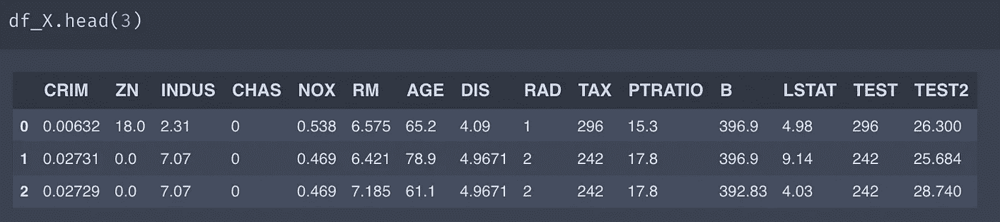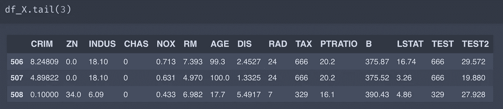

# 获取列名

```
df_X.columns
```

## 如果你想列一张清单

```
df_X.columns.tolist()
```

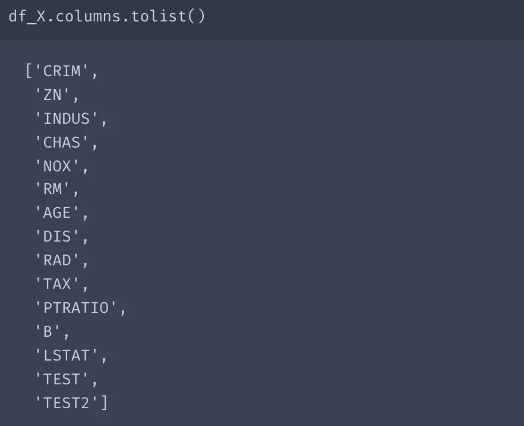

# 重复的行、列

有时，您会面对重复的行或列。(令人惊讶！)在实践中，数据集有时由人工制作或经常由人工组合和校正。因此，我们每次都必须仔细检查副本。

## 行(索引)

如何显示重复的行？下面是怎么做的。

*   显示**复制行的最后一行**:

```
df_X[df_X.duplicated()]
```

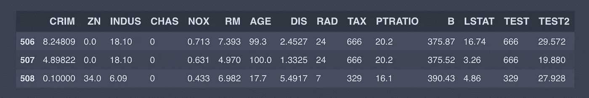

*   显示**复制行的第一行**:

```
df_X[df_X.duplicated(keep='last')]
```

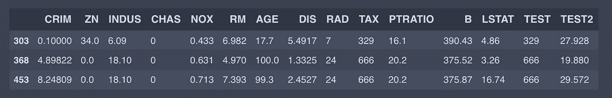

*   显示**复制行的所有行**:

```
df_X[df_X.duplicated(keep=False)]
```

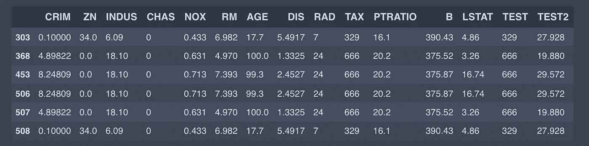

如上所述，由于本文中使用的数据集被有意修改，因此出现了一些重复的行。在本例中，我们找到了 3 对重复的行:303 和 508；368 和 507；453 和 506。

## 圆柱

我们可以使用转置矩阵找到重复的列，就像找到行一样。

显示复制列的所有列:

```
df_X.T[df_X.T.duplicated(keep=False)].T
```

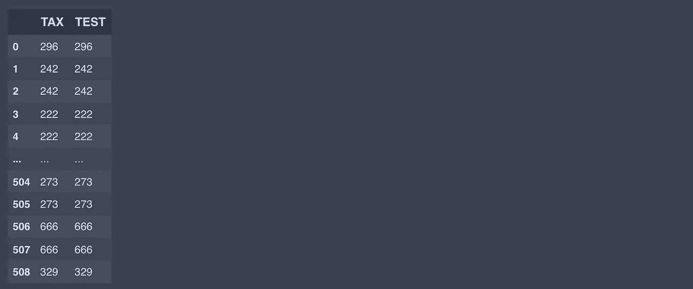

我们发现了我特意创建的重复列“TAX”和“TEST”。我们还可以像显示行一样，只显示第一列或最后一列。“测试”一栏后来被删除。

# 缺少值

## 检查缺少的值

原始数据集的另一个问题是缺少值。首先，我们使用“ *pd.isnull* ”来查看丢失值的位置。

它返回一个布尔格式的数据帧。除此之外，我们可以使用“ *np.where* ”检索相应的行和列:

```
np.where(pd.isnull(df_X))
```

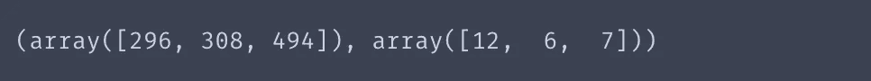

我们发现丢失的值位于[296，12]，[308，6]，[494，7]。检查它们以防万一:

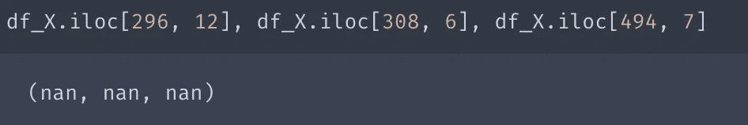

我们确认这些是丢失的值。

## 填补空白

其次，我们必须用一些替代值来替换这些缺失值，这些替代值可能是同一列中的均值或中值，也可能只是 0(这部分是展示您作为数据科学家的技能的好时机！).

使用*替换*，可以用指定的字母和数字替换空白。在这里，我们只是作为一个简单的例子向这些缺失值填充零:

```
df_X.replace(np.nan, 0)
```

我们只是确保丢失的值被替换为零:

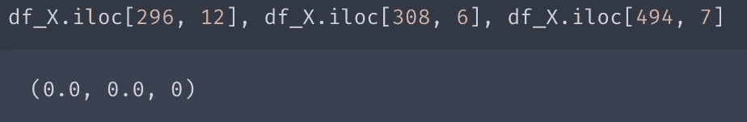

## 检查变量类型以及如何找到错别字

接下来，我们将检查每一列的变量类型。检查变量类型不仅仅是为了“检查”。检查数据集是否包含错别字非常有用，尤其是对于数值。根据我的经验，这种错误已经发生过几次了。

" *dtypes* "显示所有列的变量类型:

```
df_X.dtypes
```

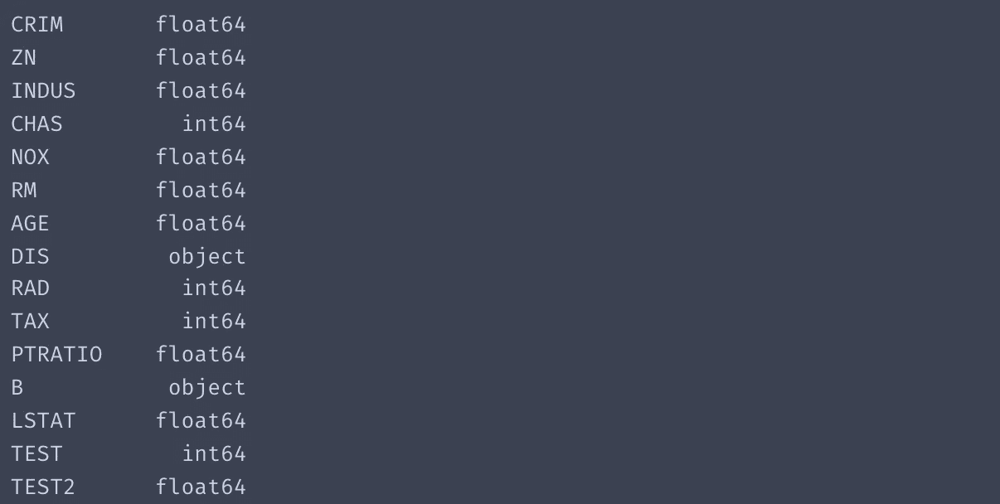

“DIS”(到五个波士顿就业中心的加权距离)和“B”(1000(Bk-0.63)，其中 Bk 是按城镇划分的黑人比例)列似乎不是数字列。但是……等等，再检查一遍数据本身就好了！

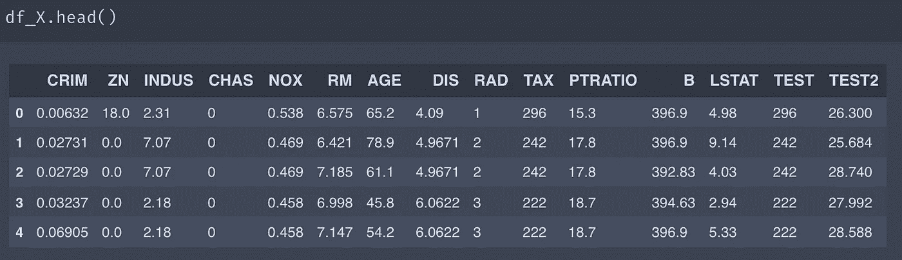

如您所见,“DIS”和“B”列至少在前 5 行包含数值。这意味着这些列中包含了一些数值以外的元素。

在这里，我会告诉你如何找到他们。

首先，在 col_miss 中定义可疑列的列表。然后，提取列中的唯一值，并尝试将每个值转换为数字数据。如果值被恰当地表示为数值，我们就跳过它们。但是，如果这些值不能正确转换，我们将显示这些值:

```
col_miss = ['DIS', 'B']
for i_col in col_miss:
    for j in df_X[i_col].unique():
        try:
            float(j)
        except ValueError:
            print(j)
```

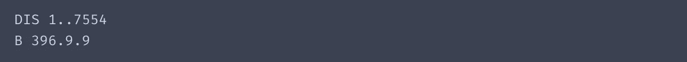

从结果中，我们发现了一个拼写错误 1..DIS 中的 7554 和 b 中的 396.9.9。正确的值分别是 1.7554 和 396.99。

因此，我们将更正这些值:

```
df_X.replace('1..7554', 1.7554)
df_X.replace('396.9.9', 396.99)
```

*   **改变数据类型**

对于“DIS”和“B”列，使用“ *astype* ”将其转换为 float 格式，这是原始数据类型:

```
df_X[['DIS', 'B']] = df_X[['DIS', 'B']].astype(float)
```

# 唯一值的数量

在这里，我们使用“ *nunique* ”来查看每一列中包含多少不同的值(唯一值的数量):

```
df_X.nunique()
```

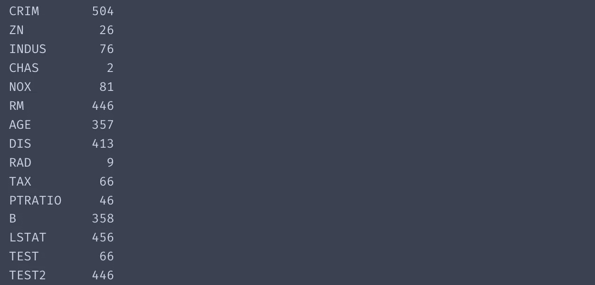

从这些结果中，我们可以看到 CRIM 有 504 个不同的值，而 CHAS 只包含两个不同的值，它坚持使用虚拟变量。

# 比例关系

在上面的内容中，我们确认了重复、缺失值和错别字。然而，即使两列之间的数字不完全匹配，一些列对有时彼此完全成比例。这里，我们通过使用“ *MinMaxScaler* ”对每一列的值进行规范化，来检查这种类型的列对是否包含在数据帧中:

```
mm = preprocessing.MinMaxScaler()
df_float = df_X.loc[:, df_X.dtypes == 'float64']
df_scaled = pd.DataFrame(mm.fit_transform(df_float), index=df_float.index, columns=df_float.columns)
duplicates = df_scaled.T[df_scaled.T.duplicated()]
duplicates.T
```

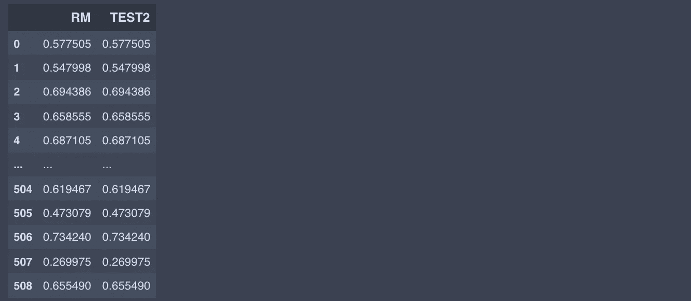

从输出中，我们发现“TEST2”(有意包含的)与“RM”成正比。在机器学习中，这样的比例特征意味着重复，所以我们需要去掉其中的一个。

# 删除列

这里，我们使用“*drop*”:
(axis = 1 表示在列方向上删除)删除了之前发现的重复列“TEST”和“TEST2”

```
df_X.drop(['TEST', 'TEST2'], axis=1)
```

# 形容

清理数据帧后，我们使用“ *describe* ”为数据帧的每一列导出基本统计参数，如平均值、标准偏差、最大值和最小值。

```
df_X.describe()
```

# 出口

数据预处理后，我们要做什么…？当然，救他们！这就是如何将数据帧导出为 CSV 和 Excel 文件。

*   **CSV
    "*index = False*"从输出项目中排除索引**

```
df_X.to_csv('boston_correct.csv', index=False)
```

*   **Excel**

```
df_X.to_excel('boston_correct.xlsx', index=False)
```

# 差不多就是这样！

感谢阅读这篇文章，并希望你喜欢它。我很高兴得到你们所有人的任何评论！

# 编码

[](https://github.com/rkiuchir/blog_TDS/tree/main/01_Pandas_Cheat_Sheet) [## 主页面上的 blog_TDS/01_Pandas_Cheat_Sheet

### 我们使用的数据最初来自这里:https://sci kit-learn . org/stable/datasets/toy _ dataset . html # Boston-dataset ' '……

github.com](https://github.com/rkiuchir/blog_TDS/tree/main/01_Pandas_Cheat_Sheet) 

# 链接

## 其他文章

[](/create-interactive-globe-earthquake-plot-in-python-b0b52b646f27) [## 用 Python 创建“交互式地球仪+地震图”

### 如何在 Python 中创建一个很酷的交互图形:Plotly 绘制的地球仪？

towardsdatascience.com](/create-interactive-globe-earthquake-plot-in-python-b0b52b646f27) [](https://rkiuchir.medium.com/20-background-image-in-python-basemap-using-arcgis-api-78c0d12b93be) [## 20 使用 ArcGIS API 的 Python 底图中的背景图像

### 以下是可使用 ArcGIS API 和 Matplotlib 底图绘制的 20 种不同类型地图的摘要。

rkiuchir.medium.com](https://rkiuchir.medium.com/20-background-image-in-python-basemap-using-arcgis-api-78c0d12b93be) 

## 个人网站

[](https://rkiuchir.github.io/) [## R.木内地震学

### 编辑描述

rkiuchir.github.io](https://rkiuchir.github.io/)