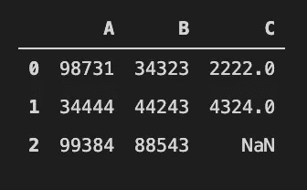

# 熊猫数据争论备忘单 2021

> 原文：<https://towardsdatascience.com/pandas-data-wrangling-cheat-sheet-2021-cf70f577bcdd?source=collection_archive---------7----------------------->


[KOBU 机构](https://unsplash.com/@kobuagency?utm_source=unsplash&utm_medium=referral&utm_content=creditCopyText)在 [Unsplash](https://unsplash.com/s/photos/data?utm_source=unsplash&utm_medium=referral&utm_content=creditCopyText) 上拍摄的照片

要想超越**数据分析** / **数据科学** / **机器学习**在 Python 中，**熊猫**是你需要掌握的库。这里有一个**备忘单**是一些你可能不想错过的最常用的语法。

Pandas 包是当今使用 Python 进行数据科学和分析的最必要的工具。强大的机器学习和迷人的可视化工具可能已经吸引了你的注意力，然而，如果你在**熊猫**中没有良好的技能，你将不会走得很远。

所以今天我收集了一些最常用的熊猫基本功能供你参考。我将从创建数据帧开始，然后是数据整形、字符串查找、值排序等。

# 内容

1.  [数据帧创建](https://medium.com/p/cf70f577bcdd#a90d)
2.  [列重命名](https://medium.com/p/cf70f577bcdd#5ee8)
3.  [数据插入](https://medium.com/p/cf70f577bcdd#33e7)
4.  [数据删除](https://medium.com/p/cf70f577bcdd#2f39)
5.  [处理空值](https://medium.com/p/cf70f577bcdd#838c)
6.  [整形](https://medium.com/p/cf70f577bcdd#0f83)
7.  [基础数据观察](https://medium.com/p/cf70f577bcdd#6e1a)
8.  [查询/检索数据](https://medium.com/p/cf70f577bcdd#08ca)
9.  奖励:处理大数据:

# 数据帧创建

我相信有必要提一下熊猫数据框架的基本结构。说到数据，在大多数情况下，你会有变量和变量的观察值。在 Pandas 中，每个变量存储为一列，而与该变量相关的所有观察值存储为行。例如，如果你对一个变量 A 有 20 个观察值，那么在 Pandas 中，它将被表示为包含 20 行数据的“A 列”。

好了，我们开始吧！

*   **创建空数据框**

```
import pandas as pd
# These are the 3 basic territories in Hong Kong. They are Hong Kong, Kowloon, and the New Territories.col=[‘香港’,’九龍’,’新界’]df = pd.DataFrame(columns=col)
df
```

退货:


一个空列表。

*   使用列表创建数据框架。

就个人而言，我更喜欢以这种方式创建数据框架。

```
col=[‘香港’,’九龍’,’新界’]
ind=[1990,2000,2010]
Data= [[‘98731’,’34444',’99384'],[‘34323’,’44243',’88543'],[‘2222’,’4324',’3432']]df = pd.DataFrame(Data, columns=col, index=ind)
df
```

退货:


*   使用字典创建数据框架。

```
Data= {‘A’:[98731,34444,99384],‘B’:[34323,44243,88543],‘C’:[2222,4324,None]}df = pd.DataFrame(Data)
df
```



熊猫用“无”代表空值。

# 重命名列

```
df = df.rename(columns={“A”:”香港”})df
```

退货:


# 插入

*   **列插入**

```
# inserting column Dd = [“x”,”y”,”z”]df[“D”] = d
df
```

退货:


*   **行插入**

```
# inserting the 4th rownew_row = {“A”:98989,”B”:77889, “C”:None, “D”:”z”}df = df.append(new_row, ignore_index=True)
df
```


# 删除

*   **降一列**

```
# to drop several columns, you can use a list. 
# E.g. df.drop(["C","B"],axis=1)
# to make permanent change, add inplace=True
# dropping column C onlydf.drop(“C”,axis=1)
```


*   **降一排**

```
# to make permanent change, inplace=True
# dropping a row with index "0"df.drop(0)
```


*   **删除重复项**

```
df.drop_duplicates()
```

我们的 df 数据帧保持不变，因为这里没有副本。

# 处理空值

通常，我们的数据中有空值。通常，我们要么去掉那些空值，要么用一些其他有意义的值来代替，例如列的平均值。

*   **检出空值**

```
pd.isnull(df)
```


我们可以看到 c 列中有两个空值。

*   **水平定位空值**

```
# checking horizontally, from Col A to Dpd.isnull(df).any(axis=0)
```


*   **垂直定位空值**

```
# checking vertically, from index 1 to 4pd.isnull(df).any(axis=1)
```


*   **用一些有意义的值填充所有 NaN**

```
df2 = df.copy()df3 = df2**.fillna(0)** # fill with 0df4 = df2.fillna(df**.mean()**) # fill with the mean of the columndf5 = df2.fillna(df**.B.max()**) # fill with the max of colum B
```


在这种情况下，用自己列的平均值填充 C 列中的 NaN 值似乎是最合理的。

# 重塑

数据科学家必须处理的另一个常见问题是数据的形状。由于不同的机器学习模型有不同的数据形状要求，所以我们必须根据模型的要求对数据进行整形。例如，我最喜欢的 LSTM 模型接受三维数据，因此我们需要将大多数二维数据集转换为三维数据集。

*   **将所有列合并成一列**

```
# gather all columns, and all observations into one columnpd.melt(df2)
```


*   **串联—堆叠**

这类似于 SQL 语法中的 UNION ALL。它堆叠具有相同列名的值。

```
# similar to UNION ALL in SQLpd.concat([df,df]) # join vertically
```


*   **并排拼接**

```
# join horizontallypd.concat([df,df], axis=1)
```


*   **分组依据**

这是一种非常流行的技术，出现在许多计算机语言中。在下面的例子中，我们按照 D 列中的字母对数据进行分组，在 b 列中只显示每个数据的总和值。

```
# SELECT B, SUM(B) FROM df GROUP BY D ORDER BY Bdf.groupby(“D”)[“B”].sum()
```


# 基础数据观察

在所有的数据管理和转换之后，是时候检查我们做了什么。

*   **打印前几行**

```
# the default is 5 if you leave the bracket empty
# we are showing the first 3 rows onlydf.head(3)
```


*   **打印最后几行**

```
# the default is 5 if you leave the bracket empty
# we are showing the last 2 rows onlydf.tail(2)
```


*   **随机打印几行**

```
# randomly sampling only 50% of the data setdf.sample(frac=0.5)
```


*   打印数据帧的简明摘要。

```
df.info()
```


*   **生成描述性统计**

这是一个方便而简单的方法，可以直观地定位哪些变量有异常值。

```
# only describing the numerical columns. Column D is a string column, so nothing is shown.df.describe()
```


# 查询/检索数据

在得到我们需要的数据帧的形状/形式后，我们将希望从数据中检索信息。查询功能是 Pandas 中最常用的数据检索功能之一。

*   **排序**

熊猫也有一些 SQL 的特征。在排序中，默认值是升序，这类似于 SQL 在中的顺序。

```
# sort values according to Hong Kong
# default is ascendingdf.sort_values(“香港”, ascending=False)
```


*   **复位索引**

很多时候，在排序之后，我们必须将索引重置为行号。这是它的语法。

```
df.reset_index()
```

*   **一个条件**

```
# returns a dataframe with one condition, which is B has to be bigger than or equal 50000df.query(“B >= 50000”)
```


下面的语法产生相同的结果，只是检索方式不同。

```
df[df[“B”]>=50000]
```

下面的代码只检索列 C，而不是打印整个数据帧。

```
df.C[df[“B”]>=50000]
```


只打印了 C 列的 2 行。

*   **多个条件—“与”**

```
# returns a dataframe with 2 conditions, which are B has to be bigger than or equal 50000, **and** “香港” has to be smaller than 99000.df[(df[“B”]>=50000) & (df[“香港”] < 99000)] # no and
```


*   **多个条件—“或”**

```
# returns a dataframe with 2 conditions, which are B has to be bigger than or equal 50000, **or** “香港” has to be smaller than 49000.df[(df["B"]>=50000) | (df["香港"] < 49000)] # no or
```


*   **串串**

要在数据集中查找字符串，我们可以使用“str.find()”或“str.contains()”。“str.find()”方法返回一个整数值。如果子字符串存在于字符串中，则返回子字符串第一个匹配项的索引。如果字符串中不存在 substring，则返回-1。

对于 str.contains，它返回布尔值 True 或 False。

```
# Within column D, check if "z" exits.print(df[“D”].str.find(“z”))print(df[“D”].str.contains(“z”,case=False))
```


*   **用 loc 和 iloc 选择数据**

```
# return the entire roll
# with a conditional statement
df.loc[df['D'] == 'z']# return the entire first roll
df.loc[0]# select one specific value row label and column label
df.loc[0, "D"]# select specific value row index and column index
df.iloc[0,3]
```


*   **用正则表达式查询**

熊猫中有很多支持 regex 的原生函数，分别是 count()、replace()、contains()、extract()、findall()、match()、split()和 rsplit()。

```
# searching for rows with single letter in D column.df[df[‘D’].str.contains(r’[a-z]+’)] # \D
```


它返回整个数据帧，因为 D 列中的所有变量都是字母。

*   **最大和最小**

```
# Return numbers of rows with the largest and smallestdf.nlargest(2, “B”)
```


```
# Return 2 rows with the smallest number in column Bdf.nsmallest(2, “C”)
```


# 奖励:处理大数据:

Microsoft Excel 只能很好地处理 1000 行数据而不会滞后。但是，如果数据集超过 10k 行，它将经常冻结。对于 Python 熊猫来说，它处理 100 万行没有任何问题(至少我的经验是这么告诉我的，我的设备只是一台 16GB ram 的旧 Macbook Pro)。大数据呢？数据大小大于 1GB 怎么办？或者数据文件太大，根本无法加载到内存中？当然你可以用 Dask，或者 Vaex，但是这次我们还是用熊猫。

对于 Pandas 中的大数据，我们将使用 **chunksize** 在任何给定时间只将文件的一部分加载到内存中。

```
**df = pd.read_csv(’data.csv’, chunksize=10000)**
```

太好了！现在我们刚刚快速复习了熊猫的基本操作，我希望这个小抄能让你在处理熊猫的数据帧时更有信心。

为了便于修改，我把上面提到的所有内容都放在了一个 Jupyter 笔记本文件中。请放心下载:[熊猫数据扯皮小抄 2021 修订文件](https://positivehk.com/wp-content/uploads/2021/04/Data-Wrangling.ipynb_.zip)。

你可能也会对这篇文章感兴趣:[基础营销分析](/fundamental-marketing-analytics-f875018391d5?source=your_stories_page-------------------------------------)

非常感谢您阅读我的文章，我一直在为数字营销、数据分析、分析和 Python 写作。请点击下面的链接来看看。

[数字营销](https://elartedm.com/marketing-blog/):[https://elartedm.com/marketing-blog/](https://elartedm.com/marketing-blog/)

[另一个数字营销和机器学习](https://positivehk.com/category/專欄/digital-marketing-blog/):【https://positivehk.com/category/%E5%B...】T2

数据科学:【https://lorenzoyeung-io.medium.com/ 