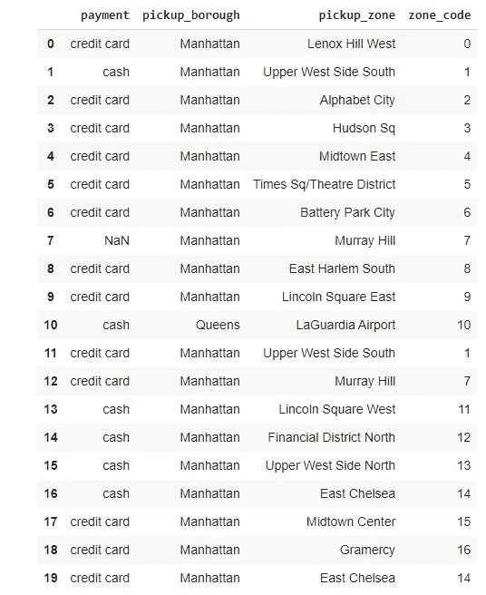
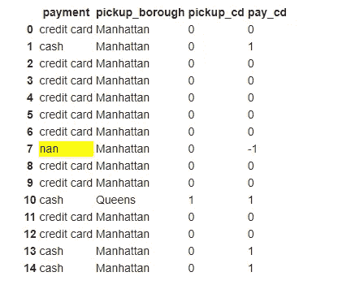
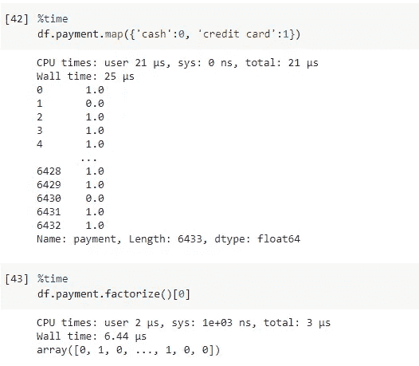

# 熊猫因子分解:从文本到数字的快速通道

> 原文：<https://towardsdatascience.com/pandas-factorize-a-fast-track-from-text-to-numbers-2a343d91b1f9?source=collection_archive---------18----------------------->

## 学习如何使用。来自熊猫的 factorize()方法。


澳大利亚八月在 [Unsplash](https://unsplash.com/s/photos/numbers?utm_source=unsplash&utm_medium=referral&utm_content=creditCopyText) 拍摄的照片

这篇文章只会占用你一分钟的时间，但我相信它可以节省几分钟的数据转换时间。

## 因式分解

`.factorize()`是一个 Pandas 方法，可以帮助你快速地将数据从文本转换成数字。

> 将对象编码为枚举类型或分类变量。[熊猫文档]

很多时候我们需要将一个给定的变量转换成数字，特别是在呈现给某些只需要数字输入的算法之前。因此，有几种方法可以用熊猫来玩这个*把戏*，例如像`map`或`replace`。

## 地图示例

```
import pandas as ps
import seaborn as sns# Load dataset for this example
df = sns.load_dataset('taxis')# slice only some textual columns
df = df[['payment', 'pickup_borough', 'pickup_zone']]# payment unique entries
df.payment.unique()
**[OUT]:** array(['credit card', 'cash', nan], dtype=object)# Using map
df.payment.map({'cash':0, 'credit card':1})
```

当我们只有两个选项时，上面的代码将很好地工作。现在，对于 *pickup_borough* 列，我们已经看到 4 个条目，仍然可以很快完成。不过，还是来看看 *pickup_zone* 一栏。

```
df.pickup_zone.nunique()[OUT]: 194
```

*哎哟……*194 个条目。这将需要一些时间来记录和创建映射字典。即使使用代码来实现这一点也需要时间。

现在让我们在这种情况下使用`.factorize()`函数。

## 因子分解示例

请看下面的内容，`.factorize`将得到一个数组，其中包含每个唯一条目的编号和索引，这样你就知道什么是什么了。因此，0 将是“鲁诺希尔西”，1 是“上西区南”，等等，直到最后一个是“希尔克雷斯特/波莫诺克”。

```
df.pickup_zone.factorize()[OUT]:
(array([ 0,  1,  2, ..., 61, 75, 64]),  
Index(['Lenox Hill West', 'Upper West Side South', 'Alphabet City',         'Hudson Sq', 'Midtown East', 'Times Sq/Theatre District',         'Battery Park City', 'Murray Hill', 'East Harlem South',         'Lincoln Square East',         ...         'Columbia Street', 'Middle Village', 'Prospect Park', 'Ozone Park',         'Gravesend', 'Glendale', 'Kew Gardens Hills', 'Woodlawn/Wakefield',         'West Farms/Bronx River', 'Hillcrest/Pomonok'],        dtype='object', length=**194**))
```

要从因式分解方法中访问数组，请使用切片索引`[0]`。让我们用数字放一个新的栏。

```
# New factorized column
df['zone_code'] = df.pickup_zone.factorize()[0]
```



因子分解列。图片由作者提供。

请注意，我们在第 7 行有一个`NaN`。看看 factorize 是如何处理的。它使用-1。所以，如果需要的话，你可以更容易地摆脱它。

```
df['pay_cd'] = df.payment.factorize()[0]
```



NaN = -1。图片由作者提供。

## 更快的

而且，正如所料，因式分解更快。



两种方法的时间测量。图片由作者提供。

## 在你走之前

当您需要将包含许多唯一条目的列从文本转换为数字时,`factorize`方法非常方便。它也比应用映射字典更快。

它和`map`或者`replace`做的是一样的工作，但是你不需要写字典。

这是因式分解的[文档。](https://pandas.pydata.org/docs/reference/api/pandas.factorize.html)

如果这个内容是有帮助的，你想要更多的内容，请关注我。

<https://medium.com/gustavorsantos> 