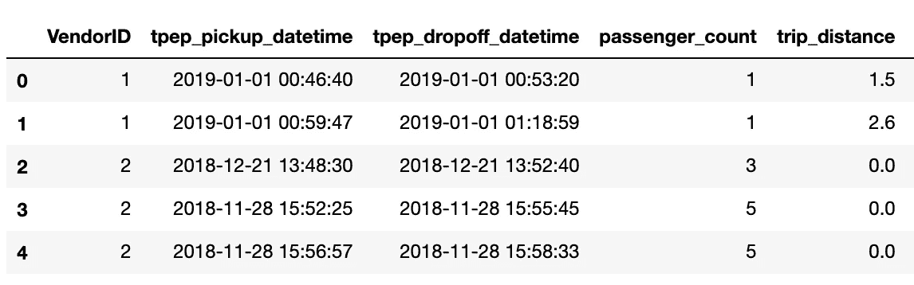
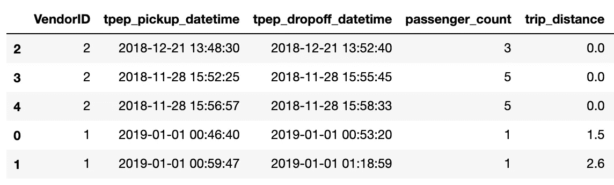
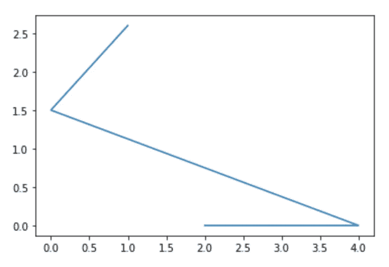
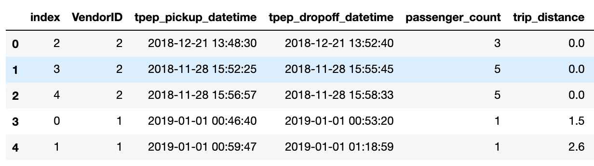
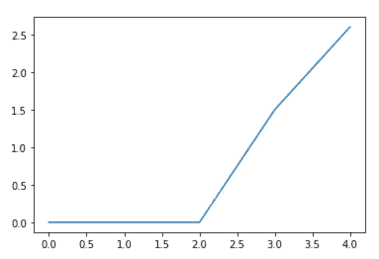
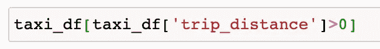

# 每个数据科学家都需要知道的熊猫基础知识

> 原文：<https://towardsdatascience.com/pandas-fundamentals-for-beginners-that-will-help-you-code-like-a-pro-2ff5e34fee09?source=collection_archive---------30----------------------->

## 像专业人士一样提高性能和代码

锡德·巴拉钱德朗在 [Unsplash](https://unsplash.com/?utm_source=unsplash&utm_medium=referral&utm_content=creditCopyText) 上拍摄的照片

*更喜欢看这个？* [*在 YouTube 上查看视频版本。*](https://youtu.be/Lh-VSmzCK-U)

熊猫不是最好的吗？这是一个如此伟大的图书馆，具有如此大的潜力和如此大的灵活性。我记得我刚开始用它的时候。我立刻喜欢上了它。

不要误解我，它确实有一个陡峭的学习曲线。并非所有事情从一开始就显而易见。熊猫有几个棘手的概念。这些事情只需要 20%的努力就能让你达到 80%。

以下是我多年来学到的熊猫的主要工作原理，它们将提高你的编码性能。

# 数据框架和系列是主要的构件

将数据加载到数据框中。数据框由行和列组成。一行是一个数据点，一列是机器学习方面的一个特征。

但是当您仔细观察时，数据框由多个系列对象组成。series 对象基本上是一个列。当您将多个列(或系列对象)加在一起时，您会得到一个数据框。

正如我在 [Pandas 公共函数备忘单](https://www.soyouwanttobeadatascientist.com/pandas-cheat-sheet)中提到的，Pandas 库的大多数函数要么应用于要么返回一个系列对象或一个数据框。

当您意识到这两者之间的区别和关系时，理解数据帧的工作方式就变得容易多了。

# 该指数具有支持作用

**‍** 列是熊猫数据框的星星，但是行也可以用于动作。Pandas 有适用于每一行的内置函数，还提供了遍历行的选项。

索引是标识行的方式。在下面的示例数据框架中，索引是最左侧的数字，以粗体显示。也可以有其他类型的索引，比如 string。

图片由我提供。

即使我们与索引没有太多的关系，我们仍然需要知道它们是如何工作的。有时，index 可能被用作 Pandas 函数中的引用，它需要是正确的。举个例子，如果我将上面的数据帧按***trip _ distance***排序，我会得到这样的结果。您可以看到，索引现在出现了故障。第一个数据点的索引值是 2 而不是 0。

图片由我提供。

这通常不是一个大问题，但是如果您随后想要对以索引为参考的数据框执行操作，您可能会得到意想不到的结果。例如，如果我现在试图绘制 trip_distance 列，我将得到这个奇怪的图形:

图片由我提供。

发生这种情况是因为绘制图的函数将指数作为参考。x 轴是索引，y 轴是 trip_distance 值。于是这个怪异的图形就产生了。

对此有一个非常简洁的解决方案，就是用 ***reset_index()*** 重置索引。所以我们得到了这个数据框架:

图片由我提供。

它再次按 trip_distance 排序，但索引是有序的。不要被有一个名为 index 的列所迷惑。只是旧的指标值。如果不需要，您可以轻松删除该列。

现在，如果我绘制这个数据框，我会得到一个合适的图:

图片由我提供。

# 当您想要更改某些内容时，请考虑数据框的整体

如果你像我一样来自编程背景，你的第一反应会是为你想在数据框中改变的一切写循环(for 或 while)。

例如，如果我想将每个数据点的 passenger_count 增加 1，旧 me 可能会编写一个 For 循环，读取每一行并将乘客计数增加 1。

但是你不必用那种方式对待熊猫。甚至是劝阻。相反，你可以说，嘿，你看到了名为 passenger_count 的列，将所有值加 1。这只用一行代码就可以完成。

这也是因为列本身就是对象。就像在 Python 中把一个整数加 1 一样，你可以把一列中的所有值都加 1。

你当然也可以做更多。在基础数学之上:

*   您可以组合多个列来创建一个新列，
*   您可以更改列的格式，
*   您可以用给定的值来填充缺失的值

还有更多。

主要要点是，当您考虑更改数据框中的内容时，请将整个数据框或至少列视为单独的对象，而不是逐行进行更改。

我在[这篇文章的视频版本](https://youtu.be/Lh-VSmzCK-U)中有更多这样的例子。

# 高效的过滤会节省你很多时间

在熊猫数据帧中过滤数据点是经常需要的。您想要过滤掉数据框中的某些值可能有多种原因:

*   为了只看到数据帧的子集，
*   要在分析中仅使用具有特定值的数据点，
*   排除具有特定值组合的数据点等等。

熊猫让过滤变得超级简单。它由两部分组成:数据框外壳和条件。这些不是正式的名字，是我想出来的。

数据框外壳基本上就是数据框的名称和两个括号。在数据框外壳中，您可以写下您希望包含和排除哪些内容的条件。就像:

my_dataframe[ <this is="" where="" conditions="" go="">]</this>

图片由我提供。

这里有一个例子。如果我只想在一个名为的数据帧中查看具有大于 0 的 ***行程距离*** 的数据点，我将编写如下过滤行:

内部短语是***taxi _ df[' trip _ distance ']>0***是我所说的条件。它返回一个 Series 对象，其中每个值要么为真，要么为假。这取决于相应的 ***trip_distance*** 是否大于 0。

你可以有任何条件。包括比较字符串、检查值是否在某个列表中等等。您可以通过在条件前放置波浪符号(~)来否定条件。您还可以将多个条件用括号括起来，并用逻辑运算符(如& (and)、| (or)进行合并。当你知道你所需要的是:

*   数据帧外壳和
*   为每个数据点/行返回 True 或 False 的条件语句

# 社区永远在你身边

当然，也许他们不是为你个人而存在，但他们一直在为别人而存在，你可以利用他们积累的知识。有如此多的信息、如此多的问题和如此多的答案，我认为几乎不可能提出一个还没有解决的问题。

这就是为什么当我陷入困境时，当我不知道如何做某件事时，我做的第一件事就是用一种非常简单明了的方式在谷歌上写下我试图做的事情。大多数时候，我第一次尝试就能找到问题的答案。

这些只是我学到的一些简单而有效的关于熊猫的基本知识，一旦我学会了，它们让我的生活变得容易多了。所以我想和你分享。

如果你想更深入地了解熊猫，了解一些最常用的功能是如何工作的，请查看我的[熊猫常用功能备忘单](https://www.soyouwanttobeadatascientist.com/pandas-cheat-sheet)。它包括按用途分类的功能定义，一些关于它们工作方式的提示和我给熊猫的一些建议。

祝你的熊猫之旅好运！我希望你和我一样喜欢它！

🐼想了解更多关于熊猫的知识吗？ [*获取我的免费熊猫小抄。*](https://www.soyouwanttobeadatascientist.com/pandas-cheat-sheet)