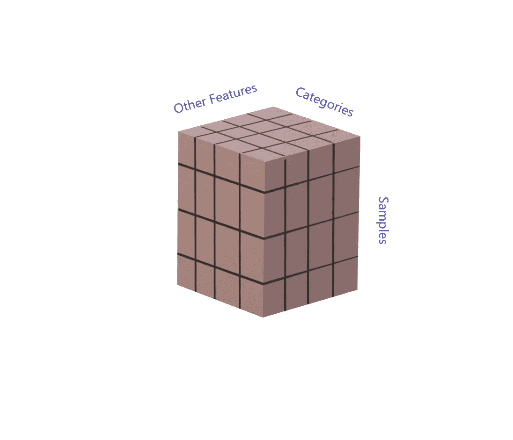
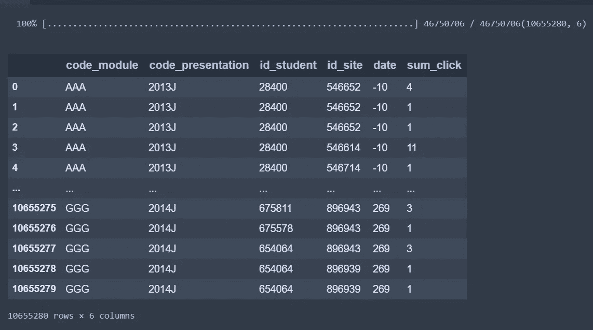
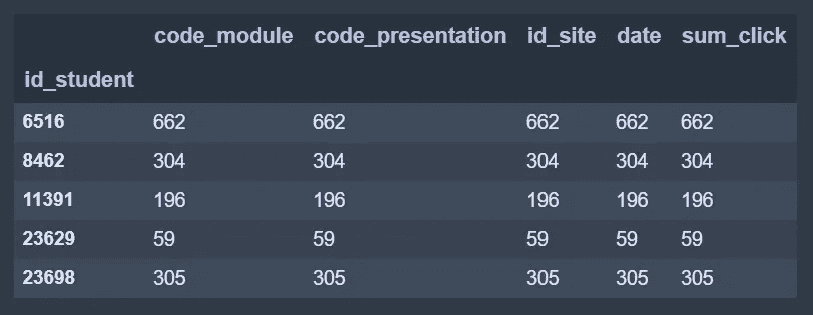
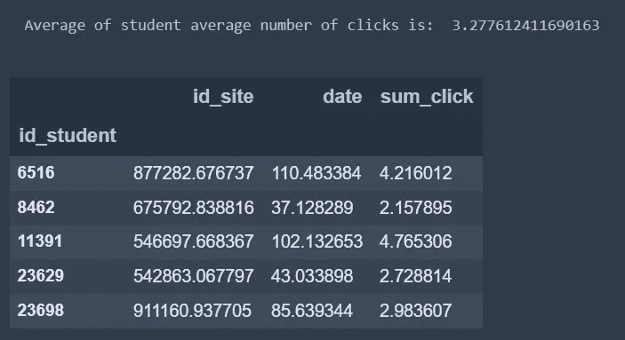
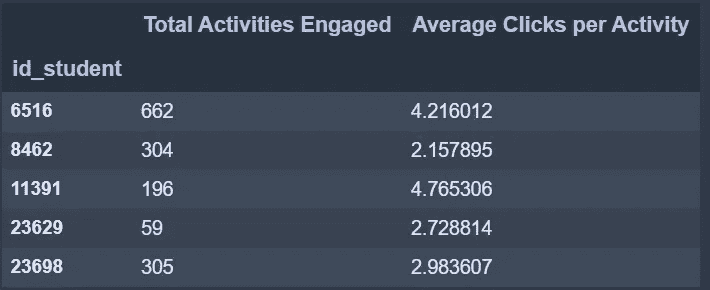
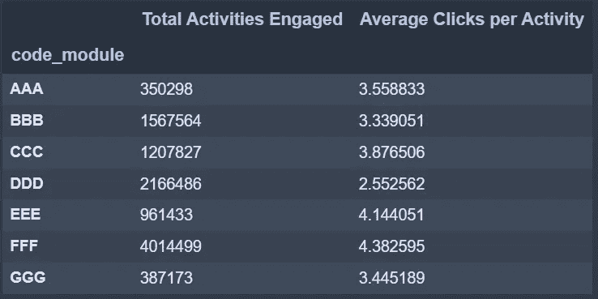
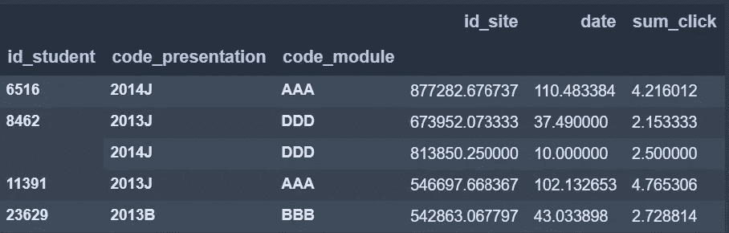
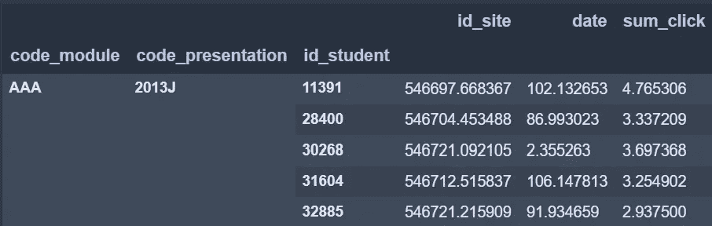
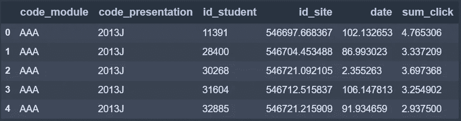
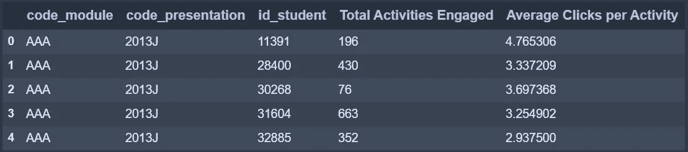

# 熊猫因爱而分组

> 原文：<https://towardsdatascience.com/pandas-groupby-love-5b3bce19c35e?source=collection_archive---------22----------------------->

## 用你的大脑来思考熊猫最强大的统计分析工具之一。


[帕斯卡·米勒](https://unsplash.com/@millerthachiller?utm_source=medium&utm_medium=referral)在 [Unsplash](https://unsplash.com?utm_source=medium&utm_medium=referral) 上的照片

在本教程中，您将学习如何使用 Pandas dataframe `.groupby()`方法和聚合器方法，如`.mean()`和`.count()`，从大型数据集(超过 1000 万行)中快速提取统计数据。还将向您介绍[开放大学学习分析数据集](https://analyse.kmi.open.ac.uk/open_dataset)

# 熊猫

Pandas 是 Python 中最可爱的表格数据管理库。一旦你掌握了它的窍门，它的直观的、面向对象的实现和提高计算效率的巧妙技巧就能实现灵活而强大的数据处理。

Pandas 促进了数据挖掘、数据处理、数据清理、数据可视化，以及对小型到大型数据集的一些基本统计分析。

# 分组依据

Pandas 最重要的分析工具之一是 Pandas DataFrame 对象的`.groupby()`方法。当您将分类数据列的名称传递给 dataframe 的`.groupby(by='column')`时，返回的对象将把分组列中的每个唯一类别作为行的索引，没有分组的其他特征作为列，以及由用于分组的类别组织的样本堆栈的第三维。该方法返回一个新的 groupby 对象，该对象比调用它的对象多一个维度。



作者图片

# 聚合器

聚合器返回一个矩阵，它的维数比它们聚合的维数少一个，并且充满了被压缩维数的所需统计信息。如果`groupby`是 groupby 对象，`groupby.mean()`将返回 groupby 对象分组所依据的每个类别中样本特征的平均值的数据帧。其他聚合器包括:`.count()`、`.sum()`和`.std()`。

**开放大学学习分析数据集**

让我们看看这一切的行动。我将使用来自[https://analyse.kmi.open.ac.uk/open_dataset](https://analyse.kmi.open.ac.uk/open_dataset)的 studentVle.csv 数据。这是一个为期两年的几门课程的匿名在线学习者记录的数据集。我选择的表格记录了学生与虚拟学习环境(VLE)相关的学习活动或资源之间的个人互动。

作为一名数据科学家，我们总是希望明确自己的目标。在这个 groupby 示例中，我想知道每个学生参加了多少活动，以及每个活动的平均点击数。

下面的代码将下载数据集，这个数据集很大，需要一段时间。一旦它下载了数据，它将解压缩文件与学生/VLE 的互动记录。一如既往，我鼓励您将我的示例作为起点，用于您自己的数据。

```
import pandas as pd
import zipfile
import wgeturl = '[https://analyse.kmi.open.ac.uk/open_dataset/download'](https://analyse.kmi.open.ac.uk/open_dataset/download')
# filename = wget.download(url)
zpf = zipfile.ZipFile(filename)
student_vle = pd.read_csv(zpf.open('studentVle.csv'))
student_vle
```

如下所示，这段代码的输出告诉我们有超过 1000 万行数据。每行代表一个学生同时参与的一项活动。数据包括模块、模块演示、学生 id、活动 id、日期和学生在活动中的点击次数。请注意，`date`栏是课程开始日期之后的几天。有关数据的更完整描述，请[访问来源](https://analyse.kmi.open.ac.uk/open_dataset)。那里的团队很棒，工作非常出色。



作者图片

我们不可能实事求是地浏览每一条记录；我们的大脑会爆炸。用 for 循环遍历 1000 万条记录来收集统计数据的计算代价非常高。幸运的是，制造熊猫的天才们已经想出了一些神奇的数组来以惊人的速度汇总统计数据。

# 计数聚合器

让我们从计算每个学生参加的活动数量开始。我们将按`student_id`列分组。如果您和我一样是视觉型的，您可能会想象 groupby 方法将`id_student`列中具有给定编号的所有行一个接一个地堆叠在一起，以生成 3D 表格。当我们在 groupby 对象上调用一个聚合器方法时，这些堆栈中的每一个都展平成我们想要的任何统计数据。在这种情况下，我们将使用`.count()`方法。

```
student_groups = student_vle.groupby('id_student')
activity_counts = student_groups.count()
activity_counts.head()
```

在下面的输出中，您可以看到`id_student`已经成为索引，并且每个原始特征都被聚合到每个学生在数据集中出现的活动参与数量的计数中。



作者图片

如果没有丢失的数据，每一行的数字都是相同的。`.count()`方法返回每个原始列中的计数，但是像`.mean()`这样的方法将只返回数字列。分类的将从结果数据帧中丢失。

# 平均聚合器

我们还想知道学生每次活动的平均点击数，所以我们将使用`.mean()`聚合器方法来收集每个学生的统计数据。它会返回`sum_click`列的平均值，对应的是每个学生每次活动的平均点击次数，以及一些我们不关心的数字。

```
average_clicks = student_groups.mean()print('Mean of median clicks per activity is',    
       average_clicks['sum_click'].mean())average_clicks.head()
```

请注意，这一次我们没有取回模块或表示列，因为它们是绝对的。日期和活动 id 的含义没有意义。



作者图片

如您所见，这些学生每次活动的点击次数的平均值为 3.2，在原始数据集中，我看到了许多 1-click 活动。我猜很多这些活动都是外部资源的链接。

让我们通过一个`pd.merge()`调用将我们想要的统计数据放在一个表中。

```
activities_and_clicks = pd.merge(left=activity_counts['id_site'], 
                                 right=average_clicks['sum_click'],
                                 how='inner',
                                 on='id_student')cols = ['Total Activities Engaged', 'Average Clicks per Activity']
activities_and_clicks.columns = colsactivities_and_clicks.head()
```

我们现在有一个表格，每个学生占一行，一列描述该学生参加了多少活动，另一列描述他们每次活动的平均点击数。



作者图片

这张表给了我们每个学生的具体统计数据。

# 其他分组:

也许我们需要模块或演示的统计数据。我们可以通过改变我们分组的列来得到它们。例如:

```
module_group = student_vle.groupby('code_module')
module_averages = module_group.mean()
module_counts = module_group.count()modules = pd.merge(module_counts['id_site'], 
                                module_averages['sum_click'],
                                how='inner',
                                on='code_module')modules.columns = ['Total Activities Engaged','Average Clicks per Activity']modules
```

这将返回每个模块而不是每个学生的活动计数和点击平均值*的表格。*



作者图片

有些模块的平均点击率比其他模块高得多。为什么 DDD 模块的每项活动平均需要的点击次数比 FFF 模块少 2 次？嗯…

# 多重索引

随着我们越来越了解我们的数据，我们意识到我们犯了一个错误。我们想知道每个学生的平均点击数，但是有些学生同时上多门课，或者多次上同一门课。

在我们的利益相关者澄清了上面的原始问题后，我们真正想要的是每个学生参与了多少活动，以及他们在每次课程演示的基础上平均点击了多少次。换句话说，我们需要每个课程注册的统计数据，而不是每个学生。如果同一个学生复读一个模块或参加多个模块，可能会有多个记录。上面，我们找到了每个模块和每个学生的统计数据，但是让我们看看如何得到每个课程、每个演示、每个学生的统计数据。

稍微补充一下，为同一个学生创建多个记录违反了观察是独立的假设。一些种类的分析需要考虑到有效性。

我们需要按照三个不同的列对数据进行分组:`code_module`、`code_presentation`和`id_student`。幸运的是，`.groupby()`方法允许我们将一列列表传递给`by=`参数。这将为每个传递的列创建一个具有另一个维度的 groupby 对象。你可以用另一种方式来思考它，结果是数据帧的数据帧乘以你传递的列数。下面的代码将创建一个五维的 groupby 对象，然后返回其余特性的每个唯一模块表示注册的平均值。

```
cols = ['id_student','code_presentation','code_module']
reg_groups = student_vle.groupby(cols) reg_averages = reg_groups.mean()
reg_averages.head()
```

dataframe 有三个索引列:id_student、code_presentation 和 code_module。第一个是学生个人，第二个是他们参加课程的学期，第三个是他们参加的课程。



作者图片

你可以看到学生 8462 两次选修了 DDD 模块，一次是在 2013 年 10 月，另一次是在 2014 年 10 月。(字母是月份，所以 J ==第 10 个月。)学生 8462 第一次参加课程时，每项活动的平均点击率为 2.15，第二次为 2.5。他们更努力了吗？参与不同的活动？这是一个更深入分析的机会，但是超出了我们当前任务的范围。让我们把它放在冰箱里待会用。

# 元组索引

如果我们想要索引这个多索引数据帧来检索特定的数据，我们需要使用一个元组作为行索引器。如果我们想知道学生 8462 在 2013 年 10 月 DDD 模块演示期间的每次活动的平均点击数，我们可以这样索引:

```
reg_averages.loc[(8462,'2013J','DDD'), 'sum_click']
```

正如我们所希望的，这将返回 2.15333。

我们还可以颠倒传递给 groupby 方法构造函数的列列表的顺序，以获得不同的数据顺序。让我们翻转`'code_module'`和`id_student`，看看这会如何改变结果。

```
cols = ['code_module','code_presentation','id_student']
groupby_module= student_vle.groupby(cols)module_averages = groupby_module.mean()
module_averages.head()
```

上面的代码首先按照模块，然后按照演示，最后按照学生对统计数据进行分组。我们获得按模块组织的整个班级列表的数据。



作者图片

如果我们想查看模块 BBB 的数据，演示 2014B，我们应该这样索引:

```
module_averages.loc[('BBB','2014B'), 'sum_click']
```

这将返回一个 Pandas 系列，其中包含该群组中所有学生每次活动的平均点击数。有将近 1300 名学生，但这是一所在线大学，所以课程是虚拟的，自定进度，并且可以更大。

# 展平多索引

我希望早点知道的最后一个技巧是如何将多索引表变成单索引表。它实际上非常简单和直观…一旦你已经知道了！

```
flat_module_averages = module_averages.reset_index()
flat_module_averages.head()
```

上述代码将行重新堆叠到 2D 表中，排序方式与显示的 groupby 对象相同。groupby 对象索引变成列，并添加一个新索引。



作者图片

请注意，这与我们第一次只按一列分组时的数据帧不同。在我们的第一个 groupby 对象中，每个学生都是一个样本。当我们使用所有三个列进行分组，然后变平时，我们现在有了每个模块、每个注册、每个学生的平均点击统计数据。

# 摘要

在本教程中，您下载了一个包含 1000 万行学生/虚拟学习环境交互的表格，并使用 Pandas `.groupby()` dataframe 方法以不同方式对数据进行分组。最后，您使用聚合器方法`.count()`和`.mean()`来提取每个学生在一门课程中参与的活动数量以及每个学生每个活动的平均点击数，并将它们返回到一个整洁的表格中。另外，您还学习了如何将多索引数据帧还原为单索引数据帧。

# 全部要点

以下要点汇集了您所学的所有技能，并返回一个单一索引表，显示每个模块的每个演示中每个学生的活动数量和每次活动的平均点击数。

作者代码

预期产出:



作者图片

# 参考资料:

Kuzilek J .、Hlosta M .、Zdrahal Z. [开放大学学习分析数据集](https://www.nature.com/articles/sdata2017171) Sci。数据 4:170171 doi:10.1038/sdata . 2017.171(2017)。