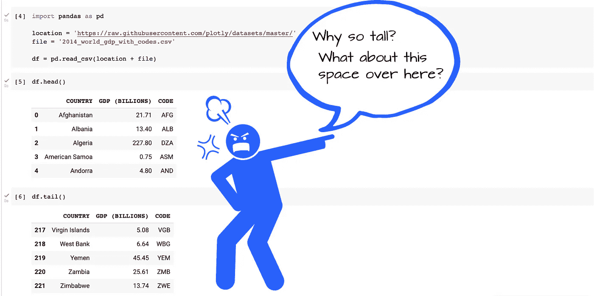
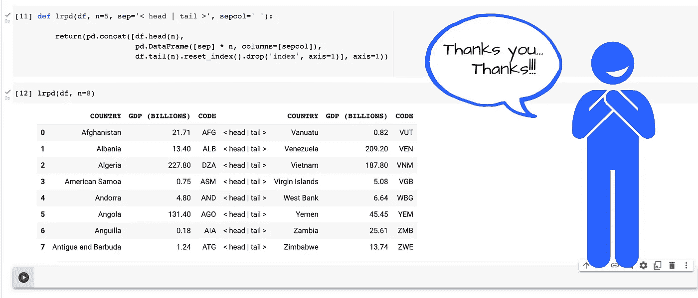
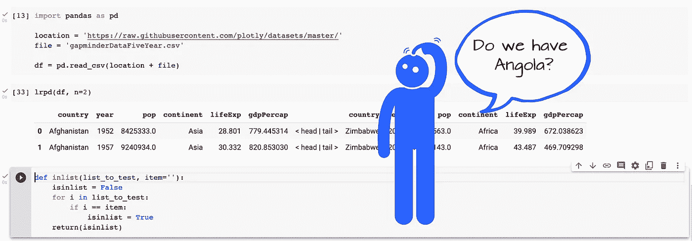

# 熊猫黑客，我希望我有当我开始了

> 原文：<https://towardsdatascience.com/pandas-hacks-that-i-wish-i-had-when-i-started-out-1f942caa9792?source=collection_archive---------6----------------------->

## 我仍然记得学习熊猫和 Python 时的焦虑；我希望在学习过程中早点掌握这些技巧

# 介绍

开始接触熊猫和蟒蛇可能是一次令人焦虑的经历。在我的经历中，我已经成长为 Stata 的一名中高级程序员。那是在我向博士委员会提交论文的几个星期后，但在我答辩之前。我有大把的时间。数据分析结束了，写作也完成了。

提交后答辩前的时间我是怎么度过的？对我来说，这是大约六周的时间。我开始学习 Python。

几年后，我发现自己在为我曾经认为是问题的事情寻找解决方案。现在，我几乎不费吹灰之力就找到了解决办法。出于有一两个空闲时间来分享这些，加上一个真诚的想法，也许(也许)这些黑客可能对其他人有用…给你。

准备好了吗？

## 检查狭长数据帧

您多久检查一次长(许多观察值)但窄(几列)数据框中的数据？在 Jupyter 笔记本环境中，或者在命令提示符下，检查这些“高”数据框会占用垂直空间，同时“浪费”水平空间。这是我的看法(以及我的感受):



作者插图。

如果我们能把输出并排放在一起会怎么样？我们可以。首先定义这个函数:

```
def lrpd(df, n=5, sep='< head | tail >', sepcol=' '):
   return(
     pd.concat([df.head(n),
                pd.DataFrame([sep] * n,
                columns=[sepcol]),
                df.tail(n).reset_index().drop('index',
                                              axis=1)], axis=1))
```

然后在一行代码中，类似于:

```
lrpd(df, n=8)
```

会给你:



作者插图。

## 测试项目“A”是否也在列表“L”中

你可能会因此而对我们动心。但是为什么不也写一个函数呢？至少这是我曾经的初学者的想法。除了这个模仿 Stata 的`inlist()`选项，您还应该看到下面的`pd.isin()`方法。

如前所述，这个 Stata 的`inlist()`功能就是灵感。首先定义以下内容:

```
def inlist(list_to_test, item=''):
   isinlist = False
   for i in list_to_test:
      if i == item:
         isinlist = True
   return(isinlist)
```

并实施:

```
inlist(df['country'], 'Angola')
```

或者，用漫画小说的风格。数据中有安哥拉吗？



作者插图。

代替一个新的函数，一些聪明的方法链有时可以完成类似的结果。例如，如果测试字符串出现在序列中，链接到`isin()`的`.max()`方法将返回`True`:

```
# Returns True
df['country'].isin(['Angola']).max()
```

同样，如果你更喜欢 0 或 1 链，那么`.sum()`方法:

```
# Returns 1
df['country'].isin(['Angola']).max().sum()
```

## 长期保存数据

这第三次攻击更多的是推荐，而不是攻击。建议是，以多种格式保存数据文件。当归档项目文件以备将来某个未知时刻参考时，这种多格式建议尤其重要。

在我职业生涯的早期(这么早),我记得我认为数据就是数据，对吗？所以，我通常把我的数据保存在 CSV 中。也许很大一部分人默认选择 CSV。然而，如果你是熊猫的新手，你知道除了 CSV 还有 21 种格式可以选择吗？这些是熊猫支持的现成格式。结合其他软件包，你会有更多的选择。

以下是熊猫将支持的一些格式，以及一些关于它们的用例的片段。

```
pandas.DataFrame.to_html('file_name.html')
pandas.DataFrame.to_xml('file_name.xml')
```

当你使用一个不总是擅长读取`.csv`文件的平台向任何人发送数据时，使用这些格式。我不止一次将一个`csv` 数据文件发送给某人，他会将该文件导入到一个解析`csv`数据时出错的工具中。有些事情不太对劲。谁知道呢？有些工具在这方面比其他工具更好。

在无孔不入的情况下，并且默认为许多`csv`失败了，还有`pandas.DataFrame.to_html()`和`pandas.DataFrame.to_xml()`来救场。

我也很喜欢这些非文本格式。

```
pandas.DataFrame.to_stata('file_name.dat')
pandas.DataFrame.to_pickle('file_name.pkl')
pandas.DataFrame.to_parquet('file_name.parquet')
```

通过以更复杂的方式保存数据，这些数据格式可以更好地保留数据表示和数据类型。

一般来说，我倾向于以至少两种格式保存数据。这种做法有助于未来证明我的项目。也许在 5 年、10 年或者更久以后，我可能会重新考虑一个项目。或者其他人可能会重访某个项目。如果数据仅以一种不再广泛使用的格式存储，这可能会产生问题。以多种格式保存可以防止在数据标准、工具和其他环境因素尚不可知的未来系统中读取数据时可能出现的问题。

我赞成以多种格式保存的另一个原因是，有时由于古怪的数据类型，项目中可能会出现错误。每种格式都有自己的数据类型方案。熊猫也有自己的计划。当数据类型没有很好地映射时，将数据从一种格式交换到另一种格式有时会产生意想不到的结果。拥有数据的冗余副本有助于解决这些与数据类型相关的问题。

<https://adamrossnelson.medium.com/membership>  

# 结论

这些是我希望在我的数据科学职业生涯中早点知道的一些技巧。我希望这些技巧对你有用。如果你有想法或主意，请发表评论。让它成为可乐吧。

我也希望你喜欢原来的插图。

编辑:感谢媒体、电子邮件和其他平台上的有益评论——我对这篇文章做了一些编辑。我非常感谢那些做出贡献的人。

另一个我开始时想变得更简单的任务是:在 Pandas >中移动列:|

</reordering-pandas-dataframe-columns-thumbs-down-on-standard-solutions-1ff0bc2941d5>  

# 感谢阅读

感谢阅读。把你的想法和主意发给我。你可以写信只是为了说声嗨。我期待着尽快聊天。推特:[@ adamrossnelson](https://twitter.com/adamrossnelson)LinkedIn:[亚当·罗斯·尼尔森在推特](https://www.linkedin.com/in/arnelson)和脸书:[亚当·罗斯·尼尔森在脸书](https://www.facebook.com/adamrossnelson)。