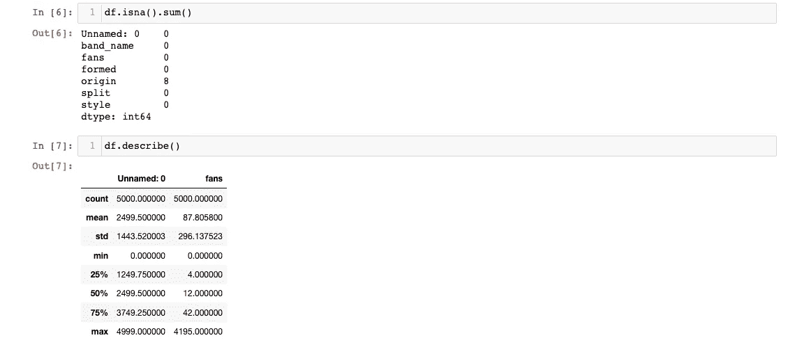

# 数据科学熊猫:初学者指南，第一部分

> 原文：<https://towardsdatascience.com/pandas-i-read-csv-head-tail-info-and-describe-43b9b2736490?source=collection_archive---------19----------------------->

## 开始学习基本的 Pandas 方法，开始用 Python、head()、info()、sum()和 describe()创建数据科学项目。


图片由 [995645](https://pixabay.com/users/995645-995645/?utm_source=link-attribution&utm_medium=referral&utm_campaign=image&utm_content=3857754) 来自 [Pixabay](https://pixabay.com/?utm_source=link-attribution&utm_medium=referral&utm_campaign=image&utm_content=3857754)

# 一、关于 Python 中数据科学的熊猫

[Pandas](https://pandas.pydata.org/) 是一个构建在 Python 之上的数据分析库。这个灵活的库[对于处理和分析各种结构的数据](https://pandas.pydata.org/pandas-docs/stable/getting_started/overview.html)非常有用，但是它对于表格数据尤其有用，比如 SQL 表和 Excel 电子表格。在本教程中，我将重点介绍用 Python 处理 Pandas 中带标签的表格数据的最基本的函数。

# **二。获取一些数据**

1.  跟随这个链接到 [Kaggle](https://www.kaggle.com/mrpantherson/metal-by-nation/) 并下载金属乐队的国家数据集到你的项目目录中。

2.打开您的终端，导航到您的项目目录，并使用以下命令打开 Jupyter 笔记本:

```
$ jupyter notebook
```

在您的浏览器中，将打开一个包含项目目录的新选项卡。在右上方，你会看到一个下拉菜单，上面写着“新建”。从下拉列表中，选择虚拟环境的名称。这将创建一个新的 Jupyter 笔记本，它使用您已经安装到该虚拟环境中的包。

如果您遇到问题，[您可能想参考本教程，以确保您的虚拟环境](/jupyter-notebooks-i-getting-started-with-jupyter-notebooks-f529449797d2)和 Jupyter 笔记本设置正确。

# **三。探索熊猫**

3.检查以确保您已经安装了 Pandas、Matplotlib 和 Seaborn。如果你不确定如何安装它们，看看这个[教程](/virtual-environments-for-python-data-science-projects-on-mac-os-big-sur-with-pyenv-and-virtualenv-60db5516bf06)。

4.有了熊猫后，回到 Jupyter 笔记本，在第一个单元格中输入:

```
import pandas
```

这个命令导入熊猫图书馆，用于你的 Jupyter 笔记本。

对于像 Pandas 这样的库，通常使用别名或简称，这样我们可以在代码中更容易地使用这个库。要使用别名，请删除第一个单元格中的信息，输入以下内容，并键入 **Shift + Enter** 来执行该单元格。

```
import pandas as pd
```

现在，当您使用熊猫函数时，您可以使用别名。

5.在下一个单元格中，我们将读入之前下载的电子表格。为此，请输入以下内容:

```
df = pd.read_csv(“metal_bands_2017.csv”)
```

*   **df** 是我们用来存储电子表格的变量的名字，它现在变成了一个[熊猫数据框](https://pandas.pydata.org/pandas-docs/stable/user_guide/dsintro.html)。
*   **=** 用于将数据赋给变量
*   pd 是 Pandas 的别名——我们用来读取文件的库
*   **read_csv()** 是 Pandas 库中执行此功能的方法
*   **"metal_bands_2017.csv"** ，(括号内)是我们希望处理的文件的名称

6.现在，我们可以开始检查数据框，方法是在笔记本的新单元格中输入以下内容:

```
 df.head()
```

此方法是查看数据框前五行的一种方式。将一个整数放在括号内可以让您看到按升序排列的许多行。或者， **df.tail()** 将允许您查看最后五行。这样做可以让我们快速评估数据的格式和质量。

7.要查看所有列的名称，可以使用:

```
df.columns
```

这将返回一个列列表。

8.接下来，我们想知道我们正在处理什么样的数据。为了找到答案，我们可以使用:

```
df.info()
```

这将显示一个小报告，其中包含所有列名、它们的数据类型以及空值的数量。

到目前为止，您的笔记本应该是这样的:


9.如果您只想查看空值，请输入:

```
 df.isna().sum()
```

10.最后，如果你想找出一些描述性的统计数据，你可以使用:

```
df.describe()
```

它应该是这样的:



11.如果您正在跟踪一天系列中的数据，请保存此笔记本以备下次使用，并将其命名为“MyProject.ipynb”。

# **四。我们做了什么？**

1.  学会了如何从命令行启动 Jupyter，打开一个新的笔记本，导入一个包(熊猫)。
2.  探索熊猫，学习一些数据分析的基本方法。

继续阅读[基本熊猫 II](https://christineegan42.medium.com/pandas-ii-drop-isna-cbbe16a15e70) 继续用 Python 和 Pandas 检查和转换金属乐队的国家数据集。在那篇教程中，我解释了如何使用像 drop()和 isna()这样的方法来处理缺失值。