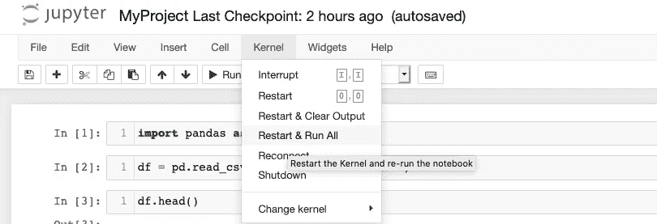

# 数据科学熊猫:缺失值初学者指南，第二部分

> 原文：<https://towardsdatascience.com/pandas-ii-drop-isna-cbbe16a15e70?source=collection_archive---------26----------------------->

## 了解如何使用 drop()、drop_duplicates()和 isna()处理 Pandas 的 Python 数据科学项目中的缺失值。


图片来自 [Pixabay](https://pixabay.com/?utm_source=link-attribution&utm_medium=referral&utm_campaign=image&utm_content=1711000) 的[莎朗·昂](https://pixabay.com/users/sharonang-99559/?utm_source=link-attribution&utm_medium=referral&utm_campaign=image&utm_content=1711000)

在 [Pandas Essentials I](https://christineegan42.medium.com/pandas-i-read-csv-head-tail-info-and-describe-43b9b2736490) 中，我描述了如何开始用 Python 分析和操作 Pandas 中的数据。在本教程中，我将解释如何通过处理缺失值来继续使用国家的金属乐队数据集。

在第一节**处理缺失值**中，我提供了一些关于处理缺失值的基本信息。如果你只是为了代码片段而来，这些信息会在 Jupyter 笔记本的第二部分**数据分析:缺失值**中。

# 一.处理缺失的价值观

数据往往是不完美的。最明显的缺陷之一是缺少值，这可能会对您的项目造成严重破坏。

## A.什么是缺失值？

在表格数据(或以行和列的模式排列的数据)中，当有一列包含空白行时，这些空白单元格中的值被视为缺失。

虽然有一些处理缺失值的通用过程，但是每个数据集都是唯一的，在确定如何处理它们之前评估数据是很重要的。在本教程中，我将探索一些最基本的方法来纠正 Python 中的缺失值。

## B.**什么是南**？

当数据通过 Pandas 导入 Python 时，将出现在该单元格位置的占位符值通常是 NaN(非数字)。对于日期时间数据类型，会调用 NaT(非时间)。

## **C .为什么数据缺失？**

数据丢失可能有多种原因。其中包括:

1.  **人/机错误** —有人在数据输入阶段犯了一个错误。(例如，由于传感器的问题，没有记录三天的温度。)
2.  **无响应** —可能没有提供响应。(例如选择不披露收入的调查对象。)
3.  **损耗** —一些观察数据不可用，因为它们不再可用于研究。(例如，退出纵向研究的参与者会阻止在研究的后期记录某些指标。)
4.  **修订** —只有拥有特定权限的用户才能访问数据。(例如，诊断仅包括已签署 HIPPA 表格的患者)

在本教程中，我们将重点介绍清除缺失值以提高数据完整性的基本方法。但是，在项目的后期阶段，在调查领域的上下文中考虑缺失值的深层本质是很重要的。

## D.数据是怎么丢失的？

缺失数据分为三种主要类型:

1.  完全随机失踪(MCAR)
2.  随机失踪(三月)
3.  非随机缺失(MNAR)

看看这个[资源](https://stefvanbuuren.name/fimd/sec-problem.html)，了解更多关于不同类型的缺失值。

## E.为什么缺失值是一个问题？

请继续阅读下一节，查看不同类型的缺失值的一些示例、与它们相关的问题以及如何处理它们。

## 二。识别缺失值

在本教程中，我讨论了如何。info()可用于获取数据的快速摘要。

```
df.info()
```


没有多少值是明确丢失的

# **二。使用 Jupyter 笔记本进行数据分析**

1.返回到终端中的项目文件夹。输入以下内容:

```
$ jupyter notebook
```

当 Jupyter 启动时，选择您的项目笔记本。在上一个教程中，我们使用 Pandas 方法做了一些初步的分析。要重新执行代码并从我们离开的地方开始，从页面顶部选择**内核>重启并运行所有**。



## **答:放下一个有熊猫的专栏**

因为某些值丢失而删除整个列是删除丢失值的一种笨拙的方法。

2.在上面笔记本的第三个单元格中，我们查看了最上面的五行。我们可以做的一件事是清理和改进数据帧，去掉**“未命名:0”**列。它似乎是索引的副本。


第一个是按国家排列的金属乐队数据集

3.要去掉那一行，我们可以用 [**drop()**](https://pandas.pydata.org/docs/reference/api/pandas.Series.drop.html?highlight=drop) 。该方法将允许我们在数据框中删除一行或一列。输入:

```
df = df.drop(“Unnamed: 0”, axis=1) 
```

如何分解是我们使用 **=** 来重新分配我们的 **df** 变量给它自己的一个修改版本。在赋值**的右侧，drop()** 被应用于数据帧。

要做到这一点，请记住以下几点:

*   我们需要为 drop()提供必要的参数，在本例中是列**的名称**(未命名:0)和轴**。**
*   坐标轴的默认值为 0，表示行数。如果您没有指定一个轴，Pandas 会认为您引用的是一个行位置，并将抛出一个错误。
*   要表示“未命名:0”将从列中删除，请输入 **axis=1** 作为参数。


未命名的数据帧:0 已移除

请记住，如果您想一次删除多列，请将这些列放在方括号内以表示多列，如下所示:

```
df = df.drop([“Unnamed: 0”, "split", "another_column"], axis=1)
```

# 三。丢下熊猫的复制品

4.由于这是一个按国家划分的波段数据集，我们可以使用波段名作为主键，或者作为数据中每个观测值(或行)的唯一标识值。因此，band_name 列中不应有重复值。

```
df[df['band_name'].duplicated()]
```


6.对于此示例，这些重复的波段名称很可能是真正的重复。然而，验证我们的假设，即每个观测的波段名确实是唯一的，不会有什么坏处。此外，在其他数据集中，标识列可能不那么明显，所以最好仔细查看重复项。在您的笔记本中尝试这行代码，以便更仔细地查看重复的内容:

```
df[df['band_name'].duplicated()]
```

# **四。用熊猫填充缺失值**

4.既然我们已经做出了改进，我们可以更仔细地查看其余的数据。我们可以通过链接方法 [isna()](https://pandas.pydata.org/docs/reference/api/pandas.DataFrame.isna.html?highlight=isna#pandas.DataFrame.isna) 和 [sum()](https://pandas.pydata.org/docs/reference/api/pandas.Series.sum.html?highlight=sum#pandas.Series.sum) 来检查每一列中有多少个空值:

```
df.isna().sum()
```

5.“原点”好像少了 8 行。让我们通过输入以下命令来检查缺少数据的行:

```
df[df[‘origin’].isna()]
```

现在，您的笔记本应该看起来像这样:


当我们进入这一行时，我们要做的是让 Pandas 显示 df 的各个部分，这样列“origin”就有一个空值。使用 **df[df[column]]** 语法允许我们 [**切片**](https://pandas.pydata.org/docs/user_guide/indexing.html?highlight=slicing) 查看满足特定标准的数据帧部分。

在处理缺失值时，谨慎是关键。我们有多种方法来处理缺失的价值，任何方法都有其利弊。因为我们试图确定什么因素会影响一个金属乐队的粉丝数量，所以我们在做决定时会记住这一点。

处理这种情况的两种方法是消去法或代换法。我们可以通过删除这些行来消除丢失的值。由于我们有 5000 行数据，我们的分析不会因为丢失 8 行数据而受到根本影响。然而，我们也可以通过替换“丢失”来最小化丢失的数据量。这样，我们仍然可以在分析中使用这些波段的其他数据。

由于这是小规模的，这个选择是相当琐碎的。然而，当数据集越来越大，丢失的数据量也越来越大时，您应该尽可能避免丢弃太多的数据。

6.我将使用第二个选项，用“Missing”替换这些值。我们所需要做的就是:

```
df = df.fillna(“Missing”)
```

很好，现在我们去掉了多余的列并修复了空值，我们可以开始检查其他列的数据类型了。

7.如果您正在跟踪一天系列中的数据，请将您的笔记本保存为 MyProject.ipynb，以便我们可以从上次停止的地方继续。继续阅读熊猫三继续。

**三世。我们做了什么？**
1。在 Jupyter 笔记本中重新打开了 a 项目。
2。使用 drop()消除熊猫数据框中的列。
3。链接 isna()和 sum()以返回所有列 4 的缺失值的数量。
4。使用 fillna()填充缺少的值

**四。下一步是什么？**
在 [Pandas III](https://christineegan42.medium.com/pandas-iii-value-counts-duplicated-min-max-d705cae54862) 中，我们将按国家数据集分析和转换金属乐队中的“拆分”和“成型”列。