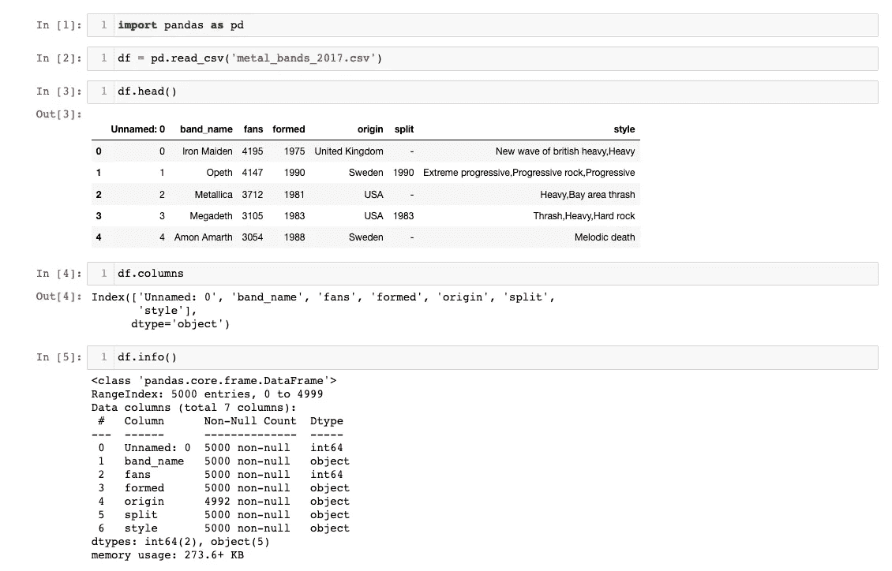
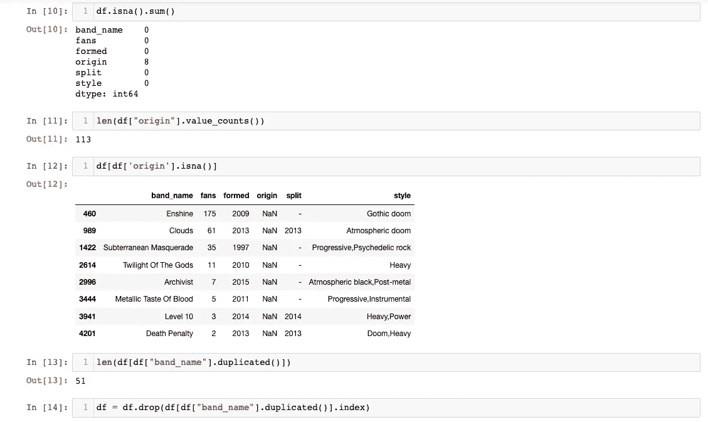
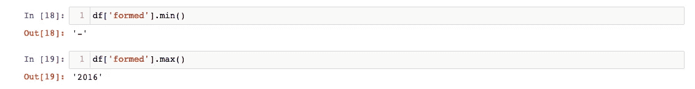
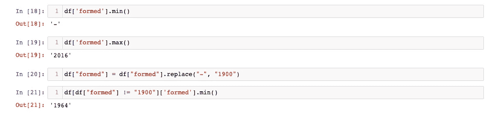
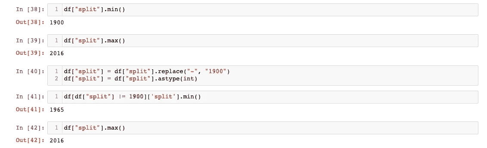

# 熊猫三:数值计数()，重复()，最小值()，最大值()

> 原文：<https://towardsdatascience.com/pandas-iii-value-counts-duplicated-min-max-d705cae54862?source=collection_archive---------23----------------------->

## 在[熊猫 II](https://christineegan42.medium.com/pandas-ii-drop-isna-cbbe16a15e70) 中，我们开始按国家清理[金属乐队的数据集。我们删除了一个不需要的列，并填充了一些缺失的值。现在，我们将检查其他列，评估它们的数据类型和值，并根据需要采取措施。](https://www.kaggle.com/mrpantherson/metal-by-nation)


图片由 [Nick115](https://pixabay.com/users/nick115-10240673/?utm_source=link-attribution&utm_medium=referral&utm_campaign=image&utm_content=3811734) 来自 [Pixabay](https://pixabay.com/?utm_source=link-attribution&utm_medium=referral&utm_campaign=image&utm_content=3811734)

# I .检查数据类型

1.  打开你的项目笔记本，然后点击**内核>重启并运行所有**重新执行我们之前的工作。


2.这将是很好的，看看我们正在处理的其他类型的价值观。根据我们从输入信息中学到的，我们有五个对象(非数字)列和一个数字列。数字列是我们的目标变量——粉丝数量(稍后会详细介绍)。其余的数据是分类数据，告诉我们不同波段的质量。



# 二。Python 中熊猫的价值计算

4.我们要看的下一栏是“起源”。首先，我们将使用 value_counts()检查唯一值，如下所示:

```
df[“origin”].value_counts()
```

有许多值，Pandas 只显示结果的头部和尾部。我们可以将上面的代码行包装在 **len** 中，以准确找出我们有多少个独特的原产国。

```
len(df[“origin”].value_counts())
```

# 三。熊猫蟒蛇皮复制品

3.5000 个金属带看起来很多，所以也许我们可以检查重复的，以确保所有的行都是唯一的带。我们可以这样检查:

```
len(df[df[“band_name”].duplicated()])
```

这将返回“band_name”值重复的行数。我们可以使用 [duplicated()](https://pandas.pydata.org/docs/reference/api/pandas.Series.duplicated.html?highlight=duplicated#pandas.Series.duplicated) 删除它们:

```
df = df.drop(df[df[“band_name”].duplicated()].index)
```

您的笔记本应该是这样的:



# 四。对 Python 和 Pandas 使用 min()和 max()

5.接下来，我们有“形成”列。调用[**value _ counts()**](https://pandas.pydata.org/docs/reference/api/pandas.Series.value_counts.html?highlight=value_counts#pandas.Series.value_counts)将返回所有唯一的年份及其出现的频率。然而，找出最早和最晚的年份可能更有帮助，这样我们可以得到一个范围。将此输入下一个单元格:

```
df[“formed”].min() 
df[“formed”].max()
```

看着[**【min()**](https://pandas.pydata.org/docs/reference/api/pandas.Series.min.html?highlight=min#pandas.Series.min)**和[**【max()**](https://pandas.pydata.org/docs/reference/api/pandas.Series.max.html?highlight=max#pandas.Series.max)**揭示了另一个问题。一些行的值为**-**。现在，我们需要决定是删除那些行，还是替换那些值。****

********

****尽管 info()表明“formed”是一个对象列，但年份数据实际上是数字。因此，如果我们决定替换 **"-"** ，使用“Missing”这样的替代词将会导致以后的问题。我们最好使用一个在数据中没有出现过的年份，比如“1900”。****

# ****动词 （verb 的缩写）使用 replace()和 astype()在 Python 和 Pandas 中转换数据****

****7.您可以通过使用 [**replace()**](https://pandas.pydata.org/docs/reference/api/pandas.Series.str.replace.html) 来进行替换。要将 replace()应用于 Pandas 数据框中的列，可以使用以下方法:****

```
**df[“formed”] = df[“formed”].replace(“-”, “1900”)**
```

****现在，我们的最小值和最大值应该是 1900–2016。如果您需要查看实际的最小值，只需输入以下内容:****

```
**df[df[“formed”] != “1900”][‘formed’].min()**
```

****这将显示 df 部分中“已形成”列的最小值，因此“已形成”列不会(`！= `)的值为 1900。****

********

****8.既然我们已经从“formed”列中消除了非数字字符，我们可以用 [astype()](https://pandas.pydata.org/docs/reference/api/pandas.Series.astype.html) 将整个列转换成数字列:****

```
**df[“formed”] = df[“formed”].astype(int)**
```

****9.现在，让我们对“split”列做同样的操作，因为它也是一年，是数字数据。也就是用 value_counts()检查值，用 replace()替换“-”，用 astype()更改数据类型。我们还将检查 min()和 max()。****

********

****六。我们做了什么？****

1.  ****使用 **info()** 检查了列的数据类型。****
2.  ****用 **duplicated()** 解决了重复问题。****
3.  ****使用 **isna()** 和 **fillna()** 处理空值。****
4.  ****使用**最小()**和**最大()**检查范围。****
5.  ****用**替换()**清除“已形成”和“已拆分”中的年份数据。****
6.  ****使用**更改了列的数据类型。astype()** 。****

******七。下一步是什么？******

****在 Pandas IV 中，我们通过分析和转换“风格”列来继续分析国家数据集中的金属乐队。****