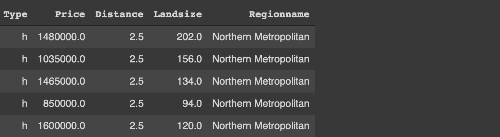
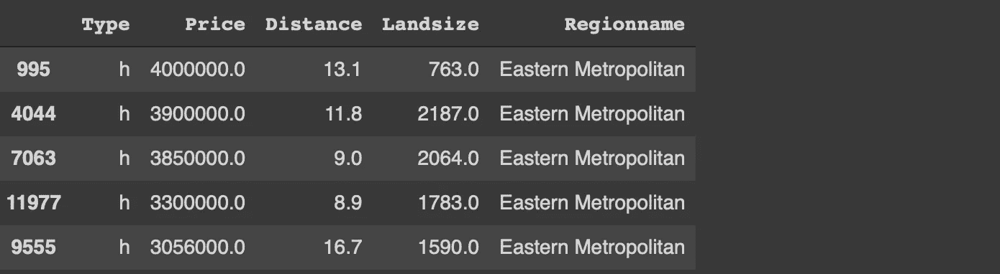
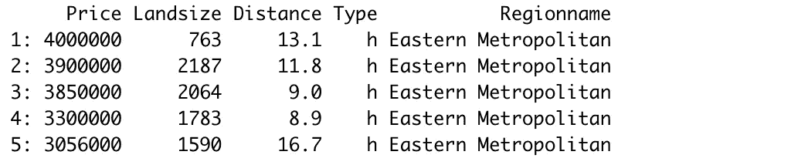
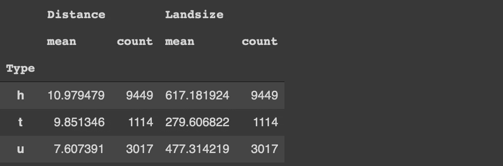
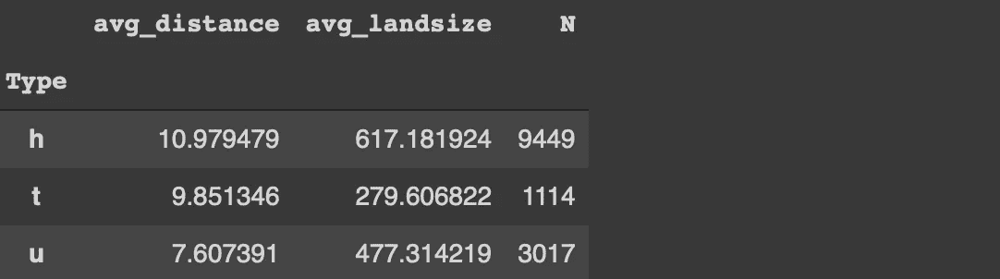
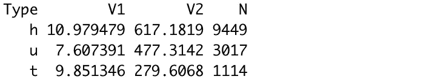

# 熊猫可能终究不是丛林之王

> 原文：<https://towardsdatascience.com/pandas-may-not-be-the-king-of-the-jungle-after-all-f09d061cf121?source=collection_archive---------1----------------------->

## 有点偏颇的比较


弗朗西斯科·德·托马索在 [Unsplash](https://unsplash.com/s/photos/lion?utm_source=unsplash&utm_medium=referral&utm_content=creditCopyText) 上拍摄的照片

Pandas 主要处理表格形式的中小型数据的数据分析和操作任务。它可以说是数据科学生态系统中最受欢迎的库。

我是熊猫的忠实粉丝，自从开始我的数据科学之旅以来，我一直在使用它。到目前为止我很喜欢它，但是我对熊猫的热情不应该也不会阻止我尝试不同的工具。

我喜欢尝试比较不同的工具和库。我的比较方式是用两者做同样的任务。我通常把我已经知道的东西和我想学的新东西进行比较。它不仅让我学习了一种新工具，还帮助我实践了我已经知道的东西。

我的一个同事告诉我为 r 尝试“data.table”包。他认为对于数据分析和操作任务，它比 Pandas 更有效。所以我试了一下。用“data.table”完成某些任务是如此简单，这给我留下了深刻的印象。

在本文中，我将通过几个例子来比较 Pandas 和 data.table。我仍然在争论是否应该将我默认选择的数据分析库从 Pandas 更改为 data.table。但是，我可以说 data.table 是取代 Pandas 的第一候选库。

事不宜迟，让我们从例子开始。我们将使用 Kaggle 上的墨尔本房屋[数据集](https://www.kaggle.com/dansbecker/melbourne-housing-snapshot)中的一个小样本作为例子。

第一步是读取数据集，分别由 Pandas 和 data.table 的 read_csv 和 fread 函数完成。语法几乎是一样的。

```
#Pandas
import numpy as np
import pandas as pdmelb = pd.read_csv("/content/melb_data.csv", 
usecols = ['Price','Landsize','Distance','Type', 'Regionname'])#data.table
library(data.table)melb <- fread("~/Downloads/melb_data.csv", select=c('Price','Landsize','Distance','Type', 'Regionname'))
```



前 5 行(作者图片)

这两个库都提供了基于列值过滤行的简单方法。我们希望过滤类型为“h”且距离大于 4 的行。

```
#Pandasmelb[(melb.Type == 'h') & (melb.Distance > 4)]#data.tablemelb[Type == 'h' & Distance > 4]
```

我们只在 data.table 中写入列名，而 Pandas 还需要 dataframe 的名称。

下一个任务是对数据点(即行)进行排序。假设我们需要按地区名称升序排序，然后按价格降序排序。

下面是我们如何使用这两个库来完成这项任务。

```
#Pandasmelb.sort_values(by=['Regionname','Price'], ascending=[True, False])#data.tablemelb[order(Regionname, -Price)]
```

逻辑是一样的。指定列和顺序(升序或降序)。但是，data.table 的语法非常简单

data.table 的另一个优点是，索引在排序后被重置，这与 Pandas 的情况不同。我们需要使用一个额外的参数(ignore_index)来重置索引。



熊猫(作者图片)



data.table(图片作者提供)

数据分析中的另一个常见任务是根据列中的类别对观察值(即行)进行分组。然后，我们计算每个组的数字列的统计数据。

我们来计算一下类型一栏中每一类的房屋均价和土地面积。我们还想看看每个类别中的房屋数量。

```
#Pandasmelb[['Type','Distance','Landsize']]\
.groupby('Type').agg(['mean','count'])
```



(图片由作者提供)

对于 Pandas，我们选择感兴趣的列并使用 groupby 函数。然后指定聚合函数。

编辑:感谢 Henrik Bo Larsen 的提醒。我忽略了 agg 函数的灵活性。我们可以在不选择列的情况下进行同样的操作:

```
#Pandasmelb.groupby('Type').agg(
   avg_distance = ('Distance', 'mean'),
   avg_landsize = ('Landsize', 'mean'),
   N = ('Distance', 'count')
)
```



(图片由作者提供)

下面是我们如何使用数据完成同样的任务。表:

```
#data.tablemelb[, .(mean(Distance), mean(Landsize), .N), by='Type']
```



(图片由作者提供)

我们使用“by”参数来选择要在分组中使用的列。聚合函数是在选择列时指定的。它比熊猫简单。

让我们也添加一个过滤组件，并对成本低于 100 万的房子进行相同的统计。

```
#Pandasmelb[melb.Price < 1000000][['Type','Distance','Landsize']]\
.groupby('Type').agg(['mean','count'])#data.tablemelb[Price < 1000000, .(mean(Distance), mean(Landsize), .N), by='Type']
```

过滤组件与 data.table 在相同的方括号中指定。另一方面，我们需要在 Pandas 中的所有其他操作之前进行过滤。

## 结论

我们在本文中讨论的是在典型的数据分析过程中完成的常见任务。当然，这两个库提供了更多的功能。因此，本文不是一个全面的比较。然而，它揭示了在两者中如何处理任务。

我只关注完成某些操作的语法和方法。与性能相关的问题，如内存和速度尚未发现。

综上，我感觉 data.table 对我来说是替代熊猫的有力人选。它还取决于您经常使用的其他库。如果你大量使用 Python 库，你可能想坚持使用熊猫。不过 data.table 绝对值得一试。

感谢您的阅读。如果您有任何反馈，请告诉我。