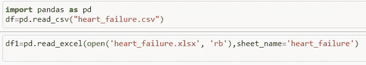
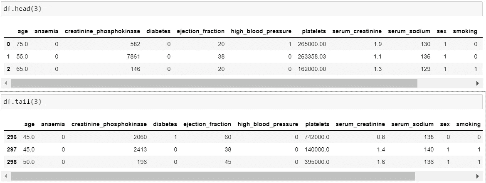
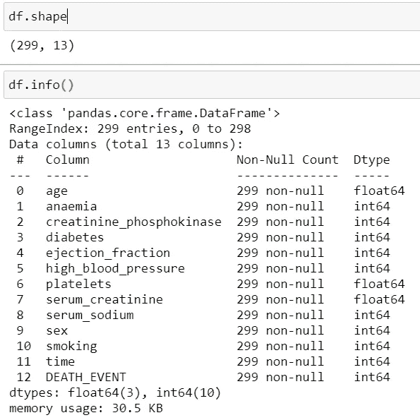
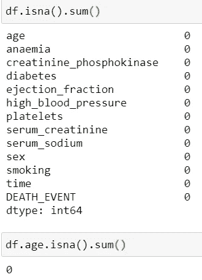
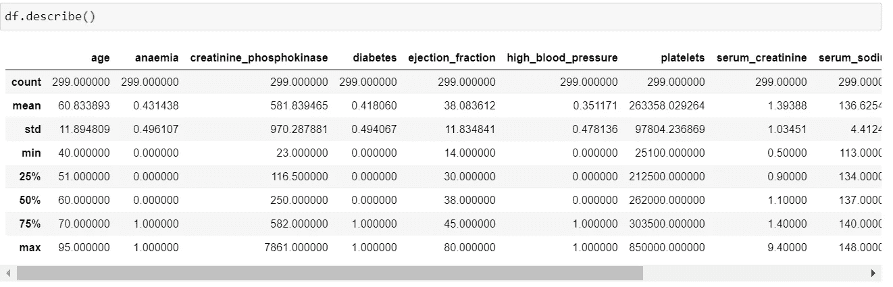
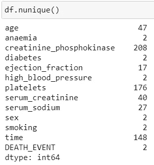
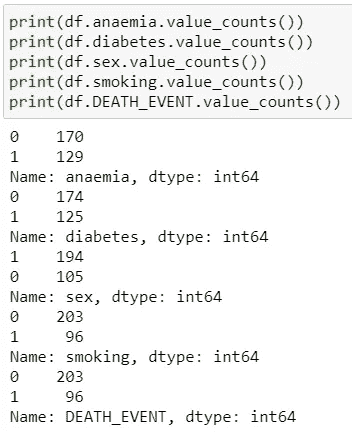
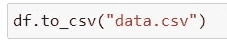
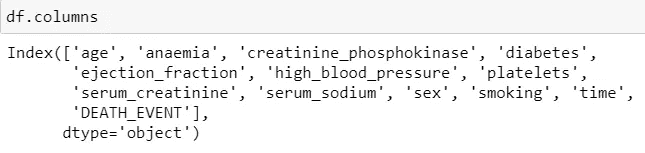

# 熊猫:数据科学中最常用的函数

> 原文：<https://towardsdatascience.com/pandas-most-used-functions-in-data-science-51b7c2b9c38a?source=collection_archive---------14----------------------->

## 对数据预处理最有用的函数

锡德·巴拉钱德朗

当你开始学习机器学习时，第一步是学习 Python，而学习 Python 的基本步骤是学习熊猫库。我们可以通过 pip 安装熊猫来安装熊猫库。安装后，我们必须在每次运行会话时导入熊猫。所使用的数据例如来自 UCI 储存库“[https://archive . ics . UCI . edu/ml/datasets/Heart+failure+clinical+records](https://archive.ics.uci.edu/ml/datasets/Heart+failure+clinical+records)”。

1.  **读取数据**

我们可以将 pandas 数据帧中的数据读取为 read_csv()。两种最常用的数据读取格式是 csv 和 excel。如果我们正在读取 excel 格式的数据，我们也可以给出如下的工作表名称。还有其他较少使用的其他文件类型的选项。

作者图片

**2。头尾**

要查看数据帧，我们可以使用 df.head()。Head 返回前几行，如果没有输入，它将总是显示在 5 行以上。与下面的行相反，我们可以使用 df.tail()。

作者图片

**3。形状、尺寸和信息**

读取数据后最基本的两个功能是知道行数和列数，以及知道变量的数据类型。我们可以使用 df.shape，它先给出总行数，然后给出列数。df.size()返回数据框中的行数乘以列数。我们还可以使用 df.info()，从中我们可以获得不同的信息，比如 RangeIndex 中的行、数据列以及每列的数据类型。它还包括非空计数的信息。

**4。isna**

但是，如果需要获得数据中空值的总数，我们可以使用 df.isna()，如下所示。Sum 将给出总的空值。如果我们只想要一个空值的变量，我们也可以通过如下给出变量名来得到它。

作者图片

**5。描述**

然后为了理解变量的基本统计，我们可以使用 df.describe()。它会给你计数，平均，标准偏差，也有 5 个数字摘要。

作者图片

**6。努尼克**

要获得变量的总唯一值，我们可以使用 df.nunique()。它将给出一个变量包含的所有唯一值。

作者图片

**7。数值计数**

同样，为了获得单个变量的唯一值，我们可以使用 df .贫血. value_counts()。为了演示，下面只给出了具有布尔值的变量。count_values()返回唯一值的计数。结果对象将按降序排列。默认情况下，此函数不包括 NA 值。

作者图片

如果我们对数据进行任何更改，并希望将其写入逗号分隔值(csv)文件，我们可以使用 to_csv()。在此 for 索引中，默认值为 true。

作者图片

**8。列**

要知道数据框中所有变量的名称，我们可以使用 df.columns。

作者图片

**结论**

这些函数在初始步骤中对数据进行预处理是非常常见的。甚至记住这些功能也是一个好主意。还有许多其他有用的功能，可以根据条件和要求使用。可在熊猫文档中探究:“[https://pandas . pydata . org/pandas-docs/stable/reference/frame . html](https://pandas.pydata.org/pandas-docs/stable/reference/frame.html)”。

感谢阅读！