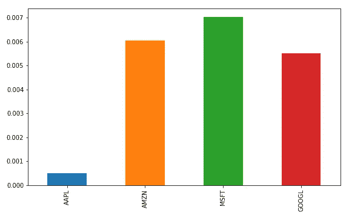

# Pandas 多重索引和处理时间序列数据

> 原文：<https://towardsdatascience.com/pandas-multiindexing-and-working-with-time-series-data-8e6229f11998?source=collection_archive---------17----------------------->


[埃斯凯·林](https://unsplash.com/@eskaylim?utm_source=medium&utm_medium=referral)在 [Unsplash](https://unsplash.com?utm_source=medium&utm_medium=referral) 上的照片

## 帮助清理时间序列数据的分步示例

在我们进行任何预测建模或分析之前，我们首先需要清理和格式化我们的数据。熊猫图书馆有很多很棒的工具来帮助加速这个过程——我们清理得越快，我们可以花更多的时间来分析和建模。

以下是四只股票几周的股价数据(眼尖的，是的，我故意给微软留了个日期):

```
ticker       date    close
0    AAPL 2021-03-18   120.53
1    AAPL 2021-03-19   119.99
2    AAPL 2021-03-22   123.39
3    AAPL 2021-03-23   122.54
4    AAPL 2021-03-24   120.09
5    AAPL 2021-03-25   120.59
6    AAPL 2021-03-26   121.21
7    AMZN 2021-03-18  3027.99
8    AMZN 2021-03-19  3074.96
9    AMZN 2021-03-22  3110.87
10   AMZN 2021-03-23  3137.50
11   AMZN 2021-03-24  3087.07
12   AMZN 2021-03-25  3046.26
13   AMZN 2021-03-26  3052.03
14  GOOGL 2021-03-18  2021.34
15  GOOGL 2021-03-19  2026.96
16  GOOGL 2021-03-22  2030.69
17  GOOGL 2021-03-23  2041.33
18  GOOGL 2021-03-24  2032.53
19  GOOGL 2021-03-25  2032.46
20  GOOGL 2021-03-26  2024.73
21   MSFT 2021-03-18   230.72
22   MSFT 2021-03-19   230.35
23   MSFT 2021-03-22   235.99
24   MSFT 2021-03-23   237.58
25   MSFT 2021-03-24   235.46
26   MSFT 2021-03-25   232.34
```

假设我们想计算每只股票在一周内的累积回报，并通过相关矩阵比较它们的共同运动。

目前，数据是堆叠格式的，一只股票在另一只的上面。以表格形式分析时间序列数据(如股票价格)要容易得多，表格中每行是一个日期，每列是一只股票。

# 获取表格

让我们考虑一下如何快速将数据转换成表格格式。我们应该:

1.  按股票对数据进行分类。
2.  并将它们水平堆叠。

一个简单的方法是通过熊猫的多重索引功能。如果您对上面的数据(存储在名为`data`的数据帧中)运行下面的代码行，它会为`data`创建一个多索引。

```
data = data.set_index(['ticker','date'])
```

**我们选择了按股票代码和日期进行索引，因此采用了多重索引，因为我们要按多个列进行索引。**一旦我们打印出生成的数据帧，多重索引如何让我们的生活变得更加轻松就变得显而易见了:

```
print(data)**Output:**
                     close
ticker date               
AAPL   2021-03-18   120.53
       2021-03-19   119.99
       2021-03-22   123.39
       2021-03-23   122.54
       2021-03-24   120.09
       2021-03-25   120.59
       2021-03-26   121.21
AMZN   2021-03-18  3027.99
       2021-03-19  3074.96
       2021-03-22  3110.87
       2021-03-23  3137.50
       2021-03-24  3087.07
       2021-03-25  3046.26
       2021-03-26  3052.03
GOOGL  2021-03-18  2021.34
       2021-03-19  2026.96
       2021-03-22  2030.69
       2021-03-23  2041.33
       2021-03-24  2032.53
       2021-03-25  2032.46
       2021-03-26  2024.73
MSFT   2021-03-18   230.72
       2021-03-19   230.35
       2021-03-22   235.99
       2021-03-23   237.58
       2021-03-24   235.46
       2021-03-25   232.34
```

看看现在数据帧组织得多好。是按股票分出来的。例如，我们可以很容易地获得苹果的回报:

```
data.loc['AAPL']**Output:**
             close
date              
2021-03-18  120.53
2021-03-19  119.99
2021-03-22  123.39
2021-03-23  122.54
2021-03-24  120.09
2021-03-25  120.59
2021-03-26  121.21
```

或者苹果和谷歌的单个日期( [IndexSlice](https://pandas.pydata.org/pandas-docs/stable/reference/api/pandas.IndexSlice.html) 简化了多索引切片的语法):

```
idx = pd.IndexSlice
print(data.loc[idx[['AAPL','GOOGL'],'2021-03-18'],])**Output:**
                     close
ticker date               
AAPL   2021-03-18   120.53
GOOGL  2021-03-18  2021.34
```

# 按库存水平堆叠

在我们的例子中，我们希望获得每只股票的回报，并将它们水平叠加，同时确保价格正确排列(*时间序列分析中可能发生的最糟糕的事情是构建了一个令人敬畏的模型，却发现您的数据没有对齐*)。我们可以通过一个简单的 for 循环来实现这一点:

```
# Get tickers where the tickers are the set of index level 0 values
# get_level_values returns all values for the given index level
# In our case, level 0 is stock ticker and level 1 is date
# Since we want, a list of tickers we can take the set of the index level 0 values
tickers = list(set(data.index.get_level_values(0)))# Initialize dataframe to store tabular stock price data
clean_table = data.loc['AAPL'][['close']]
clean_table.rename({'close': 'AAPL'}, axis=1, inplace=True)# Loop through all tickers besides Apple and "h-stack" prices
for ticker in tickers:
    if ticker != 'AAPL':
        clean_table[ticker] = data.loc[ticker][['close']]

print(clean_table)**Output:**
              AAPL     AMZN    MSFT    GOOGL
date                                        
2021-03-18  120.53  3027.99  230.72  2021.34
2021-03-19  119.99  3074.96  230.35  2026.96
2021-03-22  123.39  3110.87  235.99  2030.69
2021-03-23  122.54  3137.50  237.58  2041.33
2021-03-24  120.09  3087.07  235.46  2032.53
2021-03-25  120.59  3046.26  232.34  2032.46
2021-03-26  121.21  3052.03     NaN  2024.73
```

看看向我们数据帧添加新数据是多么容易(只需要前面代码块中的最后一行代码:`clean_table[i] = data.loc[i][['close']]`)。它只需要一行代码。因为`clean_table`和`data.loc[ticker[[['close']]`都是按日期索引的，所以当我们向`clean_table`添加一个新列时，Pandas 会确保日期正确对齐。**换句话说，当添加另一个数据帧或序列到一个现有的数据帧时，Pandas 只会在索引(在这种情况下是日期)匹配时添加非空值**(这不适用于没有索引的列表)。

这里有一个例子，让我们试着给`clean_table`添加一些日期不匹配的数据:

```
# some stale data with dates that don't matchdate
2016-01-04    26.337
2016-01-05    25.677
2016-01-06    25.175
2016-01-07    24.113
2016-01-08    24.240
2016-01-11    24.633
2016-01-12    24.990
```

我们将这个数据称为`wrong_dates`。现在让我们看看当我们尝试添加它时会发生什么:

```
clean_table['wrong_dates'] = wrong_dates
print(clean_table)**Output:** AAPL     AMZN    MSFT    GOOGL  wrong_dates
date                                                     
2021-03-18  120.53  3027.99  230.72  2021.34          NaN
2021-03-19  119.99  3074.96  230.35  2026.96          NaN
2021-03-22  123.39  3110.87  235.99  2030.69          NaN
2021-03-23  122.54  3137.50  237.58  2041.33          NaN
2021-03-24  120.09  3087.07  235.46  2032.53          NaN
2021-03-25  120.59  3046.26  232.34  2032.46          NaN
2021-03-26  121.21  3052.03     NaN  2024.73          NaN
```

因此，即使我们试图添加的数据长度是正确的(长度为 7)，Pandas 也正确地认识到日期严重不匹配(我们的数据来自 2021 年，而`wrong_dates`数据来自 2016 年)。因此，我们得到的不是数值，而是空值(如果想将`wrong_dates`加到`clean_table`，可以使用外部合并:`clean_table.merge(wrong_dates, how='outer’, left_index=True, right_index=True)`)。

还要注意，MSFT 缺少一个值，因为它比其他股票少了一个价格观察值。与`wrong_dates`类似，熊猫对此处理正确。既然我们已经了解了索引如何允许我们正确地排列数据，那么让我们去掉所有的空值，这样我们就可以完成我们的分析了:

```
clean_table = clean_table.dropna(axis=1, how='all').dropna(axis=0)
print(clean_table)**Output:**
              AAPL     AMZN    MSFT    GOOGL
date                                        
2021-03-18  120.53  3027.99  230.72  2021.34
2021-03-19  119.99  3074.96  230.35  2026.96
2021-03-22  123.39  3110.87  235.99  2030.69
2021-03-23  122.54  3137.50  237.58  2041.33
2021-03-24  120.09  3087.07  235.46  2032.53
2021-03-25  120.59  3046.26  232.34  2032.46
```

# 累积收益和相关性

为了获得累积回报和相关性，我们需要首先计算月回报，这可以使用`shift`方法很容易地计算出来(此处应用的方法允许我们将每个观察值除以前一个观察值)。然后我们用`cumprod`得到累计收益。取`cumul_returns`的最后一行给出了我们的样本期内每只股票的累计回报。

```
stock_returns = (clean_table/clean_table.shift(1)-1).dropna()
cumul_returns = (1+stock_returns).cumprod()-1
cumul_returns.iloc[-1].plot(kind='bar', figsize=(8,5));
plt.tight_layout()
plt.savefig('ts_cumul_returns')
```

这是结果图:



在我们短暂的样本期内的累积回报(来源:Sharadar，图片由作者创作)

最后，让我们计算相关矩阵:

</understanding-correlation-and-diversification-661c19a26555>  

```
print(stock_returns.corr())**Output:**
           AAPL      AMZN      MSFT     GOOGL
AAPL   1.000000  0.440295  0.724448  0.344711
AMZN   0.440295  1.000000  0.710669  0.814061
MSFT   0.724448  0.710669  1.000000  0.499615
GOOGL  0.344711  0.814061  0.499615  1.000000
```

# 结论

全部完成！Pandas 确实使分析时间序列数据变得容易得多——难怪它在数据分析中如此重要。您对 Pandas 的微妙之处(如多重索引)掌握得越多，花在清理和格式化上的时间就越少，而花在思考、分析和建模上的时间就越多。干杯！