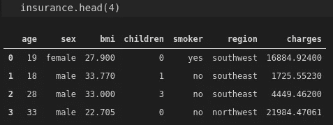
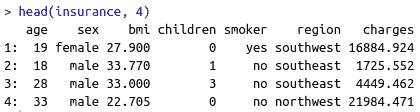

# 熊猫(Python) vs 数据表(R)

> 原文：<https://towardsdatascience.com/pandas-python-vs-data-table-r-278386a96f2a?source=collection_archive---------53----------------------->

## 比较两种流行的数据操作库的实用指南


约尔根·哈兰在 [Unsplash](https://unsplash.com/s/photos/twice?utm_source=unsplash&utm_medium=referral&utm_content=creditCopyText) 上的照片

数据科学生态系统充满了高效实用的工具和框架。新的产品不断推出，现有的产品不断改进。

有多种选择是一件好事，在大多数情况下可能会提高效率。然而，这也可能让你很难决定选择哪一个。

在本文中，我们将比较数据科学领域中最常用的两种编程语言中流行的数据操作库。

我们将看到基本操作是如何在 Pandas (Python)和 Data.table (R)中完成的。目标不是确定一个是否优于或优于另一个。我只是想让你熟悉语法，并展示相似或不同的方法。

使用这些包有很多选择。我用 R-studio IDE 做 R，用 VSCode 做 Python。

我们从导入库开始，通过从 csv 文件中读取数据来创建基本的数据结构。

## 读取 csv 和 fread

在 Pandas 中，我们使用 read_csv 函数从 csv 文件创建数据帧。

```
import numpy as np
import pandas as pd #importing pandasinsurance = pd.read_csv("/home/soner/Downloads/datasets/insurance.csv")
```

在 Data.table 中，read_csv 的等效函数是 fread 函数。

```
> library(data.table) #importing data.table 

> insurance = fread("/home/soner/Downloads/datasets/insurance.csv")
```

## 头

head 函数显示前 n 行。两个包的函数名相同，但语法略有不同。



熊猫(作者图片)



Data.table(图片作者提供)

两者的缺省 n 值都是 5，所以缺省情况下它们将显示前 5 行。

## 行数和列数

我们通常根据行数和列数来检查数据的大小。这两个库都有获取大小相关信息的直观方法。

```
#Pandas
insurance.shape
(1338, 7)#Data.table
nrow(insurance)
1338ncol(insurance)
7
```

## 按列选择子集

在某些情况下，我们只需要表中的一组列。Pandas 和 Data.table 都提供了方便的方法来完成这个操作。

```
sub = insurance[['age','sex','charges']]
sub.head()
```


子数据框架(图片由作者提供)

对 Data.table 执行相同的操作，如下所示:

```
> sub = insurance[, .(age, sex, charges)]
> head(sub)
```


子数据表(图片由作者提供)

## 重命名列

rename 和 setname 函数可分别用于重命名 Pandas 和 Data.table 中的列。

熊猫:

```
sub.rename(columns={'sex':'gender'}, inplace=True)sub.columns
Index(['age', 'gender', 'charges'], dtype='object')
```

数据表:

```
> setnames(sub, c("sex"), c("gender"))> names(sub)
[1] "age"     "gender"  "charges"
```

正如我们从示例中看到的，dataframe 上的 columns 方法返回列的列表。对 Data.table 库中的 names 函数执行相同的操作。

## 基于行值的筛选

我们可以根据行值过滤数据帧或表格。在下面的示例中，我们创建了一个包含年龄超过 40 岁的客户的子集。

熊猫:

```
sub_over40 = sub[sub.age > 40]
```


(图片由作者提供)

数据表:

```
> sub_over40 <- sub[age > 40] #can also use "<-" instead of "="
```


(图片由作者提供)

## 分组

数据分析中最常见的操作之一是根据分类变量中的不同值来比较数值变量。

在 Pandas 中，这种转换和计算是通过 group by 函数完成的。例如，我们可以基于性别和吸烟者列计算每个类别中数据点的平均费用。

```
insurance[['gender','smoker','charges']]\
.groupby(['gender','smoker']).mean().round(2)
```


(图片由作者提供)

可以应用多个聚合函数。例如，除了平均电荷值之外，我们可能还希望看到每组中的观察次数。

```
insurance[['gender','smoker','charges']]\
.groupby(['gender','smoker']).agg(['mean','count'])
```


(图片由作者提供)

在 Data.table 中，相同的计算如下:

```
> insurance[, .(mean(charges)), by = .(gender, smoker)]
```


(图片由作者提供)

就像 Pandas 一样，Data.table 提供了一种应用多个聚合的简单方法。观察次数和平均电荷值计算如下:

```
> insurance[, .(mean(charges), .N), by = .(gender, smoker)]
```


(图片由作者提供)

## 结论

我们已经在 Pandas 和 Data.table 库中介绍了一些简单的任务。由于操作的复杂程度，两个库的语法看起来非常相似。然而，随着复杂性的增加，以及我们进行更高级的数据分析和操作，它们之间的差异变得更加明显。

学习如何使用这些库的最好方法是通过实践。当您在数据分析任务中使用它们时，您会更喜欢在某些任务中使用特定的一个。

总的来说，我认为两者都足以完成典型的数据分析任务。

感谢您的阅读。如果您有任何反馈，请告诉我。