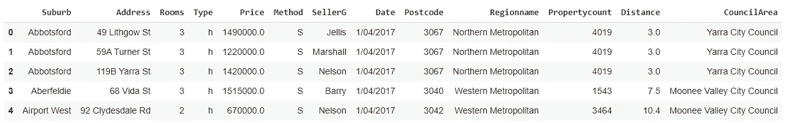
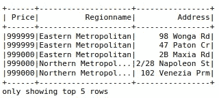
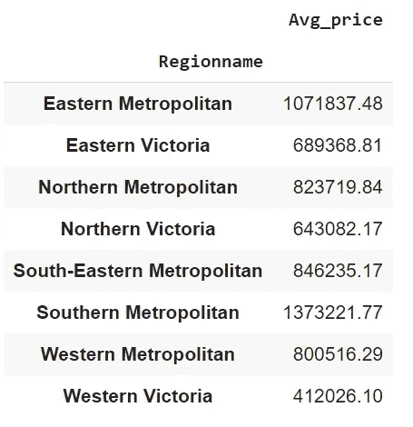

# 熊猫到 PySpark 的 6 个例子

> 原文：<https://towardsdatascience.com/pandas-to-pyspark-in-6-examples-bd8ab825d389?source=collection_archive---------20----------------------->

## 当你去大规模的时候会发生什么


杰克·吉文斯在 [Unsplash](https://unsplash.com/s/photos/fast-and-slow?utm_source=unsplash&utm_medium=referral&utm_content=creditCopyText) 上的照片

Pandas 是操纵和分析结构化数据的主要工具之一。它提供了许多函数和方法来处理表格数据。

然而，随着数据变大，熊猫可能不是你最好的朋友。当处理大规模数据时，有必要同时分发数据和计算，这是 Pandas 无法实现的。

这类任务的一个非常受欢迎的选项是 Spark，这是一个用于大规模数据处理的分析引擎。它让您可以将数据和计算分散到集群上，从而实现显著的性能提升。

收集和存储数据已经变得非常容易，所以当我们处理现实生活中的问题时，可能会有大量的数据。因此，像 Spark 这样的分布式引擎正在成为数据科学生态系统中的主要工具。

PySpark 是 Spark 的 Python API。它结合了 Python 的简单性和 Spark 的高性能。在本文中，我们将通过 6 个例子来演示 PySpark 版 Pandas 的典型数据分析和操作任务。

## 示例 1

我们需要一个例子的数据集。因此，第一个示例是通过读取 csv 文件来创建数据帧。我将使用 Kaggle 上的墨尔本房产[数据集](https://www.kaggle.com/anthonypino/melbourne-housing-market)。

```
# Pandas
import pandas as pd
df = pd.read_csv("melb_housing.csv")
```

对于 PySpark，我们首先需要创建一个 SparkSession，作为 Spark SQL 的入口点。

```
from pyspark.sql import SparkSession
sc = SparkSession.builder.getOrCreate()sc.sparkContext.setLogLevel("WARN")print(sc)
<pyspark.sql.session.SparkSession object at 0x7fecd819e630>
```

我们现在可以读取 csv 文件了。

```
# PySpark
df = sc.read.option("header", "true").csv(
    "/home/sparkuser/Desktop/melb_housing.csv"
)
```

## 示例 2

开始数据分析的一个好方法是获得数据的概述。例如，我们可能想要检查列名、行数，并查看前几行。

```
# Pandaslen(df)
63023df.columns
Index(['Suburb', 'Address', 'Rooms', 'Type', 'Price', 'Method', 'SellerG','Date', 'Postcode', 'Regionname', 'Propertycount', 'Distance','CouncilArea'])
```



(图片由作者提供)

这些函数和方法与 PySpark 非常相似。

```
# PySparkdf.count()
63023df.columns
['Suburb', 'Address', 'Rooms', 'Type', 'Price', 'Method', 'SellerG','Date', 'Postcode', 'Regionname', 'Propertycount', 'Distance','CouncilArea']df.show(5)
```

## 示例 3

在某些情况下，我们需要根据列值过滤数据框。例如，我们可能对北部大都市地区价值超过 100 万英镑的房子感兴趣。

对于 Pandas，wgionne 指定条件和列名如下:

```
# Pandas
df_sub = df[
      (df.Price > 1000000) & 
      (df.Regionname == 'Northern Metropolitan')
]len(df_sub)
3022
```

我们对 PySpark 采用了类似的方法。

```
# PySpark
from pyspark.sql import functions as Fdf_sub = df.filter(
    (F.col('Price') > 1000000) &
    (F.col('Regionname') == 'Northern Metropolitan')
)df_sub.count()
3022
```

PySpark 的 SQL 模块中的函数需要单独导入。在以下示例中，我们将使用本模块中的几个函数。

## 实例 4

典型的任务可以是根据列选择数据集的子集。让我们以价格、地区名称和地址列为例，按价格降序排列。我们将只显示前 5 个观察值(即行)。

```
# Pandas
df[['Price', 'Regionname', 'Address']].sort_values(by='Price', ascending=False).head()# PySpark
df.select("Price", "Regionname", "Address").orderBy('Price', ascending=False).show(5)
```



(图片由作者提供)

语法也非常相似。PySpark 的功能更像 SQL 语句。此外，正如您所注意到的，PySpark 像显示 SQL 表一样显示数据框。

## 实例 5

我们并不总是数字数据。文本数据是数据科学的基础部分。因此，数据分析库提供了许多操作字符串的函数。

例如，我们可能希望从地址列的值中提取地址的类型。

```
# Pandas
df.Address[:3]
0    49 Lithgow St 
1    59A Turner St 
2    119B Yarra St
```

地址中的最后一个字给出了 st 和 rd 等类型。我们可以通过在空格处拆分地址并获得最后一项来获得该信息。

Pandas 使用 str 访问器下的 split 函数来完成这个操作。

```
# Pandas
df.Address.str.split(' ', expand=True)[2][:5]
0    St 
1    St 
2    St 
3    St 
4    Rd
```

末尾的“[:5]”表达式仅用于显示前 5 行。

Pyspark 还有一个拆分功能。下面是如何使用该函数完成该操作的:

```
# PySpark
df.select(
   F.split("Address", ' ').getItem(2).alias('Address_type')
).show(5)
```


(图片由作者提供)

## 实例 6

数据分析中最常用的函数之一是 groupby 函数。它允许根据列中的类别或不同值对行进行分组。然后，我们可以对每个组的数字列执行聚合。

例如，我们可以计算每个地区的平均房价。熊猫和 PySpark 都有这类任务的分组功能。

```
# Pandas
df.groupby('Regionname').agg(Avg_price=('Price', 'mean')).round(2)# Pyspark
df.groupby('Regionname').agg(F.round(F.mean('Price'), 2).alias('Avg_price'))
```



(图片由作者提供)

## 结论

我们做了 6 个例子来比较 Pandas 和 PySpark 的语法。正如我们在例子中看到的，它们非常相似。

需要注意的是，Spark 针对大规模数据进行了优化。因此，在处理小规模数据时，您可能看不到任何性能提升。事实上，在处理小数据集时，Pandas 可能会比 PySpark 表现得更好。

感谢您的阅读。如果您有任何反馈，请告诉我。