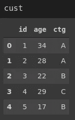
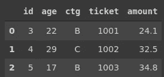
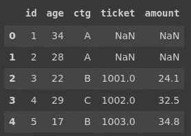
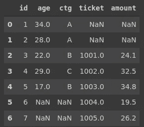

# 5 个例子中的 Pandas vs SQL

> 原文：<https://towardsdatascience.com/pandas-vs-sql-in-5-examples-485b5571d934?source=collection_archive---------26----------------------->

## Pandas 中的合并和 SQL 中的连接的比较


詹姆斯·巴尔茨在 [Unsplash](https://unsplash.com/s/photos/combine?utm_source=unsplash&utm_medium=referral&utm_content=creditCopyText) 上的照片

最近，我写了几篇文章，专注于数据科学生态系统中使用的工具和框架的比较，如 Pandas vs dplyr、SQL vs NoSQL、Pandas vs SQL、Seaborn vs ggplot2、Seaborn vs Altair 等等。

在这些文章中，我主要关注如何使用不同的工具来完成给定的任务。我清楚地看到了它们之间的差异和相似之处。此外，它有助于建立一种直觉，了解这些工具的创造者是如何处理特定问题的。

本文的重点是在合并和连接操作方面比较 Pandas 和 SQL。Pandas 是 Python 的一个数据分析和操作库。SQL 是一种用于管理关系数据库中数据的编程语言。两者都处理带有标签的行和列的表格数据。

Pandas 的合并功能根据公共列中的值合并数据帧。SQL 中的连接也完成了同样的操作。这些都是非常有用的操作，尤其是当我们在表格的不同数据框架中有关于观察的数据(即数据点)时。


熊猫合并(图片由作者提供)

我创建了两个简单的数据框架和表格，通过例子来说明合并和连接。



客户数据框架(图片由作者提供)

“cust”包含关于 5 个客户的 3 条信息。这些列是 id、年龄和类别。

“purc”包含客户 id、票号和购买金额。


purc 数据框架(图片由作者提供)

id 是公共列，所以我们将在合并或连接时使用它。

您可能已经注意到 id 列并不完全相同。一些值只存在于一个数据帧中。我们将在示例中看到处理它们的方法。

## 示例 1

第一个示例是基于 id 列中的共享值进行合并或联接。默认设置完成这项任务，所以我们不需要调整任何参数。

熊猫:

```
import pandas as pdcust.merge(purc, on='id')
```



(图片由作者提供)

SQL:

```
mysql> select cust.*, purc.*
    -> from cust join purc 
    -> on cust.id = purc.id;+------+------+------+------+--------+--------+
| id   | age  | ctg  | id   | ticket | amount |
+------+------+------+------+--------+--------+
|    3 |   22 | B    |    3 |   1001 |  24.10 |
|    4 |   29 | C    |    4 |   1002 |  32.50 |
|    5 |   17 | B    |    5 |   1003 |  34.80 |
+------+------+------+------+--------+--------+
```

Pandas 的合并功能不会返回重复的列。另一方面，如果我们选择两个表中的所有列(" * ")，则 id 列在 SQL join 中是重复的。

## 示例 2

假设我们希望左表中有所有的行，而右表中只有匹配的行。在 Pandas 中，打开参数被更改为“左”。在 SQL 中，我们使用“left join”而不是“join”关键字。

熊猫:

```
cust.merge(purc, on='id', how='left')
```



(图片由作者提供)

SQL:

```
mysql> select cust.*, purc.*
    -> from cust
    -> left join purc
    -> on cust.id = purc.id;+------+------+------+------+--------+--------+
| id   | age  | ctg  | id   | ticket | amount |
+------+------+------+------+--------+--------+
|    3 |   22 | B    |    3 |   1001 |  24.10 |
|    4 |   29 | C    |    4 |   1002 |  32.50 |
|    5 |   17 | B    |    5 |   1003 |  34.80 |
|    1 |   34 | A    | NULL |   NULL |   NULL |
|    2 |   28 | A    | NULL |   NULL |   NULL |
+------+------+------+------+--------+--------+
```

purc 数据帧和表没有 id 为 1 或 2 的行。因此，purc 中的列用这些行的空值填充。

我们可以使用 on 参数的“right”参数对右边的数据帧进行同样的操作。类似地，在 SQL 中使用了“右连接”。

## 示例 3

如果我们希望看到数据帧或表中的所有行，该怎么办？

熊猫:

在 Pandas 中，这是一个简单的操作，可以通过将“outer”参数传递给 on 参数来完成。

```
cust.merge(purc, on='id', how='outer')
```



(图片由作者提供)

SQL:

MySQL 不提供“全外部”连接，但是我们可以通过组合两个左连接来实现它。

**注意**:尽管关系数据库管理系统(RDBMSs)大多采用相同的 SQL 语法，但可能会有细微的差别。因此，最好检查特定 RDBMS 的文档，看看它是否支持完全外连接。

在 MySQL 中，下面是如何用两个左连接实现一个完整的外连接:

```
mysql> select cust.*, purc.*
    -> from cust left join purc
    -> on cust.id = purc.id
    -> union
    -> select cust.*, purc.*
    -> from purc left join cust
    -> on cust.id = purc.id;+------+------+------+------+--------+--------+
| id   | age  | ctg  | id   | ticket | amount |
+------+------+------+------+--------+--------+
|    3 |   22 | B    |    3 |   1001 |  24.10 |
|    4 |   29 | C    |    4 |   1002 |  32.50 |
|    5 |   17 | B    |    5 |   1003 |  34.80 |
|    1 |   34 | A    | NULL |   NULL |   NULL |
|    2 |   28 | A    | NULL |   NULL |   NULL |
| NULL | NULL | NULL |    6 |   1004 |  19.50 |
| NULL | NULL | NULL |    7 |   1005 |  26.20 |
+------+------+------+------+--------+--------+
```

union 运算符堆叠多个查询的结果。类似熊猫的 concat 功能。

## 实例 4

合并或联接不仅仅是组合数据。我们可以把它们作为数据分析的工具。例如，我们可以计算每个类别的总订单量(“ctg”)。

熊猫:

```
cust.merge(purc, on='id', how='left')[['ctg','amount']]\
.groupby('ctg').mean()

ctg     amount
--------------                             
A       NaN                 
B       29.45                 
C       32.50
```

SQL:

```
mysql> select cust.ctg, sum(purc.amount)
    -> from cust
    -> left join purc
    -> on cust.id = purc.id
    -> group by cust.ctg;+------+------------------+
| ctg  | sum(purc.amount) |
+------+------------------+
| A    |             NULL |
| B    |            58.90 |
| C    |            32.50 |
+------+------------------+
```

因为 purc 表不包含属于类别 A 中的客户的任何购买，所以 sum 结果为 Null。

## 实例 5

我们也可以在合并前根据条件过滤行。假设我们需要找到 25 岁以下的顾客的购买量。

熊猫:

我们首先过滤数据帧，然后应用合并功能。

```
cust[cust.age < 25].merge(purc, on='id', how='left')[['age','amount']] age     amount                       
0       22       24.1                 
1       17       34.8
```

SQL:

我们只是实现了一个 where 子句来指定过滤的条件。

```
mysql> select cust.age, purc.amount
    -> from cust
    -> join purc
    -> on cust.id = purc.id
    -> where cust.age < 25;+------+--------+
| age  | amount |
+------+--------+
|   22 |  24.10 |
|   17 |  34.80 |
+------+--------+
```

## 结论

我们已经通过一些例子展示了 Pandas merge 函数和 SQL 连接之间的区别和相似之处。

这些例子可以被认为是简单的案例，但是它们可以帮助你建立直觉和理解基础。理解了基础知识之后，你就可以逐步学习更高级的操作了。

感谢您的阅读。如果您有任何反馈，请告诉我。