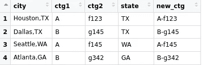
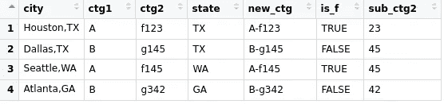

# 文字资料上的熊猫 vs Tidyverse

> 原文：<https://towardsdatascience.com/pandas-vs-tidyverse-on-textual-data-23c6a7c2df8c?source=collection_archive---------25----------------------->

## 如何在两个库中操作字符串


照片由 [Aaron Burden](https://unsplash.com/@aaronburden?utm_source=unsplash&utm_medium=referral&utm_content=creditCopyText) 在 [Unsplash](https://unsplash.com/s/photos/write?utm_source=unsplash&utm_medium=referral&utm_content=creditCopyText)

文本数据通常没有一个好的和干净的格式，所以它需要大量的预处理和操作。大量的原始数据是文本的，所以数据分析库应该能够很好地处理字符串。

在本文中，我们将从处理字符串的角度比较两个流行的库。第一个是 pandas，它是 Python 的数据分析和操作库。另一个是 tidyverse，它是为数据科学设计的 R 包的集合。


在熊猫的例子中，我们将使用城市数据框架。我还使用 r . exe 中的 readr 包创建了一个包含相同数据的 tibble。

## 拆开一根绳子

**熊猫**:

可以使用 str 访问器来使用字符串函数和方法。split 函数在给定字符处拆分字符串。

“城市”列包括城市和州的名称。我们可以为 state 部分创建一个新列。

```
import pandas as pdcities.city.str.split(",")0    [Houston, TX]
1     [Dallas, TX]
2    [Seattle, WA]
3    [Atlanta, GA]
```

返回序列中的每个值都是城市和州的列表。我们可以通过使用 str 索引提取一个新列，将其分配给 state 部分。

```
cities['state'] = cities.city.str.split(",").str[1]
```


城市数据框架(图片由作者提供)

**潮汐**:

Tidyverse 是包的集合。我们将使用以下 tidyverse 包来处理城市 tibble(与 pandas 中的 dataframe 相同)

*   readr:从 csv 文件创建 tibble
*   DP lyr:tible 上的数据操作
*   stringr:字符串上的函数

```
cities <- mutate(cities, state = str_split_fixed(city, ",", n=2)[,2])
```

dplyr 包的 mutate 函数可以用来在现有列的基础上创建新列。

stringr 包的 str_split_fixed 函数在逗号处拆分城市列。因为每个值中有两个字，所以 n 参数是 2。最后，我们选择分裂后的第二部分。


适宜居住的城市(图片由作者提供)

## 上和下

将字符串转换为大写或小写是获得一致值的常见操作。

让我们将“ctg1”列转换为大写字母。

**熊猫:**

上层函数的用法如下。

```
cities['ctg1'] = cities['ctg1'].str.upper()
```


城市数据框架(图片由作者提供)

**Tidyverse:**

stringr 包的 str_to_upper 函数使用如下。

```
cities <- mutate(cities, ctg1 = str_to_upper(ctg1))
```

## 连接字符串

就像我们拆分字符串一样，我们可能也需要组合它们。例如，我们可以通过合并“ctg1”和“ctg2”列来创建一个新的类别列。

熊猫:

使用 str 访问器的 cat 函数。我们指定用作分隔符的字符以及列名。

```
cities['new_ctg'] = cities['ctg1'].str.cat(cities['ctg2'], sep="-")
```

**潮汐:**

使用 stringr 包的 str_c 函数。

```
cities <- mutate(cities, new_ctg = str_c(ctg1, ctg2, sep="-"))
```



适宜居住的城市(图片由作者提供)

## 遏制/检测

我们可以检查字符串，看看它们是否包含一个特定的字符或一组字符。让我们创建一个新列，指示“new_ctg”列是否包含字母“f”。

**熊猫:**

要使用的函数非常简单。

```
cities["is_f"] = cities.new_ctg.str.contains("f")
```


城市数据框架(图片由作者提供)

**潮水:**

stringr 包的 str_detect 函数完成 pandas 的 contains 函数所做的事情。

```
cities <- mutate(cities, is_f = str_detect(new_ctg, "f"))
```

## 索引

字符串可以被认为是字符的集合。它们不必是单词或有意义的文本数据。例如，“foo123”是一个有效的字符串。

在数据操作中，对字符串进行索引或切片是一项非常实用的操作。我们可以通过提供索引来提取字符串的任何部分。pandas 和 tidyverse 都提供了基于字符索引提取部分字符串的功能。

让我们通过提取“ctg2”列的最后两个字符来创建一个新列。

**熊猫:**

我们可以从 0 开始传递索引，也可以从-1 开始传递索引。既然需要后两个，那就用最后面那个比较方便。

```
cities["sub_ctg2"] = cities.ctg2.str[-2:]
```

通过将相关索引传递给 str 访问器来指定所需字符串部分的开始和结束。起始索引是倒数第二个(-2)。结束索引留空以表示字符串结束。

**潮汐**

使用 str_sub 函数可以完成相同的操作，如下所示:

```
cities <- mutate(cities, sub_ctg2 = str_sub(ctg2, -2, -1))
```



适宜居住的城市(图片由作者提供)

## 长度和计数

在某些情况下，我们可能需要根据字符串包含的字符数来确定字符串的长度。特定字符在字符串中出现的次数也是一条有用的信息。

**熊猫:**

len 函数返回字符串的长度，count 函数返回字符在字符串中出现的次数。

```
# Length of citiescities.city.str.len()
0    10
1     9
2    10
3    10# How many "a" exists in city namescities.city.str.count("a")
0    0
1    2
2    1
3    2
```

**Tidyverse:**

这些功能的名称与熊猫中的功能非常相似。我们只需要在开头加上“str”。

```
# Number of occurrencesstr_count("Houston", "o")
[1] 2# Length of a stringstr_length("Houston")
[1] 7
```

## 结论

我们已经介绍了一些常用于操作字符串的基本操作。熊猫和 tidyverse 在执行这类任务时效率都很高。

还有许多操作可以用来操作或转换字符串。我认为我们在这篇文章中讨论的内容足以让你感到温暖。在后面的文章中，我计划用 pandas 和 tidyverse 演示更复杂的字符串操作。

感谢您的阅读。如果您有任何反馈，请告诉我。