# 电子商务需求的面板预测

> 原文：<https://towardsdatascience.com/panel-forecasting-for-ecommerce-demand-3cb4d7c6f351?source=collection_archive---------8----------------------->

## [行业笔记](https://towardsdatascience.com/tagged/notes-from-industry)

## 使用机器学习来更好地预测和理解数字市场

*本文是哈佛大学 2021 年秋季* *课程* [*AC297R 期末项目的一部分。*](https://www.capstone.iacs.seas.harvard.edu/)

***团队成员****:siva Nanda Raja Nanda、Ryan Liu、David Assaraf、Junkai Ong*

***模式伙伴*** *:雅各布·米勒、汉密尔顿·诺尔*

***助教*** *:佐纳·科斯蒂克*

***导师*** *:克里斯·坦纳*

# 问题描述

电子商务正在全球零售市场中占据主导地位。预测消费者行为的趋势非常重要，因为它们有助于为库存规划等关键业务提供信息。库存过多会导致不必要的财务支出和存储成本增加，而库存不足会导致潜在收入损失和消费者需求得不到满足。因此，准确预测需求以优化库存计划至关重要。

我们与电子商务加速器 Pattern 合作，创建了一个预测未来 8 周需求的面板预测模型。我们的模型的性能将与 28 天移动平均线模型进行比较，该模型用作基线模型。

# 数据

提供了从 2018 年 1 月到 2021 年 11 月每日产品销售业绩的数据集。该数据集包含大约 1150 万行，与 Amazon.com 的销售有关。数据集的字段包括假名供应商(品牌)代码、产品代码、地区、日期、单位销售、库存和购买量百分比。库存和购买箱百分比信息是内部跟踪的指标，有时可能会丢失。在亚马逊上有多个卖家出售同一产品的情况下，当买家购买产品时，购买框决定哪个卖家获得销售。购买箱百分比是根据模式每天估计的一个指标，该功能为需求预测增加了另一层复杂性，因为特定卖方的销售增长可能归因于该卖方更高的产品需求和/或更高的购买箱百分比。此外，库存信息可能对我们的预测有用，因为用完库存(缺货)会影响观察到的销售。

我们选择专注于美国地区的销售，因为大部分销售都在美国。

# 探索性数据分析

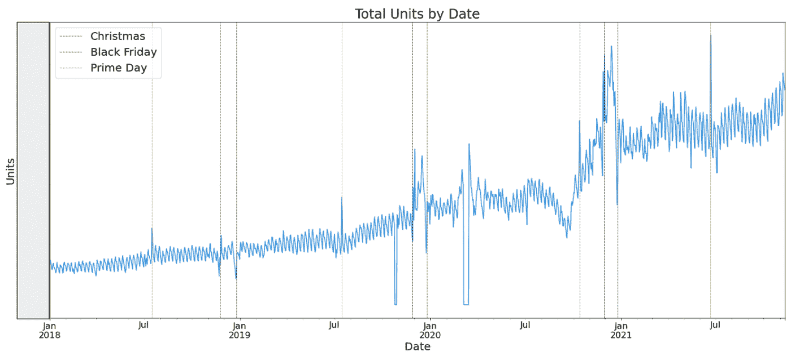

*图 1:按日期排列的总单位数(*图片由作者提供)

图 1 显示了整个数据范围内的每日单位总数。该图还显示，在每年的黄金日、黑色星期五和圣诞节前后，与大型销售活动相对应，销售量会出现峰值。因此，我们为某些假日创建了指示变量(参见后面的“特征工程”部分)，以在我们的建模中考虑这些事件。在 Covid 疫情期间，我们看到了更多的销售波动。特别是，在 Covid 开始时有一个峰值(可能是由于对某些维生素和医疗保健产品的需求增加)，在 2020 年下半年急剧下降并迅速恢复，在 2021 年期间销售相对稳定。

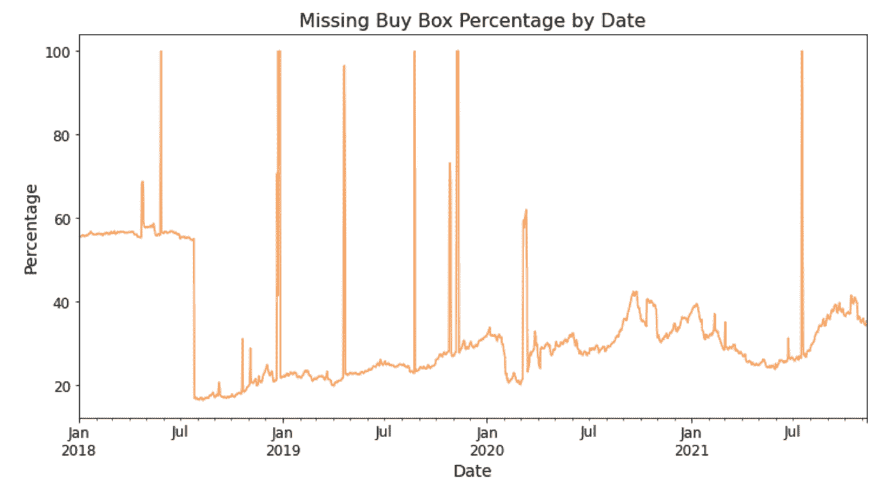

*图 2:按日期排列的未购买框百分比(*按作者排列的图片)

由于购买箱百分比信息可能对需求预测很重要，我们在图 2 中按日期显示了缺少购买箱百分比信息的观察的百分比。我们观察到，从 2018 年下半年开始，购买箱百分比指标变得更加一致。此外，似乎有几个日期的购买框从几乎所有的观察中消失了。

# 方法——概述

如下图所示，我们采用了三步法进行面板预测。对于数据清理，我们过滤掉非美国数据，并将其汇总到每周级别(以减轻每日波动的影响)。对于特征工程，我们创建了新的特征来捕捉潜在的信息。在建模中，我们探索了基线模型(即 28 天移动平均线)、XGBoost、不同的 LSTM 模型，并最终通过集合模型将它们全部结合起来。

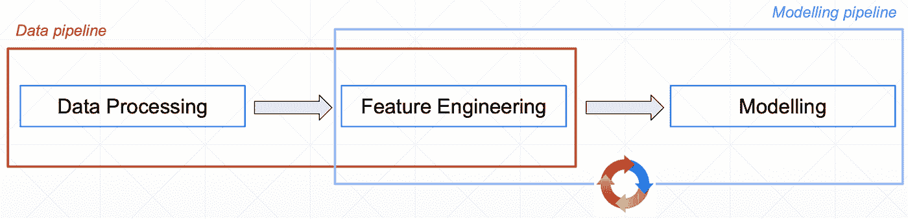

*图 3:面板预测的三步法(*图片由作者提供)

# 方法——培训和评估方法

我们的评估标准是平均绝对误差(MAE ),它是针对每个预测周独立测量的。在评估过程中，我们还删除了基准(28 天移动平均线)为 0 的观察值，因为使用基准作为未来需求估计的人如果知道产品可能会有一些销售，可能不会预测 0 销售。

为了训练和评估模型，我们按日期分割训练、验证和测试数据:

*   训练数据集:截至 2021 年 2 月 28 日
*   验证数据集:2021 年 3 月 1 日至 2021 年 4 月 30 日
*   测试数据集:2021 年 5 月 1 日起

我们利用验证数据集来调整每个模型的超参数。一旦超参数被调优，我们就在组合的训练集和验证集上进行训练，然后在测试集上评估性能。

我们有两种训练方法:

1.  非在线培训。在非在线训练中，我们在测试数据集上计算模型预测的 MAE。
2.  在线培训。在在线培训中，我们用测试集中每个新周的数据迭代更新我们的模型，以便预测下一组周的需求。这种方法(如图 4 所示)模拟了真实世界的环境，因为模型可以在生产中每周更新一次。

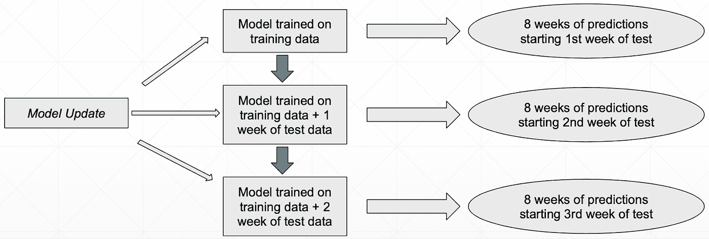

*图 4:在线培训流程图(*图片由作者提供)

# 数据处理、特征工程

我们设计了各种附加功能来补充原始数据集中提供的功能。针对之前 1、2、3、4、12、26、52 周的时间框架，计算销售单位的滚动汇总统计数据(即平均值、标准偏差、最小值、最大值、第 25 百分位、第 50 百分位和第 75 百分位指标)，并将其添加到数据集中。因此，每一行不仅包含该周的销售数据，还包含前 4 周的信息。我们还计算了 12 周、26 周和 52 周时间范围内购买箱百分比的汇总统计数据。这些额外的信息将允许模型捕捉短期趋势，并检测本周数据中可能的异常。

基于时间的要素也被创建并添加到数据集中。对一周的开始日期进行简单的解析和操作，以设计诸如一月中的某一天、一年中的某一天、一月中的某一周、一年中的某一周、月和年等特征。为了提取品牌和产品的更多信息，我们还计算了自品牌首次出现在市场上以来的日志天数和自产品首次出现在市场上以来的日志天数。我们使用了对数变换，使特征的数据分布更接近高斯分布。这导致更紧凑的特征范围，从而实现更有效的神经网络训练。

自从产品最后一次销售以来的周数和最后一次销售的数量也被添加为特性。我们还添加了截至该日期每种产品的总销售量，作为长期历史销售业绩的指标。由于产品可能会遵循季节性周期，我们设计了一个包括上一年 2 周平均销售额(即本周之前 52–53 周的平均销售额)的功能。

由于从每日级别到每周级别的数据聚合，我们丢失了一些关于缺失值的信息。因此，该特定周的购买框和库存列中缺失值的数量也被添加到数据集中(这对于模型能够考虑缺货非常重要)。原始数据集中缺少的行(由于缺少销售额)也被计算并添加到数据集中。此外，由于假日和销售额的大幅增长之间存在明显的相关性，我们还设计了一个“假日指标”功能，该功能可以指示假日的购物期是否在我们希望预测的一周内。

为了利用具有相似销售趋势的产品的统计优势，我们基于训练数据中最近 52 周的单位销售执行了时间序列聚类。我们使用 3 种不同的聚类算法将产品分为 6 类:(1)欧几里德 k 均值聚类，(2)动态时间弯曲(DTW)，以及(3) DTW 重心平均(DBA)。

# **建模**

在基线模型(28 天移动平均线)之上，我们选择与不同的模型(即 XGBoost、LSTM、CNN-LSTM 和自回归 LSTM)合作，以利用它们的不同优势。众所周知，XGBoost 在某些预测任务上具有一流的性能，训练速度相对较快，并且可伸缩性非常好。LSTM 模型是为序列和时间序列数据制作的，因为它们能够处理不同长度的时间戳。然后，我们在最后将这些模型与一个集合模型(以随机森林回归的形式)相结合，以获得有利的结果。

我们从使用更小的数据子集开始，随着我们构建数据管道、训练我们的模型和调整我们的模型超参数，迭代地增加产品的数量。我们在下面更详细地描述了我们的模型和建模结果。

# 基线模型(28 天移动平均线)

基线模型是一个简单的 28 天移动平均线。这意味着，对于每种产品，提前 1-8 周的任意一周的预测需求是前 28 天售出数量的简单平均值。

为了直观显示基线模型在较高或较低流动性产品上表现更好，我们绘制了基线模型的相对绝对误差(|y_pred — y_true | / y_true)与产品流动性的关系图。图 5 显示，数据量和 28 天基线模型的性能之间似乎没有相关性。

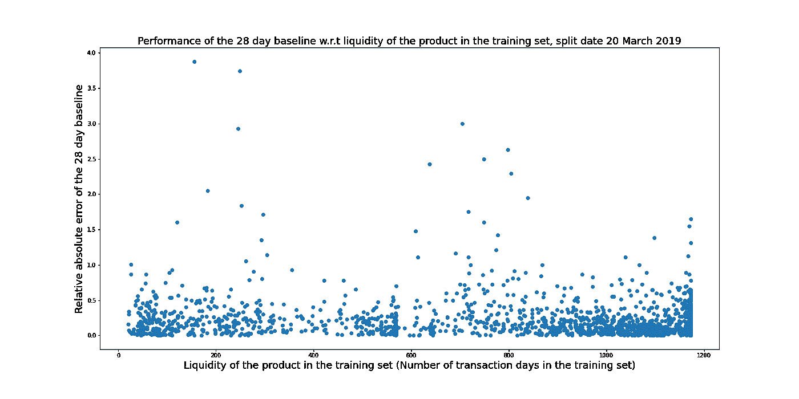

*图 5:28 天基线相对于产品流动性的表现(*图片由作者提供)

下面是单个产品的基准模型预测的直观表示，比较了预测 1 周和未来 8 周的基准性能。在每个预测日期，28 天移动平均线用于预测接下来 8 周的销售额。我们观察到，这一基线在提前 1 周预测需求方面相当不错，但在前几周之后表现不佳，除非销售相当稳定。

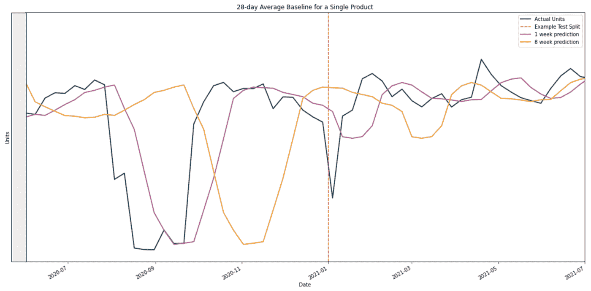

*图 6:单一产品的 28 天平均基线(*图片由作者提供)

# XGBoost

我们选择训练一个单独的模型来预测未来每周的需求。这种方法在计算上更容易，并允许我们更快地迭代，因为预测未来任何一周的全局模型都需要在内存中保存更大的数据集，并且训练起来更慢。此外，在预测未来特定时间范围的更窄任务上训练模型可能会导致更好的性能，因为该模型针对该任务进行了优化，而不是平衡跨时间段的性能。

使用默认超参数在我们的工程特性上训练的 XGBoost 模型能够击败基于前 3000 个产品的测试集的 MAE 的基准测试，参见下面的图 7。

## XGBoost:超参数(HP)调整

我们对训练数据执行了网格搜索的多次迭代和交叉验证，以找到该预测任务的最佳超参数。对于每次迭代，搜索空间被缩小以精确定位要使用的最佳超参数。最终，通过搜索选择的超参数对前 3000 种产品的未调优 XGBoost 模型产生了更大的改进。

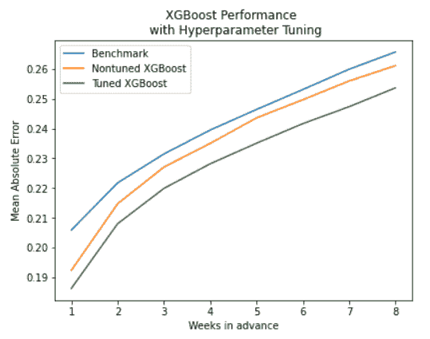

*图 7:超参数调优的 XGBoost 性能(前 3000 种产品)(*图片由作者提供)

## XGBoost:在线培训

随后，我们进行了在线训练，并评估了我们的模型。在测试集中的每个星期之后，该模型在直到该星期的数据期间被重新训练。通过这种方式，模型将使用生产环境中可用的新信息进行更新，并且在预测日期不会使用未来的信息来训练模型。此外，这种方法更好地解释了数据的分布变化。如果测试数据与训练数据的分布不同(在这种情况下是正确的，因为销售通常在增加)，那么更新模型将是必要的，以防止它在未来的进一步预测中变得过时。下图比较了有和没有在线培训的 XGBoost 模型的结果 MAEs。我们观察到，在线培训极大地提高了模型性能，尤其是在未来几周。

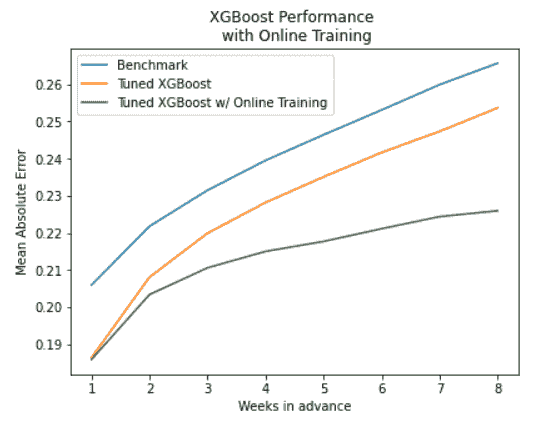

*图 8:在线培训的 XGBoost 性能(前 3000 名产品)(*图片由作者提供)

## XGBoost:用于在线培训的不同时间长度

在线训练的一个相关超参数是在每个预测周期后使用多少数据来重新训练模型。换句话说，我们想要调查我们需要给模型多少周的过去数据来学习数据中的模式，所以我们设计了一个实验，在再训练期间用给模型的不同周的数据来执行在线训练。下面我们展示这个实验的结果。有趣的是，我们看到，虽然在更长的一段时间内重新训练模型提高了对近期预测的性能，但它往往会导致对未来更远时间的更差预测。对此的一个潜在解释可能是，越旧的数据变得越不相关，您需要预测的越远，因此将训练数据限制到更近的观测值可能有利于预测未来更远的时间。

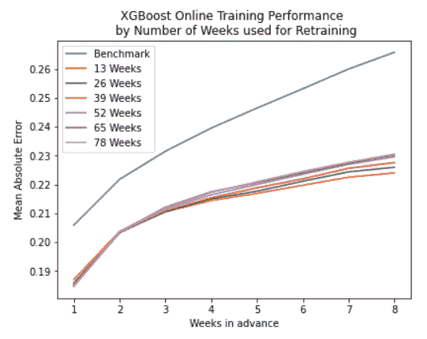

*图 9: XGBoost 在线培训绩效，按用于再培训的周数排列(*图片由作者提供)

## XGBoost:前 100 名产品

接下来，我们评估了我们的模型在前 100 种产品上进行训练时的性能。如下图所示，在对排名前 100 的产品进行评估时，我们的模型相对于基准测试的改进更加适度。

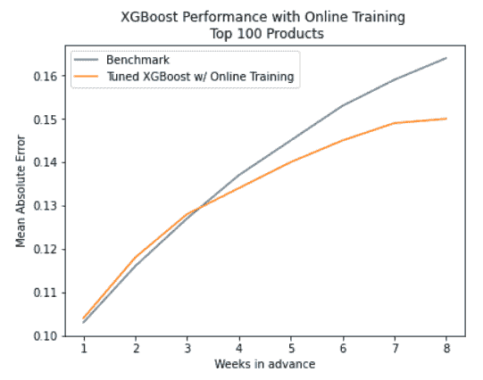

*图 10:在线培训的 XGBoost 性能(前 100 名产品)(*图片由作者提供)

## XGBoost:预测 9 到 16 周

预测未来超过 8 周的需求可以帮助品牌了解生产量。因此，当提前 16 周预测时，我们评估我们的模型与基准相比的性能。我们观察到，通过在线培训，我们的模型相对于基准的改进随着提前周数的增加而增加。虽然基准和模型 MAE 都在增长，但模型 MAE 的增长速度比基准慢，因为它在预测中考虑了其他特征。

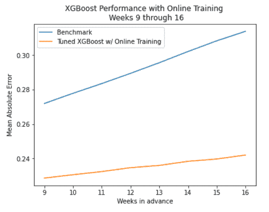

*图 11:在线培训的 XGBoost 性能(*图片由作者提供)

# LSTM

我们探索了 LSTM 的 3 个关键设计，即:

1.  **普通 LSTM** 。我们探索了常规 LSTM 的使用，它适用于基于时间序列的数据和应用，如面板需求预测。
2.  美国有线电视新闻网-LSTM。在 LSTM 进行序列预测之前，CNN-LSTM 将利用 CNN 层来改进特征提取。
3.  **自回归 LSTM** 。自回归 LSTM 将允许我们利用历史时间序列数据的自回归。

# 普通 LSTM 和 CNN LSTM 频道

为了了解以下因素对性能的影响，我们在常规 LSTM 和 CNN LSTM 频道上进行了以下实验。

## **常规 LSTM & CNN LSTM: 1 全球模特 vs 每周模特**

我们探讨了 LSTM 的以下主要方法，即:

1.  跨所有周和所有产品的 1 个 LSTM 模型(全球模型)
2.  所有产品每周 1 个 LSTM 模型(每周模型)

下图总结了实验结果。

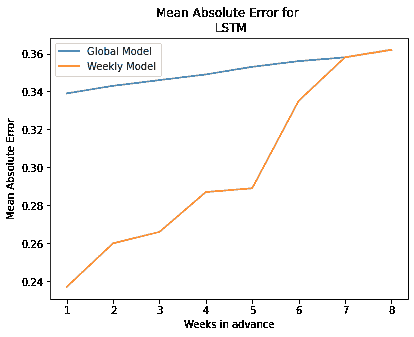

*图 12:全球模型与每周模型的比较(*图片由作者提供)

从上图可以看出，从第 1 周到第 7 周，周模型的性能优于全局模型。这可能是因为每周建模的 LSTM 允许它学习预测未来特定时间范围的更窄任务，这可能会导致更好的性能，因为该模型针对该任务进行了优化，而不是平衡各时间段的性能。

## 常规 LSTM 和 CNN LSTM:不同的 LSTM 输入序列长度

我们研究了在 LSTM 模型中改变输入序列长度对性能的影响。出于我们项目的目的，我们选择探索 2、6、10、14、18 的长度。结果如下图所示。

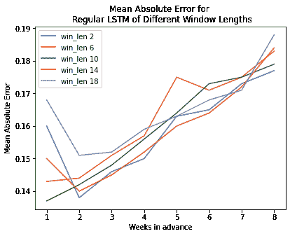

*图 13:不同序列长度的常规 LSTM 的比较(*图片由作者提供)

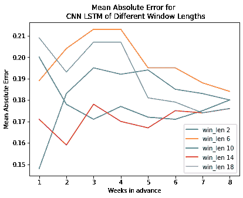

*图 14:不同序列长度的 CNN LSTM 对比(*图片由作者提供)

如上图所示，通常随着输入序列长度从 2 增加到 14，LSTM 的性能(就 MAE 而言)会提高。然而，当序列长度变为 18 时，我们注意到性能变得更差。这可能是因为虽然较长的输入序列长度允许 LSTM 更好地了解历史趋势，但当输入序列长度变得过长时，模型的训练会变得过于复杂，并且模型无法很好地拟合预测数据。

## 常规 LSTM 和 CNN LSTM:100 大产品

我们探究了常规的 LSTM 和 CNN LSTM 在 100 大产品上的表现。结果如下图所示。

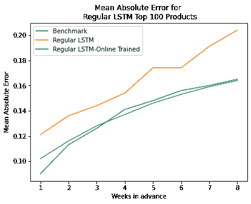

*图 15:常规 LSTM 百强产品的结果(*图片由作者提供)

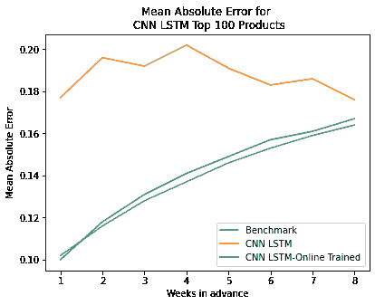

*图 16:CNN-LSTM 100 强产品结果(*图片由作者提供)

如上图所示，在预测前 100 种产品的需求时，常规的 LSTM 和 CNN-LSTM 都比没有在线培训的基准(28 天移动平均线)差得多。然而，常规的 LSTM 和 CNN-LSTM 都能够在在线培训后实现接近基准(28 天移动平均线)的 MAE 表现。这可能是因为在线训练允许用新数据更新先前训练的模型，从而提高其性能。

## 常规 LSTM 和 CNN LSTM:前 3000 名产品

我们探讨了常规 LSTM 和 CNN LSTM 对前 3000 名产品的表现。结果如下图所示。

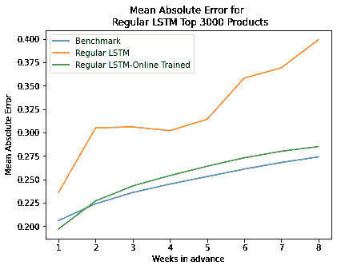

*图 17:常规 LSTM 3000 强产品的结果(*图片由作者提供)

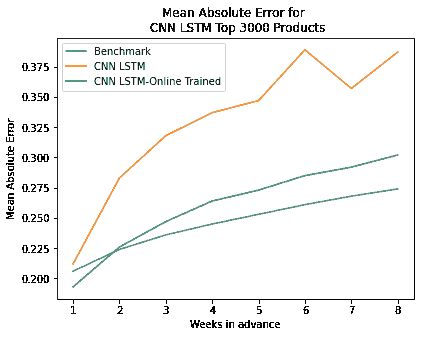

*图 18:CNN LSTM 3000 强产品结果(*图片由作者提供)

如上图所示，在预测前 3000 种产品的需求时，与前 100 种产品的需求相似，常规的 LSTM 和 CNN-LSTM 都比没有在线培训的基准(28 天移动平均线)差得多。

然而，在线培训后，常规的 LSTM 和 CNN-LSTM 都能够在 1-2 周内实现优于基准(28 天移动平均线)的 MAE 表现，而在 2 周后实现差于基准的 MAE 表现。这可能是因为在线训练允许用新数据更新先前训练的模型，从而提高其性能。

# 自回归 LSTM

我们选择实施自回归 LSTM (AR-LSTM)，因为这可能是一个优雅的问题解决方案。AR-LSTM 为一种产品获取 10 个时间步长(即 10 周)的数据，然后预测第 11 周的销售量。由于许多特性取决于售出的单位，因此第 11 周的预测用于生成特性，作为第 12 周预测的输入。这种特性工程是在训练和测试期间动态进行的。

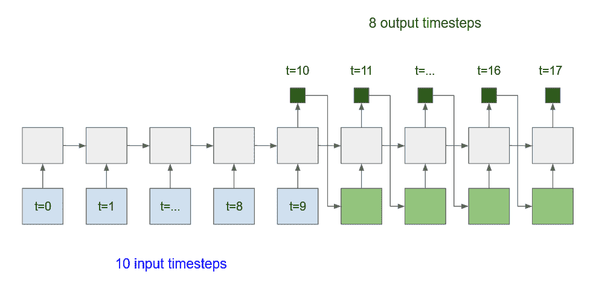

图 19:显示自回归 LSTM 过程的图表。(图片由作者提供)

由于 LSTM 无法处理 NaN 值，我们向前填充每个产品的值，然后用零填充剩余的 NaN(即在产品生命周期开始时没有先前数据的 NaN)。在评估期间，我们删除了这些填充的值，以确保模型不会根据填充的值进行评估。

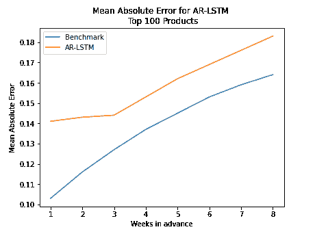

*图 20:前 100 名产品的结果(*图片由作者提供)

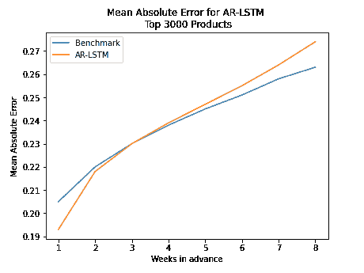

*图 21:3000 强产品的结果(*图片由作者提供)

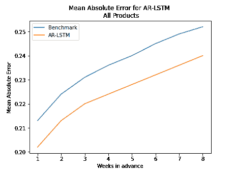

*图 22:所有产品的结果(*图片由作者提供)

我们在下面看到，AR-LSTM 的结果随着产品数量的增加而改善。人们可能会凭直觉认为，用更多产品训练的模型表现更好，因为它在大多数时候预测的值要低得多。但是，预测值和真实值的直方图显示，预测值的分布通常相互匹配。相反，它还表明该模型没有尽可能多地预测接近于零的值。这可能是由于损失函数是均方误差，并且较低的损失不会像较高的损失那样受到惩罚。

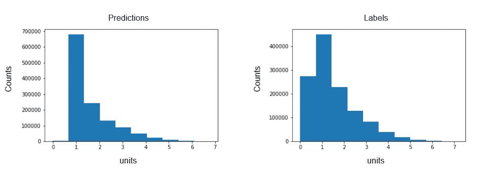

*图 23:所有产品的预测直方图和预测标签(*作者图片)

# 单个模型的结果汇总

下表总结了各个模型在预测前 100 名产品和前 3000 名产品方面的性能。

一般来说，与前 3000 个产品相比，我们的模型对前 100 个产品的改进更为适度。一种解释可能是，模型有更多的数据和产品可供训练，因此产品之间和品牌内部有更好的迁移学习。此外，另一个起作用的因素可能是，前 100 名中的这些高销量产品比低销量产品具有更稳定的销售，因此 28 天移动平均线是对这些产品未来需求的相当好的预测，因此基准预测更难改进。事实上，前 100 名产品基准的 MAEs 远低于前 3000 名产品的 MAEs，这意味着该基准是前 100 名产品与前 3000 名产品的更好预测器。

请注意，下表中以浅绿色突出显示的单元格代表特定一周的最低(即最佳)MAE。单个模型的预测将在下一步被输入到集合模型中，以结合我们不同模型的优势。

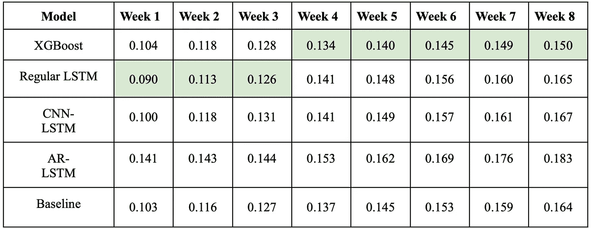

*表 1:前 100 名产品的结果(*图片由作者提供)

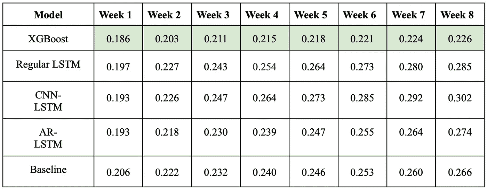

*表 2:3000 种顶级产品的结果(*图片由作者提供)

# 集合模型

我们方法的最后一步是结合不同模型的优势。在这个时间点，我们有 4 个不同的模型在每个时间步产生 4 个不同的预测，我们希望有一个统一的方法来组合各种预测。拥有一个集成学习方法将允许我们拥有一个集中的预处理、训练和微调 API。此外，由于一些模型在时间序列之间的迁移学习方面比其他模型更强——我们可以在跨模型比较前 100 名产品和前 3000 名产品的性能时看到这一点——组合不同的模型将是有帮助的。

我们希望集合模型能够缩小某个模型优于另一个模型的情况。因此，我们希望不同模型的“权重”是动态的。

从非动态聚合模型切换到动态聚合模型:

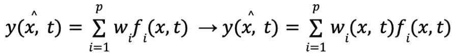

*(* 图片作者)

因此，第一步将是在 0 级模型(即下面描述的“聚集模型”)的不同预测上训练元模型，并添加一些元特征以给出关于我们正在预测的当前点的一些元信息(关于该方法的详细描述，请参考*特征加权线性叠加，Sill 等人*)。

第二步是选择我们想要使用的实际元模型。通常的方法是利用线性模型的可解释性。然而，线性模型的基本假设是不同的预测因子是相互独立的。因此，分配给不同的 0 级模型的权重不能依赖于当前时间。因此，我们决定使用随机森林模型。最后，我们也将使用黑盒解释方法来推断集合模型是如何做出预测的。

**元特性**:我们使用的元特性被称为‘元’,因为我们不希望它们包含任何定量信息，例如它们只包含当前季节、年份、产品和供应商的信息。使用这些元特征，我们期望随机森林(RF)分类器能够拾取不同的模型。

**聚合模型**:我们利用来自以下模型的预测:Tuned XGBoost、AR-LSTM、LSTM、CNN LSTM 和 Benchmark。

**培训程序**:对于这一步，我们设计了 2021 年 3 月 1 日的培训-验证拆分和 2021 年 5 月 1 日的验证-测试拆分。我们设计了两种不同的培训程序，一种用于非在线培训(nOT ),一种用于在线培训(OT)。

*   ***非在线训练***:0 级模型首先在训练集上进行训练，然后在验证集上进行预测。然后，我们在训练+验证上重新训练，并在测试集上预测。然后，元模型在验证集上被训练，并在测试集上被测试。
*   ***在线训练*** :首先在训练集上对 0 级模型进行训练，然后在验证集上进行预测。然后，我们再培训那些培训+验证。元模型已经在验证集上进行了训练。然后，0 级模型都在测试集上进行在线训练，元模型在不同的 0 级模型之上进行在线训练。

**调谐程序**:

*   ***消融研究*** :为了仅在“强”模型上训练元模型，我们执行消融研究，以便在对整个测试集进行 1 周到 8 周的预测时，仅从模型中选择对降低整体 MAE 有显著贡献的预测。这个过程是在验证集上运行的，我们将验证集分成两部分(并用来自训练集的数据填充训练部分)。
*   ***嵌入式超参数(HP)调整*** *:* 随机森林分类器模型的每一次训练都利用了对 4 个关键超参数的超参数调整:树的数量、生长的树的最大深度、分裂节点的最小点数和叶子中的最小点数。超参数调整过程利用贝叶斯优化(BO)来加速该过程并更有效地搜索参数空间。

## 集合模型:前 100 名产品

*   *消融研究*:在 160，000 种组合中，我们可以尝试约 40，000 种组合，并选择预测因子的最佳子集。所选择的特征是 prediction_XGBoost、prediction_CNNLSTM、vendor_name_encoded、自品牌发布以来的时间、基准和一些其他时间特征。这一步骤有助于显著降低 MAE。
*   *嵌入式超参数调整*:贝叶斯优化算法探索了插入的 max_depth 和 min_sample_split 范围的下端。树的数量是我们指定的一组离散值。

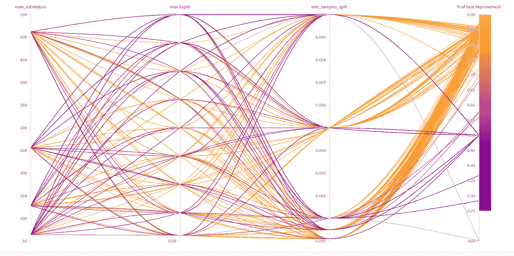

*图 24:惠普调优仪表板的可视化(*图片由作者提供)

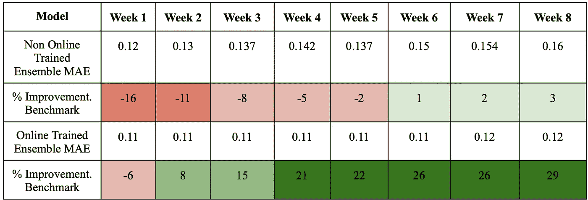

*表 3:消融研究和嵌入式惠普调整后前 100 名产品的整体模型结果(*图片由作者提供)

如上面的表 3 所示，集合模型在所有预测周内都明显优于所有其他模型*。这证实了我们的直觉，即集合模型能够获得不同产品和供应商的不同模型的不同优势。具有在线培训、消融研究和 HP 调整的集合模型是产生最佳结果的模型。*

## *集合模型:前 3000 名产品*

*使用前 3000 种产品运行管道的计算成本更高，因此无法进行全面的消融研究或惠普调整程序。这里，结果使用所有 20 个特征和随机森林分类器的默认超参数。*

*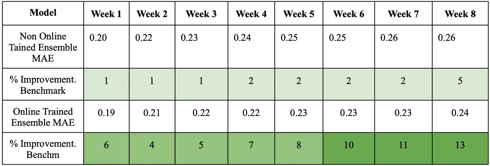*

**表 4:前 3000 种产品的整体模型结果，无消融研究，无嵌入式惠普调整(*图片由作者提供)*

*这里要观察的一点是，前 3000 个产品上的默认集合模型(非在线训练)优于前 100 个产品上的优化模型(非在线训练)。对于前 100 名产品的模型，采用嵌入式 HP 调整的消融研究显著提高了分类器的性能。因此，我们相信，在排名前 3000 的产品上以正确的方式调整集合模型将会产生更好的结果。*

***集合模型解释** : 如前所述，我们故意使用不可解释的模型，以便预测依赖于所有特征的值。然而，随机森林模型并不受益于可解释的机制。因此，我们使用了 SHAP 模型，*一个统一的方法来解释模型预测，伦德伯格等人。艾尔。*，以便了解执行预测时使用了哪些特征。在这里，我们将 SHAP 模型用于前 100 名产品的集合模型、消融后研究和超参数调整后。*

*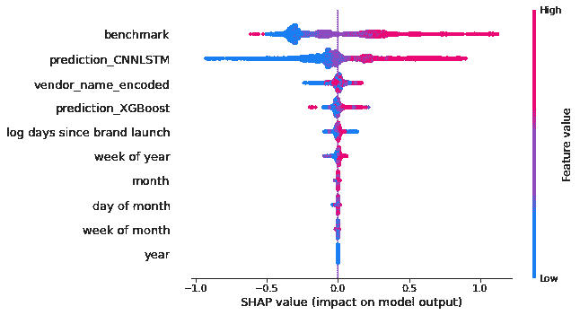*

**图 25:100 强模型的全球 SHAP 值结果(*图片由作者提供)*

*SHAP 值背后的直觉是，给定要预测的实例 x，我们训练局部线性模型来近似我们的(黑盒，这里是随机森林)模型的输出:*

*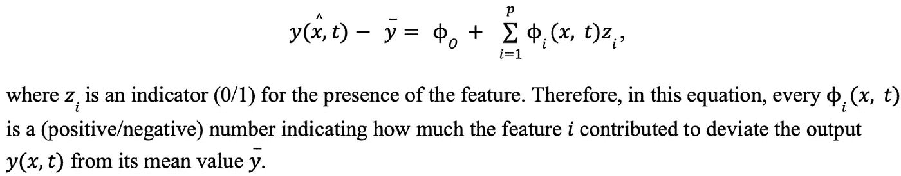*

**(* 图片作者)*

*图 25 中的图是整个训练集的所有 SHAP 值的集合，其中不同的特征按照特征重要性排序(参见 *Lundberg 等人。艾尔。*对特征重要性的定义)。我们可以从这个数字中得出一些结论:*

1.  *随机森林最重要的特征是基准。这抓住了我们的直觉:即使我们构建了不同的模型来预测未来的价值，基准模型将始终“产生”非常接近实际价值的结果。*
2.  *CNN-LSTM 的预测比 XGboost 的预测用得多。这表明，在这种情况下，CNN-LSTM 能够更有效地获取前 100 名产品的需求。*
3.  *编码的供应商名称具有很高的特性重要性，这意味着当删除时，性能会显著下降。这证实了我们最初的观点，即随机森林模型比不同的模型具有更强的性能，因为它了解模型对于不同产品和品牌的优势。*
4.  *实施的不同模型以正确的方式捕捉了趋势:当它们的值低时，它们的 Shapley 值是负的。这意味着当模型的输出与其平均值相比较低时，其预测对缺口 y(x，t)- y 的影响是负的；这将降低输出的价值。*

# *未来的工作*

*在我们的项目结束后，我们项目的下一步包括以下内容。*

*在这个项目中，我们实现了前 3000 种产品的面板预测模型。对于项目的下一个开发阶段，我们可以将其扩展到包括整个产品集的预测，以使模型更加全面。*

*此外，针对整体模型，我们对前 100 种产品进行了全面的消融研究和超参数调整。在项目的下一阶段，我们可以将其扩展到前 3000 个产品，并随后扩展到整个产品集。这将有可能让我们在更全面的产品组合中实现出色的表现。*

# ***参考文献***

*南任、崔天凯、刘，“基于面板数据的粒子滤波模型在服装销售预测中的应用”，载于《IEEE 系统、人与控制论汇刊:系统》，第 45 卷，第 3 期，第 411-421 页，2015 年 3 月，doi:10.1109/台积电，2014 年 12 月。40316.63636363616*

*R.Ghanbari 和 K. Borna，“使用 LSTM 神经网络的多变量时间序列预测”，2021 年第 26 届国际计算机会议，伊朗计算机学会(CSICC)，2021，第 1–5 页，doi:10.1109/csicc 52101 . 53686766676*

*Y.王，郭，“基于和 XGBoost 混合模型的股市波动时间序列预测方法”，载《中国交通》，第 17 卷第 3 期，第 205-221 页，2020 年 3 月，doi: 10.23919/JCC.2020.03.017*

*J.Sill，G. Takacs，L. Mackey 和 D. Lin，“特征加权线性叠加”，arXiv.org，2019 年 11 月，arXiv: 0911.0460*

*南 Lundberg，S. Lee，“解释模型预测的统一方法”，arXiv.org，2017 年 11 月，arXiv: 1705.07874*