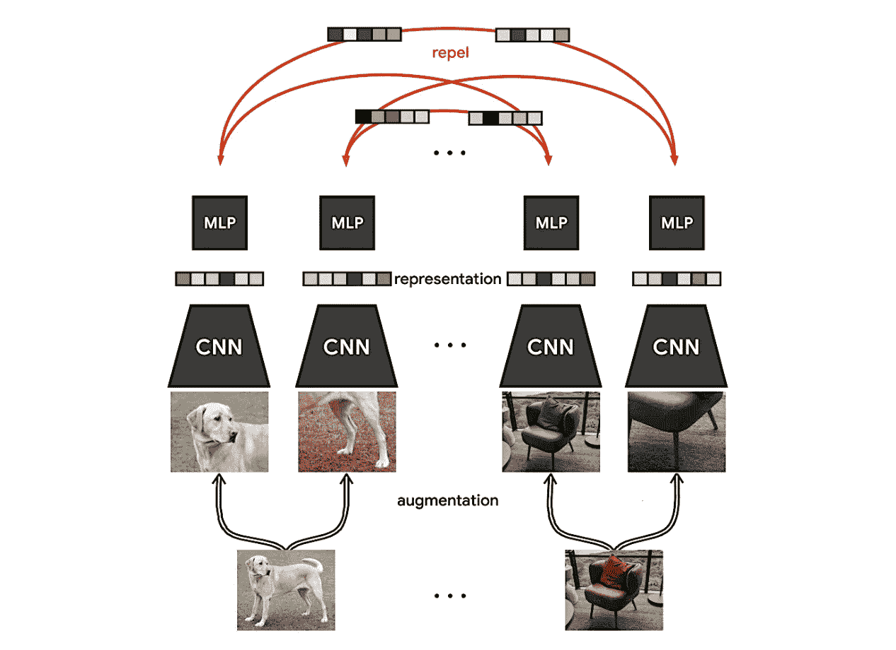
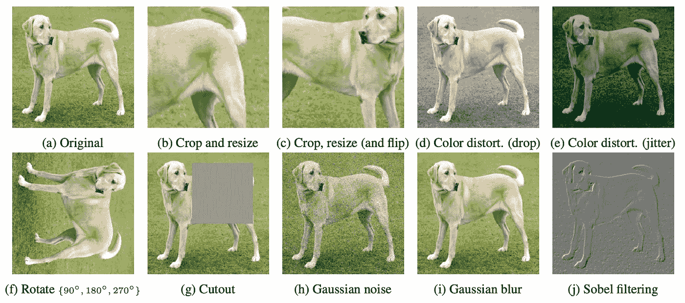
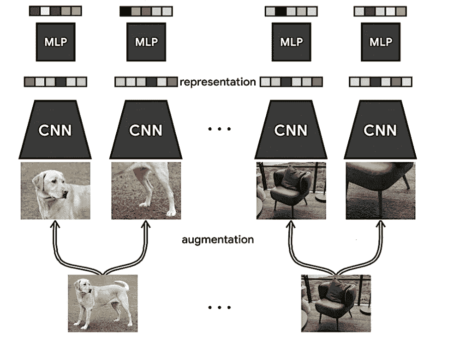
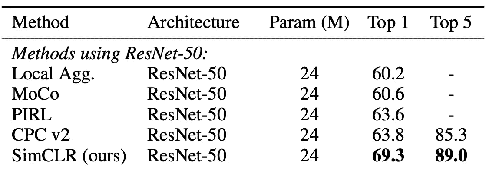
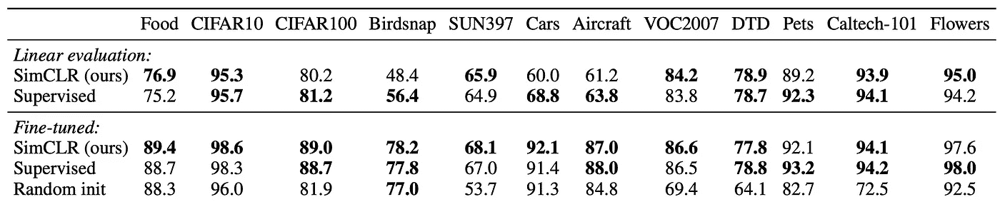

# 论文解释:视觉表征对比学习的简单框架

> 原文：<https://towardsdatascience.com/paper-explained-a-simple-framework-for-contrastive-learning-of-visual-representations-6a2a63bfa703?source=collection_archive---------4----------------------->

## 查看 SimCLR 论文中提出的观点

在这个故事中，我们将看看 SimCLR:在视觉任务的自我监督预训练中，将计算机视觉研究社区引向新高度的架构。

SimCLR 在 2020 年来自 Google Research 的陈等人的论文 [*【视觉表征对比学习的简单框架】*](https://arxiv.org/pdf/2002.05709.pdf)中提出。本文中的思想相对简单和直观，但也有一个新颖的损失函数，这是实现自我监督预训练的良好性能的关键。我尽量让文章简单，这样即使没有什么先验知识的读者也能理解。事不宜迟，我们开始吧！

SimCLR 训练程序的说明。来源:[【1】](https://github.com/google-research/simclr)

# 先决条件:计算机视觉的自我监督预培训

在我们深入研究 SimCLR 白皮书之前，有必要快速回顾一下自我监督的预培训到底是怎么回事。如果你一直在阅读我的其他自我监督学习的故事，或者你熟悉自我监督预培训，请随意跳过这一部分。

传统上，计算机视觉模型总是使用**监督学习**来训练。这意味着人类看着这些图像，并为它们创建了各种各样的标签，这样模型就可以学习这些标签的模式。例如，人类注释者可以为图像分配一个类标签，或者在图像中的对象周围绘制边界框。但是，任何接触过标注任务的人都知道，创建足够的训练数据集的工作量很大。

相比之下，**自我监督学习不需要任何人为创造的标签**。顾名思义，**模特学会自我监督**。在计算机视觉中，对这种自我监督进行建模的最常见方式是获取图像的不同裁剪或对其应用不同的增强，并通过模型传递修改后的输入。尽管图像包含相同的视觉信息，但看起来并不相同，**我们让模型知道这些图像仍然包含相同的视觉信息**，即相同的对象。**这导致模型学习相同对象的相似潜在表示(输出向量)。**

我们可以稍后在这个预训练的模型上应用迁移学习。通常，这些模型然后在 10%的带有标签的数据上进行训练，以执行下游任务，如对象检测和语义分割。

# 用 SimCLR 学习图像相似度

这篇论文的一个重要贡献是使用了**数据扩充**。SimCLR 创建成对的图像来学习相似性。如果我们两次输入相同的图像，就不会有学习效果。因此，每对图像都是通过对图像应用**放大或变换来创建的。**

不同的数据增强应用于狗的图像。来源:[【2】](https://arxiv.org/pdf/2002.05709.pdf)

从这篇论文的摘录中可以看出，作者应用了不同的增强，如调整大小、颜色失真、模糊、噪声等等。他们还从图像的不同部分获取作物，这对模型学习一致的表示很重要。可以将图像裁剪成全局和局部视图(完整图像和图像的裁剪部分)，或者可以使用相邻视图(从图像的不同部分进行两次裁剪)。每一对被公式化为**正对，**，即两个增强图像包含相同的对象。

接下来，这些对被传递到**卷积神经网络**中，以创建每个图像的特征表示。在论文中，作者选择使用流行的 ResNet 架构进行实验。成对的图像总是成批地提供给模型。特别强调的是批量的大小，作者从 256 到 8192 不等。从该批次开始，应用数据扩充，导致批次大小加倍，因此从 512 到 16382 个输入图像。

一旦 ResNet 计算出输入图像的矢量表示，该输出将被传送到**投影头**进行进一步处理。在本文中，这个投影头是一个带有一个隐藏层的 MLP。该 MLP 仅在训练和进一步细化输入图像的特征表示期间使用。

从原始输入图像到由 MLP 计算的表示的 SimCLR 训练过程。来源:[【1】](https://github.com/google-research/simclr)

一旦 MLP 计算完成，结果保留为损失函数的输入。**sim clr 的学习目标是使同一图像的不同增强之间的一致性最大化**。这意味着模型试图**最小化包含相同对象的图像之间的距离**和**最大化包含非常不同的对象的图像之间的距离**。这种机制也被称为**对比学习**。

SimCLR 论文的一个主要贡献是制定了其 **NT-Xent 损失**。NT-Xent 代表归一化温度标度交叉熵损失。这个新颖的损失函数具有一个特别理想的性质:**不同的例子被有效地加权**允许模型**从彼此远离的矢量表示中更有效地学习**，即使它们的原点是相同的图像。这些模型认为彼此非常不同的例子被称为**硬否定**。

这种损失有效地实现了相似图像的吸引，即，相似图像被学习为更紧密地映射在一起。

相似的图像相互吸引。来源:[【1】](https://github.com/google-research/simclr)

# 结果

一旦网络被完全训练，MLP 投影头被丢弃，仅卷积神经网络被用于评估。在他们的论文中，作者进行了不同的评估:

首先，他们在 ImageNet 数据集上测量 SimCLR 作为线性分类器的性能。他们的结果显示 **SimCLR 执行所有其他自我监督的方法**。

SimCLR 和其他自监督方法对 ImageNet 线性分类的结果。来源:[【2】](https://arxiv.org/pdf/2002.05709.pdf)

请记住，这些结果不再是最新的，因为具有更好性能的新方法已经出现。请随意阅读我的其他文章，在那里我回顾了其他自我监督的预培训模型。

其次，他们评估了 SimCLR 在不同图像数据集上的**性能，对比了使用标签**训练相同的 ResNet，即使用监督学习。同样， **SimCLR 表现非常好，在许多数据集上击败了监督训练方法**。在同一张表中，他们还查看了用标记数据微调自我监督模型的结果。在这一行中，他们表明 **SimCLR 在几乎所有数据集上的表现都优于监督训练方法**。

评估 SimCLR 与 ResNet 的监督培训。来源:[【2】](https://arxiv.org/pdf/2002.05709.pdf)

# 包装它

在本文中，您了解了 SimCLR，这是一篇最流行的自我监督框架，概念简单，结果有希望。SimCLR 在不断改进，甚至还有这种架构的第二个版本。虽然我希望这个故事能让你对这篇论文有一个很好的初步了解，但是还有很多东西需要发现。因此，我会鼓励你自己阅读这篇论文，即使你是这个领域的新手。你必须从某个地方开始；)

如果你对论文中介绍的方法有更多的细节感兴趣，请随时在 Twitter 上给我留言，我的账户链接在我的媒体简介上。

我希望你喜欢这篇论文的解释。如果你对这篇文章有任何意见，或者如果你看到任何错误，请随时留下评论。

**最后但同样重要的是，如果你想在高级计算机视觉领域更深入地探索，考虑成为我的追随者**。我试着每周发一篇文章，让你和其他人了解计算机视觉研究的最新进展。

参考资料:

[1] SimCLR GitHub 实现:【https://github.com/google-research/simclr 

[2]陈，丁等:“视觉表征对比学习的一个简单框架。”*机器学习国际会议*。PMLR，2020 年。[https://arxiv.org/pdf/2002.05709.pdf](https://arxiv.org/pdf/2002.05709.pdf)