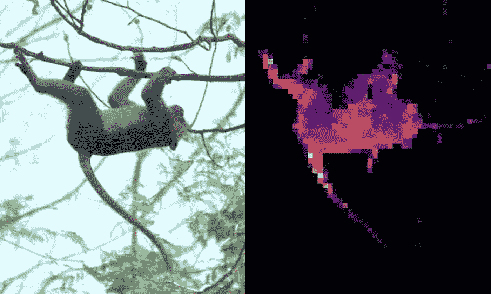
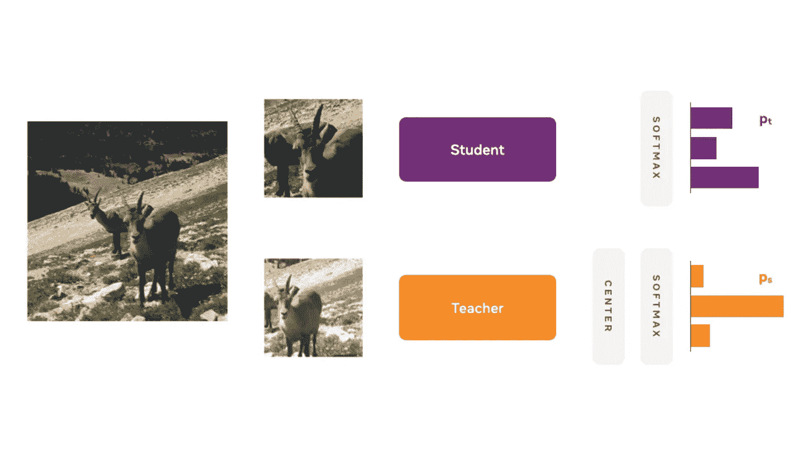
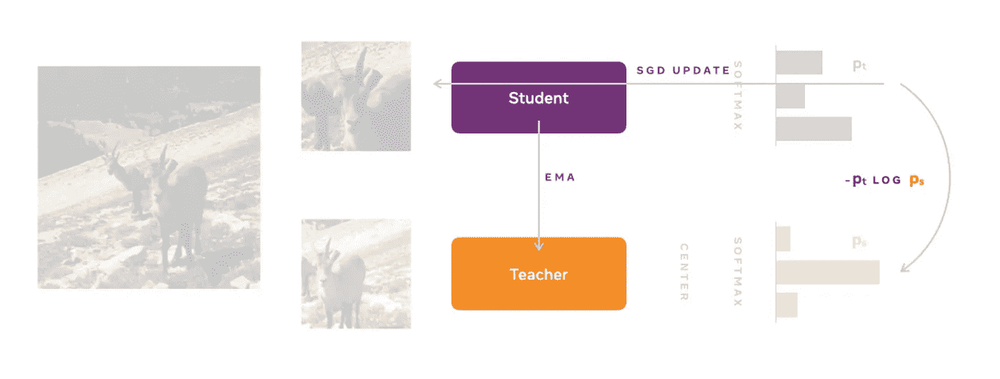
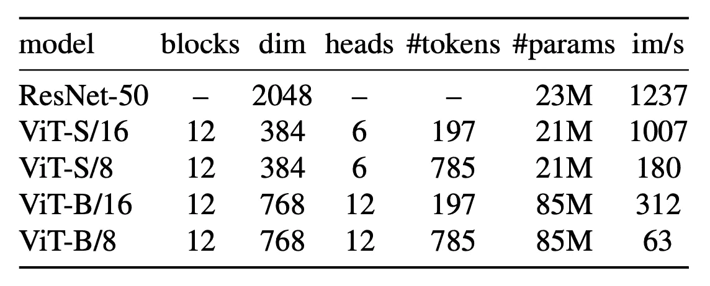
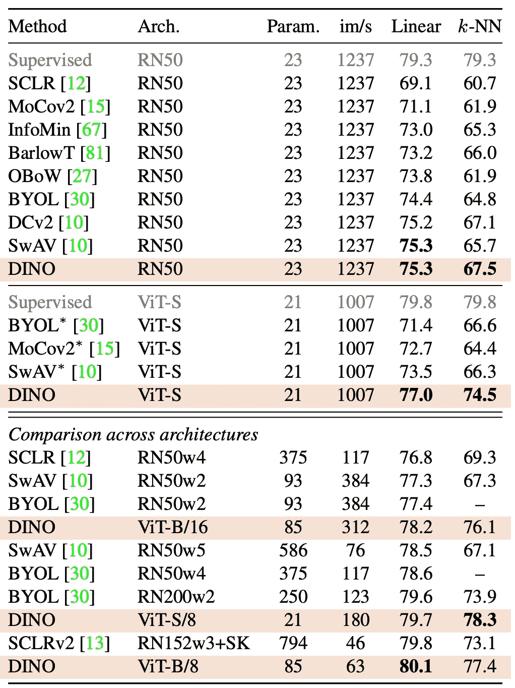
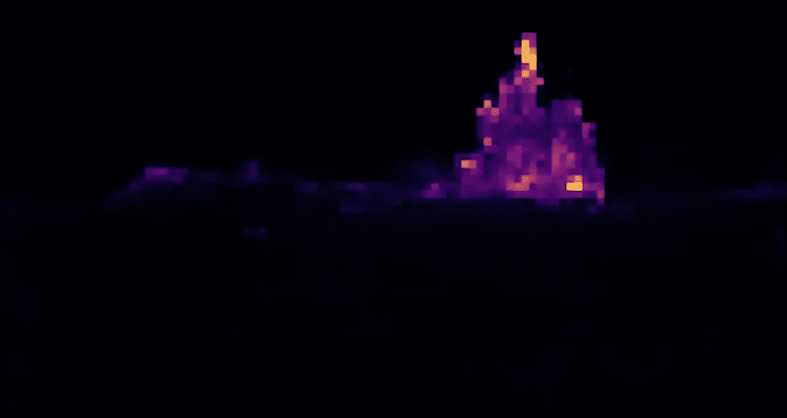

# 论文解释:DINO——自监督视觉变压器中的新兴特性

> 原文：<https://towardsdatascience.com/paper-explained-dino-emerging-properties-in-self-supervised-vision-transformers-f9386df266f1?source=collection_archive---------5----------------------->

## 用于自我监督学习的高级视觉转换器

在这个故事中，我很乐意给你一个关于 DINO paper 如何工作的好主意，以及是什么让它如此伟大。我尽量让文章简单，这样即使没有什么先验知识的读者也能理解。

迪诺的注意力被想象成树上的一只猴子。来源:[【2】](https://ai.facebook.com/blog/dino-paws-computer-vision-with-self-supervised-transformers-and-10x-more-efficient-training/)

传统上，视觉变压器(ViT)并不像一些人预期的那样有吸引力:它们有很高的计算要求，需要更多的训练数据，并且它们的特征没有表现出独特的属性。在他们 2020 年的论文“自我监督的视觉变压器中的新兴特性”中，Caron 等人旨在研究为什么监督的 ViT 尚未起飞，以及是否可以通过对它们应用自我监督的学习方法来改变这种情况。

传统上，计算机视觉模型，例如卷积神经网络，总是在人类监督下训练。这意味着人类必须为训练数据创建标签，比如告诉模型图像中有一只狗。

**自我监督学习允许它在没有任何标签的情况下训练模型。**因此，在计算机视觉任务的情况下，**只有图像被输入模型，网络本身学习理解它周围的视觉世界**。

事实证明，将自我监督应用于视觉变压器会产生以下理想的特性:

*   该模型学习从语义上分割对象并创建边界。该信息可在自我关注模块中获得。我们稍后会谈到什么是自我关注。

来自 DINO 的关注显示了该模型可以多么令人印象深刻地专注于图像的最相关部分。这也用作场景的无监督语义分割。来源:[【1】](https://arxiv.org/pdf/2104.14294.pdf)

*   学习到的特征表示，即模型的输出向量，对于执行聚类非常有用。此外，应用 k-最近邻分类器导致一些令人印象深刻的分类结果

迪诺以自我监督的方式学习集群。在训练过程中没有使用标签。来源:[【2】](https://ai.facebook.com/blog/dino-paws-computer-vision-with-self-supervised-transformers-and-10x-more-efficient-training/)

# 迪诺如何工作

迪诺采用了一种叫做自我蒸馏的方法。这也是这个名字的由来:Self-**di**stillation with**no**labels(或者他们只是想构造一个朗朗上口的名字)。

自我升华创造了一个教师和学生网络。这两个网络的模型架构完全相同。DINO 的一个很大的优点是它在这一点上完全灵活:可以使用 ViT 或 ConvNet，比如流行的 ResNet-50。

迪诺前进训练过程的简单概述。一幅图像被裁剪成两种尺寸，并传送给学生和教师网络。对教师的输出应用居中操作，并且两个输出都通过 softmax 层馈送。来源:[【2】](https://ai.facebook.com/blog/dino-paws-computer-vision-with-self-supervised-transformers-and-10x-more-efficient-training/)

在模型的**正向训练阶段**，创建图像的不同裁剪。作物 1 通过学生网络提供，而作物 2 通过教师网络提供。与来自学生网络的输出相反，对教师网络的输出应用居中操作。接下来，使用 softmax 函数对两个网络的输出进行归一化。

为了反向传播模型并更新参数，定义了**交叉熵** **损失**。

两个 softmax 输出都被传递到损失函数中，使用随机梯度下降(SGD)执行反向传播。之后，使用指数移动平均(EMA)将学生网络的模型参数转移到教师网络。来源:[【2】](https://ai.facebook.com/blog/dino-paws-computer-vision-with-self-supervised-transformers-and-10x-more-efficient-training/)

两个 softmax 输出都馈入损失函数。对于训练，模型通常处理多个图像，在这种情况下，可能是 2 个较大的作物和 4 个较小的作物。这种损失可以同时应用于所有视图。一旦计算出损失，使用**随机梯度下降** (SGD)执行**反向传播**，目标是最小化交叉熵。反向传播是通过学生网络执行的，这就是为什么教师的权重还没有更新。为了更新教师模型，DINO 对学生权重使用指数移动平均(EMA)，即[动量编码器](https://arxiv.org/pdf/1911.05722.pdf)。

简而言之，这就是训练程序。在我们看一些结果之前，让我们快速看一下这篇论文使用了什么模型。

用于 DINO 的网络体系结构概述。来源:[【1】](https://arxiv.org/pdf/2104.14294.pdf)

正如我们将在结果中看到的，DINO 与 ViT 一起使用时效果最佳，特别是 ViT-B/8 效果最佳。但是，如前所述，DINO 也可以与传统的 ConvNet 一起使用。

# 结果

为了应用该模型，作者以 3 层多层感知器(MLP)的形式在变压器的顶部添加了投影头。虽然它们提供了各种各样的结果，但我想把重点放在我认为最相关的结果上。

**ImageNet 上的线性和 k 近邻分类**

在我看来，最相关的是将 k-最近邻分类器应用于训练特征呈现时的分类性能。如本文介绍所示，**恐龙集群不同班级成绩斐然**。这又是那个图表:

迪诺创造的集群。来源:[【2】](https://ai.facebook.com/blog/dino-paws-computer-vision-with-self-supervised-transformers-and-10x-more-efficient-training/)

巨大的分离清晰可见，代表**相似物体的星团彼此更加接近**。这具有难以置信的含义。这意味着分类可以在没有标签监督的情况下，仅通过自我监督的预训练，以高精度完成。此外，DINO 对于线性分类似乎工作得很好。如需了解更多详情，请参见下表，其中作者将 DINO 与其他最先进的自我监督预训练方法进行了比较:

与其他自我监督预训练方法的性能比较。对于 ImageNet 上的线性和 k-NN 分类任务，DINO 优于所有这些方法。来源:[【1】](https://arxiv.org/pdf/2104.14294.pdf)

**高度精确的注意力和完全无监督的语义分割**

视觉上最令人印象深刻的当然是由自我注意机制产生的分割结果。就像人类一样，**模型聚焦于场景中的相关物体，即使船只被遮挡**。虽然没有在本文中进行定量评估，但这种可视化提供了模型过程的更透明的视图，并增加了对其能力的信心。

迪诺对这艘船的关注可视化了。来源:[【2】](https://ai.facebook.com/blog/dino-paws-computer-vision-with-self-supervised-transformers-and-10x-more-efficient-training/)

# 包装它

在本文中，您已经了解了 DINO，这是一篇在《视觉变形金刚》中利用自我监督学习的论文。虽然我希望这个故事能让你对这篇论文有一个很好的初步了解，但是还有很多东西需要发现。因此，我会鼓励你自己阅读这篇论文，即使你是这个领域的新手。你必须从某个地方开始；)

如果你对论文中介绍的方法有更多的细节感兴趣，请随时在 Twitter 上给我留言，我的账户链接在我的媒体简介上。

我希望你喜欢这篇论文的解释。如果你对这篇文章有任何意见，或者如果你看到任何错误，请随时留下评论。

**最后但同样重要的是，如果你想在高级计算机视觉领域更深入地探索，考虑成为我的追随者**。我试着每周发一篇文章，让你和其他人了解计算机视觉研究的最新进展。

参考资料:

[1][https://ai . Facebook . com/blog/dino-paws-computer-vision-with-self-supervised-transformers-and-10x-more-efficient-training/](https://ai.facebook.com/blog/dino-paws-computer-vision-with-self-supervised-transformers-and-10x-more-efficient-training/)

[2]卡隆，玛蒂尔德等，“自我监督的视觉变形金刚的新兴特性” *arXiv 预印本 arXiv:2104.14294* (2021)。[https://arxiv.org/pdf/2104.14294.pdf](https://arxiv.org/pdf/2104.14294.pdf)

链接到 GitHub 库:[https://github.com/facebookresearch/dino](https://github.com/facebookresearch/dino)