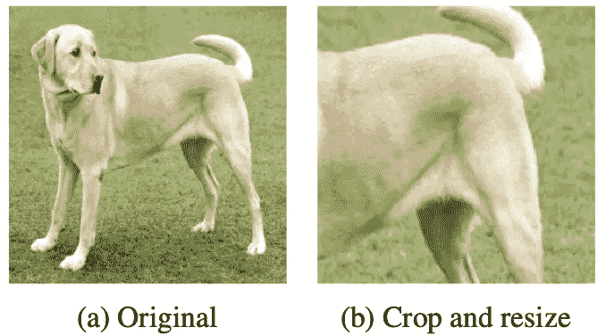
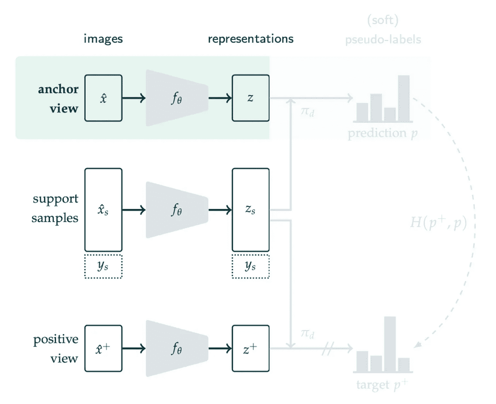
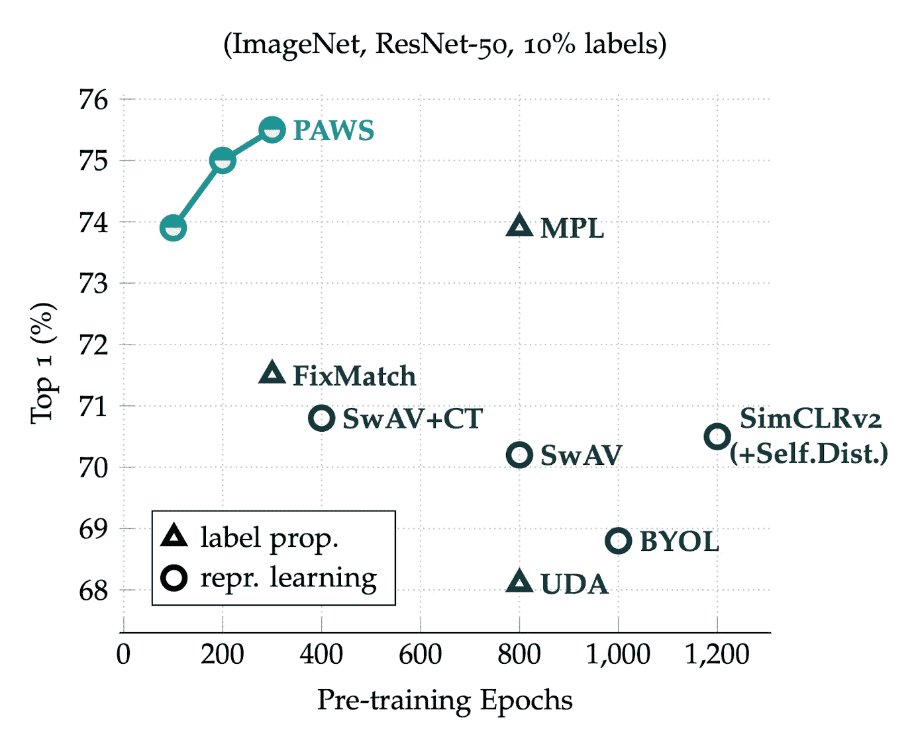
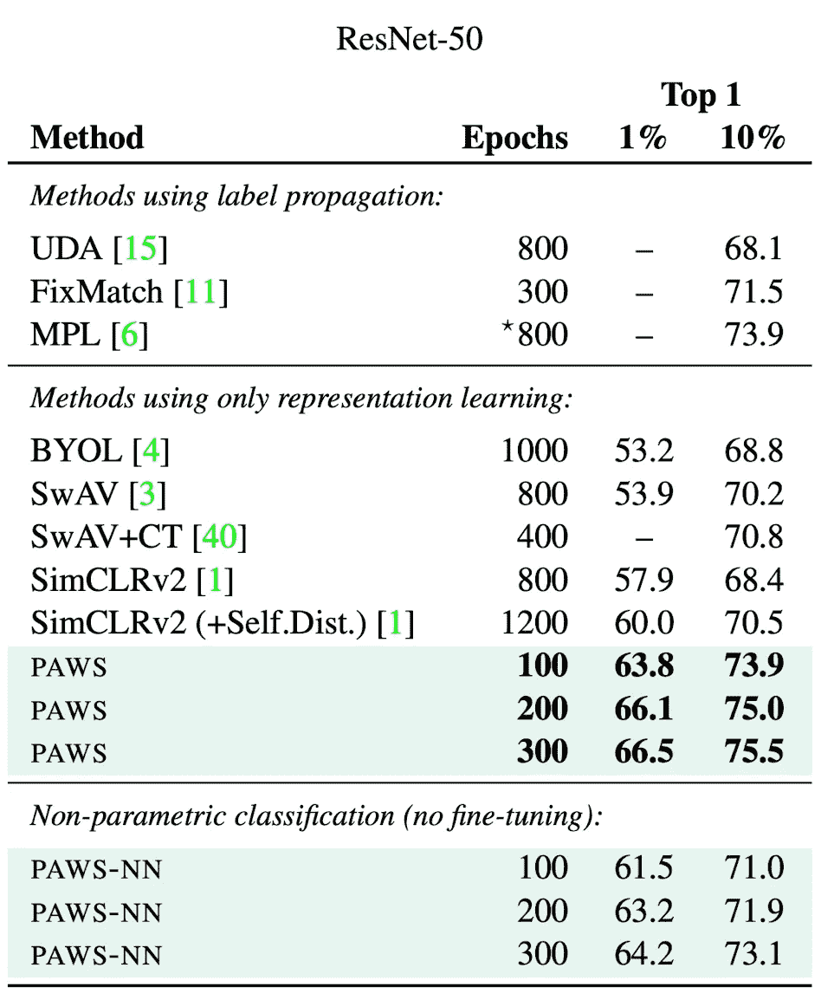

# 论文解释:通过用支持样本非参数预测视图分配的视觉特征的半监督学习

> 原文：<https://towardsdatascience.com/paper-explained-semi-supervised-learning-of-visual-features-by-non-parametrically-predicting-view-1fcbf91517a0?source=collection_archive---------33----------------------->

## 利用标记支持样本进行半监督学习

在这个故事中，我们将进一步了解 PAWS ( **p** 预测视图 **a** 分配**w**with**s**支持标签)，这是一种将半监督学习应用于计算机视觉问题的新方法。

该方法已作为 Assran 等人在 2021 年 ICCV 大会上发表的论文 [*“通过支持样本的非参数预测视图分配的半监督学习”的一部分。与我写过的一些其他论文相比，这种方法允许有限地使用标记数据，只将这些信息投射到更大的未标记数据池中进行学习。因此，**标记的数据变得比在完全监督下训练模型更有价值**。和往常一样，我试图保持文章的简单，这样即使没有什么先验知识的读者也能理解。事不宜迟，我们开始吧！*](https://arxiv.org/pdf/2104.13963.pdf)

PAWS 训练过程的简化可视化。最值得注意的是，标签与支持样本一起被引入训练过程。来源:[【1】](https://github.com/facebookresearch/suncet)

# 先决条件:自我监督与半监督学习

一个重要的区别是自我监督和半监督学习之间的区别。

当以自我监督的方式训练模型时，监督不是来自标记的数据。更确切地说，这个模型，顾名思义，是自我监督的。这种监管会是什么样的？简而言之，可以向模型提供应用了不同数据增强的相同图像，目标是了解图像仍然是相同的。这样，学习过程就有了指导。

相比之下，半监督学习确实依赖于标记数据，但很少。当使用传统的监督训练方法时，所有数据都必须被标记。**半监督模型仅使用一小部分标记数据，并提取标签来推理和学习未标记的训练数据**。这在本文中变得更加清楚。

# 从少量标记图像中学习

在过去，有监督的计算机视觉模型总是在 ImageNet 数据上进行评估。为了执行评估，仅使用标记的图像在数据集上训练模型。PAWS 只有 1%或 10%的标签可用于训练，但仍然取得了令人难以置信的性能。我们来看看为什么！

首先，每个图像被随机增强以形成两个视图:锚视图和正视图。虽然图像的内容仍然是相同的，例如它包含一只狗，**增强现在已经扭曲了它的视觉表现，即它们看起来不同**。

数据扩充的一个例子。右边是原始图像，左边是增强图像。来源:[【2】](https://arxiv.org/pdf/2002.05709.pdf)

现在使用卷积神经网络对同一图像的这两个视图进行编码，在这种情况下是 ResNet-50。该网络将每幅图像作为输入，并输出其矢量表示。**在自我监督学习中，我们现在将在同一图像的两个视图之间公式化相似性损失或类似的东西**。但是**在半监督学习**中，在任何损失函数被公式化以从这些输出中学习之前，**我们可以从我们可用的标记图像中受益**。

在本文中，带标签的图像称为支持样本。这些被标记的支持样本也被编码，使用相同的 ResNet-50 来为它们中的每一个形成向量表示。

形成输入图像的矢量表示的编码器的图示。来源:[【3】](https://arxiv.org/pdf/2104.13963.pdf)

现在我们已经有了带有标签的矢量表示，我们可以使用它们来衡量它们与锚和正图像编码的相似性。这通过使用所谓的**软最近邻策略**来实现。这意味着**锚和正视图根据它们与其中一个支持样本**的相似性进行分类，并且它们被分配一个**软伪标签**，即具有最小距离的支持样本的标签。

整个训练过程可视化了。条形图前面的箭头表示软最近邻分类器。来源:[【3】](https://arxiv.org/pdf/2104.13963.pdf)

既然已经为正视图和锚视图生成了软伪标签，则计算它们之间的交叉熵作为损失项的公式。

注意，为了防止学习崩溃，**温度参数被引入到最近邻分类器**中，而且被引入到显示在图示右下角的目标预测中。在这种情况下，温度参数充当锐化工具。简单来说，**在输出分配中，高值变得更高，低值变得更低**，增加了它们之间的对比度。这使得学习目标更接近于一次性编码(标签被编码成 0 和 1 的数组)。

至此，我们将结束对本文背后技术的简短概述。现在，让我们来看看一些结果！

# 结果

如前所述，与自我监督学习相比，半监督学习可以利用标签形式的信息来学习理解周围的视觉世界。作为评估的一部分，在预训练期间，1%或 10%的 ImageNet 训练数据被标记为 paw。**所有方法都在没有监督的情况下进行训练，然后使用 10%的标记 ImageNet 数据进行微调**。这使得 PAWS 的第一个优点相当直观。

PAWS 与 Top 1 ImageNet 分类的其他预训练技术的比较。来源:[【3】](https://arxiv.org/pdf/2104.13963.pdf)

第一个图表显示 **PAWS 在这个分类基准上表现得更好，训练更少，因为它的训练数据信息更丰富**。因此，在训练期间使用标签取代了诸如 SwAV 或 SimCLRv2 所要求的长训练时间。这是有意义的，因为 SwAV，一种自我监督的方法，必须在没有任何人类帮助的情况下找出一个良好的视觉世界模型，而 PAWS，在这种情况下，使用 10%的数据和标签。

将 PAWS 的表现与其他预训练技术进行比较的表格。所有模型都使用 ResNet-50，并在其他 1%或 10%的标记上进行微调，除了 PAWS-NN，它在学习的嵌入上使用最近邻分类。来源:[【3】](https://arxiv.org/pdf/2104.13963.pdf)

**与其他预训练方法相比，PAWS 的性能优势是真实的，也是最先进的自我监督预训练**。通过使用 1%或 10%的标记 ImageNet 数据作为支持样本，PAWS 能够以更少的训练时期胜过所有这些。更令人印象深刻的是在 PAWS-NN 下看到的结果。为此，没有对 PAWS 进行微调，所有图像都基于其原始输出嵌入的最近邻分类进行分类。这是了不起的，显示了半监督训练的真正潜力。

这表明**以标签的形式提取的人类知识，当被正确地整合时，可能是极其强大的**。如与自我监督学习相比更低的训练时间所示，通过让人类辅助学习过程，人工神经网络可以更有效地理解信息。从某种意义上说，这是两个神经网络一起工作。一个生物的，一个人工的。

# 包装它

在本文中，您已经了解了 PAWS，这是一篇使用半监督学习从少数标记图像中获利并将该知识转移到所有其他未标记图像的论文。这已经显示出期望的特性，例如更少的预训练时间和更好的性能。虽然我希望这个故事能让你对这篇论文有一个很好的初步了解，但是还有很多东西需要发现。因此，我会鼓励你自己阅读这篇论文，即使你是这个领域的新手。你必须从某个地方开始；)

如果你对论文中介绍的方法有更多的细节感兴趣，请随时在 Twitter 上给我留言，我的账户链接在我的媒体简介上。

我希望你喜欢这篇论文的解释。如果你对这篇文章有任何意见，或者如果你看到任何错误，请随时留下评论。

**最后但同样重要的是，如果你想在高级计算机视觉领域更深入地探索，考虑成为我的追随者**。我试着每周发一篇文章，让你和其他人了解计算机视觉研究的最新进展。

参考资料:

[1] PAWS GitHub 资源库:【https://github.com/facebookresearch/suncet 

[2]陈，丁等:“视觉表征对比学习的一个简单框架。”*机器学习国际会议*。PMLR，2020 年。[https://arxiv.org/pdf/2002.05709.pdf](https://arxiv.org/pdf/2002.05709.pdf)

[3] Assran，Mahmoud 等人，“通过支持样本的非参数预测视图分配的视觉特征的半监督学习” *arXiv 预印本 arXiv:2104.13963* (2021)。[https://arxiv.org/pdf/2104.13963.pdf](https://arxiv.org/pdf/2104.13963.pdf)