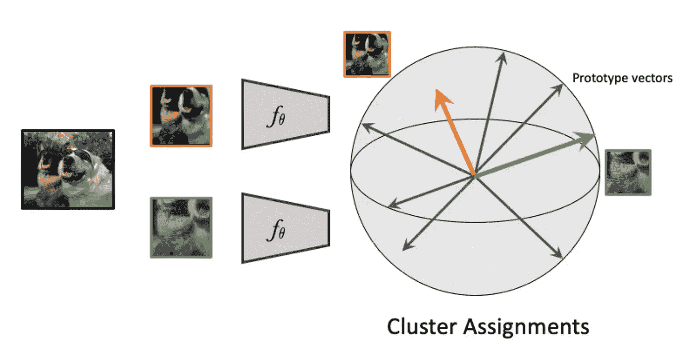
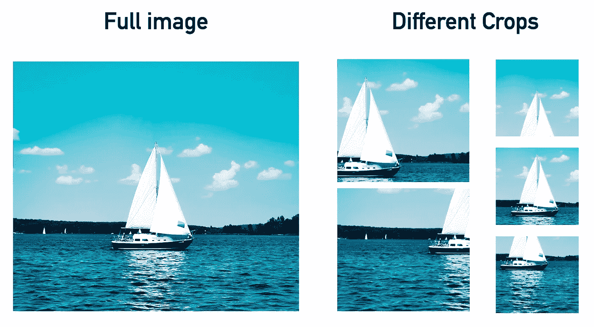
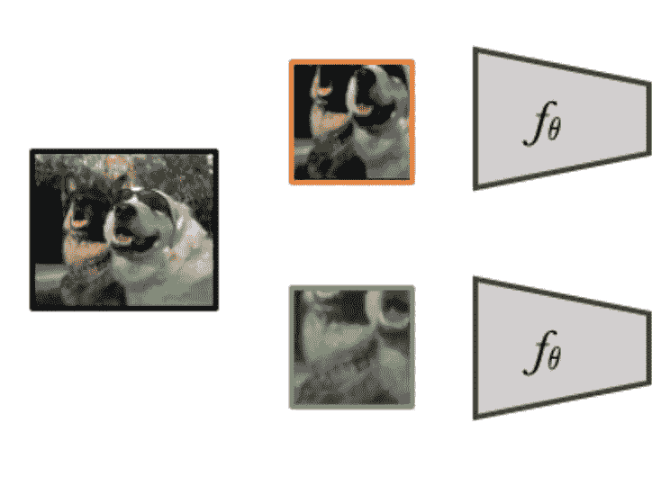
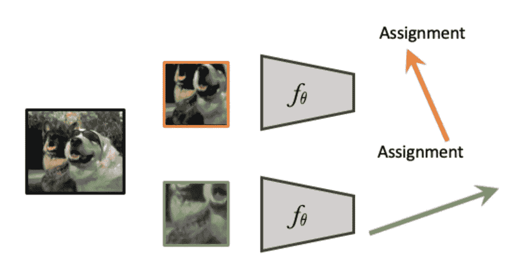
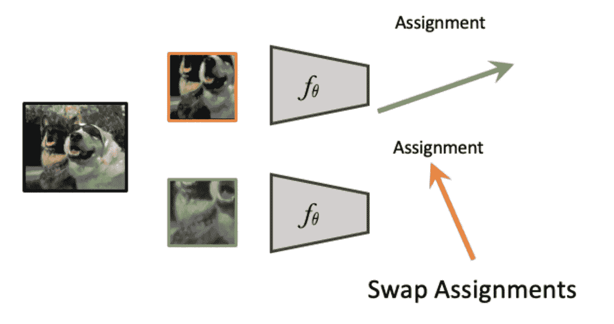
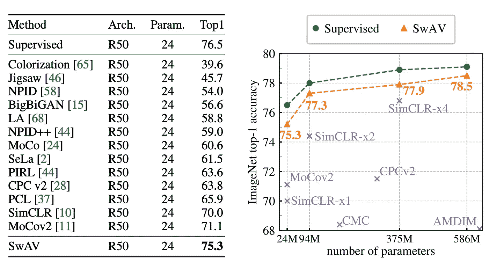

# 论文解释:通过对比聚类分配的视觉特征的无监督学习

> 原文：<https://towardsdatascience.com/paper-explained-unsupervised-learning-of-visual-features-by-contrasting-cluster-assignments-f9e87db3cb9b?source=collection_archive---------10----------------------->

## 为什么 SwAV 模型架构对自我监督的预培训如此有效的秘密

多年来，教会神经网络在没有人类监督的情况下理解周围的世界一直是计算机视觉研究社区的北极星之一。最近，多个出版物显示了新方法在该领域取得重大进展的潜力。

发表的最有前景的方法之一是 Caron 等人从今年开始发表的一篇名为 [*“通过对比聚类分配进行视觉特征的无监督学习”*](https://arxiv.org/pdf/2006.09882.pdf) 的论文。在这篇文章中，我们将回顾作者介绍的思想，SwAV 模型架构以及自我监督预训练的结果。我尽量让文章简单，这样即使没有什么先验知识的读者也能理解。事不宜迟，我们开始吧！

SwAV 训练程序的可视化。来源:[【1】](https://github.com/facebookresearch/swav)

# 先决条件:计算机视觉的自我监督预培训

在我们深入研究 SwAV 论文之前，有必要快速回顾一下自我监督预培训是怎么回事。如果你熟悉自我监督的预备培训，可以跳过这一部分。

传统上，计算机视觉模型总是使用**监督学习**来训练。这意味着人类看着这些图像，并为它们创建了各种标签，这样模型就可以学习这些标签的模式。例如，人类注释者可以为图像分配一个类标签，或者在图像中的对象周围绘制边界框。但是，任何接触过标注任务的人都知道，创建足够的训练数据集的工作量很大。

相比之下，**自我监督学习不需要任何人为创造的标签**。顾名思义，**模特学会自我监督**。在计算机视觉中，对这种自我监督进行建模的最常见方式是获取图像的不同裁剪或对其应用不同的增强，并通过模型传递修改后的输入。尽管图像包含相同的视觉信息，但看起来并不相同，**我们让模型知道这些图像仍然包含相同的视觉信息**，即相同的对象。**这导致模型学习相同对象的相似潜在表示(输出向量)。**

我们可以稍后在这个预训练的模型上应用迁移学习。通常，这些模型然后在 10%的带有标签的数据上进行训练，以执行下游任务，如对象检测和语义分割。

# SwAV 如何使用无监督学习来理解周围的视觉世界

SwAV 的培训管道分为多个阶段。

在第一部分中，创建图像的不同裁剪。其他技术总是使用固定的大小来裁剪图像，而 SwAV 引入了多裁剪策略:不仅创建了两个较大的裁剪，还拍摄了多达 4 个较小的裁剪。这是 SwAV 与其他方法相比能够提升其性能的关键之一。也可以应用其他图像增强，如模糊和翻转。

SwAV 从同一幅图像中创建不同大小的作物进行训练。这被称为多作物策略。来源:自己的策展，图片来自 [Unsplash](https://unsplash.com/photos/UJh4sYnVmNE)

接下来，图像通过卷积神经网络成对传递**。在论文中，作者使用了流行的 [ResNet-50](https://arxiv.org/pdf/1512.03385.pdf) 架构，他们发现随着模型宽度的增加，性能也有所提高。对于每一个图像，ResNet 将输出一个维数为 128 的特征向量。**

该可视化显示了将图像的每种不同裁剪输入到 ResNet，ResNet 输出每种图像的矢量表示。来源:[【1】](https://github.com/facebookresearch/swav)

一旦这些特征向量或代码被计算出来，它们就与所谓的原型向量相匹配。这些是定义可学习视觉特征空间之间的可能区别的空间的向量，例如，狗和猫之间的区别由不同的原型向量表示。制定代码到原型的映射，以最大化图像特征和原型之间的相似性。这个过程的输出是一个集群分配。

将输出特征向量匹配到原型向量空间导致将向量分配给原型聚类。来源:[【1】](https://github.com/facebookresearch/swav)

现在我们已经创建了这些聚类分配，我们做一个假设:**如果输入的作物来自同一幅图像，我们希望以这样一种方式学习模型，即它为同一幅图像的作物输出相似的向量。**

匹配聚类分配向量的简化可视化。来源:[【1】](https://github.com/facebookresearch/swav)

因此，应该可以交换两个输出向量(作物 1 得到向量 2，作物 2 得到向量 1)并且**使模型学习预测另一个输入作物**的向量输出。

交换集群分配。这成为新的训练目标。来源:[【1】](https://github.com/facebookresearch/swav)

这些交换的向量现在是另一个输入的预测目标，现在成为我们的学习目标，我们用它来反向传播模型的权重。

这种机制允许 SwAV 学习相同图像或对象类的**一致矢量表示**。这种能力对下游迁移学习至关重要。

现在，让我们看看一些结果。

# 结果

当仅使用来自预训练的冻结权重在 ImageNet 上对线性分类评估 SwAV 模型时，它优于所有其他最先进的自我监督方法。

SwAV 在 ImageNet 数据集上的性能。来源:[【2】](https://arxiv.org/pdf/2006.09882.pdf)

最令人印象深刻的是，自我监督模型的**性能几乎与仅使用注释数据的完全监督模型的性能相当。**所有评估均使用 ResNet-50 (R50)骨架进行。在右图中，更多参数的性能差异表明 SwAV 也优于其他方法。

对 SwAV 的评估与对差异数据集的全监督训练程序的比较。来源:[【2】](https://arxiv.org/pdf/2006.09882.pdf)

线性分类的这种性能优势在其他数据集上也同样适用。令人难以置信的是，当用作 Mask R-CNN 等对象检测模型的主干并仅使用 ImageNet 中 10%的标记数据进行微调时，所示的所有对象检测架构都优于相同模型架构的完全监督训练。**这意味着对象检测主干的自我监督预训练可以产生比完全监督训练模型更好的性能。**

# 包装它

在本文中，您已经了解了 SwAV，这是一种利用自我监督的预训练来为下游任务(如对象检测)实现新的性能高度的论文。在某些任务上，它甚至优于完全监督的方法。虽然我希望这个故事能让你对这篇论文有一个很好的初步了解，但是还有很多东西需要发现。因此，我会鼓励你自己阅读这篇论文，即使你是这个领域的新手。你必须从某个地方开始；)

如果你对论文中介绍的方法有更多的细节感兴趣，请随时在 Twitter 上给我留言，我的账户链接在我的媒体简介上。

我希望你喜欢这篇论文的解释。如果你对这篇文章有任何意见，或者如果你看到任何错误，请随时留下评论。

**最后但同样重要的是，如果你想在高级计算机视觉领域更深入地探索，考虑成为我的追随者**。我试着每周发一篇文章，让你和其他人了解计算机视觉研究的最新进展。

参考资料:

[1] SwAV GitHub 实现:【https://github.com/facebookresearch/swav 

[2]卡隆、玛蒂尔德等人，“通过对比聚类分配对视觉特征进行无监督学习。” *arXiv 预印本 arXiv:2006.09882* (2020)。[https://arxiv.org/pdf/2006.09882.pdf](https://arxiv.org/pdf/2006.09882.pdf)