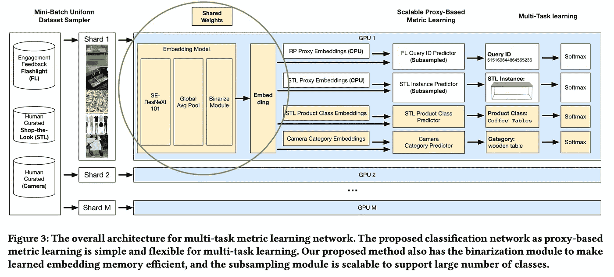
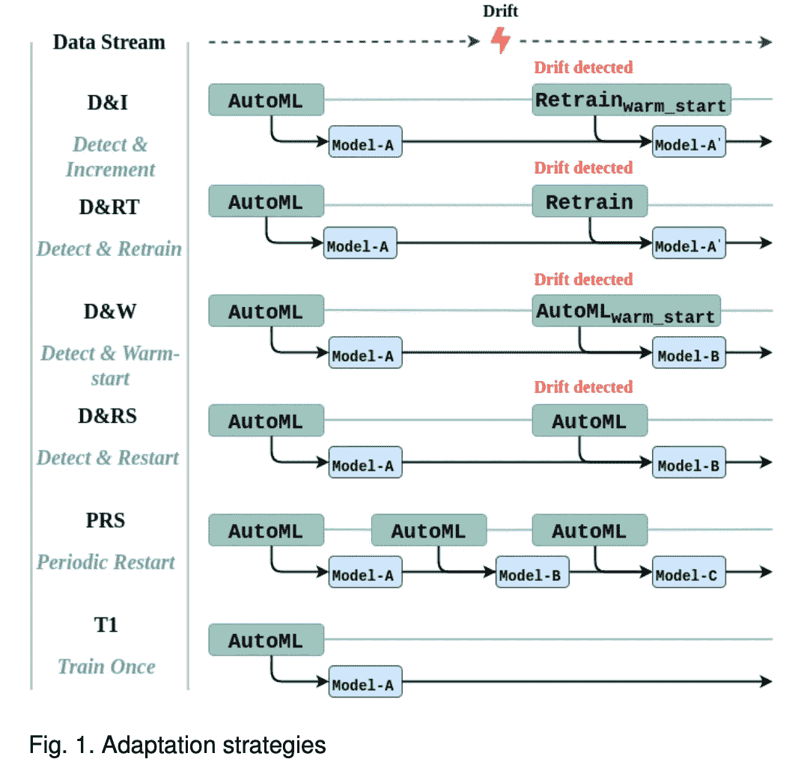
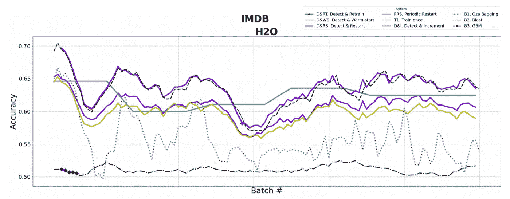
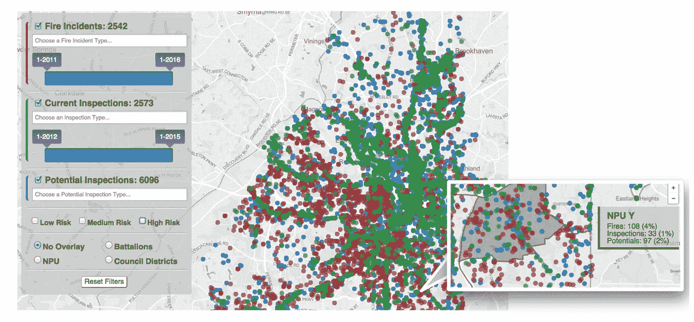

# 论文摘要-部署机器学习的挑战:案例研究调查

> 原文：<https://towardsdatascience.com/paper-highlights-challenges-in-deploying-machine-learning-a-survey-of-case-studies-cafe61cfd04c?source=collection_archive---------17----------------------->

## 本文通过讨论我们可能面临的挑战，为我们部署 ML 模型做更好的准备

# 概观

生产 ML 很难。如果我们能更好地理解部署 ML 的挑战，我们就能更好地准备下一个项目。这就是为什么我喜欢阅读 Paleyes、Urma 和 Lawrence 的《部署机器学习的挑战:案例研究调查》(2021 年 1 月 18 日，arXiv)。它调查了过去 5 年中与 ML 部署流程相关的论文和文章。为了对 ML 开发过程中的挑战进行分组，作者将 ML 工作流分为 4 个高级步骤，从数据管理到模型部署。之后有一节是关于交叉问题的。

在这篇文章中，我将分享这篇论文的主要亮点，并用参考资料的摘要补充这些要点。我们将讨论:

*   模型重用
*   研究人员和工程师之间的有效合作
*   离群点检测有助于更好的预测
*   处理概念漂移
*   最终用户信任
*   敌对攻击

这篇文章不是这篇论文的完整总结，而是我发现的最新颖的话题。

# 模型部署

## **模型重用**

在软件工程中[代码重用](https://en.wikipedia.org/wiki/Code_reuse)可以减少需要维护的代码，鼓励模块化和可扩展性。重用的思想可以应用于 ML 模型。我们以 Pinterest 为例来看看。Pinterest 使用[图像嵌入](https://arxiv.org/abs/1908.01707)来支持视觉搜索。他们使用了三个独立的嵌入，专门用于三个不同的任务。因此，不同嵌入的维护、部署和版本控制很快变得势不可挡。作为解决方案，他们在多任务学习框架下统一了嵌入。结果是维护负担减轻，性能提高。

引用一下:

> [解决方案]利用来自每个应用程序的所有训练数据组合中的相关信息来生成统一嵌入，该嵌入优于之前为每个产品部署的所有专门嵌入。

来源:[在 Pinterest](https://arxiv.org/pdf/1908.01707.pdf) 学习视觉搜索的统一嵌入。他们的多任务度量学习网络的架构。

关于这个图:蓝盒子里的所有东西都是一个巨大的神经网络。被圈起来的部分(被我圈起来的)产生了普遍嵌入。嵌入和下游任务特定网络被联合优化。

ML 实践者的一个问题是:有没有通用的建模组件可以跨 ML 应用程序重用？也许您不能使用反向传播来优化一个通用的神经网络层，但是您可以使用共享组件来实现模型可解释性、异常值检测等等。

## 研究人员和工程师之间的有效合作

Paleyes 提到，尽管 ML 研究人员和工程师之间似乎有明确的角色分工，但孤立的研究和开发可能会有问题。将数据科学研究“越过墙”扔给工程团队通常被认为是反模式的。研究人员应该与工程师一起工作来拥有产品代码，因为它提高了迭代速度和产品质量。这与 Stitchfix [如何构建他们的数据团队](https://multithreaded.stitchfix.com/blog/2019/03/11/FullStackDS-Generalists/)以及这篇关于为什么[的数据科学家应该更加端到端](https://eugeneyan.com/writing/end-to-end-data-science/)的文章是一致的。

## 离群点检测有助于更好的预测

模型对非分布输入的概括能力很差，导致可信度很高的错误输出。在生产中，检测可能导致不可信预测的异常值是很重要的。

例如，假设您维护一个预测客户是否会流失的模型，客户关系团队使用该模型。该团队投入大量精力来挽救预测流失风险较高的大客户，但大多忽略了“健康”的客户。不正确的预测会带来不小的代价——花费在不需要关注的账户上的努力(用在其他地方会更好),或者被忽视的不健康账户的流失。在某种程度上，你的模型得到了一个异常值，一个与训练数据有很大不同的特征的账户。与其让模型自信地做出预测，不如显示一条消息，说明该帐户是异常值，需要数据科学和客户关系团队进行进一步调查。罪魁祸首实际上可能是上游数据问题。

离群值检测本身可能很难，因为通常缺乏标记离群值。Paleyes 引用了 Seldon Technologies 的一篇[论文，其中提到探测器可以预先训练或在线更新。对于前者，检测器作为一个单独的模型部署，并成为另一个模型来发展和维护。后者可以部署为有状态的应用程序。](https://arxiv.org/abs/2007.06299)

## 处理概念漂移

当世界改变时，你的世界模型可能会变得过时和不准确。这在 ML 中被称为概念漂移，定义为联合分布 *P(X，y)* 中的一个移位。通常 *X* 是训练数据， *y* 是目标变量。无法从概念漂移中学习的真实世界类比是因为不适应变化的市场而破产的公司，以及试图与 Z 世代联系的老一代人(这不会起作用)。

在 ML 中，当数据收集方法改变时，概念漂移也可能出现——世界没有改变，但从模型的角度看，它似乎发生了变化。也许上游的数据处理代码发生了变化，或者升级了一个物联网传感器。

Paleyes 引用了[一篇探索漂移对 AutoML](https://arxiv.org/abs/2006.06480) 算法影响的论文。参考论文的作者使用了真实世界和带有概念漂移的合成数据集。他们定义了不同的适应策略，使模型适应检测到的漂移，并比较了 AutoML 系统、适应策略和数据集的每种组合的结果。

来源:[自动机器学习对进化数据的适应策略](https://arxiv.org/pdf/2006.06480.pdf)。概念漂移的适应策略。

在上图中，前 4 个策略定义了检测到漂移时要做的事情。例如,“检测和增量”对 AutoML 模型进行增量训练，训练基于最新的数据批次。最后一个策略是没有再训练的基线。对于每种策略的更深入的描述，我将遵从本文。下面是来自 IMDB 的真实世界数据的每个适应策略的模型准确性结果。

来源:[自动机器学习对进化数据的适应策略](https://arxiv.org/pdf/2006.06480.pdf)。使用 H2O 的 AutoML，在 IMDB 数据集上为每种适应策略建立模型的准确性。

图中，没有再培训的基准线是黄线。在 magenta 中，检测和增量策略似乎在这个数据集上工作得最好，但有时比定期重启策略差。

本文的结论是，最佳的适应策略取决于 AutoML 系统和数据集。基本上，没有免费的午餐，你必须找出最能解决你问题的方法。

# 跨领域挑战

## 最终用户信任

作为一名数据科学家，您可能对自己的模型非常有信心，但最终用户可能会对模型预测保持警惕。与最终用户建立信任的重点主要是围绕模型的可解释性，但 Paleyes 认为可解释性只是难题的一部分。你还需要与最终用户建立强有力的沟通渠道，透明地开发系统，并设计一个迎合你的观众的用户界面。

例如，引用的[论文](https://poloclub.github.io/polochau/papers/16-kdd-firebird.pdf)的作者描述了他们为亚特兰大消防救援部门(AFRD)设计的 ML 系统。该项目有两个主要目标:

1.  确定符合消防检查条件的商业物业。AFRD 没有准确的财产清单，因为数据分散在不同的组织中。
2.  开发一个模型来预测已识别属性的火灾风险。

很明显，作者与 AFRD 密切合作，并考虑到他们的需求。一个例子是他们如何将预测的风险概率转化为低、中、高风险类别:

> 风险分类旨在为 AFRD 分配一个可管理的中等风险(N = 402)和高风险(N = 69)的财产，以确定其优先级。

作者还和 AFRD 一起设计了一个用户界面来帮助做决定。他们了解到，除了火灾风险评分，AFRD 还需要该市房产和行政分区的具体信息。最终结果是一个能够过滤和覆盖信息的界面，其中风险分值是更大产品的一部分。

来源:[火鸟:预测火灾风险和优先消防检查。](https://dl.acm.org/doi/10.1145/2939672.2939682)物业、火灾和检查的互动地图。

## 敌对攻击

一种对抗性攻击是数据中毒，攻击者试图破坏训练数据，导致他们可以利用的模型预测。一篇被引用的[论文](https://arxiv.org/pdf/1804.00308.pdf)探讨了数据中毒对线性回归模型(如 OLS 和拉索)的影响。一个评估数据集涉及医疗保健患者数据。该模型的目标是正确预测特定药物的剂量。8%的数据中毒率导致一半患者的剂量不正确！网络安全和医疗保健等高风险领域的 ML 从业者需要格外小心，以防范数据中毒攻击。

另一个讨论过的对抗性攻击是模型窃取，如下图所示。

来源:[利用自适应误报防御模型窃取攻击](https://arxiv.org/pdf/1911.07100.pdf)

你的模型端点实质上变成了对手的土耳其机器人。对手可以窃取你的知识产权，而且比你花在训练你的神奇模型上的力气还少。调查报告指出，在某些情况下，重建一个相似的模型真的不需要那么多查询。如果您计划通过 API 公开您的模型，这是需要注意的事情。

# 结论

总之，我们讨论了:

*   模型重用
*   研究人员和工程师之间的有效合作
*   离群点检测有助于更好的预测
*   处理概念漂移
*   最终用户信任
*   敌对攻击

我希望这些话题能更好地为你的下一个 ML 项目做准备。我知道我会更多地考虑模型重用和概念漂移。有相关论文推荐的请伸手！

# 论文参考

*   Andrei Paleyes，Raoul-Gabriel Urma，Neil D. Lawrence:“部署机器学习的挑战:案例研究调查”，2020 年； [arXiv:2011.09926](http://arxiv.org/abs/2011.09926) 。
*   Andrew Zhai，，Eric Tzeng，Dong Huk Park，Charles Rosenberg:“在 Pinterest 学习视觉搜索的统一嵌入”，2019 年； [arXiv:1908.01707](http://arxiv.org/abs/1908.01707) 。
*   Janis Klaise，Arnaud Van Looveren，Clive Cox，Giovanni Vacanti，Alexandru Coca:《生产中模型的监测和可解释性》，2020 年； [arXiv:2007.06299](http://arxiv.org/abs/2007.06299) 。
*   比格·切利克，华金·范肖伦:“自动机器学习对不断发展的数据的适应策略”，2020 年；arXiv:2006.06480 。
*   Madaio，m .，Chen s-t .，Haimson，O. L .，Zhang，w .，Cheng，x .，Hinds-Aldrich，m .，Chau，D. H .，& Dilkina，B. (2016 年 8 月 13 日)。火鸟。第 22 届 ACM SIGKDD 知识发现和数据挖掘国际会议论文集。KDD 16:第 22 届 ACM SIGKDD 知识发现和数据挖掘国际会议。[https://doi.org/10.1145/2939672.2939682](https://doi.org/10.1145/2939672.2939682)
*   马修·贾格尔斯基、阿丽娜·奥普雷亚、巴蒂斯塔·比吉奥、刘畅、克里斯蒂娜·妮塔-罗塔鲁、李博:《操纵机器学习:回归学习的中毒攻击与对策》，2018 年； [arXiv:1804.00308](http://arxiv.org/abs/1804.00308) 。
*   Sanjay Kariyappa，Moinuddin K Qureshi:《用自适应误报防御模型窃取攻击》，2019； [arXiv:1911.07100](http://arxiv.org/abs/1911.07100) 。