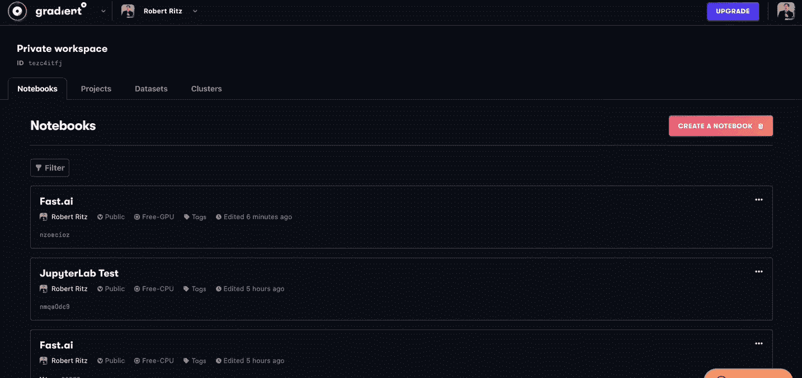
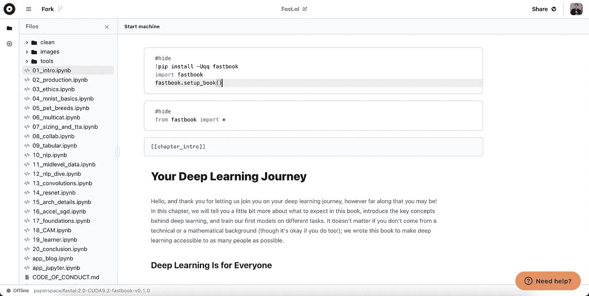

# Paperspace 推出新的云 IDE

> 原文：<https://towardsdatascience.com/paperspace-launches-new-cloud-ide-64693b2e5bd4?source=collection_archive---------24----------------------->

## 他们通过定制的 Jupyter 笔记本用户界面加入了 Colab 和 Deepnote

黑暗模式下的新 IDE

> 注意:这个版本似乎是一个正在进行的工作。详情请查看底部与 Colab 和 Deepnote 的对比。

2020 年 2 月 11 日， [Paperspace 推出了](https://blog.paperspace.com/all-new-gpu-backed-notebooks-on-gradient/)他们重新设计的基于云的笔记本产品，配备了新的 IDE 和文件浏览器。Paperspace 从 2018 年开始通过其[渐变产品](https://gradient.paperspace.com/)提供一键 Jupyter 笔记本[。改变的是，笔记本的默认视图现在是他们自己的自定义 IDE 用户界面，类似于 Google Colab 和 Deepnote 提供的界面。](https://blog.paperspace.com/gradient/)

在此更新之前，您使用预安装软件包列表和机器类型(从免费到$$$$)选择了您的基础环境。然后你用 Jupyter 笔记本或者 Jupyter 实验室启动了一个浏览器标签。现在，您仍然可以选择使用 vanilla Jupyter 笔记本/实验室用户界面，但您也可以使用自定义笔记本用户界面，Paperspace 声称该界面速度更快，响应更快。

让我们来看看最近更新中的新功能。

# 新 IDE

自 2018 年以来，渐变笔记本使用标准的 Jupyter 笔记本或 Jupyter Lab UI。这通常意味着启动环境容器需要几分钟时间，然后必须在浏览器中加载 UI。一旦全部加载完毕，速度非常快，但最初的加载时间总是阻碍我的笔记本电脑快速运行。

新的 IDE 允许您在只读模式下浏览文件和打开笔记本，而无需连接计算机实例来解决这个问题。这意味着您可以快速开始查看您的笔记本。

黑暗模式下的新用户界面。

当然，如果你不喜欢黑暗模式，你也可以选择光明模式。

当您准备好时，您可以选择您的机器类型并启动您的实例。然后，您将能够编辑和执行您的笔记本。宣称的显著更快的设置似乎没有发生在我身上。我通常用 5-10 分钟的时间来准备好我的实例。希望这些是发射故障，速度会提高。

一旦实例准备就绪，现在就有了很好的硬件指示器，让您知道 CPU 和 RAM 的使用情况。

不幸的是，在测试中，并不是所有的环境都与这个新的 IDE 兼容。我测试的一些环境给了我一个错误，笔记本还不支持渐变，但我仍然可以选择在 classic Jupyter 中打开。

# 即将推出…存储改进？

在 Paperspace 博客公告的底部，他们调侃了即将推出的新存储功能。他们可能正在研究一种方法来解决数据科学家今天面临的最重要的问题之一，即文件和数据管理。数据集可能在 S3 桶或类似的对象存储中，而笔记本可能在本地硬盘驱动器、Google Drive 或其他云提供商中。这产生了许多基本的耗时的管理工作，对任何人来说都不好玩。

# 与 Deepnote 和 Colab 的比较

Google Colab 提供了一个免费的笔记本环境，可以与 Google Drive 一起工作，并提供免费的 GPU 访问。Deepnote 更进一步，在笔记本中提供了类似 Google Doc 的功能，多个合作者可以在同一个文档中实时编码。Deepnote 目前不提供 GPU 访问。

目前，更新的渐变笔记本没有 Colab 或 Deepnote 提供的功能多。键盘快捷键在活动笔记本中似乎不起作用。看起来你实际上不能在新的 IDE 中*创建笔记本*，只能运行或编辑现有的。

Paperspace 一推出，我就在它的一键笔记本上使用了它的渐变功能。出于几个原因，从那以后，它一直是我首选的云笔记本供应商。这是因为它们提供了许多机器类型(从免费到$$$$)并允许您使用本机 Jupyter 接口。当在本地编码时，我使用 Jupyter Lab，拥有相同的云选项意味着我不必记住两套键盘快捷键，两种 UI 哲学，或者两种不同的概念*什么是笔记本*。

像整个数据科学工具空间一样，Jupyter 笔记本的实现似乎正在破裂。也许这是一个好的发展，我们将会看到一些创新的工具化方法。但是现在对我来说，这些解决方案都不会取代我首选的 Jupyter Lab UI。

你可以在 https://gradient.paperspace.com/的[查看新的渐变笔记本用户界面。](https://gradient.paperspace.com/)

> 感谢阅读。你可以在这里找到更多关于我的信息。考虑订阅以便在我发布时收到通知。如果你想直接支持我的文章，你可以使用我的[推荐链接](https://robertritz.com/membership)注册成为一个媒体会员。