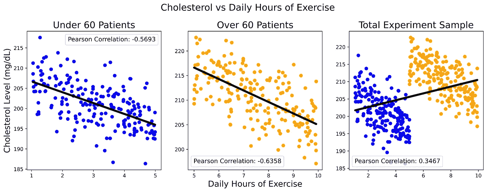
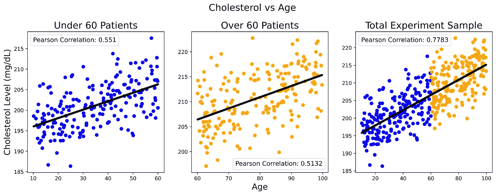
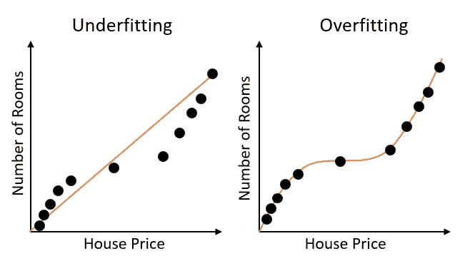

# 数据科学中的悖论

> 原文：<https://towardsdatascience.com/paradoxes-in-data-science-cab0869ef23d?source=collection_archive---------21----------------------->

## 深入了解与数据科学及其统计基础相关的一些主要悖论

[沙丹阿拉伯](https://unsplash.com/@_sshadann_?utm_source=medium&utm_medium=referral)在 [Unsplash](https://unsplash.com?utm_source=medium&utm_medium=referral) 上的照片

# 介绍

悖论是一类现象，当我们从已知为真的前提出发，推导出某种逻辑上不合理的结果时，就会出现这种现象。由于机器学习模型从数据中创造知识，这使得它们容易受到训练和测试之间可能存在的认知悖论的影响。

在本文中，我将带您了解一些与数据科学相关的主要悖论，以及如何识别它们:

*   辛普森悖论
*   准确性悖论
*   可学性-哥德尔悖论
*   意外后果定律

# 辛普森悖论

数据科学中最常见的悖论形式之一是辛普森悖论。

作为一个例子，让我们考虑一个思维实验:我们进行了一项研究，以发现每天进行体育锻炼是否有助于降低胆固醇水平(以毫克/分升为单位),我们现在开始检查所获得的结果。首先，我们根据个人年龄(60 岁以下/60 岁以上)将我们的人口样本分为两大类，然后我们绘制他们的胆固醇水平与受试者每天锻炼小时数的关系图。通过检查图 1 中前两个图的结果，我们可以推断，每天锻炼更多的时间可以导致我们胆固醇水平的整体下降。然后，通过检查通过线性回归推断的最佳拟合线的总体趋势以及在两种情况下得分的相当强的负个人相关性，也可以加强这一假设。

在这一点上，我们得出的结果使我们放心，然后我们可以尝试重复同样的分析，这次考虑整个人口样本(图 1 中最右边的图)。在这种情况下，我们面临着一个完全矛盾的场景和一个正相关，这意味着更多的锻炼会导致胆固醇水平上升。

图 1:胆固醇与每日运动时间(图片由作者提供)。

这种类型的场景通常被称为辛普森悖论，每当我们有某种形式的相关性时就会发生，当在子组中考虑时，这种相关性指向一个方向，而如果被视为整个组的一部分，则指向相反的方向。为了揭示这种机制背后的原因，我们需要尝试超越所提供的数据，思考我们的数据最初是如何产生这种结果的(例如，什么未知的缺失变量可能会阻止我们看到全貌？).

在这个简单的场景中，我们缺失的部分可能是任何潜在的有影响的变量，例如:个体的共病、饮食和年龄。然后，我们决定进一步研究胆固醇水平如何随着年龄的增长而变化(图 2)。重复图 1 中的分析，我们可以清楚地看到胆固醇水平与个人年龄的正相关关系。

图 2:胆固醇与年龄(图片由作者提供)。

从这些结果中，我们可以推断，胆固醇水平更有可能随着年龄的增长和缺乏锻炼而增加(这三个变量之间存在因果关系)。因此，为了尝试量化锻炼对降低胆固醇水平的益处并克服辛普森悖论，我们应该确保在对受试者的年龄设定固定值(控制变量)的情况下进行实验。

在上个世纪，辛普森悖论出现在许多统计研究中，例如:加州大学伯克利分校的性别偏见、肾结石治疗和死刑中的种族差异[1]。

关于机器学习中因果关系和因果推理的更多信息，可以在我之前的文章[机器学习中的因果推理](/causal-reasoning-in-machine-learning-4f2a6e32fde9)和[回答 AI 中的因果问题](/answering-causal-questions-in-ai-87c9b53e3a72)中找到。

# 准确性悖论

在我们的日常生活中，人们普遍认为，深入研究一个主题或了解一个话题，必然会对所研究的现象有更深的理解。虽然，这并不总是正确的，因为过度专业化有时会导致我们低估**对大局**的重要性。

当创建比必要的更复杂的机器学习模型时，也会发生同样的模式。在这种情况下，我们的模型最终会过于关注单个数据点，而没有关注数据的整体趋势(**过度拟合**)。在这种情况下，我们的模型将能够在训练数据(它记住了每个小细节)上表现良好，而不能推广到新的看不见的数据。

这个问题可以总结在图 3 中。下图考虑了一个回归问题的例子(在意大利，房价如何随着房间数量的增加而变化)。

图 3:欠拟合与过拟合(图片由作者提供)。

创建一个复杂的模型(过度拟合),在这种情况下，我们将能够很好地估计意大利的房价。但是，我们的复杂模型很可能比线性模型表现更差(拟合不足)，例如，当试图预测另一个国家的房价时，它没有被训练过(如西班牙)。

因此，这给我们留下了一个准确性悖论。我们训练我们的机器学习模型，以随着时间的推移提高它们的准确性，尽管这可能会导致生产中的准确性降低。这个问题，可以用查尔斯·古德哈特的名言来完美地概括:

> "当一个度量成为目标时，它就不再是一个好的度量."
> 
> —查尔斯·古德哈特

克服这个问题的最常见的方法之一是在训练期间添加**正则化**(一种模型复杂性损失)。这样，我们减少了与不太重要的特征相关联的权重，并将我们的注意力集中在为我们提供更多信息的特征上。

在分类问题中，当处理不平衡的训练数据集(一些类出现的频率比其他类高得多)时，最有可能出现准确性悖论。在这种情况下，计算模型的精度和召回率可以成为更有价值的度量。

# 可学性-哥德尔悖论

库尔特·哥德尔是上世纪最著名的数学家之一。毫无疑问，其中最有趣的理论之一是两个[哥德尔不完全性定理](https://en.wikipedia.org/wiki/G%C3%B6del%27s_incompleteness_theorems)。

根据这些定理，现在的数学有一些内在的局限性，不允许它确定地陈述一个陈述是否真实。数据科学的整个领域与数学思维紧密相连，因此这导致了一个悖论(可学习性-哥德尔悖论)。

根据哥德尔理论是对还是错，这将证明从人口样本进行外推是可能的或不可能的。机器学习模型严重依赖于使用样本数据集进行训练，如果这被证明是不够的，那么将使它们不可能正确地执行任何形式的推断/预测。事实上，在整个人口数据上训练机器学习模型在计算上是不可行的，并且在大多数情况下，首先收集整个人口的数据几乎是不可能的。

关于这个悖论及其在机器学习中的应用的其他信息可以在 Shai Ben-David 等人的研究出版物“可学习性是不可判定的”中找到。艾尔。[2]

# 意外后果定律

随着系统和模型变得越来越复杂，对于我们人类来说，理解一个系统如何工作并做出决策可能会变得越来越困难。这个概念总结在意外后果法则中。

根据这一概念，随着系统复杂性的增长，不期望的行为或“错误”可能会不由自主地发生。当创建大型软件项目或创建复杂的机器学习模型时，这往往是正确的。

近年来，随着大数据制度的出现，人们对创建技术的兴趣越来越大，以使模型更具可解释性和无偏见，从而符合政府机构的法规(如 GDPR)。

最终，这让我们面对本文中考虑的最后一个悖论。日复一日，我们致力于创造尽可能好的模型来实现一个结果，尽管如果过于复杂而难以理解，这可能永远不会在生产中部署(例如 GDPR 第 5 条，右为解释)。

# 结论

在本文中，我介绍了一些与数据科学相关的主要悖论。虽然，许多其他常见的悖论可能对数据科学和人工智能有潜在的影响。一些例子有[3]:

*   伯克森悖论
*   布莱斯悖论
*   莫拉维克悖论
*   生日悖论

如果你有任何其他的矛盾，你想加入到这个列表中，请留言告诉我！

*我希望你喜欢这篇文章，谢谢你的阅读！*

# 联系人

如果你想了解我最新的文章和项目[，请通过媒体](https://pierpaoloippolito28.medium.com/subscribe)关注我，并订阅我的[邮件列表](https://www.getrevue.co/profile/pier_paolo_28)。以下是我的一些联系人详细信息:

*   [领英](https://uk.linkedin.com/in/pier-paolo-ippolito-202917146?source=post_page---------------------------)
*   [个人网站](https://pierpaolo28.github.io/?source=post_page---------------------------)
*   [中等轮廓](https://towardsdatascience.com/@pierpaoloippolito28?source=post_page---------------------------)
*   [GitHub](https://github.com/pierpaolo28?source=post_page---------------------------)
*   [卡格尔](https://www.kaggle.com/pierpaolo28?source=post_page---------------------------)

# 文献学

[1]辛普森悖论:如何用相同的数据证明相反的论点威尔·科尔森，走向数据科学。访问日期:[https://shorturl.at/jkyT9](https://shorturl.at/jkyT9)2020 年 8 月。

[2]自然，可学性是不可决定的。Shai Ben-David、Pavel Hrube 等人。艾尔。访问:[https://www.nature.com/articles/s42256-018-0002-3](https://www.nature.com/articles/s42256-018-0002-3)，2020 年 9 月。

[3]数据科学家应该知道的五个悖论，MC.AI .访问:[https://MC . ai/Five-paradomes-that-Data-Scientists-Should-Know/](https://mc.ai/five-paradoxes-that-data-scientists-should-know-about/)，2020 年 9 月。