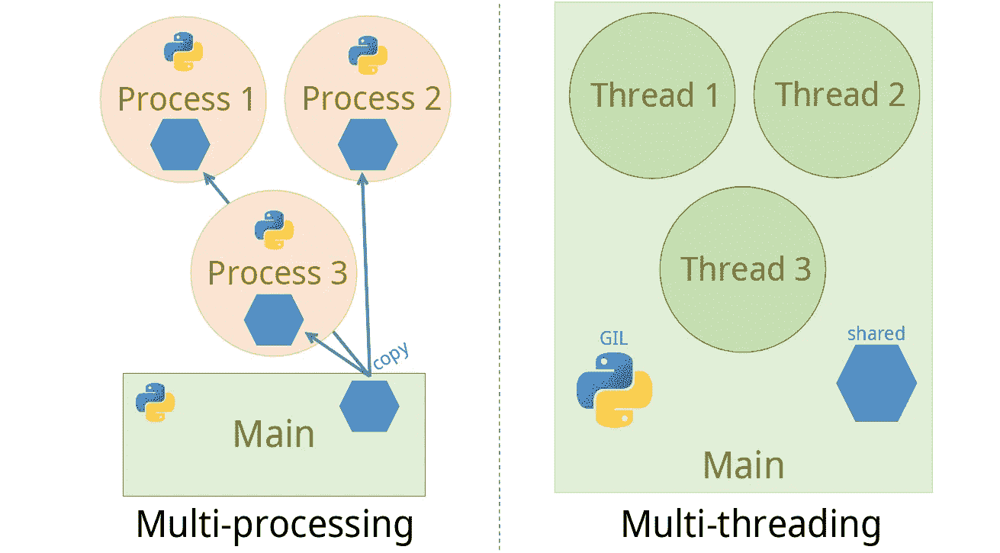
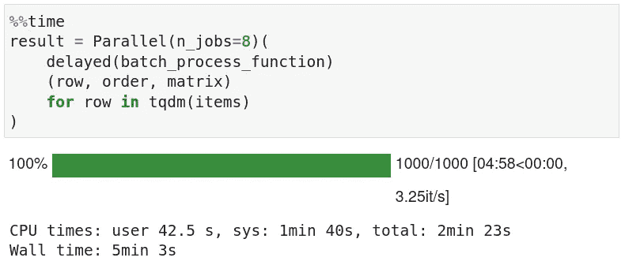
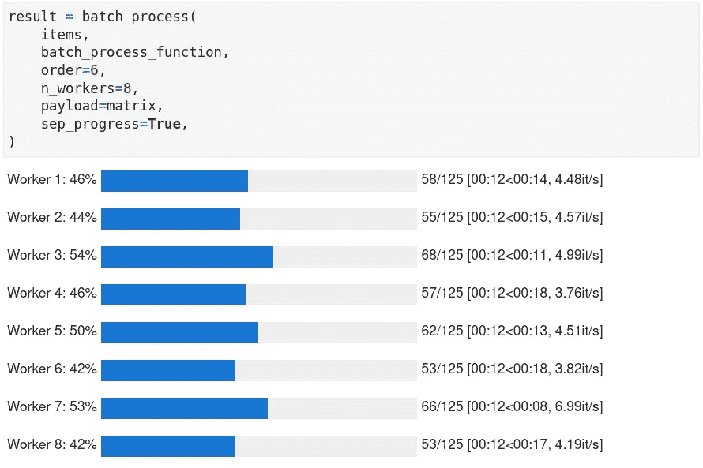
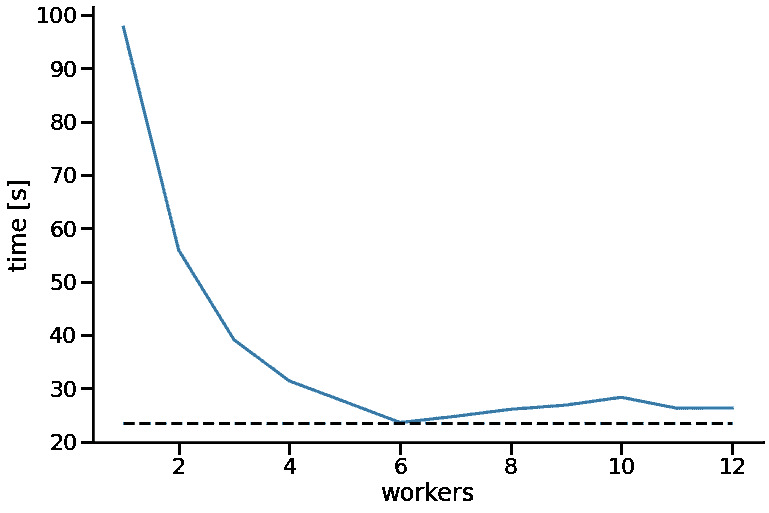

# Python 中的并行批处理

> 原文：<https://towardsdatascience.com/parallel-batch-processing-in-python-8dcce607d226?source=collection_archive---------5----------------------->

我的个人工作空间(用佳能 Rp 给自己拍照)

## 使用 joblib 进行批处理，并使用 tqdm 显示进度

Joblib 是一个很好的并行化工具，但有时分批处理工作负载比默认的迭代方式更好。在本文中，我将展示:

1.  使用 joblib 和 tqdm 进行并行化的标准方式
2.  为什么以及何时不起作用
3.  使用批处理进行并行化
4.  让进步再次发挥作用

所有代码都可以在 [Github](https://github.com/dennisbakhuis/tqdm_batch) 上获得。如果有任何问题，请随时[联系我](https://www.linkedin.com/in/dennisbakhuis/)。

代码也可作为 [Pypi 包](https://pypi.org/project/tqdm-batch/0.1.0/) : `pip install tqdm_batch`

使用 Python、joblib 和 tqdm 批处理工作负载。

## 1)使用 joblib 进行并行化的直接方法

2021 年，我们购买的几乎每个 CPU 都有多个内核。我目前的笔记本电脑(Dell XPS)配有带 6 个内核和超线程技术的英特尔 i7，总共有 12 个内核供您使用。甚至现在的移动电话也有多个 CPU，并具有巨大的计算能力。这些 CPU 架构中的内核可以是相同的，即每个内核具有相同的处理能力，或者具有定制的特征。后者的一个例子就是 ARM 的大。将高性能内核与低能耗内核相结合的小型架构。

当处理大型数据集时，我们都遇到过这样的情况:我们不能使用所有的内核并加快处理速度吗？当然，答案是肯定的，但是多重处理一点也不微不足道。

> 我们都经历过这种情况:难道我们不能利用所有的内核并加快处理速度吗？

Python 内置了多处理和多线程，带有[多处理](https://docs.python.org/3/library/multiprocessing.html)和[线程](https://docs.python.org/3/library/threading.html)模块。这是您开始使用多处理和多线程所需要的全部内容，但它需要一些样板代码。这可能令人望而生畏，尤其是从数据科学的角度来看，我们有这个串行处理循环，只是想并行运行它。

为了简化我们的多核处理负担，我们可以利用奇妙的库，如 [joblib](https://joblib.readthedocs.io/en/latest/parallel.html) 或 [pathos](https://github.com/uqfoundation/pathos) 。在 joblib 的网站上，作者说这些循环是“令人尴尬的平行”,他们肯定是对的，因为它非常容易上手。让我们创建一个示例:

这只是一个伪函数，近似π，但阶数为 6，计算时间约为 200 毫秒。还有另外两个变量。第一个变量是一行，它是要处理的单个项目。这可以是方法需要打开和加载的文件名，也可以是我们需要规范化的字符串。在这个虚拟函数中，我们忽略它。有效载荷将用于显示限制，现在也可以忽略。让我们为这个函数获取一些运行时数据:

图 1:运行时间串行运行和使用 joblib 时。

串行运行，即处理每一行的 for 循环，只需不到 100 秒。在这个例子中，我们可以清楚地看到 joblib 的优点。我们不需要做任何改变就可以并行处理，使用 8 个内核时，结果几乎快了 5 倍。这通常很有效，但是我们必须注意它的局限性。

## 2)局限性以及为什么它不总是有效

为了理解这些限制，我们需要解释一下多处理和多线程之间的区别，以及这与 Python 的全局解释器锁(GIL)有什么关系。当试图利用多核时，您可能听说过 GIL。关于 GIL 到底是什么有很多很棒的文章，但简而言之，它是一把锁，可以防止多个进程同时访问 Python 解释器。这防止了一些奇怪的问题，比如一个进程删除了一个变量，而另一个进程想同时读取它。GIL 的一个大缺点是，如果你有一个 Python 繁重的任务(大量的 Python 代码)并试图并行运行它，每个任务都必须等待解释器。他们是 GIL 有限公司。

多处理是并行运行任务的一种方式，它使用自己的 Python 解释器创建一个独立的流程。多处理任务没有 GIL 问题。但是，因为我们正在运行一个独立的进程，所以任务不能访问与主程序相同的内存，所有需要的数据都需要发送(序列化)到这个进程。序列化本身是使用 Pythons 内置 Pickle(或 [Dill](https://dill.readthedocs.io/en/latest/dill.html) )完成的，它为所有需要的对象创建一个冻结的内存副本。有些对象无法序列化，您将会得到一个错误。例如，对进程 1 的 UI 的引用不能共享给进程 2(这也没有意义)。这种序列化，即把对象的状态冻结成字节发送给进程，是开销(额外的内存和 IO)的原因。例如，当每个进程需要一个字典用于某些翻译时，多处理库将为每个进程*复制这个字典。如果这个字典很大，这种开销比串行处理花费更多的时间是很常见的。*

> 这种开销比串行处理花费更多的时间并不罕见。

另一种并行运行任务的方法是多线程。最大的好处是它与主程序共享内存，并且不需要序列化，因此开销更少。但代价是你必须和 GIL 合作。如果任务使用许多编译好的库，比如不需要 GIL 的 [Numpy](https://numpy.org/) ，这不是问题。

图 2:多处理有开销，多线程 GIL。

默认情况下，joblib 使用多线程，但是可以使用`prefer='threads'`参数将其设置为多线程。您可以尝试这个设置，如果任务不是 Python 繁重的，您可能会受益。一般来说，默认的多处理是一个非常明智的默认。

当多处理任务需要大量数据进行处理时，例如，一个大型模型进行一些分类，这个模型需要序列化到每个任务，从而产生大量开销。最初的 joblib 示例为 items 中的每一行启动一个新的进程，这意味着它必须为每次迭代序列化所有内容，这与理想情况相差甚远:

图 3:过多的开销导致 4 倍的串行运行时间

开销如此之大，以至于运行时间是逐个执行的四倍。这是否意味着我们无法并行处理这类工作负载？当然不是！通过使用批处理方法:首先将工作量分成大小相等的批，让每个进程处理这些批。

## 3)使用批处理进行并行化

我们已经看到，对于多处理，由于每个任务的大数据要求的串行化，开销可能是巨大的。解决方案很简单:减少序列化的数量。我们将创建一个额外的包装器函数来处理流程内部的批处理，而不是对每一项进行序列化。这导致每个进程只序列化一次数据。

图 4:减少开销回到我们的常规节省

这为我们带来了与串行方法相似的节省，而不需要大量数据。`%%time`神奇的功能也向我们展示了一些有趣的事情:我们在这个过程中只花了 1.33 秒的时间。另外的 23 是在`%%time`不能访问的其他进程中花费的。

你可能已经注意到的另一件事是进度条不再工作了。Tqdm 耦合到批处理，将所有批处理发送出去，并且必须等待进程完成。我们看不到目前为止在项目级别上已经处理了多少。由于我们无法访问内存，所以显示单个(或多个)进度条并不容易。

## 4)让我们修复进度条

在多重处理时创建进度条不是一件容易的事情。当使用串行方法时，我们可以将 tqdm 保持在主进度(集体进度)中。它会看到传递给流程的每个项目。通过序列化连接进度条是不可能的，因为它需要进程写入主程序内存的一部分。根据定义，这是不允许的，这也是为什么当您尝试将 progress_bar 对象添加到函数参数时会出现序列化错误的原因。

为了解决这个问题，我们可以利用一个队列，一种列表，它使得进程之间的相互通信成为可能。为了使它更简单，让我们创建一个完整的包装器，这样我们就可以提供一个项目列表和一个函数，在我们的包装器将工作划分给所有的进程。

> 该代码也可以在 [Github](https://github.com/dennisbakhuis/tqdm_batch) 上获得，并作为一个包在 [PyPi](https://pypi.org/project/tqdm-batch/) 上获得。

图 5:在多个 CPU 上分配工作并显示进度条

使用这种方法，我们创建了一个插入式替换，您只需编写一个处理单行的方法。会将该函数封装到一个批处理处理器中，该处理器还会更新一个进度条。函数的所有参数都可以在传递给处理函数时使用实参进行添加，包括所需的大型数据和模型。结果类似于最初的运行，开销很小。`tqdm_batch`被添加到 pypi 中，所以你可以自己做一个`pip install tqdm_batch`来试试。

工人的数量也不是你所期望的，因为他们不是线性增长的。在某一点上，增加更多的工人不会带来任何好处。我还注意到，我的超线程内核也没有带来任何性能提升。以下是所需计算时间与工作人员数量的概述:

图 6:超过 6 件作品不会增加任何利益

## 围捕

我希望您对多处理有所了解，并对它的工作原理和局限性有所了解。您可以使用 batch_process 作为 joblib 和 tqdm 的替代工具，在不修改原始代码的情况下批量运行您的处理。

肯定有一些可以改进的地方。首先，我在寻找一个不存在的 joblib 扩展。回想起来，我本可以完全放弃对 joblib 的依赖，全部用普通 Python 来创建。另外，进度条不需要在一个单独的线程中。也许，我会在未来的版本中改变这一点(或者我接受你的拉取请求(-:)。

这让我想到了这篇文章的结尾。如果您有任何意见，请告诉我！在 LinkedIn 上随意联系。