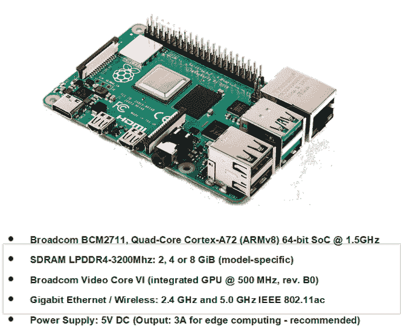
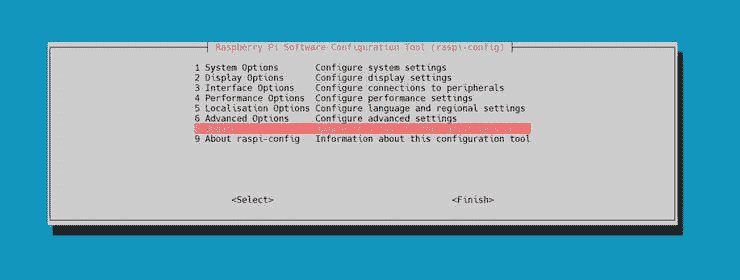
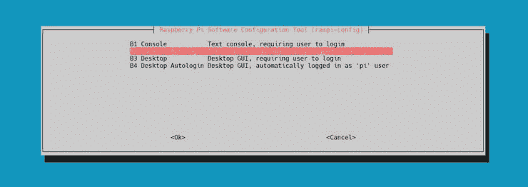
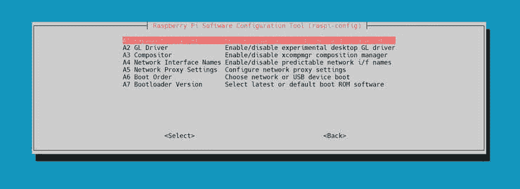
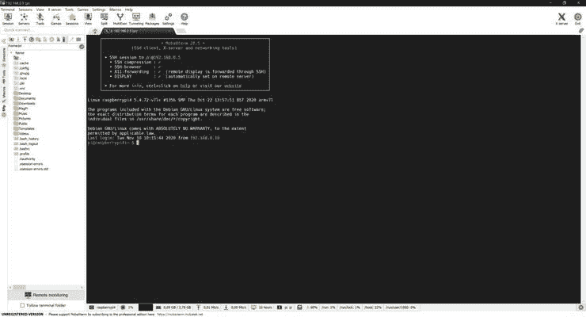
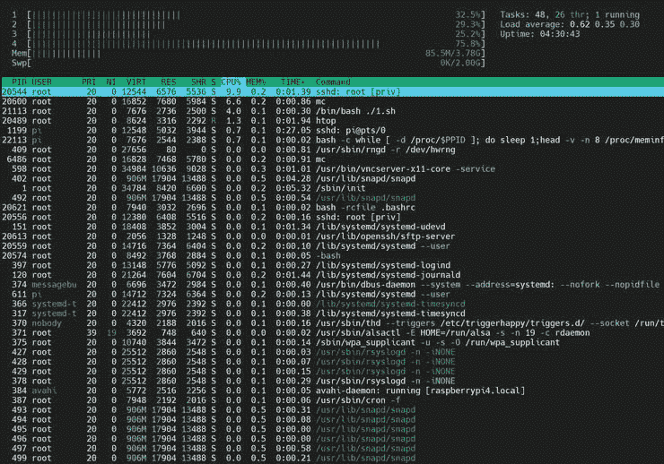

# Raspberry Pi 4B+物联网板上的并行计算变得更加简单

> 原文：<https://towardsdatascience.com/parallel-computing-on-raspberry-pi-4b-iot-boards-made-easier-d3d6ccbb8e76?source=collection_archive---------28----------------------->


来自 Unsplash 的 Arthur V. Ratz 的照片

## 在 Raspberry Pi 物联网板上构建和运行使用 Khronos CL/SYCL-model 规范实现的 C++17 并行代码。

# 我们的目标…

该项目提供了有用的指南、技巧和教程，用于在 C++17/2x0 中构建现代并行代码，使用 CL/SYCL 编程模型实现，并在基于创新的 ARM Cortex-A72、四核、64 位 RISC-V CPU 的下一代 Raspberry Pi 4B 物联网板上运行。

读者观众将了解如何设置 Raspberry 4B 物联网板，开箱即用，并将其用于并行计算，使用 Khronos CL/triSYCL 和 Aksel Alpay 的 hipSYCL 项目的开源发行版交付 C++17 中的并行代码，安装和配置 GNU 的编译器集合(GCC)和 LLVM/Clang-9 . x . x Arm/aarch 64-tool chains，以构建并行代码的可执行文件并在 Raspbian Buster 10.6 OS 中运行。

# Raspberry PI 4B+物联网板概述

下一代创新的 Raspberry Pi 4B+物联网主板基于强大的 ARM 多核对称 64 位 RISC-V CPU，提供了无与伦比的性能，从而实现了并行计算本身的终极生产力。使用最新的 Raspberry Pi 板可以大幅提高边缘计算过程的实际性能，例如在将数据交付到数据中心进行处理之前，实时收集和预处理数据。并行运行这些流程显著提高了基于云的解决方案的效率，为数十亿个客户端请求提供服务，或者提供数据分析和其他推断。

在我们讨论如何在 C++17 中构建和运行并行代码之前，让我们先花点时间简要了解一下下一代 Raspberry Pi 4B+板及其技术规格，该并行代码是使用 CL/SYCL 异构编程模型规范为采用 Arm/Aarch64 架构的 Raspberry Pi 板设计的:



Raspberry Pi 4B+物联网板

Raspberry Pi 4B+物联网板基于创新的 Broadcom BCM2711B0 (SoC)芯片制造，配备最新的 ARM 四核 Cortex-A72 @ 1.5GHz 64 位 RISC-V CPU，提供终极性能和可扩展性，同时利用它进行边缘并行计算。

Raspberry Pi 以“可靠”和“快速”的微型纳米计算机而闻名，专为数据挖掘和并行计算而设计。ARM 的多核对称 64 位 RISC-V CPU 的主要新硬件架构特性，如 DSP、SIMD、VFPv4 和硬件虚拟化支持，可以显著提高边缘大规模处理数据的物联网集群的性能、加速和可扩展性。

具体来说，最新的 Raspberry Pi 4B+板最重要的优势之一是薄型 LPDDR4 存储器，可选择 2、4 或 8 GiB RAM 容量，工作频率为 3200Mhz，提供典型的大内存事务带宽，总体上对并行计算的性能产生积极影响。对于数据挖掘和并行计算，强烈建议使用安装了 4gb 或更高内存的主板。此外，BCM2711B0 SoC 芯片还捆绑了各种集成设备和外设，如 Broadcom VideoCore VI @ 500Mhz GPUs、PCI-Ex 千兆以太网适配器等。

为了在 C++17 中构建和运行特定的并行现代代码，使用 CL/SYCL 异构编程模型实现，我们真正需要的第一个是 Raspberry Pi 4B+物联网板，该板安装了最新的 Raspbian Buster 10.6 操作系统，并针对首次使用进行了配置。

以下是硬件和软件要求的简要清单:

**硬件:**

*   树莓 Pi 4 型号 B0，4GB 物联网板；
*   Micro-SD 卡 16GB，用于 Raspbian 操作系统和数据存储；
*   DC 电源:通过 USB Type-C 连接器的 5.0V/2–3A(最小 3A —用于数据挖掘和并行计算)；

**软件:**

*   Raspbian Buster 10.6.0 完整 OS；
*   拉斯比安成像仪 1.4；
*   MobaXterm 20.3 build 4396 或任何其他 SSH 客户端；

既然我们已经有了一个 Raspberry Pi 4B+物联网板，现在，我们可以开箱即用地打开它并进行设置。

# 设置 Raspberry Pi 4B 物联网板

在开始之前，我们必须从官方的 Raspbian 库下载 Raspbian Buster 10.6.0 完整操作系统映像的最新版本。要将 Raspbian 操作系统映像安装到 SD 卡，我们还需要下载并使用适用于各种平台的 Raspbian Imager 1.4 应用程序，如 Windows、Linux 或 macOS:

*   [拉斯边巴斯特 10.6.0](http://downloads.raspberrypi.org/raspbian_full/images/raspbian_full-2020-02-14/)
*   [拉斯比安成像仪 1.4](http://downloads.raspberrypi.org/imager/)

此外，我们还必须下载并安装 MobaXterm 应用程序，以便通过 SSH 或 FTP 协议远程建立与 Raspberry Pi 板的连接:

*   [MobaXterm 20.3](https://mobaxterm.mobatek.net/download.html)

由于 Raspbian Buster 操作系统和 Imager 应用程序已成功下载并安装，我们将使用 Imager 应用程序执行以下操作:

1.默认情况下，擦除 SD 卡，将其格式化为 FAT32 文件系统；

2.提取预装的 Raspbian Buster OS 镜像(*。img)到 SD 卡；

由于上述步骤已经完成，从读卡器中取出 SD 卡，并将其插入 Raspberry Pi 板的 SD 卡插槽中。然后，连接微型 HDMI 和以太网电缆。最后，插入 DC 电源电缆的连接器，并打开电路板。最后，系统将启动安装在 SD 卡上的 Raspbian Buster 操作系统，提示执行几个安装后步骤来配置它以供首次使用。

由于主板已通电，请确保已完成以下所有安装后步骤:

1.打开 bash 控制台并设置“root”密码:

```
pi@raspberrypi4:~ $ sudo passwd root
```

2.以“root”权限登录 Raspbian bash 控制台:

```
pi@raspberrypi4:~ $ sudo -s
```

3.使用以下命令升级 Raspbian 的 Linux 基本系统和固件:

```
root@raspberrypi4:~# sudo apt update
root@raspberrypi4:~# sudo apt full-upgrade
root@raspberrypi4:~# sudo rpi-update
```

4.首次重新启动系统:

```
root@raspberrypi4:~# sudo shutdown -r now
```

5.再次安装最新的 Raspbian 引导程序并重启系统:

```
root@raspberrypi4:~# sudo rpi-eeprom-update -d -a
root@raspberrypi4:~# sudo shutdown -r now
```

6.启动“raspi-config”安装工具:

```
root@raspberrypi4:~# sudo raspi-config
```

7.使用“raspi-config”工具完成以下步骤:

***更新“raspi-config”工具:**



***启动时禁用 Raspbian 的桌面 GUI:**

**系统选项** > > **开机/自动登录** > > **控制台自动登录:**



***扩展 SD 卡上的根'/'分区大小:**



最后，在执行 Raspbian 安装后配置后，重新引导系统。重启后，系统会提示您登录。使用之前设置的“root”用户名和密码，以 root 权限登录 bash 控制台。

因为您已经成功登录，所以在 bash-console 中使用下面的命令安装 APT-repositories 中的一些包:

```
root@raspberrypi4:~# sudo apt install -y net-tools openssh-server
```

需要这两个软件包来配置 Raspberry Pi 的网络接口或 OpenSSH-server，以便使用 MobaXterm 通过 SSH 协议远程连接到电路板。

通过修改/etc/network/interfaces 配置板的网络接口“eth0 ”,例如:

```
auto eth0
iface eth0 inet static
address 192.168.87.100
netmask 255.255.255.0
broadcast 192.168.87.255
gateway 192.168.87.254
nameserver 192.168.87.254
```

在网络接口旁边，通过取消注释 **/etc/ssh/sshd_config** 中的这些行来执行 OpenSSH-server 的基本配置:

```
PermitRootLogin yes
StrictModes noPasswordAuthentication yes
PermitEmptyPasswords yes
```

这将允许“root”登录，通过 SSH 协议进入 bash 控制台，而无需输入密码。

最后，尝试通过网络连接板，使用 MobaXterm 应用程序并打开到 IP 地址为 192.168.87.100 的主机的远程 SSH 会话。您还必须能够使用之前设置的凭证成功登录到 Raspbian 的 bash 控制台:



# 用 CL/SYCL-Model 在 C++17 中开发并行代码

2020 年，Khronos 集团、英特尔公司和其他供应商宣布推出革命性的新型异构并行计算平台(XPU)，提供了将“繁重”数据处理工作负载的执行卸载到广泛的硬件加速(例如，GPGPU 或 FPGAs)目标的能力，而不仅仅是主机 CPU。从概念上讲，使用 XPU 平台的并行代码开发完全基于 Khronos CL/SYCL 编程模型规范 OpenCL 2.0 库的抽象层。

下面是一个很小的例子，展示了使用 CL/SYCL-model 抽象层实现的 C++17 中的代码:

```
#include <CL/sycl.hpp>using namespace cl::sycl;constexpr std::uint32*_t N = 1000;**cl::sycl::queue q{};**q.submit([&](cl::sycl::handler &cgh) {*
 *cgh.parallel_*for<class Kernel>(cl::sycl::range<1>{N}, \
       [=](cl::sycl::id<1> idx) {
           // Do some work in parallel
       });
});q.wait();
```

如上所示，C++17 中的代码片段完全基于 CL/SYCL 编程模型交付。它用默认参数初始化列表实例化一个 cl::sycl::queue{}对象，用于将 sycl 内核提交给默认使用的主机 CPU 加速目标来执行。接下来，它调用 cl::sycl::submit(…)方法，使用 cl::sycl::handler{}对象的单个参数来访问提供基本内核功能的方法，这些方法基于各种并行算法，包括 cl::sycl::handler::parallel _ for(…)方法。

下面的方法用于实现从正在运行的内核中产生的紧密并行循环。这个循环的每次迭代都由它自己的线程并行执行。cl::sycl::handler::parallel _ for(…)接受 cl::sycl::range <> {}对象的两个主要参数和一个在每次循环迭代中调用的特定 lambda 函数。cl::sycl::range <> {}对象基本上为每个特定维度定义了几个正在执行的并行循环迭代，以防在处理多维数据时多个嵌套循环被折叠。

在上面的代码中，cl::sycl::range <1> (N)对象用于调度一维并行循环的 N 次迭代。parallel_for(…)方法的 lambda 函数接受另一个 cl::sycl::id <> {}对象的单个参数。和 cl::sycl::range <> {}一样，这个对象实现了一个向量容器，其中的每个元素分别是并行循环的每个维度和每个迭代的索引值。作为参数传递给 lambda 函数范围内的代码，下面的对象用于检索特定的索引值。lambda 函数的主体包含一段并行处理数据的代码。

在将特定内核提交到队列并生成以供执行后，以下代码调用不带参数的 cl::sycl::wait()方法来设置屏障同步，以确保它不会执行任何代码，直到正在生成的内核完成其并行工作。

> *CL/SYCL 异构编程模型效率高，应用广泛。*
> 
> 然而，英特尔公司和 CodePlay Software Inc .很快就否决了除 x86_64 之外的硬件架构对 CL/SYCL 的支持。这使得不可能使用特定的 CL/SYCL 库，针对 Arm/Aarch64 和其他架构来交付并行 C++代码。

目前，有几个 CL/SYCL 开源库项目，由许多开发人员和爱好者开发，提供对更多硬件架构的支持，而不仅仅是 x86_64。

> *自 2016 年以来，Khronos Group，Inc .发布了他们的 tri cycl 库开源项目的修订版(*[*https://github . com/tri cycl/tri cycl)、*](https://github.com/triSYCL/triSYCL) *，建议将其用作测试平台，同时评估最新的 CL/SYCL 编程模型层规范，并向 Khronos-和 ISO-委员会发送反馈。然而，下面的库发行版并不“稳定”,只能用于演示目的，而不能用于在生产中构建 CL/SYCL 代码。此外，Khronos triSYCL 库发行版完全支持 x86_64 开发机器上的跨平台编译，使用 GNU 的 Arm/Aarch64 跨平台工具链，而不是在 Raspberry Pi 上使用 LLVM/Clang 编译器“本机”构建代码。*
> 
> *2019 年，海德堡大学(德国)的 Aksel Alpay 实现了最新的 CL/SYCL 编程模型层规范库，针对各种硬件架构，包括 Raspberry Pi 的 Arm/Aarch64 架构，并向 GitHub(*[*https://github.com/illuhad/hipSYCL*](https://github.com/illuhad/hipSYCL)*)贡献了 hipSYCL 开源库发行版中最“稳定”的版本。*

此外，在这个故事中，我们将讨论安装和配置 GNU 的跨平台 GCC/G++-10.x.x 和“本机”Arm/Aarch64 的 LLVM/Clang-9.x.x 工具链，并使用 triSYCL 和 hipSYCL 库发行版，在 C++17 中交付一个现代的并行代码，基于正在讨论的库的使用。

# 在 Debian/Ubuntu 开发机器(x86_64)和 Raspberry Pi 物联网板上构建 CL/SYCL 代码

在 C++17 中，基本上有两种构建 CL/SYCL 代码的方法，如上所述，通过使用 GNU 的 GCC/G++-10.x.x 跨平台工具链和基于 x86_64 Debian/Ubuntu 的开发机器，或者在安装了 LLVM/Clang-9.x.x 用于 Arm/Aarch64 硬件架构的 Raspberry Pi 物联网板上“本地”构建。

使用第一种方法允许在 C++17/2x0 中构建代码源，在 Raspberry Pi 上运行之前，使用 Khronos triSYCL 库和 GNU 的跨平台 Arm/aarch 64-tool chain Debian/Ubuntu-based x86 _ 64 开发机器来实现。

要部署 x86_64 开发机器，需要安装最新的 Debian Buster 10.6.0 或 Ubuntu 20.04 LTS:

*   [Debian Buster 10.6.0 x86_64](https://cdimage.debian.org/debian-cd/current/amd64/iso-dvd/)
*   [Ubuntu 20.04 LTS x86_64](https://ubuntu.com/#download)

为了能够在运行 Microsoft Windows 10 的主机上使用开发机器，可以使用选择的任何现有(例如 Oracle VirtualBox 或 VMware Workstation)虚拟化环境，用于该目的:

*   [用于 Windows 10 的 64 位 Oracle VirtualBox 6.1](https://www.virtualbox.org/wiki/Downloads)
*   [适用于 Windows 10 的 64 位 VMware Workstation 16](https://my.vmware.com/en/web/vmware/downloads/info/slug/desktop_end_user_computing/vmware_workstation_pro/16_0)

要开始部署开发机器，我们必须做的就是设置一个特定的虚拟化环境，创建一个虚拟机，并启动 Debian 或 Ubuntu 安装。

既然已经创建了虚拟机，并且 Debian/Ubuntu 已经成功安装，我们可以继续几个步骤，安装和配置 GNU 的 GCC/G++-10.x.x 跨平台编译器、开发工具和 Khronos triSYCL 库，这是针对 Raspberry Pi 的 Arm/Aarch64 架构构建代码所必需的。

在安装和配置 GCC/G++编译器工具链和运行时库之前，请确保已经完成了以下先决步骤:

*   升级 Debian/Ubuntu 的 Linux 基础系统:

```
root@uarmhf64-dev:~# sudo apt update
root@uarmhf64-dev:~# sudo apt upgrade -y
root@uarmhf64-dev:~# sudo apt full-upgrade -y
```

要确保 x86_64 主机开发机器上运行的 Debian/Ubuntu 安装是最新的，并且安装了最新的内核和软件包，需要完成这个步骤。

*   从 APT-repository 安装“net-tools”和 OpenSSH-server 软件包:

```
root@uarmhf64-dev:~# sudo apt install -y net-tools openssh-server
```

安装“net-tools”和“openssh-server”是为了能够配置开发机器的网络接口，并通过 ssh 和 FTP 协议远程连接到正在运行的开发机器。

由于系统已经升级，所有必需的软件包都已安装，我们可以安装和配置特定的编译器和工具链。

# 安装和配置 GNU 的 GCC/G++-10.x.x

1.为 x86_64 平台安装 GNU 编译器集合(GCC)的工具链:

```
root@uarmhf64-dev:~# sudo apt install -y build-essential
```

2.安装 GNU 的跨平台 Arm64/Armhf 工具链:

```
root@uarmhf64-dev:~# sudo apt install -y crossbuild-essential-arm64
root@uarmhf64-dev:~# sudo apt install -y crossbuild-essential-armhf
```

需要为 Arm64/Armhf 硬件架构安装跨平台工具链，以便在 x86_64 开发机器上构建使用 triSYCL 库的 C++17 并行代码。

3.安装 GNU 的 GCC/G++、OpenMP 5.0、Boost、Range-v3、POSIX 线程、C/C++标准运行时库，需要:

```
root@uarmhf64-dev:~# sudo apt install -y g++-10 libomp-dev libomp5 libboost-all-dev librange-v3-dev libc++-dev libc++1 libc++abi-dev libc++abi1 libpthread-stubs0-dev libpthread-workqueue-dev
```

4.安装 GNU 的 GCC/G++-10.x.x .跨平台编译器，用于构建针对 Arm64/Armhf 架构的代码:

```
root@uarmhf64-dev:~# sudo apt install -y gcc-10-arm-linux-gnueabi g++-10-arm-linux-gnueabi gcc-10-arm-linux-gnueabihf g++-10-arm-linux-gnueabihf
```

5.选择默认情况下使用的 GCC/G++-10.x.x“本机”x86_64 编译器，更新备选方案:

```
sudo update-alternatives --install /usr/bin/gcc gcc /usr/bin/gcc-9 1
sudo update-alternatives --install /usr/bin/gcc gcc /usr/bin/gcc-10 2
sudo update-alternatives --install /usr/bin/g++ g++ /usr/bin/g++-9 1
sudo update-alternatives --install /usr/bin/g++ g++ /usr/bin/g++-10 2
sudo update-alternatives --install /usr/bin/cc cc /usr/bin/gcc 3
sudo update-alternatives --set cc /usr/bin/gcc
sudo update-alternatives --install /usr/bin/c++ c++ /usr/bin/g++ 3
sudo update-alternatives --set c++ /usr/bin/g++
```

6.选择默认情况下使用的 GCC/G++-10.x.x 跨平台 Arm/Aarch64 编译器，更新备选方案:

```
sudo update-alternatives --install /usr/bin/arm-linux-gnueabihf-gcc arm-linux-gnueabihf-gcc /usr/bin/arm-linux-gnueabihf-gcc-9 1
sudo update-alternatives --install /usr/bin/arm-linux-gnueabihf-gcc arm-linux-gnueabihf-gcc /usr/bin/arm-linux-gnueabihf-gcc-10 2
sudo update-alternatives --install /usr/bin/arm-linux-gnueabihf-g++ arm-linux-gnueabihf-g++ /usr/bin/arm-linux-gnueabihf-g++-9 1
sudo update-alternatives --install /usr/bin/arm-linux-gnueabihf-g++ arm-linux-gnueabihf-g++ /usr/bin/arm-linux-gnueabihf-g++-10 2
sudo update-alternatives --install /usr/bin/arm-linux-gnueabihf-cc arm-linux-gnueabihf-cc /usr/bin/arm-linux-gnueabihf-gcc 3
sudo update-alternatives --set arm-linux-gnueabihf-cc /usr/bin/arm-linux-gnueabihf-gcc
sudo update-alternatives --install /usr/bin/arm-linux-gnueabihf-c++ arm-linux-gnueabihf-c++ /usr/bin/arm-linux-gnueabihf-g++ 3
sudo update-alternatives --set arm-linux-gnueabihf-c++ /usr/bin/arm-linux-gnueabihf-g++
```

7.最后，检查是否安装了 GNU 的“本地”和跨平台工具链的正确版本:

```
root@uarmhf64-dev:~# gcc --version && g++ --version
root@uarmhf64-dev:~# arm-linux-gnueabihf-gcc --version
root@uarmhf64-dev:~# arm-linux-gnueabihf-g++ --version
```

8.导航到/opt 目录，从 GitHub 存储库中克隆 Khronos triSYCL 库发行版:

```
root@uarmhf64-dev:~# cd /opt
root@uarmhf64-dev:~# git clone --recurse-submodules [https://github.com/triSYCL/triSYCL](https://github.com/triSYCL/triSYCL)
```

以下命令将创建/opt/tri cycl 子目录，其中包含 tri cycl 库分发源。

9.使用“rsync”命令，将 triSYCL 库的 C++头文件从/opt/triSYCL/include 目录复制到开发计算机上的默认位置/usr/include/c++/10/:

```
root@uarmhf64-dev:~# cd /opt/triSYCL
root@uarmhf64-dev:~# sudo rsync -r ./ include/ /usr/include/c++/10/
```

10.设置使用 triSYCL 库和 GNU 跨平台工具链所需的环境变量，以前安装了:

```
export CPLUS_INCLUDE_PATH=/usr/include/c++/10
env CPLUS_INCLUDE_PATH=/usr/include/c++/10
sudo echo "export CPLUS_INCLUDE_PATH=/usr/include/c++/10" >> /root/.bashrc
```

11.通过删除/opt/triSYCL 子目录来执行简单的清理:

```
root@uarmhf64-dev:~# rm -rf /opt/triSYCL
```

12.使用“本机”x86_64 GNU 的 GCC/G++编译器构建“hello.cpp”代码示例:

```
root@uarmhf64-dev:~# g++ -std=c++17 -o hello hello.cpp -lpthread -lstdc++
```

在 C++17/2x0 中构建使用 Khronos triSYCL 库的特定代码需要 POSIX 线程和 C++标准库的运行时链接。

13.使用 GNU 的跨平台 GCC/G++编译器构建“hello.cpp”代码示例:

```
root@uarmhf64-dev:~# arm-linux-gnueabihf-g++ -std=c++17 -o hello_rpi4b hello.cpp -lpthread -lstdc++
```

既然我们已经成功地为 Arm/Aarch64 架构生成了代码可执行文件，那么就使用 MobaXterm 应用程序，通过 FTP 或 SSH 协议，从开发机器上下载可执行文件。之后，使用另一个 SSH 会话将“hello_rpi4b”可执行文件上传到 Raspberry Pi 板。

要运行“hello_rpi4b”可执行文件，请在 Raspbian 的 bash 控制台中使用以下命令，例如:

```
root@uarmhf64-dev:~# chmod +rwx hello_rpi4b
root@uarmhf64-dev:~# ./hello_rpi4b > output.txt && cat output.txt
```

这将创建输出并将其附加到‘output . txt’文件，将其内容打印到 bash 控制台:

```
Hello from triSYCL on Rasberry Pi 4B+!!!
Hello from triSYCL on Rasberry Pi 4B+!!!
Hello from triSYCL on Rasberry Pi 4B+!!!
Hello from triSYCL on Rasberry Pi 4B+!!!
Hello from triSYCL on Rasberry Pi 4B+!!!
```

**注意:**通常，第一种方法不需要从源代码构建 Khronos triSYCL 库发行版，除非您计划将 tri cycl 用于其他 HPC 库，如 OpenCL、OpenMP 或 TBB。有关使用 triSYCL 以及其他库的更多信息，请参考以下指南和文档[https://github . com/triSYCL/triSYCL/blob/master/doc/cmake . rst](https://github.com/triSYCL/triSYCL/blob/master/doc/cmake.rst)。

使用 Aksel Alpay 的 hipSYCL 开源库发行版和 LLVM/Clang-9.x.x. "native "编译器工具链，以 Arm/Aarch64 架构为目标，是第二种允许在 C++17/2x0 中构建 CL/SYCL 代码的方法，以便在 Raspberry Pi 板上运行。只有在 LLVM/Clang-9.x.x 工具链和 hipSYCL 库发行版都安装在 Raspberry Pi 板上，而不是 x86_64 开发机器本身上的情况下，特定代码的本地构建才是可能的。

此外，我们将讨论在 Raspberry Pi 板上安装和配置 LLVM/Clang-9.x.x 编译器工具链以及从源代码构建 Aksel Alpay 的 hipSYCL 库所需了解的一切。

# 安装和配置 LLVM/Clang-9.x.x

在使用 Aksel Alpay 的 hipSYCL 库项目发行版之前，必须正确安装和配置特定的 LLVM/Clang-9.x.x 编译器和 Arm/Aarch64 工具链。为此，请确保您已经完成了下列步骤:

1.更新 Raspbian 的 APT-repositories 并安装以下必备软件包:

```
root@raspberrypi4:~# sudo apt update
root@raspberrypi4:~# sudo apt install -y bison flex python python3 snap snapd git wget
```

上面的命令将安装一个替代的“snap”包管理器，这是安装 cmake >= 3.18.0 实用程序的正确版本所必需的，以及使用“cmake”实用程序从头开始构建 hipSYCL 开源项目所需的“python”、“python3”发行版和“bison”、“flex”实用程序。

2.使用“快照”软件包管理器安装“cmake”> = 3 . 18 . 0 实用程序和 LLVM/Clang 守护程序:

```
root@raspberrypi4:~# sudo snap install cmake --classic
root@raspberrypi4:~# sudo snap install clangd --classic
```

安装“cmake”实用程序后，让我们使用下面的命令检查它是否工作，以及是否从“snap”存储库中安装了正确的版本:

```
root@raspberrypi4:~# sudo cmake --version
```

运行此命令后，您必须看到以下输出:

```
cmake version 3.18.4CMake suite maintained and supported by Kitware (kitware.com/cmake).
```

3.为 LLVM/Clang 工具链安装最新的 Boost、POSIX-Threads 和 C/C++标准运行时库:

```
root@raspberrypi4:~# sudo apt install -y libc++-dev libc++1 libc++abi-dev libc++abi1 libpthread-stubs0-dev libpthread-workqueue-devroot@raspberrypi4:~# sudo apt install -y clang-format clang-tidy clang-tools clang libc++-dev libc++1 libc++abi-dev libc++abi1 libclang-dev libclang1 liblldb-dev libllvm-ocaml-dev libomp-dev libomp5 lld lldb llvm-dev llvm-runtime llvm python-clang libboost-all-dev
```

4.下载并添加 LLVM/Clang 的 APT-repositories 安全密钥:

```
root@raspberrypi4:~# wget -O - https://apt.llvm.org/llvm-snapshot.gpg.key | sudo apt-key add -
```

5.将 LLVM/Clang 的存储库 URL 附加到 APT 的源中。

```
root@raspberrypi4:~# echo "deb http://apt.llvm.org/buster/ llvm-toolchain-buster main" >> /etc/apt/sources.list.d/raspi.listroot@raspberrypi4:~# echo "deb-src http://apt.llvm.org/buster/ llvm-toolchain-buster main" >> /etc/apt/sources.list.d/raspi.list
```

要从特定的 APT 资源库安装 LLVM/Clang-9.x.x .编译器和特定的工具链，必须完成前面的两个步骤 4 和 5。

6.删除 LLVM/Clang 先前版本的现有符号链接，安装:

```
root@raspberrypi4:~# cd /usr/bin && rm -f clang clang++
```

7.再次更新 APT 库，并安装 LLVM/Clang 的编译器、调试器和链接器:

```
root@raspberrypi4:~# sudo apt update
root@raspberrypi4:~# sudo apt install -y clang-9 lldb-9 lld-9
```

8.创建“clang-9”和“clang++-9”编译器的相应符号链接，安装:

```
root@raspberrypi4:~# cd /usr/bin && ln -s clang-9 clang
root@raspberrypi4:~# cd /usr/bin && ln -s clang++-9 clang++
```

9.最后，您必须能够在 bash 控制台中使用“clang”和“clang++”命令:

```
root@raspberrypi4:~# clang --version && clang++ --version
```

这里，让我们检查使用上面的命令安装的 LLVM/Clang 的版本。

使用这些命令后，您必须看到以下输出:

```
clang version 9.0.1-6+rpi1~bpo10+1
Target: armv6k-unknown-linux-gnueabihf
Thread model: posix
InstalledDir: /usr/bin
clang version 9.0.1-6+rpi1~bpo10+1
Target: armv6k-unknown-linux-gnueabihf
Thread model: posix
InstalledDir: /usr/bin
```

# 下载并构建 hipSYCL 库发行版

另一个重要的步骤是下载和构建开源 hipSYCL 库 staging distribution，从它的源代码，贡献给 GitHub。

这通常通过完成以下步骤来完成:

1.下载 hipSYCL 项目的发行版，从 GitHub 克隆它:

```
root@raspberrypi4:~# git clone https://github.com/llvm/llvm-project llvm-project
root@raspberrypi4:~# git clone --recurse-submodules [https://github.com/illuhad/hipSYCL](https://github.com/illuhad/hipSYCL)
```

Aksel Alpay 的 hipSYCL 项目的发行版依赖于另一个项目 LLVM/Clang 的开源项目。这就是为什么我们通常需要克隆两个发行版来“从头”构建 hipSYCL 库运行时。

2.通过使用“export”和“env”命令，以及将下面的特定行附加到。bashrc 配置文件脚本:

```
export LLVM_INSTALL_PREFIX=/usr
export LLVM_DIR=~/llvm-project/llvm
export CLANG_EXECUTABLE_PATH=/usr/bin/clang++
export CLANG_INCLUDE_PATH=$LLVM_INSTALL_PREFIX/include/clang/9.0.1/includeecho "export LLVM_INSTALL_PREFIX=/usr" >> /root/.bashrc
echo "export LLVM_DIR=~/llvm-project/llvm" >> /root/.bashrc
echo "export CLANG_EXECUTABLE_PATH=/usr/bin/clang++" >> /root/.bashrc
echo "export CLANG_INCLUDE_PATH=$LLVM_INSTALL_PREFIX/include/clang/9.0.1/include" >> /root/.bashrcenv LLVM_INSTALL_PREFIX=/usr
env LLVM_DIR=~/llvm-project/llvm
env CLANG_EXECUTABLE_PATH=/usr/bin/clang++
env CLANG_INCLUDE_PATH=$LLVM_INSTALL_PREFIX/include/clang/9.0.1/include
```

3.在 hipSYCL 项目的主目录下创建并切换到~/hipSYCL/build 子目录:

```
root@raspberrypi4:~# mkdir ~/hipSYCL/build && cd ~/hipSYCL/build
```

4.使用“cmake”实用程序配置 hipSYCL 项目的源代码:

```
root@raspberrypi4:~# cmake -DCMAKE_INSTALL_PREFIX=/opt/hipSYCL ..
```

5.使用 GNU 的“make”命令构建并安装 hipSYCL 运行时库:

```
root@raspberrypi4:~# make -j $(nproc) && make install -j $(nproc)
```

6.将 libhipSYCL-rt.iso 运行时库复制到 Raspbian 的默认库位置:

```
root@raspberrypi4:~# cp /opt/hipSYCL/lib/libhipSYCL-rt.so /usr/lib/libhipSYCL-rt.so
```

7.设置使用 hipSYCL 运行时库和 LLVM/Clang 编译器构建源代码所需的环境变量:

```
export PATH=$PATH:/opt/hipSYCL/bin
export C_INCLUDE_PATH=$C_INCLUDE_PATH:/opt/hipSYCL/include
export CPLUS_INCLUDE_PATH=$CPLUS_INCLUDE_PATH:/opt/hipSYCL/include
export LD_LIBRARY_PATH=$LD_LIBRARY_PATH:/opt/hipSYCL/libecho "export PATH=$PATH:/opt/hipSYCL/bin" >> /root/.bashrc
echo "export C_INCLUDE_PATH=$C_INCLUDE_PATH:/opt/hipSYCL/include" >> /root/.bashrc
echo "export CPLUS_INCLUDE_PATH=$CPLUS_INCLUDE_PATH:/opt/hipSYCL/include" >> /root/.bashrc
echo "export LD_LIBRARY_PATH=$LD_LIBRARY_PATH:/opt/hipSYCL/lib" >> /root/.bashrcenv PATH=$PATH:/opt/hipSYCL/bin
env C_INCLUDE_PATH=$C_INCLUDE_PATH:/opt/hipSYCL/include
env CPLUS_INCLUDE_PATH=$CPLUS_INCLUDE_PATH:/opt/hipSYCL/include
env LD_LIBRARY_PATH=$LD_LIBRARY_PATH:/opt/hipSYCL/lib
```

# 在 Raspberry Pi 4B+上运行 C++17 中的并行 CL/SYCL 代码

由于我们最终已经完成了 LLVM/Clang 和 hipSYCL 库的安装和配置，所以强烈建议构建并运行“matmul_hipsycl”示例的可执行文件，确保一切正常运行:

以下是从源代码构建以下示例的最常见步骤:

```
rm -rf ~/sources
mkdir ~/sources && cd ~/sources
cp ~/matmul_hipsycl.tar.gz ~/sources/matmul_hipsycl.tar.gz
tar -xvf matmul_hipsycl.tar.gz
rm -f matmul_hipsycl.tar.gz
```

上面的一组命令将创建~/source 子目录，并从 matmul_hipsycl.tar.gz 归档文件中提取 sample 的源代码。

要构建示例的可执行文件，请使用 GNU 的“make”命令:

```
root@raspberrypi4:~# make all
```

这将调用“clang++”命令来构建可执行文件:

```
syclcc-clang -O3 -std=c++17 -o matrix_mul_rpi4 src/matrix_mul_rpi4b.cpp -lstdc++
```

该命令将使用最高级别的代码优化(例如 O3)来编译特定的 C++17 代码，并将其与 C++标准库运行时相链接。

> ***注:*** *随着库运行时，hipSYCL 项目的建立，还提供了同样的‘syc LCC’和‘syc LCC-clang’工具，用于构建并行代码，在 C++17 中，使用 hipSYCL 库实现。这些工具的使用与“clang”和“clang++”命令的常规用法略有不同。但是，仍然可以使用“syclcc”和“syclcc-clang ”,指定与原始“clang”和“clang++”命令相同的编译器和链接器选项。*

使用这些工具执行编译后，使用下面列出的命令向编译器生成的“matrix_mul_rpi4”文件授予执行权限:

```
root@raspberrypi4:~# chmod +rwx matrix_mul_rpi4
```

在 bash 控制台中运行可执行文件:

```
root@raspberrypi4:~# ./matrix_mul_rpi4
```

运行之后，执行将会以以下输出结束:

```
* * * * * * * * * * * * * * * * * * * * * * * * * * * * * * * * * * * * * * *Multiplication C = A x B:Matrix C:323 445 243 343 363 316 495 382 463 374
322 329 328 388 378 395 392 432 470 326
398 357 337 366 386 407 478 457 520 374
543 531 382 470 555 520 602 534 639 505
294 388 277 314 278 330 430 319 396 372
447 445 433 485 524 505 604 535 628 509
445 468 349 432 511 391 552 449 534 470
434 454 339 417 502 455 533 498 588 444
470 340 416 364 401 396 485 417 496 464
431 421 325 325 272 331 420 385 419 468 Execution time: 5 ms
```

或者，我们可以通过安装和使用以下实用程序来评估正在执行的并行代码的性能:

```
root@raspberrypi4:~# sudo apt install -y top htop
```

使用已安装的“htop”实用程序，可以在运行并行代码可执行文件时直观显示 CPU 和系统内存的利用率:



# **LLVM/Clang-9.x.x 编译器和 Aksel Alpay 的 hipSYCL 安装和配置脚本**

用于安装和配置 LLVM/Clang-9.x.x Arm/Aarch64 编译器和 Aksel Alpay 的 hipSYCL 库开源发行版的自动化 bash 脚本

```
#!/bin/sh

sudo apt update

sudo apt install -y bison flex python python3 snap snapd git wget

sudo snap install cmake --classic
sudo snap install clangd --classic

sudo apt install -y libc++-dev libc++1 libc++abi-dev libc++abi1 libpthread-stubs0-dev libpthread-workqueue-dev
sudo apt install -y clang-format clang-tidy clang-tools clang libc++-dev libc++1 libc++abi-dev libc++abi1 libclang-dev libclang1 liblldb-dev libllvm-ocaml-dev libomp-dev libomp5 lld lldb llvm-dev llvm-runtime llvm python-clang libboost-all-dev

wget -O - https://apt.llvm.org/llvm-snapshot.gpg.key | sudo apt-key add -

echo "deb http://apt.llvm.org/buster/ llvm-toolchain-buster main" >> /etc/apt/sources.list.d/raspi.list
echo "deb-src http://apt.llvm.org/buster/ llvm-toolchain-buster main" >> /etc/apt/sources.list.d/raspi.list

cd ~

sudo apt update

sudo apt install -y clang-9 lldb-9 lld-9

cd /usr/bin && rm -f clang clang++

cd /usr/bin && ln -s clang-9 clang
cd /usr/bin && ln -s clang++-9 clang++

cd ~

git clone https://github.com/llvm/llvm-project llvm-project
git clone --recurse-submodules https://github.com/illuhad/hipSYCL

export LLVM_INSTALL_PREFIX=/usr
export LLVM_DIR=~/llvm-project/llvm
export CLANG_EXECUTABLE_PATH=/usr/bin/clang++
export CLANG_INCLUDE_PATH=$LLVM_INSTALL_PREFIX/include/clang/9.0.1/include

echo "export LLVM_INSTALL_PREFIX=/usr" >> /root/.bashrc
echo "export LLVM_DIR=~/llvm-project/llvm" >> /root/.bashrc
echo "export CLANG_EXECUTABLE_PATH=/usr/bin/clang++" >> /root/.bashrc
echo "export CLANG_INCLUDE_PATH=$LLVM_INSTALL_PREFIX/include/clang/9.0.1/include" >> /root/.bashrc

env LLVM_INSTALL_PREFIX=/usr
env LLVM_DIR=~/llvm-project/llvm
env CLANG_EXECUTABLE_PATH=/usr/bin/clang++
env CLANG_INCLUDE_PATH=$LLVM_INSTALL_PREFIX/include/clang/9.0.1/include

mkdir ~/hipSYCL/build && cd ~/hipSYCL/build

cmake -DCMAKE_INSTALL_PREFIX=/opt/hipSYCL ..

make -j $(nproc) && make install -j $(nproc)

cp /opt/hipSYCL/lib/libhipSYCL-rt.so /usr/lib/libhipSYCL-rt.so

export PATH=$PATH:/opt/hipSYCL/bin
export C_INCLUDE_PATH=$C_INCLUDE_PATH:/opt/hipSYCL/include
export CPLUS_INCLUDE_PATH=$CPLUS_INCLUDE_PATH:/opt/hipSYCL/include
export LD_LIBRARY_PATH=$LD_LIBRARY_PATH:/opt/hipSYCL/lib

echo "export PATH=$PATH:/opt/hipSYCL/bin" >> /root/.bashrc
echo "export C_INCLUDE_PATH=$C_INCLUDE_PATH:/opt/hipSYCL/include" >> /root/.bashrc
echo "export CPLUS_INCLUDE_PATH=$CPLUS_INCLUDE_PATH:/opt/hipSYCL/include" >> /root/.bashrc
echo "export LD_LIBRARY_PATH=$LD_LIBRARY_PATH:/opt/hipSYCL/lib" >> /root/.bashrc

env PATH=$PATH:/opt/hipSYCL/bin
env C_INCLUDE_PATH=$C_INCLUDE_PATH:/opt/hipSYCL/include
env CPLUS_INCLUDE_PATH=$CPLUS_INCLUDE_PATH:/opt/hipSYCL/include
env LD_LIBRARY_PATH=$LD_LIBRARY_PATH:/opt/hipSYCL/lib

echo "\n*** CONGRATULATIONS!!! YOU'RE ALL SET! ***\n\n"
echo "*** BUILDING MATMUL PROJECT FOR RASPI4B+ ***\n\n"

rm -rf ~/sources

mkdir ~/sources && cd ~/sources

cp ~/matmul_hipsycl.tar.gz ~/sources/matmul_hipsycl.tar.gz

tar -xvf matmul_hipsycl.tar.gz

rm -f matmul_hipsycl.tar.gz

make all

echo "\n*** RUNNING PARALLEL MATMUL (CL/HIPSYCL) EXECUTABLE ON RASPI4B+ ***\n"

./matrix_mul_rpi4 > output.txt

cat output.txt

rm -f output.txt && cd ~

echo "\n*** SUCCESS!!! ***\n\n"
```

# 总之…

微 FPGAs，以及具有计算能力的口袋大小的 GPGPUs，通过 GPIO 或 USB 接口从外部连接到物联网板，是物联网并行计算的下一个巨大进步。使用微型 FPGAs 和 GPGPUs 提供了并行执行更复杂和“繁重”计算的机会，大大提高了实际性能，同时实时处理大量大数据。

显然，物联网并行计算的另一个重要方面是继续开发特定的库和框架，提供 CL/SYCL 模型层规范，从而提供异构计算平台(XPU)支持。目前，这些库的最新版本仅提供对将并行代码执行卸载到主机 CPU 加速目标的支持，因为其他加速硬件，如用于纳米计算机的小型 GPGPUs 和 FPGAs，目前还没有由其供应商设计和制造。

事实上，使用 Raspberry Pi 和其他特定物联网板进行并行计算是软件开发人员和硬件技术人员的一个特别兴趣点，在与物联网并行运行时对现有计算流程进行性能评估。

总之，利用基于物联网的并行计算通常有利于旨在实时收集和大规模处理大数据的基于云的解决方案的整体性能。因此，它会积极影响机器学习(ML)和数据分析本身的质量。