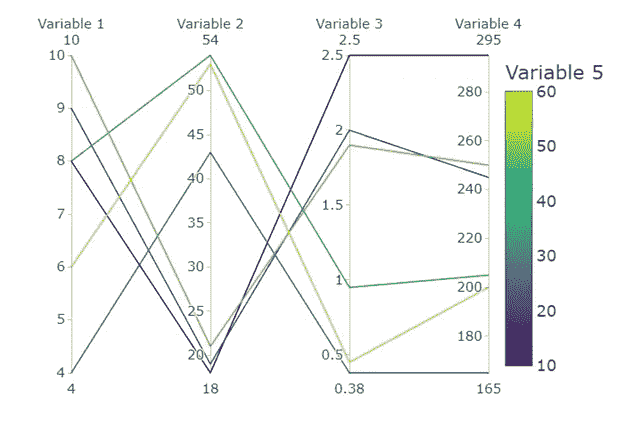
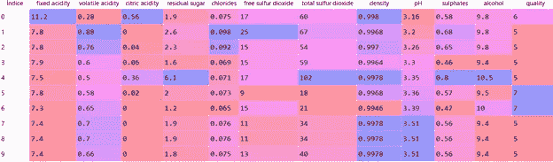
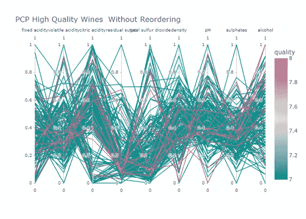
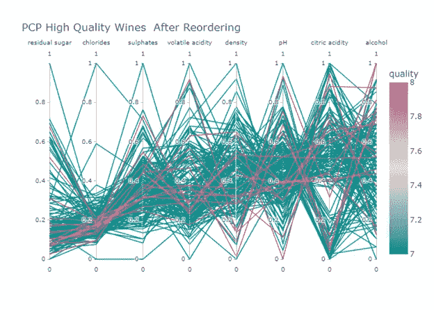
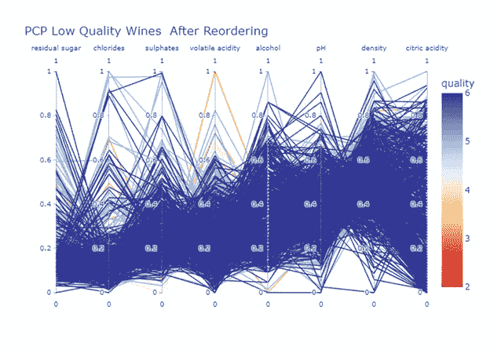
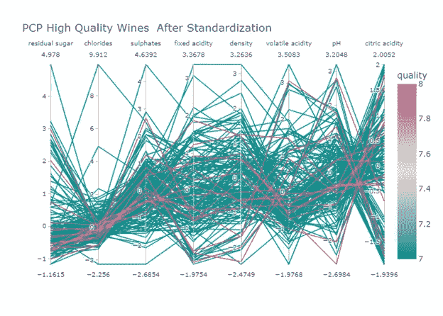

# 平行坐标用 Plotly 绘制

> 原文：<https://towardsdatascience.com/parallel-coordinates-plots-with-plotly-dffe3f526c6b?source=collection_archive---------14----------------------->

## [实践教程](https://towardsdatascience.com/tagged/hands-on-tutorials)

## **规范化还是标准化？**


图片来自 Unspalsh 的 Abbas Therani

数据可视化是讲故事的工具。数据科学家通常需要找到隐藏在具有多个数值变量的多维数据集中的模式或趋势。平行图或**平行坐标图** (PCPs)是数据可视化图表，适用于同时比较多个数值变量，这些变量具有不同的刻度和/或不同的测量单位。

在 PCP **中，每个数值变量都有自己的轴。**除此之外，所有的轴都画成垂直，**平行**，等间距。数据集的记录被表示为跨每个轴连接的线段。这些线段形成一条**折线**，该折线由不同数值变量在其相应轴上的取值产生。

下图显示了一个带有四个数值变量和每个变量六条记录的 PCP。所以我们有四个垂直的、平行的、等间距的轴和它们相应的标签。有六条由四个连接点组成的多段线，每个轴上有一个。根据第五个变量采用的数值，每条折线都有其特定的颜色。



图 1:平行坐标图的示意图。这个图形是作者用 Plotly 绘制的。

根据折线之间的**平行度**分析不同数值变量之间的模式、趋势或聚类:连接平行轴的线的一定平行度意味着相应变量之间的正关系；连接平行轴的线之间的交叉( **X 形**)暗示它们之间的负关系；没有确定顺序的交叉意味着不存在特定的关系。

由于变量 4 与变量 1 和变量 3 之间的数量级不同，任何试图找出图 1 所示变量之间的模式或关系的尝试都会产生误导:在绘制该图之前，我们必须进行**数据标准化任务**。**标准化**或**缩放**技术将原始数据转换成新的比例，允许我们比较最初不同幅度的值。

两种经典的缩放技术被称为规范化和标准化。规格化在 PCP 中最小和最大值之间缩放每个轴。在此过程中，最小值被设置为 0，最大值被设置为 1，中间的所有其他值也相应地进行转换。[标准化](https://machinelearningmastery.com/standardscaler-and-minmaxscaler-transforms-in-python/)使用平均值和标准偏差将原始数值转换为通用刻度。

用 PCP 讲故事通常很难沟通，即使对于技术和科学观众来说也是如此，因为没有办法避免典型的折线混乱。**重排**和**刷**的手法可以增强剧情的可读性。

**重新排序**基于相邻变量之间的关系、聚类或模式比不相邻变量之间的关系、聚类或模式更容易可视化的想法。重新排序基本上包括**改变垂直轴**的顺序，直到显示中出现某种模式或关系。

**刷**通过**高亮显示所选线条**而淡化其他线条，最大限度地减少杂乱并揭示关系。**发散色标**适用于那些没有内置刷牙方法的可视化工具。

# **平行坐标用 Plotly 绘制**

我们使用五氯苯酚分析了 Kaggle 竞赛的数据，这些数据与评估某些化学特性如何影响葡萄牙" Vinho Verde "葡萄酒红色变种的质量有关[ [Cortez 等人，2009 年](https://www.kaggle.com/uciml/red-wine-quality-cortez-et-al-2009/version/2) ]。葡萄酒的感官质量会受到下列化学或物理特性的影响:酒精、残糖、密度、pH 值、固定酸度、挥发性酸度、柠檬酸、氯化物、游离二氧化硫、总二氧化硫和硫酸盐。为数据集中的每种葡萄酒提供了介于 0(差)和 10(优)之间的质量分数。

首先，我们分别导入 Plotly Express 为 *px、*和库 Numpy & Pandas 为 *np* 和 *pd* 。我们包含了一个关闭特定警告的功能。

```
import plotly.express as px
import numpy  as np
import pandas as pd
pd.set_option('mode.chained_assignment', None)
```

然后我们使用 *read_csv* 函数将逗号分隔值(csv)文件读入相应的数据帧( *df)* 。我们使用 *describe()* 方法生成描述性统计数据(平均值，标准差。戴夫。、最小值、最大值等。)总结了数据集的集中趋势、形状和分散性。然后，我们使用 *isnull()* 来检测缺失值。

```
df = pd.read_csv(path +'winequality-red.csv', sep=';',
                 header = 0,
                 names=['fixed acidity', 'volatile acidity', 
                        'citric acidity','residual sugar', 
                        'chlorides','free sulfur dioxide',
                        'total sulfur dioxide','density', 'pH',
                        'sulphates', 'alcohol', 'quality'])first10    = df.head(10)
stat_basic = df.describe()
count_null = df.isnull().sum()
```

下面的屏幕截图显示了数据集的前十条记录:



我们决定使用 *Z 分数*来消除**异常值**。请记住，Z 得分是数据集的每个数据点偏离平均值的标准偏差数。我们使用来自 Python*[*ScyPy*](https://www.tutorialspoint.com/scipy/index.htm)开源科学库的 *stats.zscore(df)* 计算 Z 分数。经过几次测试后，我们选择值 6 作为异常值过滤阈值。*

```
*from scipy import statszT  = np.abs(stats.zscore(df))df2 = df[(zT < 6).all(axis =1)]*
```

*我们决定将数据集分为高品质和低品质葡萄酒，以减少行数，最大限度地减少混乱，并提高模式检测:*

```
*df_highq = df2[df2['quality'] >  6]df_lowq  = df2[df2['quality'] <= 6]*
```

*数据集的屏幕截图清楚地显示了在绘制 PCP 之前需要一个缩放任务。首先，我们使用 scikit-learn 对象 [MinMaxScaler](https://scikit-learn.org/stable/modules/generated/sklearn.preprocessing.MinMaxScaler.html) 对数据集进行规范化。记住*最小最大缩放器*从原始值重新缩放数据，所以所有的新值都在 0-1 的范围内。*

```
*from sklearn.preprocessing import MinMaxScaler
scaler = MinMaxScaler()df_highqN = df_highqdf_highqN[['fixed acidity', 'volatile acidity', 'citric acidity',
           'residual sugar', 'chlorides','free sulfur dioxide',
           'total sulfur dioxide','density', 
           'pH','sulphates','alcohol']]    
           =scaler.fit_transform(df_highqN[[
                           'fixed acidity', 'volatile acidity',
                           'citric acidity','residual sugar',
                           'chlorides','free sulfur dioxide',
                           'total sulfur dioxide','density', 'pH',
                           'sulphates', 'alcohol']])*
```

*对于本文中的平行坐标图，Plotly Express 函数为`*px.parallel_coordinates*`，对应的参数为:`*data_frame*;``*color=*`**data _ frame*中一列的名称，其值用来表示线条的颜色； `*dimensions=*`在 *data_frame* 中列的名称，其值用于画线；`*color_continuous_scale=*` 选择[内置色标](https://plotly.com/python/builtin-colorscales/)；`*color_continuous_midpoint=*` 使用发散色标时设置合适的中点值； `*title=*` 设置图名。**

```
**fig0 = px.parallel_coordinates(df_highqN, color="quality",
               dimensions=['fixed acidity', 'volatile acidity',
                             'citric acidity', 'residual sugar',
                             'total sulfur dioxide','density', 'pH',
                             'sulphates', 'alcohol'
                             ],
               color_continuous_scale=px.colors.diverging.Tealrose,
               color_continuous_midpoint=7.5,
               title = 'PCP High Quality Wines  Without Reordering')fig0.show()**
```

****

**图 2:没有重新排序的高品质葡萄酒的平行坐标图。作者用 Plotly 开发的图。**

**真的很乱。没有办法获得任何有用的信息，所以我们决定尝试不同的重新排序方案，直到得到图 3。**

```
**fig1 = px.parallel_coordinates(df_highqN, color="quality",
             dimensions=['residual sugar', 'chlorides',
                         'sulphates', 'volatile acidity', 'density',
                         'pH',  'citric acidity', 'alcohol'
                         ],
             color_continuous_scale=px.colors.diverging.Tealrose,
             color_continuous_midpoint=7.5,
             title = 'PCP High Quality Wines  After Reordering')fig1.show()**
```

****

**图 3:重新排序的高品质葡萄酒的平行坐标图。作者用 Plotly 开发的图。**

**该图显示，高品质的葡萄酒具有低水平的残留糖、氯化物和硫酸盐，以及高水平的酒精和柠檬酸。**

**让我们看看低品质葡萄酒会发生什么:**

```
**df_lowq2 = df_lowqdf_lowq2[['fixed acidity', 'volatile acidity', 'citric acidity',
          'residual sugar', 'chlorides','free sulfur dioxide',
          'total sulfur dioxide','density', 'pH',
          'sulphates', 'alcohol']]  = 
            scaler.fit_transform(df_lowq2[[
             'fixed acidity', 'volatile acidity', 'citric acidity',
             'residual sugar', 'chlorides','free sulfur dioxide',
             'total sulfur dioxide','density', 'pH',
             'sulphates', 'alcohol']])fig2 = px.parallel_coordinates(df_lowq2, color="quality",
           dimensions=['residual sugar', 'chlorides',
                       'sulphates', 'volatile acidity',
                       'alcohol', 'pH','density',
                       'citric acidity'
                       ],
            color_continuous_scale=px.colors.diverging.RdYlBu,
            color_continuous_midpoint=4,
            title = 'PCP Low Quality Wines  After Reordering')fig2.show()**
```

****

**图 4:重新排序的低品质葡萄酒的平行坐标图。作者用 Plotly 开发的图。**

**似乎低质量的葡萄酒含有高水平的氯化物、硫酸盐和挥发性酸度。**

**最后，我们想知道标准化技术的扩展是否改善了故事的讲述。**

```
**from sklearn.preprocessing import StandardScaler
scalerST = StandardScaler()df_highqS = df_highqdf_highqS[['fixed acidity', 'volatile acidity', 'citric acidity',
           'residual sugar', 'chlorides','free sulfur dioxide',
           'total sulfur dioxide','density', 'pH',
           'sulphates', 'alcohol']]  =  
             scalerST.fit_transform(df_highqS[[
              'fixed acidity', 'volatile acidity', 'citric acidity',
              'residual sugar', 'chlorides','free sulfur dioxide',
              'total sulfur dioxide','density', 'pH',
              'sulphates', 'alcohol']])fig3 = px.parallel_coordinates(df_highqS, color="quality",
           dimensions=['residual sugar', 'chlorides',
                       'sulphates', 'fixed acidity', 'density',
                       'volatile acidity','pH',
                       'citric acidity'
                       ],
           color_continuous_scale=px.colors.diverging.Tealrose,
           color_continuous_midpoint=7.5,
           title= 'PCP High Quality Wines  After Standardization')fig3.show()**
```

****

**图 5:标准化高品质葡萄酒的平行坐标图。作者用 Plotly 开发的图。**

**可以看出，该显示等同于图 3 的显示，只是难以显示不对应的化学和物理性质的负值。**

****总之，**平行坐标图是非常复杂的图形，需要几个预处理步骤。它们仅推荐用于具有大量数值变量的数据集。始终使用标准化作为缩放技术。它们的复杂性不允许保证足够的故事。**

**如果你对这篇文章感兴趣，请阅读我以前的(【https://medium.com/@dar.wtz】T2):**

**分歧棒线，为什么&如何，用分歧讲故事**

**[](/diverging-bars-why-how-3e3ecc066dce) [## 背离棒线，为什么&如何

### 用分歧讲故事

towardsdatascience.com](/diverging-bars-why-how-3e3ecc066dce) 

斜率图表，为什么和如何，用斜率讲故事

[](/slope-charts-why-how-11c2a0bc28be) [## 斜率图表，为什么和如何

### 用斜坡讲故事

towardsdatascience.com](/slope-charts-why-how-11c2a0bc28be)**