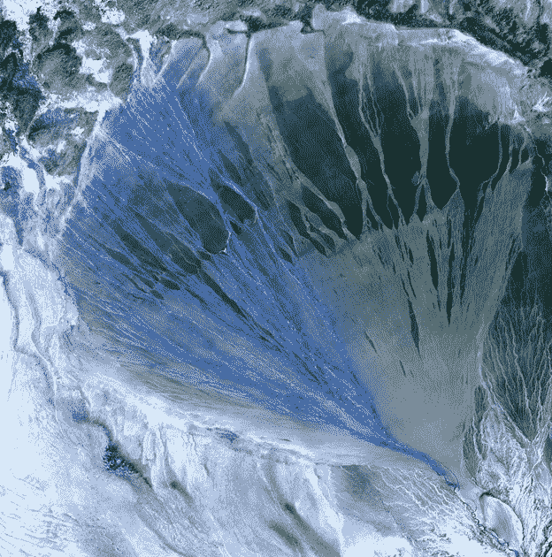
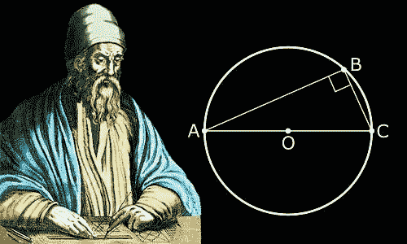
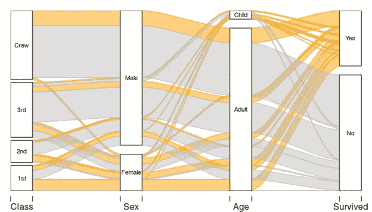
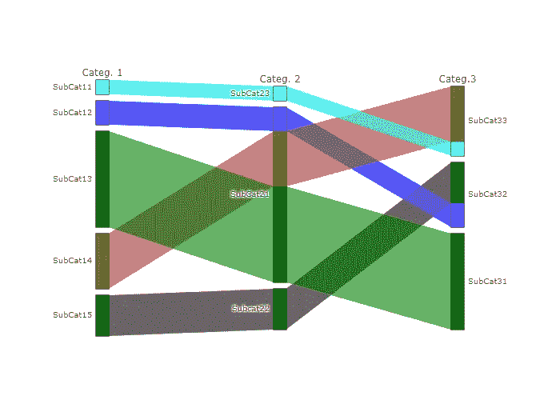

# 平行集和冲积图

> 原文：<https://towardsdatascience.com/parallel-sets-alluvial-diagrams-adf40514546?source=collection_archive---------57----------------------->

## 为什么和如何

美国地质勘探局在 [Unsplash](https://unsplash.com/s/photos/alluvial?utm_source=unsplash&utm_medium=referral&utm_content=creditCopyText) 上拍摄的照片

大约在公元前 300 年，在托勒密一世统治时期，发生了第一个影响宇宙数学和几何的“我*的生活和工作:**欧几里德。它的主要成就是在一个公理系统中汇编了所有以前的几何知识，这在数学史上是第一次，在一篇名为**元素**的论文中。***

欧几里德发展的系统把假设分成两类:1。-未经论证就被接受的原则、假设；2.-定理，基于之前的假设而被接受的假设。反过来，他将原则细分为公理和公设。后者是关于几何对象的陈述，为了进行演示，应该将其视为真实的。

《几何原本》是几何推理的主要来源，直到《非欧几何》的出现，也是继《圣经》之后西方世界的第二本畅销书。作为西方科学的基础基石，它包括其著名的第五公设**或纬线公设**，为二维几何建立了以下内容:

如果一条直线落在两条直线上，使同一侧的内角小于两个直角，那么这两条直线，如果无限长，就在内角小于两个直角的那一侧相交。[1].

虽然该公设并没有特别提到平行线，但它引入了平行的概念。其中一些想法在两个数据可视化图中出现:**平行集合图和冲积图。**

图 1:欧几里得的图像；资料来源:FamousScientists.org[2]

**原因:**两个图表都允许可视化**多维分类数据集**，以便执行此类数据的探索和分析任务。对于连续数据分析来说，这两个图都有其等效物:**平行集图** (PSD)类似于 Sankey 图(SD)(https://towardsdatascience . com/Sankey-diagrams-1c 2e 1 f 469 c 85)，而**冲积图** (AD)对应于平行坐标图(PCP)(https://towardsdatascience . com/Parallel-Coordinates-plots-6 fcfa 066 dcb 3)。

说到**类别，**记住它们指的是方法、姓氏、城市、公司、品牌、日期、年份等定性元素。如果一组变量的数据或观察值可以被分配到不重叠的类别中，那么这组变量称为**分类变量**。类别可以是名词或序数:方法、公司和品牌是名词；否则，有序分类变量允许对类别进行排序[低、中、中高、高]或[稀疏、充足、丰富、过多]。分类数据也可以间隔显示。

由于公司和政府不断收集关于产品、客户、调查、人口普查和其他分类变量的数据，因此需要一些技术来分析构成这些数据集的多个类别之间的关系。从这个意义上说，平行集合图的主要功能是**可视化两个或更多分类变量的比例**。当消息的性质包括相同数据集的比较、分布或流动时，也使用它。冲积图的最佳实现是当它被用来显示一个系统随着时间的变化。它还用于分发和比较任务。

**如何做**:如维基百科所述，“冲积图是一种流程图，最初是用来表示网络结构随时间的变化。鉴于其视觉外观和对流动的强调，冲积图以**冲积扇**命名，冲积扇是由流水沉积的土壤自然形成的【3】。然而，数据可视化中使用的 ADs 是由**带**组成的，这些带代表以固定间隔绘制的节点块之间的流动。每个块的垂直大小与所表示的数据的频率成比例，并且条带的宽度与它们所表示的值的大小成比例。DA 显示以规则的间隔在不同阶段之间流动的彩色条带。当它们从一个阶段移动到下一个阶段时，丝带通常会改变颜色，以显示时间的流逝或分类变量的变化。

在技术文献中被引用最多的 DA 例子是 Michal Bojanowski，他是 R 语言的冲积包的创造者。图 1 显示了根据与 1912 年泰坦尼克号沉没相关的数据创建的图表。

图 2:冲积图，来源:Michal Bojanowski [4]

该图从左至右，从等级类别(乘客和船员)开始，首先按性别类别，然后按年龄类别，将他们分开，直到到达远洋客轮悲剧的幸存者或不幸存者的条件。很明显，阶级、性别、年龄和存活率是分类变量。

该图展示了以规则间隔绘制的节点块，其高度与所表示的数据的频率成比例。您还可以看到带状区的宽度与它们所代表的值的大小成正比。作为一个明确的时代精神，图表显示，大多数乘坐头等舱旅行的女性幸存下来，而大多数溺水对应的是乘坐三等舱旅行的船员和男性。

总之，冲积图显示了一组事件是如何跨类别维度分配的。

在 PSD，*又名*平行类别图中，每个类别变量都有自己的轴；此外，所有轴都是平行、垂直且等距的。每个轴由一列矩形表示，其中每个矩形的相对高度表示不同子类别或属性的值的相对频率。**PSD 显示平行四边形**，其宽度随着其通过不同阶段而变化。平行四边形的宽度与它们所代表的观察数量成正比。在第一阶段，颜色分布在主类别的子类别中，并且该颜色在所有剩余阶段都保持不变。

下图显示了一个有三个分类变量的 PSD，每个变量都有相应的子类别。利用`*ParCats*` 功能，使用`*Plotly graphic library*`绘制图形。以前你必须使用指令`*import plotly.graph_objects as go*`导入类`graph.objects`。您必须为参数`*dimensions*`提供值，以指示带有相应 `*label*`和`*values*`数据的轴或类别的数量，或者为属性 `*counts*` 提供值，以指示子类别或属性出现的频率。

图 3:作者用 Plotly [5]制作的平行集图。

可以在 PSD 中用**表示连续变量**的数据。为此，有必要首先将相应的轴划分为箱，然后将它们转换为分类变量。与桑基图不同，**PSD 没有方向性**，它们不显示方向性箭头，但是类别(轴)的排列可以(也应该)改变，以改善它们之间的比较和分布的交互分析(图 3)。虽然它们没有方向性，但它们可以水平或垂直放置，这取决于讲故事的方式。

总之，我们使用平行集图来显示高维分类数据或混合分类/连续数据。PSD 使用平行四边形来显示分类变量之间的比例或分布。

**总结一下**:平行集合图和冲积图允许探索和分析多维分类数据。它们是复杂的图表，不容易解释，但是随着多维度中与类别相关的数据数量的增加，它们变得越来越重要。

如果你发现了这篇感兴趣的文章，请阅读我之前的(https://medium.com/@dar.wtz):

分歧棒线，为什么&如何，用分歧讲故事

</diverging-bars-why-how-3e3ecc066dce>  

斜率图表，为什么和如何，用斜率讲故事

</slope-charts-why-how-11c2a0bc28be>  

## **参考文献**

[1]:[https://en.wikipedia.org/wiki/Parallel_postulate](https://en.wikipedia.org/wiki/Parallel_postulate)

[2]:“欧几里得。”著名的科学家。famousscientists.org。2018 年 6 月 24 日。网络。2021 年 1 月 11 日<www.famousscientists.org>。</www.famousscientists.org>

[3]:[https://en.wikipedia.org/wiki/Alluvial_diagram](https://en.wikipedia.org/wiki/Alluvial_diagram)

[4]:[https://cran . r-project . org/web/packages/冲积/vignettes/冲积. html](https://cran.r-project.org/web/packages/alluvial/vignettes/alluvial.html)

https://plotly.com/python/parallel-categories-diagram/