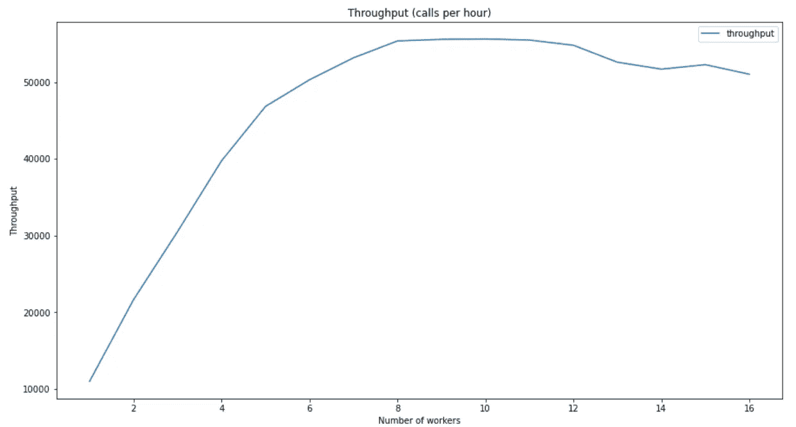

# Python 中的并行 web 请求

> 原文：<https://towardsdatascience.com/parallel-web-requests-in-python-4d30cc7b8989?source=collection_archive---------1----------------------->

并行执行 web 请求可以显著提高性能。提议的 Python 实现使用队列和线程来创建一个简单的方法，节省了大量时间。

照片来自 [Unsplash](https://unsplash.com/) 上的 [E Kemmel](https://unsplash.com/@ekemmel)

我最近发表了几篇文章，使用 Open Trip Planner 作为公共交通分析的来源。行程路线是通过其 REST API 从 OTP 获得的。OTP 在本地机器上运行，但是仍然需要花费大量时间来发出所有必需的请求。文章中显示的实现是顺序的。为了简单起见，我张贴了这个顺序实现，但在其他情况下，我使用并行实现。本文展示了执行大量 web 请求的并行实现。

虽然我有一些经验，但我发现教程很难掌握。这篇文章包含了我学到的经验，可以用来执行并行 web 请求。

该函数的核心是一个包含所有已执行请求的队列。在这种情况下，请求由其 url 指定:

python 包*队列*实现了一个有多个生产者和消费者的队列。这意味着可以从多个源( *Queue.put()* )填充队列，并且多个工作线程( *Threads)* 可以从队列中获得一个项目。默认实现是先进先出(FIFO)队列，这意味着添加的第一个元素是提取的第一个元素。为此，默认行为是好的。

第二个组成部分是工人。worker 从队列中获取一个元素，执行所需的逻辑，并对它可以从队列中获取的所有元素重复此操作。

当构造一个 worker 时，需要一个对队列的引用(第 2 行)。*工作者*扩展 Python 类*线程*。它从*线程*继承了 *start()* 方法。调用该方法时，会创建一个新线程，并在该线程中调用 *run()* 方法。第 7 行到第 15 行实现了 run 方法。第 9 行从队列中检索一个元素(这个调用也从队列中删除了这个元素)。当队列中没有元素时，它会一直阻塞，直到添加了新元素。因为我们将 URL 字符串添加到队列中，所以可以创建(第 12 行)并执行(第 13 行)一个请求。请求的结果被添加到这个工作者的结果列表中(第 14 行)。最后，第 15 行通知队列任务已经成功执行。

因为我们希望线程在所有调用完成后结束，所以我们必须实现一个停止机制。一种方法是调用带有超时值的 *Queue.get()* 方法。当队列中没有对象时，当超时超过时，抛出一个*空*异常。我个人不喜欢这个解决方案。异常是针对异常情况的，而不是针对预期的功能。所以这段代码在队列中使用了一个停止值，在这个例子中是一个空字符串。当检索到空字符串时， *while* 循环结束，从而结束 *run-* 方法。当 *run* 方法结束时，线程也自动结束。

将所有这些放在一起:

创建一个将执行并行 web 请求的方法。这些参数是 URL 列表和要创建的工作线程数。创建队列后(第 21–24 行),创建了一组工作线程。每个工作线程都连接到队列并启动。当从队列中检索到一个空字符串时，线程将被停止，因此对于每个 worker，一个空字符串将被添加到队列中(第 33–34 行)。因为我们有一个 FIFO 队列，这些将最后从队列中取出。通过加入 worker，在所有 worker 都结束时执行下一个代码。

所有工人都将结果存储在他们自己的内存空间中。所有这些结果必须在返回给调用者之前组合起来(第 40–42 行)。有了这个方法，用一行代码(第 46 行)就可以并行执行多个 web 调用。通过组合几个循环可以减少代码的大小，但是为了可读性，它们是分开的。

现在，是时候回答它在多大程度上提高了性能这个问题了。因此实现了一个小实验。通过向 OTP 的本地实例发送一千个请求，就可以确定工作人员数量的影响。本地服务器实例用于减少网络流量和互联网速度的影响。为了防止某种缓存，所有请求都是不同的。通过对 1000 个请求进行计时，我们可以确定一小时内可以进行的调用总数(吞吐量)。

生产量作为工人数量的函数进行计算和绘图:

吞吐量(作者图片)

只有一个工作人员时，性能相当于没有并行性的实现。由于线程的额外开销，它会稍微差一些，但与其他测量相比，这并不显著。

在没有线程的情况下，吞吐量是每小时 11000 个调用。通过添加螺纹，该值提高到 56.000。达到这个最佳值后，添加更多的线程并不能提高性能，甚至还会有所下降。该测试是在具有 8 个内核的 CPU 上执行的，因此找到 8 个内核时的最佳性能是意料之中的。OTP 是多线程实现的，8 个内核可以并行处理 8 个请求。根据系统上运行的其他作业，最佳数量等于或略少于内核数量。

在我们的 OTP 示例中，我们可以将吞吐量提高 5 倍。随着我的其他文章中制作 OTP 图的请求数量的增加，运行时间从 6 小时减少到略低于 1 小时。这种性能提升可以通过实现这种相对简单的多线程方法来实现。我希望它能为你节省一些宝贵的时间！

我希望你喜欢这篇文章。要获得使用 OTP 的灵感，请查看我的一些其他文章:

*   [REST API 的客户端缓存](https://leo-vander-meulen.medium.com/client-side-caching-of-a-rest-api-in-python-7f2ce483efb8)
*   [对 CSV 文件中的列执行功能](https://towardsdev.com/perform-a-function-on-columns-in-a-csv-file-a889ef02ca03)
*   [用开放数据和开普勒](/visualization-of-crowdedness-for-dutch-trains-with-kepler-f55057a3ba24)可视化荷兰火车的拥挤
*   [使用 OTP 和 QGIS 可视化行程时间](/visualization-of-travel-times-with-otp-and-qgis-3947d3698042)
*   [所有公共交通工具都通向乌得勒支，而不是罗马](/all-public-transport-leads-to-utrecht-not-rome-bb9674600e81)

如果你喜欢这个故事，请点击关注按钮！

*免责声明:本文包含的观点和看法仅归作者所有。*