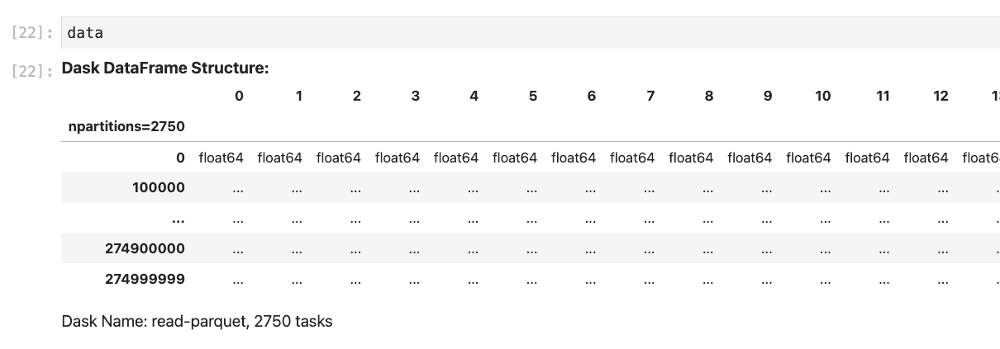
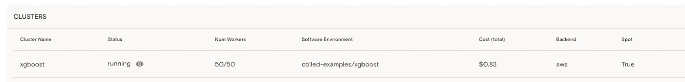

# 用 Python 中的 Dask 并行 XGBoost

> 原文：<https://towardsdatascience.com/parallel-xgboost-with-dask-in-python-11f7ed004dd3?source=collection_archive---------29----------------------->

## 扩展到非常大的数据集的机器学习


图片由 Billy Hunh 通过 Unsplash.com 提供

# TL；博士；医生

开箱即用，XGBoost 无法在大于你电脑内存的数据集上进行训练；Python 会抛出一个`MemoryError`。本教程将向您展示如何通过利用 Dask 的**分布式**[**XGBoost**](https://xgboost.readthedocs.io/en/latest/)**来超越您的本地机器限制，只需对您现有的代码进行微小的更改。**

具体来说，您将学习如何:

1.  使用 [Dask](https://dask.org/) 在小型数据集上本地训练分布式 XGBoost 模型，
2.  使用 Dask 和 [Coiled](https://coiled.io/) 将您的分布式 XGBoost 模型扩展到云，以在大于内存的数据集上进行训练，
3.  借助 Dask 核心团队的专业技巧，加快训练速度。

[这是我们将使用的代码](https://github.com/coiled/coiled-resources/blob/main/xgboost-with-coiled/coiled-xgboost-synthetic-100GB.ipynb)，如果你想直接进入的话。

*关于代码的问题？* [*加入盘绕群落的松弛通道*](https://join.slack.com/t/coiled-users/shared_invite/zt-hx1fnr7k-In~Q8ui3XkQfvQon0yN5WQ)


作者创建的图像

# 用`xgb.dask.train()`进行平行模型训练

默认情况下，XGBoost 按顺序训练模型。这对于基本项目来说没什么问题，但是随着数据集和/或 ML 模型的大小增加，您可能需要考虑使用 Dask 在分布式模式下运行 XGBoost，以加快计算速度并减轻本地机器的负担。

XGBoost 自带原生 Dask 集成，使得并行训练多个模型成为可能。使用分布式 Dask 后端运行 XGBoost 只需要对常规的 XGBoost 代码进行两处修改:

1.  用`dtrain = xgb.dask.DaskDMatrix(X_train, y_train)`代替`dtrain = xgb.DMatrix(X_train, y_train)`T26
2.  用`xgb.dask.train(client, params, dtrain, ...)`替换`xgb.train(params, dtrain, ...)`

让我们用一个实际的数据集来看看这一点！

我们将使用存储在公共亚马逊 S3 桶中的合成 100GB 数据集。你需要一个免费的 Coiled Cloud 帐户来自己运行这个笔记本中的整个示例[。](https://github.com/coiled/coiled-resources/blob/main/xgboost-with-coiled/coiled-xgboost.ipynb)

*免责声明:我在 Coiled 工作，是一名数据科学传播者。* [*Coiled*](http://coiled.io/) *由*[*Dask*](https://dask.org/)*的最初作者 Matthew Rocklin 创立，是一个面向分布式计算的开源 Python 库。*

# 具有本地 Dask 集群的分布式 XGBoost

好了，让我们开始这个分布式派对吧！

首先，实例化一个本地版本的 Dask 分布式调度器，它将并行地编排训练你的模型。

```
from dask.distributed import Client, LocalCluster # local dask cluster 
cluster = LocalCluster(n_workers=4) 
client = Client(cluster) 
client
```

由于这是合成数据，我们不会对数据做任何预处理。关于包含预处理的真实世界数据的例子，请看[这本笔记本](https://github.com/coiled/coiled-resources/blob/main/xgboost-with-coiled/coiled-xgboost-arcos-20GB.ipynb)，它在 ARCOS 数据集的 20GB 子集上训练 XGBoost。当您完成预处理后，您可以使用 dask-ml 库创建您的训练和测试分割。

在本节中，我们将使用 **data_local** ，它是整个数据集的子集，只包含前 50 个分区。

```
from dask_ml.model_selection import train_test_split # Create the train-test split 
X, y = data_local.iloc[:, :-1], data_local["target"] 
X_train, X_test, y_train, y_test = train_test_split(
    X, y, test_size=0.3, shuffle=True, random_state=2
)
```

现在您已经准备好开始训练您的 XGBoost 模型了！

让我们在这个例子中使用默认参数。

```
import xgboost as xgb 
# Create the XGBoost DMatrices 
dtrain = xgb.dask.DaskDMatrix(client, X_train, y_train) 
dtest = xgb.dask.DaskDMatrix(client, X_test, y_test) # train the model 
output = xgb.dask.train( 
    client,
    params,
    dtrain, 
    num_boost_round=4, 
    evals=[(dtrain, 'train')] 
)
```

然后，您可以使用训练好的模型以及测试分割来进行预测。

```
# make predictions 
y_pred = xgb.dask.predict(client, output, dtest)
```

如您所见，与常规的 XGBoost 代码相比，没有什么变化。我们只是用了`xgb.dask.DaskDMatrix`代替了`xgb.DMatrix`，用`xgb.dask.train()`代替了`xgb.train()`。

# 使用 Coiled 将 XGBoost 扩展到云

现在让我们扩展这个工作流，通过将 XGBoost 扩展到云来处理整个 100GB 的数据集。

你需要对我们上面写的代码进行 **2 修改**:

1.  将 Dask 连接到云中的盘绕式集群，而不是我们的本地 CPU 核心，
2.  使用整个 100GB 数据集，而不是本地子集。

我们将首先在云中启动一个 Dask 集群，它可以在整个数据集上运行您的管道。要运行本节中的代码，您需要一个 Coiled Cloud 帐户。用你的 Github 证书登录[盘绕云](http://cloud.coiled.io)来创建一个。

*注意，如果您使用盘绕空闲层，您必须将 n_workers 参数减少到 25，因为该层最多允许 100 个并发内核。*

```
import coiled cluster = coiled.Cluster( 
    name="xgboost", 
    software="coiled-examples/xgboost", 
    n_workers=50, 
    worker_memory='16Gib', 
    shutdown_on_close=False, 
)
```

最后，让 Dask 在您的盘绕式集群上运行计算。

```
# connect Dask to your Coiled cluster 
from dask.distributed import Client 
client = Client(cluster) 
```

对于这一部分，请确保使用包含 2750 个分区的整个 dataframe 数据，而不是我们上面使用的仅包含前 10 个分区的`data_local`子集。

```
# download data from S3 
data = dd.read_parquet( 
    "s3://coiled-datasets/synthetic-data/synth-reg-104GB.parquet/", 
    compression="lz4", 
    storage_options={"anon": True, 'use_ssl': True},
) data
```



现在，您可以从上面重新运行所有相同的代码。所有的计算都将在云中的集群上运行，而不是在本地机器上。这意味着您将拥有数量级以上的计算能力！

```
%%time 
# train the model 
output = xgb.dask.train( 
    client, 
    params, 
    dtrain, 
    num_boost_round=5, 
    evals=[(dtrain, 'train')] 
)
```

`CPU times: user 17.5 s, sys: 3.43 s, total: 20.9 s
Wall time: 3min 24s`

正如您在 Coiled Cloud 仪表盘中看到的，在云中培训 100GB 数据的 XGBoost 花费了 0.83 美元。



训练完成后，我们可以保存模型并关闭集群，释放资源。如果我们出于某种原因忘记这样做，Coiled 会在 20 分钟不活动后自动关闭集群，以帮助避免不必要的成本。

```
# Shut down the cluster 
client.cluster.close()
```

# 加速 XGBoost 训练的专业技巧

最后，我们从 Dask 核心团队收集了一些专业技巧，帮助您加快 XGBoost 训练:

*   提升性能的第一件事是增加集群中 Dask workers 的数量。这将加速你的计算。
*   将列重新转换为占用内存较少的数据类型。例如，尽可能将`float64`转换成`int16`。这将减少数据帧的内存负载，并加快训练速度。
*   使用 Dask Dashboard 来发现瓶颈，并找出提高代码性能的机会。观看 Dask 的原作者 Matt Rocklin 解释如何充分利用 Dask Dashboard [这里](https://www.youtube.com/watch?v=N_GqzcuGLCY)。
*   注意非托管内存。阅读 Dask 核心贡献者 Guido Imperiale 的博客，了解如何解决 Dask workers 中的非托管内存问题。

[](https://coiled.io/blog/common-dask-mistakes/) [## 使用 Dask 时要避免的常见错误

### 第一次使用 Dask 可能是一个陡峭的学习曲线。经过多年的建设 Dask 和引导人们通过…

coiled.io](https://coiled.io/blog/common-dask-mistakes/) 

# Python 摘要中的并行 XGBoost

让我们回顾一下我们在这篇文章中讨论的内容:

*   开箱即用，XGBoost 无法在大于内存的数据集上进行训练。
*   将 XGboost 连接到本地 Dask 集群允许您利用机器中的多个内核。
*   如果这还不够，您可以将 Dask 连接到 Coiled，并在需要时突发到云。
*   您可以通过检查 Dask 仪表板来调整您的分布式 XGBoost 性能。

让我知道你是否最终把你的数据集换到了这个笔记本上，并亲自驾驶 XGBoost + Dask。

在 LinkedIn 上关注我[，了解定期的数据科学和机器学习更新和黑客攻击。](https://www.linkedin.com/in/richard-pelgrim/)

*原载于 2021 年 12 月 20 日*[*https://coiled . io*](https://coiled.io/blog/dask-xgboost-python-example/)*。*