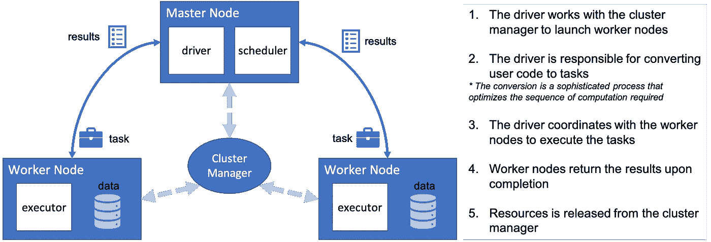
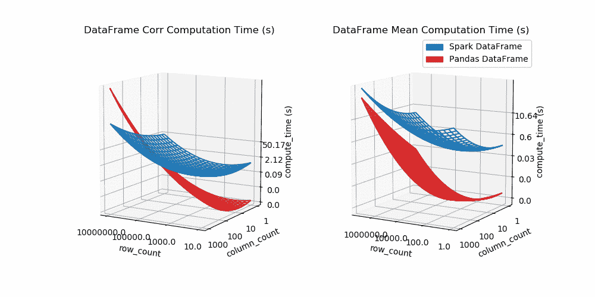
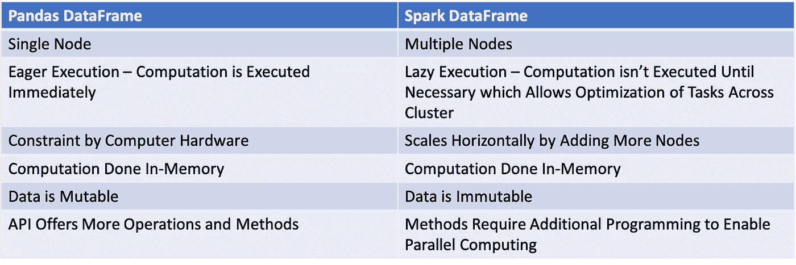
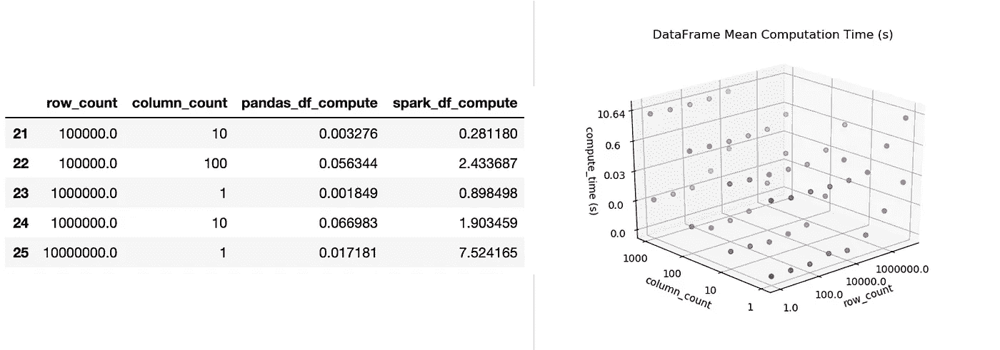

# 熊猫数据框架与 Spark 数据框架:当并行计算变得重要时

> 原文：<https://towardsdatascience.com/parallelize-pandas-dataframe-computations-w-spark-dataframe-bba4c924487c?source=collection_archive---------1----------------------->

## 通过性能比较分析和动画 3D 线框绘图的引导示例

*注:本帖代码可在* [*这里*](https://github.com/kevinclee26/spark_df_benchmark) 找到


照片由 [Pixabay](http://www.pixabay.com/) 上的 [By_Jo](https://pixabay.com/users/by_jo-2580273/) 拍摄

**Python** 以其来自开源社区的大量**库**和**资源**而闻名。作为一名数据分析师/工程师/科学家，人们可能熟悉一些流行的软件包，如[**【Numpy】**](https://numpy.org/)[**熊猫**](https://pandas.pydata.org/)[**Scikit-learn**](https://scikit-learn.org/stable/)[**Keras**](https://keras.io/)和 [**TensorFlow**](https://www.tensorflow.org/) 。这些模块共同帮助我们从数据中提取价值，推动分析领域的发展。随着数据不断变得更大和更复杂，另一个需要考虑的因素是专门处理**大数据**的框架，如 [**Apache Spark**](https://spark.apache.org/) 。在本文中，我将展示分布式/集群计算的能力，并对**熊猫数据框架**和 **Spark 数据框架**进行比较。我的希望是为选择正确的实现提供更多的信心。

## 熊猫数据框

熊猫因其简单易用而广受欢迎。它利用数据框架以**表格**格式呈现数据，就像带有行和列的电子表格。重要的是，它有非常**直观的方法**来执行常见的分析任务和相对**平坦的学习曲线**。它将所有数据加载到一台机器上的内存中(**一个节点**)以便快速执行。虽然熊猫数据框架已经被证明在处理数据方面非常强大，但它也有其局限性。随着数据呈指数级增长，复杂的数据处理变得非常昂贵，并导致性能下降。这些操作需要**并行化**和**分布式计算**，而 Pandas DataFrame 并不支持。

## 介绍集群/分布式计算和 Spark 数据框架

[**Apache Spark**](https://spark.apache.org/docs/0.9.2/index.html) 是一个开源的**集群计算**框架。借助集群计算，数据处理由多个节点并行分配和执行。这被认为是 **MapReduce** 框架，因为分工通常可以用**功能编程**中的 **map** 、 **shuffle** 和 **reduce** 操作的集合来表征。Spark 的集群计算实现是独一无二的，因为进程 1)在内存中执行**和 2)建立一个查询计划，直到必要时才执行(称为**延迟执行**)。尽管 Spark 的集群计算框架具有广泛的实用性，但出于本文的目的，我们只研究 Spark 数据框架。与熊猫中发现的相似，Spark 数据框架具有直观的 API，使其易于实现。**



火花过程(图片由作者提供)

## 熊猫数据框与火花数据框

当比较 Pandas 数据帧和 Spark 数据帧之间的计算速度时，很明显 Pandas 数据帧对于相对较小的数据表现稍好。考虑到**大小**是影响性能的主要因素，我对两者进行了对比测试(脚本在 [GitHub](https://github.com/kevinclee26/spark_df_benchmark) )。我发现随着数据量的增加，特别是超过了**的 100 万行**和**的 1000 列**，Spark 数据帧的表现会超过 Pandas 数据帧。下面是一个**动画 3D 线框图**来说明**单变量**(平均值)和**双变量**(相关性)计算的比较。请注意，这不包括与设置 Spark 数据帧相关的高开销**。另外，比较是在相对简单的操作上进行的。实际上，使用更复杂的操作，使用 Pandas 数据帧比使用 Spark 数据帧更容易执行。**



用于相关性和平均值计算的动画 3D 线框图(如下演示)

鉴于 Pandas 数据帧的**单节点**特性与 Spark 数据帧的**分布式**特性，这一结果并不令人惊讶。也就是说，由于熊猫数据帧是在单个服务器上执行的，所以对于非常大的数据集，**内存中的**计算速度和能力会受到影响。当然，这取决于硬件的能力。

## 哪个是正确的数据帧？

考虑到现代硬件规格和 Pandas 如何优化计算，一个典型的探索性项目不太可能保证 Spark 的实施。然而，有些情况下 Spark 有明显的意义。



Pandas 数据帧与 Spark 数据帧的特征

1.  Spark 对于需要高度分布式、**持久化**和**流水线化**处理的应用非常有用。开始一个项目，用有限的样本探索熊猫，并在它成熟时迁移到 Spark，这可能是有意义的。这在今天的市场趋势预测、个性化客户体验和天气预报引擎的开发中得到了应用。
2.  Spark 对于**自然语言处理**和**计算机视觉**应用非常有用，这些应用通常需要对又宽又长的数据进行大量计算。
3.  Spark 有一个机器学习库， [**MLlib**](https://spark.apache.org/mllib/) ，旨在提供高级 API 来创建机器学习管道。由于模型调整的迭代性质，机器学习管道理想地在 Spark 的框架上运行。

## 摘要

对比分析表明，流行的 Pandas DataFrame 非常能够执行**快速计算**。尽管 Spark DataFrame 的实现已经变得更加容易，因为其语法旨在匹配其 Pandas 对应物，但它并不总是适合于**特别分析**。对于已经建立的数据处理，它变得非常强大，特别是当数据预计很大的时候。

## 奖金

以下是我如何创建动画 3D 线框图的步骤。概括地说，它可以分为以下几个步骤:

1.  获取一些数据—我使用有限的数据点来推断步骤 2–4 中的其他模拟
2.  根据数据拟合回归模型
3.  创建所需 X，Y 平面的网格
4.  使用回归模型计算网格的 Z 坐标
5.  生成 3D 线框出图
6.  通过旋转 X，Y 平面的轴重复步骤 5，并将每个图存储为单独的 PNG 文件
7.  使用顺序 PNG 文件生成 GIF

我模拟并收集了 26 个不同数据维度的试验，如下所示(只显示了 5 个)。



数据框和 3D 散点图

上面的要点是用来为线框出图生成额外的点，因为散点图并没有为我正在寻找的可视化做一个完整的工作。我使用 for 循环遍历 x，y 轴的不同旋转，生成 GIF 的不同帧。

```
import matplotlib.pyplot as plt
from mpl_toolkits.mplot3d import Axes3Dax=plt.axes(projection='3d')
X, Y, pandas_Z, spark_Z, _=get_plane(df, 2, 20)
ax.plot_wireframe(X, Y, pandas_Z)
ax.plot_wireframe(X, Y, spark_Z)# rotate x, y plane with the azimuth parameter and save figure at every 10 degrees
# intentionally generate more frames between 180 and 270 degrees to create a slow down effect in GIFfor ii in range(0,360,1):
    if ii>=180 and ii<=270 and ii%3==0: 
        ax.view_init(elev=10., azim=ii)
        plt.savefig("movie/movie%d.png" % ii)
    elif (ii<=180 or ii>=270) and ii%10==0: 
        ax.view_init(elev=10., azim=ii)
        plt.savefig("movie/movie%d.png" % ii)
```