# 并行化 Python 代码

> 原文：<https://towardsdatascience.com/parallelizing-python-code-3eb3c8e5f9cd?source=collection_archive---------1----------------------->

## 本文回顾了并行化 Python 代码的一些常见选项，包括基于进程的并行、专用库、ipython 并行和 Ray。

**作者** : [达维德·博里基](https://www.linkedin.com/in/dawidborycki/)和[迈克尔·加莱尼克](https://twitter.com/GalarnykMichael)

Python 非常适合训练机器学习模型、执行数值模拟和快速开发概念验证解决方案等任务，而无需设置开发工具和安装几个依赖项。在执行这些任务时，您还希望尽可能多地使用底层硬件来快速获得结果。并行化 Python 代码可以实现这一点。然而，使用标准的 CPython 实现意味着您不能完全使用底层硬件，因为全局解释器锁(GIL)阻止了从多个线程同时运行字节码。

本文回顾了并行化 Python 代码的一些常见选项，包括:

*   [基于流程的并行性](https://docs.python.org/3/library/multiprocessing.html)
*   专业图书馆
*   [IPython 并行](https://ipython.readthedocs.io/en/stable/)
*   [雷](https://docs.ray.io/en/master/)

对于每种技术，本文列出了一些优点和缺点，并展示了一个代码示例来帮助您理解它的用法。

# 如何并行化 Python 代码

有几种常见的并行化 Python 代码的方法。您可以启动多个应用程序实例或一个脚本来并行执行作业。当您不需要在并行作业之间交换数据时，这种方法非常有用。否则，在进程间共享数据会显著降低聚合数据时的性能。

在同一个进程中启动多个线程可以让您更有效地在作业之间共享数据。在这种情况下，基于线程的并行化可以将一些工作卸载到后台。然而，标准 CPython 实现的全局解释器锁(GIL)阻止了字节码在多个线程中同时运行。

下面的示例函数模拟复杂的计算(旨在模拟激活函数)

```
iterations_count = round(1e7)
**def** **complex_operation**(input_index):
   print("Complex operation. Input index: {:2d}".format(input_index))
   [math.exp(i) * math.sinh(i) **for** i **in** [1] * iterations_count]
```

`complex_operation`执行几次以更好地估计处理时间。它将长时间运行的操作分成一批较小的操作。它通过将输入值分成几个子集，然后并行处理来自这些子集的输入来实现这一点。

下面是运行`complex_operation`几次(输入范围为 10)并使用 timebudget 包测量执行时间的代码:

```
@timebudget
**def** **run_complex_operations**(operation, input):
   **for** i **in** input:
      operation(i) 

input = range(10)
run_complex_operations(complex_operation, input)
```

在执行[这个脚本](https://gist.github.com/mGalarnyk/8c491fbdfe6ce3e498a7f62f03fa9ca4)之后，您将得到类似于下面的输出:

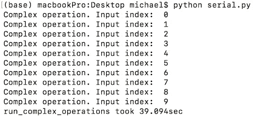

如您所见，在本教程中使用的笔记本电脑上执行这段代码花费了大约 39 秒。让我们看看如何改善这个结果。

# 基于进程的并行性

第一种方法是使用基于流程的并行性。使用这种方法，可以同时(并发地)启动几个进程。这样，他们可以同时执行计算。

从 Python 3 开始，[多重处理包](https://docs.python.org/3/library/multiprocessing.html#module-multiprocessing)被预装，并为我们提供了一个启动并发进程的方便语法。它提供了 Pool 对象，该对象自动将输入划分为子集，并将它们分布在许多进程中。

[下面是一个如何使用池对象启动十个进程的示例](https://gist.github.com/mGalarnyk/b5455b0454815b04363ef9994f22fbf3):

```
**import** math
**import** numpy **as** np
**from** timebudget **import** timebudget
**from** multiprocessing **import** Pool

iterations_count = round(1e7)

**def** **complex_operation**(input_index):
    print("Complex operation. Input index: {:2d}\n".format(input_index))
    [math.exp(i) * math.sinh(i) **for** i **in** [1] * iterations_count]

@timebudget
**def** **run_complex_operations**(operation, input, pool):
    pool.map(operation, input)

processes_count = 10

**if** __name__ == '__main__':
    processes_pool = Pool(processes_count)
    run_complex_operations(complex_operation, range(10), processes_pool)
```

每个进程同时执行复杂的操作。因此，该代码理论上可以将总执行时间减少 10 倍。然而，下面代码的输出只显示了大约四倍的改进(上一节是 39 秒，本节是 9.4 秒)。

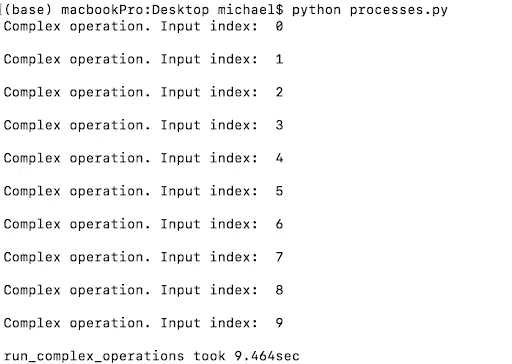

有几个原因可以解释为什么没有十倍的提高。首先，可以同时运行的进程的最大数量取决于系统中 CPU 的数量。您可以通过使用`os.cpu_count()`方法找出您的系统有多少个 CPU。

```
import os
print('Number of CPUs in the system: {}'.format(os.cpu_count()))
```

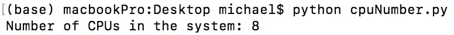

本教程中使用的机器有八个 CPU

改进不多的另一个原因是本教程中的计算量相对较小。最后，值得注意的是，当并行化计算时通常会有一些开销，因为想要通信的进程必须利用[进程间通信机制](https://en.wikipedia.org/wiki/Inter-process_communication)。这意味着对于非常小的任务，并行计算通常比串行计算慢(普通 Python)。如果你有兴趣了解更多关于多重处理的知识，Selva Prabhakaran 有一个[优秀的博客](https://www.anyscale.com/blog/writing-your-first-distributed-python-application-with-ray)启发了本教程的这一部分。如果你想了解更多关于并行/分布式计算的权衡，[看看这篇教程](/writing-your-first-distributed-python-application-with-ray-4248ebc07f41)。

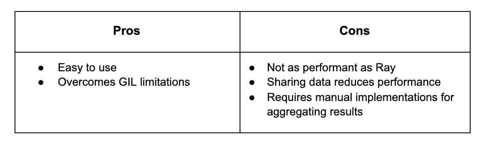

# 专业图书馆

[像 NumPy 这样的专门库的许多计算不受 GIL](https://stackoverflow.com/questions/36479159/why-are-numpy-calculations-not-affected-by-the-global-interpreter-lock) 的影响，可以使用线程和其他技术并行工作。教程的这一部分介绍了结合 NumPy 和多处理的好处

为了展示简单实现和基于 NumPy 的实现之间的差异，需要实现一个额外的函数:

```
**def** **complex_operation_numpy**(input_index):
      print("Complex operation (numpy). Input index: {:2d}".format(input_index))

      data = np.ones(iterations_count)
      np.exp(data) * np.sinh(data)
```

代码现在使用 NumPy `exp`和`sinh`函数对输入序列执行计算。然后，代码使用进程池执行`complex_operation`和`complex_operation_numpy`十次，以比较它们的性能:

```
processes_count = 10
input = range(10)

**if** __name__ == '__main__':
    processes_pool = Pool(processes_count)
    print(‘Without NumPy’)
    run_complex_operations(complex_operation, input, processes_pool)
    print(‘NumPy’)
    run_complex_operations(complex_operation_numpy, input, processes_pool)
```

下面的输出显示了这个脚本在有和没有 NumPy 的情况下的性能。

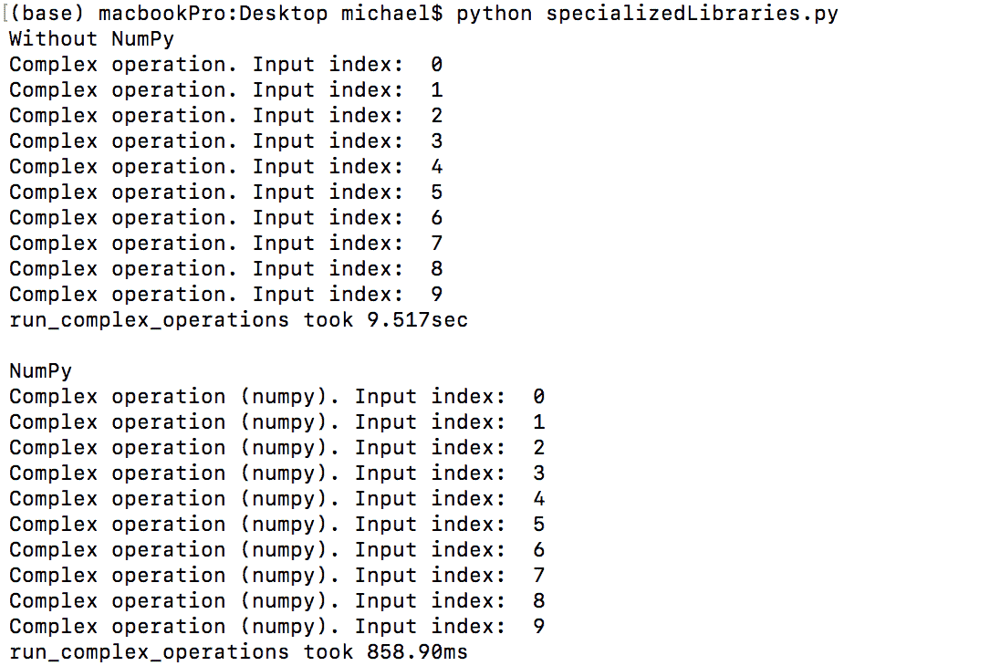

NumPy 提供了性能的快速提升。在这里，NumPy 将计算时间减少到原来的 10%(859 毫秒对 9.515 秒)。它更快的一个原因是因为 NumPy 中的大多数处理都是矢量化的。通过矢量化，底层代码被有效地“并行化”,因为操作可以一次计算多个数组元素，而不是一次遍历一个数组元素。如果你有兴趣了解更多这方面的知识，杰克·范德普拉斯在这里做了一个关于这个主题的精彩演讲。

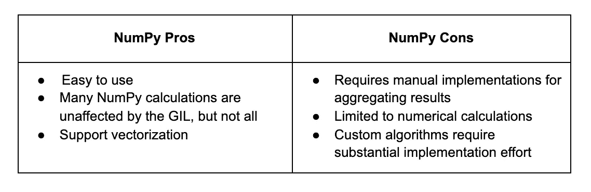

# IPython 并行

IPython shell 支持跨多个 IPython 实例的交互式并行和分布式计算。IPython Parallel(几乎)是和 IPython 一起开发的。当 IPython 更名为 Jupyter 时，他们将 IPython Parallel 拆分成自己的包。 [IPython Parallel](https://ipython.org/ipython-doc/3/parallel/parallel_intro.html) 有许多优点，但最大的优点可能是它支持交互式地开发、执行和监控并行应用程序。当使用 IPython Parallel 进行并行计算时，通常从 ipcluster 命令开始。

```
ipcluster start -n 10
```

最后一个参数控制要启动的引擎(节点)的数量。在[安装 ipyparallel Python 包](https://ipyparallel.readthedocs.io/en/latest/)后，上面的命令变为可用。下面是一个输出示例:


下一步是提供应该连接到 ipcluster 并启动并行作业的 Python 代码。幸运的是，IPython 为此提供了一个方便的 API。下面的[代码看起来像是基于池对象的基于进程的并行性:](https://gist.github.com/mGalarnyk/6dab23cc6485f145d2b148fc64d34b3c)

```
**import** math
**import** numpy **as** np
**from** timebudget **import** timebudget
**import** ipyparallel **as** ipp

iterations_count = round(1e7)

**def** **complex_operation**(input_index):
    print("Complex operation. Input index: {:2d}".format(input_index))

    [math.exp(i) * math.sinh(i) **for** i **in** [1] * iterations_count]

**def** **complex_operation_numpy**(input_index):
    print("Complex operation (numpy). Input index: {:2d}".format(input_index))

    data = np.ones(iterations_count)
    np.exp(data) * np.sinh(data)

@timebudget
**def** **run_complex_operations**(operation, input, pool):
    pool.map(operation, input)

client_ids = ipp.Client()
pool = client_ids[:]

input = range(10)
print('Without NumPy')
run_complex_operations(complex_operation, input, pool)
print('NumPy')
run_complex_operations(complex_operation_numpy, input, pool)
```

在终端的新选项卡中执行的上述代码产生如下所示的输出:

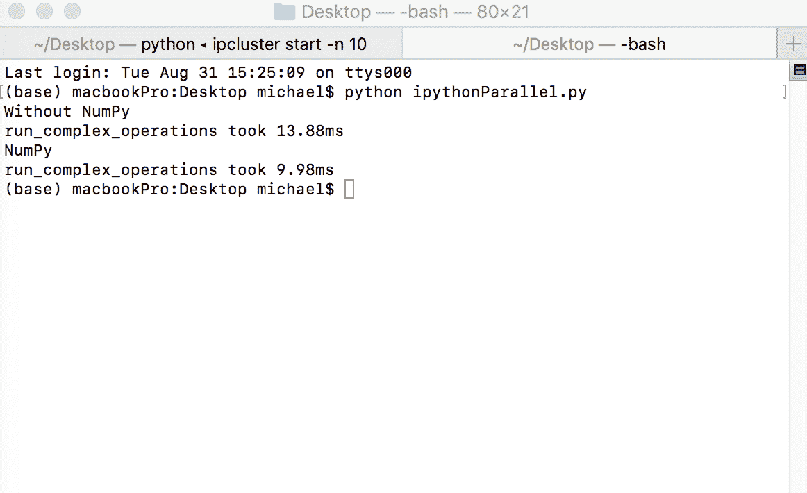

IPython Parallel 使用和不使用 NumPy 的执行时间分别为 13.88 ms 和 9.98 ms。请注意，标准输出中不包含日志，但是可以使用其他命令来访问它们。

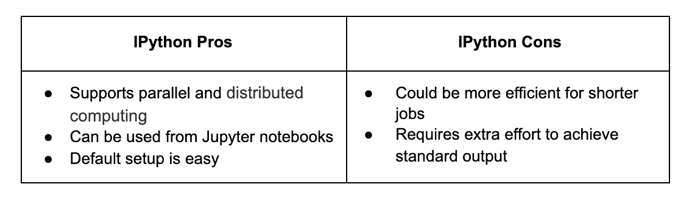

# 光线

和 IPython 并行一样， [Ray](https://docs.ray.io/en/master/index.html) 可以用于并行**和**分布式计算。Ray 是一个快速、简单的分布式执行框架，使您可以轻松扩展应用程序并利用最先进的机器学习库。使用 Ray，您可以将按顺序运行的 Python 代码转换成分布式应用程序，只需对代码进行最少的修改。

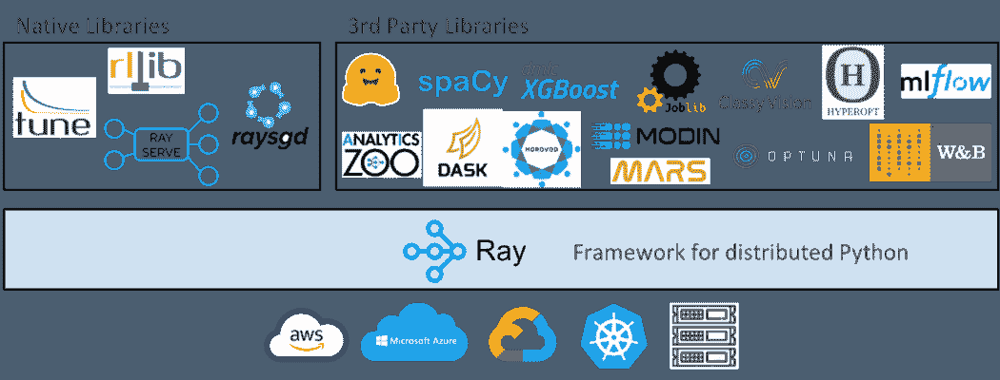

虽然本教程简要介绍了 Ray 如何简化普通 Python 代码的并行化，但需要注意的是，Ray 及其生态系统也简化了现有库的并行化，如 [scikit-learn](https://medium.com/distributed-computing-with-ray/how-to-speed-up-scikit-learn-model-training-aaf17e2d1e1) 、 [XGBoost](https://www.anyscale.com/blog/distributed-xgboost-training-with-ray) 、 [LightGBM](https://www.anyscale.com/blog/introducing-distributed-lightgbm-training-with-ray) 、 [PyTorch](https://medium.com/pytorch/getting-started-with-distributed-machine-learning-with-pytorch-and-ray-fd83c98fdead) 等等。图片由[迈克尔·加拉尼克](https://twitter.com/GalarnykMichael)

要使用射线，需要使用`ray.init()`来启动所有相关的射线过程。默认情况下，Ray 为每个 CPU 内核创建一个工作进程。如果您想在一个集群上运行 Ray，您需要传入一个类似 Ray . init(address = ' insertAddressHere ')的集群地址。

```
ray.init()
```

下一步是创建一个光线任务。这可以通过用`@ray.remote`装饰器装饰一个普通的 Python 函数来实现。这将创建一个任务，可以跨笔记本电脑的 CPU 内核(或 Ray cluster)进行调度。下面是之前创建的`complex_operation_numpy`的一个例子:

```
@ray.remote
**def** **complex_operation_numpy**(input_index):
   print("Complex operation (numpy). Input index: {:2d}".format(input_index))
   data = np.ones(iterations_count)
   np.exp(data) * np.sinh(data)
```

最后一步，在 ray 运行时中执行这些函数，如下所示:

```
@timebudget
**def** **run_complex_operations**(operation, input):
   ray.get([operation.remote(i) **for** i **in** input])
```

在执行[这个脚本](https://gist.github.com/mGalarnyk/30c8672620c8655a37940be935899a57)之后，您将得到类似于下面的输出:

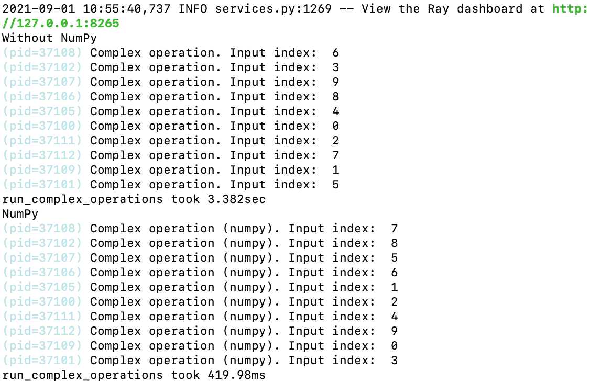

使用和不使用 NumPy 时，Ray 的执行时间分别为 3.382 秒和 419.98 毫秒。重要的是要记住，当执行长时间运行的任务时，Ray 的性能优势会更加明显，如下图所示。

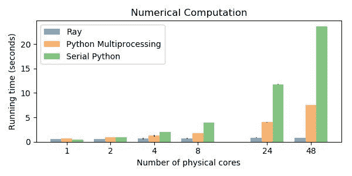

当运行更大的任务时，雷有更明显的优势[(图片来源)](/10x-faster-parallel-python-without-python-multiprocessing-e5017c93cce1)

如果你想了解 Ray 的语法，这里有一个介绍性的教程。

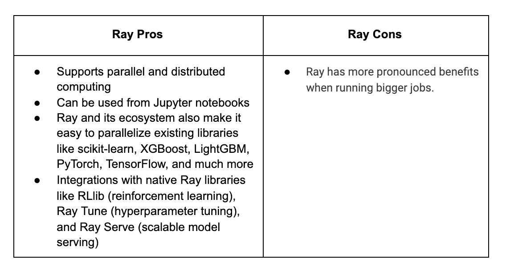

# 替代 Python 实现

最后一个考虑是，您可以使用其他 Python 实现来应用多线程。例子包括 IronPython。NET 和 Jython for Java。在这种情况下，您可以使用底层框架的低级线程支持。如果您已经有了使用的多处理功能的经验，这种方法会很有用。NET 或者 Java。

# 结论

本文通过代码示例回顾了并行化 Python 的常用方法，并强调了它们的优缺点。我们使用简单数字数据的基准进行测试。重要的是要记住，并行化的代码通常会带来一些开销，并行化的好处在较大的任务中会更加明显，而不是本教程中的短时间计算。

请记住，并行化对于其他应用程序来说可能更加强大。尤其是在处理典型的基于人工智能的任务时，在这些任务中，您必须对您的模型进行重复的微调。在这种情况下， [Ray](https://github.com/ray-project/ray) 提供了最好的支持，因为它拥有丰富的生态系统、自动伸缩、容错和使用远程机器的能力。

*最初发表于*[*https://www.anyscale.com*](https://www.anyscale.com/blog/parallelizing-python-code)*。*