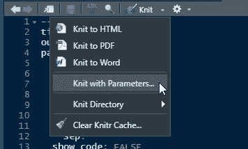
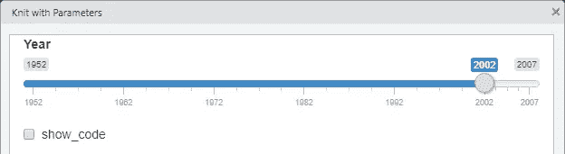
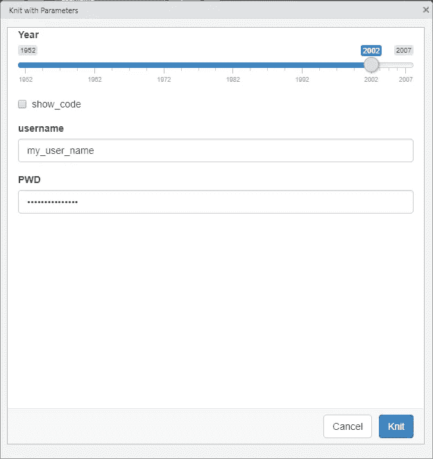

# R 降价的灵活报告

> 原文：<https://towardsdatascience.com/parameters-in-r-markdown-ade0cfac0c9b?source=collection_archive---------12----------------------->

## 教程| R | R 降价参数

## 使用参数进行快速重现性分析


由[米歇尔·利奇](https://unsplash.com/@mitchellleach?utm_source=medium&utm_medium=referral)在 [Unsplash](https://unsplash.com?utm_source=medium&utm_medium=referral) 上拍摄的照片

我们都参加过这样的会议，有人会问，“你能在不同的时间段再运行一次那个分析吗”，或者，“你能为 B 组而不是 A 组运行它吗”，或者，“你能把那个分析发给我吗，这样我就可以摆弄它了。”

当我们试图满足这些要求时，经常会遇到一些问题。改变一个分析的来源可能是困难的，无论它是来自一个。csv 到另一个或从测试数据库到生产数据库。如果要导入的连接或文件是在多个地方定义的，那么很容易遗漏其中一个并产生无效的输出。当将分析从 A 组切换到 B 组或改变分析数据的时间范围时，我们会遇到同样的问题。可能是多个过滤器都需要更换。

给出一个分析也是很麻烦的。当处理一些特别的分析时，通常会在代码中留下数据库密码，同时处理分析的细节。给出 R Markdown 文件或将它放在共享网络驱动器上会引起安全问题。虽然 dotenv 是一个选项，但它需要更多的设置才能正常工作。

[](/using-dotenv-to-hide-sensitive-information-in-r-8b878fa72020) [## 用 dotenv 隐藏 R 中的敏感信息

### 隐藏您的密码和 API 令牌，使您的共享代码更加安全

towardsdatascience.com](/using-dotenv-to-hide-sensitive-information-in-r-8b878fa72020) 

幸运的是，R Markdown 有一个名为 parameters 的特性，可以解决所有这些问题。

# 硬编码参数

R Markdown 文档中的参数使用起来非常简单。在 yaml 头(markdown 文档顶部的部分)中，您只需为您的参数添加几个新行来硬编码它们。一旦它们被编码，它们将在`params`对象中可用，以用于剩余的分析。通过引用 yaml 头中的参数，需要对它们进行的任何更新只需要一次更改。

对于这个例子，我们将查看 gapminder 数据集。这是一个可从`gapminder`包中获得的数据集。它有一个由 Gapminder 基金会收集的指标子集。查看汉斯·罗斯林(Gapminder 创始人之一)的 [TED 演讲](https://www.ted.com/talks/hans_rosling_the_best_stats_you_ve_ever_seen?referrer=playlist-the_best_hans_rosling_talks_yo)，或者 [Gapminder 网站](https://www.gapminder.org/about/about-gapminder/history/)了解更多信息。

```
# Setup
# install.packages("gapminder")
library(gapminder)# The data frame
gapminder
```

`gapminder`数据集包含 6 个变量:国家、洲、年、lifeExp(预期寿命)、pop(人口)和 gdpPercap(**g**Ross**d**omestic**p**人均产品)。

## 代码块中的参数

我们将从过滤 2002 年的数据框架开始。使用`tidyverse`，代码看起来像这样:

```
library(tidyverse)gapminder %>%
    filter(year == **2002**) %>%
    head()
```

我们可能希望在不同的年份运行此报告，使之成为创建参数的良好候选。在我们的 yaml 头中，我们将添加另一个名为`params`的项目，在它下面，前面有两个空格，我们将创建一个`year`参数。当运行 R Markdown 时，将创建一个`params`对象，并且命名的参数可供我们使用。

```
---
title: "Hardcoded Parameters"
author: "RealDrewData"
date: "7/6/2021"
output: html_document
**params:
  year: 2002**
---
```

现在我们可以回到我们的过滤代码。我们将用刚刚创建的 year 参数替换 2002。

```
library(tidyverse)gapminder %>%
 filter(year == **params$year**) %>%
 head()
```

我们还可以在代码中的其他地方使用 year 参数，比如一个绘图中的标签。让我们创建一个散点图，x 轴为人均 GDP，y 轴为预期寿命，人口为点的大小，大陆为颜色。在我们的标签中，我们可以使用`paste()`函数和我们的`params$year`来构建一个用参数更新的图的标题。

```
gapminder %>%
    filter(year == **params$year**) %>%
    ggplot(aes(x = gdpPercap, y = lifeExp, size = pop, color = continent)) +
    geom_point() +
    labs(title = paste("Life Expectancy and GDP for", **params$year**), x = "GPD Per Capita", y = "Life Expectancy")
```

## 降价部分中的参数

减价区是我们有纯文本的地方。我们可以内联运行代码来返回值，并让它们显示在输出文本中。例如，我们可能有一个部分标题，上面写着:

```
## Gapminder Analysis for 2002
```

当我们改变参数时，这不会更新。为了纠正这一点，我们可以使用内联代码从`params`对象中获取年份。`r`是说我们将使用 R 代码。在编织文档时，这将与前面的代码完全相同，假设`year`参数仍然设置为 2002。

```
## Gapminder Analysis for **'r params$year'**
```

## 参数的其他常见用途

参数不一定是数字，也可以是布尔值。一个常见的例子是创建开关来修改减价编织时的行为。一个例子是是否在最终输出中打印代码。当向经理或执行官展示某些东西时，您可能不想看到代码，但是当与团队一起评审时，代码可能更重要。

[](/storing-data-in-r-data-types-d0fa076ba5ad) [## 在 R 中存储数据:数据类型

### R 中数据科学的构建块

towardsdatascience.com](/storing-data-in-r-data-types-d0fa076ba5ad) 

为此，我们将在 year 下创建另一个参数:`show_code`。

```
---
title: "Hardcoded Parameters"
author: "RealDrewData"
date: "6/19/2021"
output: html_document
params:
  year: 2002
  **show_code: FALSE**
---
```

通常在设置中定义大块编织选项。在我们的例子中，我们希望将`echo`选项设置为等于`show_code`。因为我们将这个设置为`FALSE`，这将阻止我们的代码出现在最终输出中。

```
knitr::opts_chunk$set(**echo = params$show_code**)
```

# 动态参数

Markdown 中的硬编码参数显然增加了一些主要的好处。如果不熟悉 Markdown 的人想要修改报告，或者您想要快速重新运行不同的时间段，该怎么办？动态参数在这里会很有帮助。

对于`gapminder`数据框，可用数据中存在一些细微差别。数据框中每 5 年一次，从 1952 年开始，到 2007 年结束。对于不知道数据的人来说，他们可以很容易地将参数更改为 1953 年，当没有数据显示时，他们会非常困惑。要改变这一点，我们可以通过修改 yaml 头中的`year`参数来添加自定义提示。

我们将在 year 下添加另一个子级别，使用我们想要的设置。在本例中，我们希望标签名为 year，默认值为 2002，输入为 slider。我们还可以指定最小值和最大值，以及每个值之间有多少步。

```
---
title: "Dynamic Parameters"
author: "RealDrewData"
date: "6/19/2021"
output: html_document
params:
 **year:
    label: "Year"
    value: 2002
    input: slider
    min: 1952
    max: 2007
    step: 5
    sep: ""**
  show_code: FALSE
```

要显示提示，请单击针织按钮旁边的箭头。点击带参数的针织。



作者图片

这将弹出一个窗口，带有一个标有年份的滑块。这个滑块将有我们上面设置的限制。将滑块滑动到 1977 年并单击 knit 与更改 yaml 标题中的 year 值是一样的。额外的好处是，我们知道输入将是正确的类型，我们可以限制可以选择的选项，以确保数据出现在最终输出上。

您还会注意到为`show_code`参数创建了一个复选框输入。这是布尔参数的默认值。



作者图片

## 其他输入类型

同样，我们不仅限于数字和布尔类型。如果我调用了一个数据库，其中的代码需要用户名和密码，我们也可以为它们创建参数。

用户名可以是文本字段。该输入由`text`输入表示。`value`是默认值，在本例中为空。`placeholder`是文本框空白时显示的文字。对于密码输入，我们可以使用文本输入的`password`变体。这将使输入的文本变得模糊，就像你登录一个网站一样。

```
---
title: "Dynamic Parameters"
author: "RealDrewData"
date: "6/19/2021"
output: html_document
params:
  year:
    label: "Year"
    value: 2002
    input: slider
    min: 1952
    max: 2007
    step: 5
    sep: ""
  show_code: FALSE
  username:
    label: "username"
    value: ""
    input: text
    placeholder: "username"
  password:
    label: "PWD"
    value: ""
    input: password
    placeholder: "password"
---
```

当我们单击“带参数的编织”时，我们现在会看到一个文本框输入和一个密码输入。这绝不是最佳实践，但它为您提供了一个使用动态参数的示例。



作者图片

您可以使用许多其他输入选项来设置参数。更全面的列表可以在[闪亮小工具图库](https://shiny.rstudio.com/gallery/widget-gallery.html)中找到。

# 结论

在 R Markdown 中，参数有多种用途。它们允许您在文档中进行影响整个文档的单个更改。它们使得为不同的时间段运行相同的报告或者为不同的受众运行相同的报告变得容易。他们还可以帮助与他人共享分析，但是对于这个特殊的用例可能有更好的选择。

*   R Markdown:权威指南，作者:*谢一辉，J. J. Allaire，Garrett Grolemund。由 RStudio 团队成员撰写，涵盖了你想知道的关于 R Markdown 的一切。此处* *可在线免费下载* [*，但您也可以*](https://bookdown.org/yihui/rmarkdown/parameterized-reports.html) [*购买硬拷贝*](https://www.amazon.com/dp/1138359335/ref=cm_sw_r_tw_dp_76F016PXGSF7ZME9XC7X)
*   [闪亮小部件图库](https://shiny.rstudio.com/gallery/widget-gallery.html):所有闪亮小部件的交互示例，可用于动态设置 R Markdown 文档中的参数。
*   [汉斯·罗斯林 TED 演讲](https://www.ted.com/talks/hans_rosling_the_best_stats_you_ve_ever_seen?referrer=playlist-the_best_hans_rosling_talks_yo):汉斯·罗斯林是 Gapminder 基金会的创始人之一。这个 TED 演讲给出了一些例子中使用的数据的背景。它总是让我兴奋起来，并准备做一些数据分析！

[](https://realdrewdata.medium.com/membership) [## 通过我的推荐链接加入 Medium-Drew Seewald

### 作为一个媒体会员，你的会员费的一部分会给你阅读的作家，你可以完全接触到每一个故事…

realdrewdata.medium.com](https://realdrewdata.medium.com/membership) [](/r-is-slow-and-its-your-fault-2fcedacc7abb) [## r 慢——都是你的错！

### 了解您的工具对您的成功至关重要

towardsdatascience.com](/r-is-slow-and-its-your-fault-2fcedacc7abb)