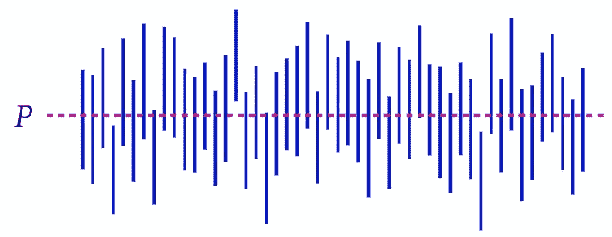
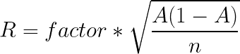
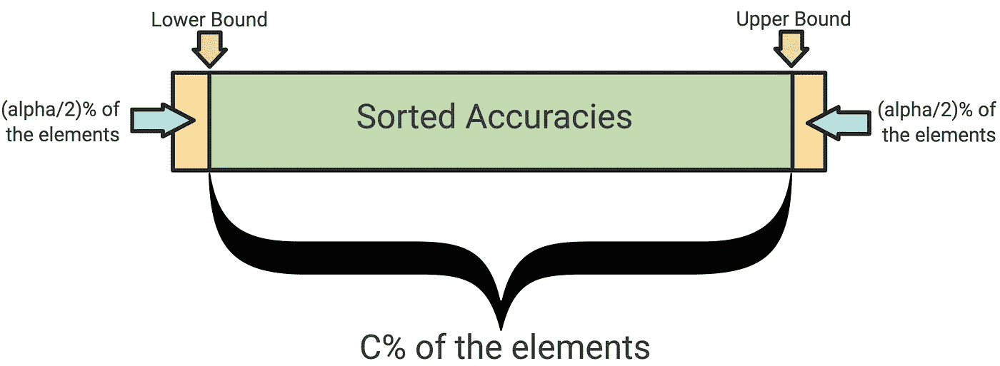

# 机器学习的参数和非参数置信区间估计，3 行代码。

> 原文：<https://towardsdatascience.com/parametric-and-non-parametric-confidence-interval-estimation-for-machine-learning-in-3-lines-of-f35e49c73ef3?source=collection_archive---------21----------------------->

## 学习如何像专家一样报告结果。

[Edit 11/01/2021]添加了更好的定义，并根据 [AlexMurphy](https://medium.com/@murphyalex?source=responses-----f35e49c73ef3----0----------------------------) 的有益建议调整了第 1 节中的示例。

在报告机器学习模型的结果时，置信区间是提供有用信息的一个很好的工具。它们是评估模型可靠性的一种简单直接的方法。

在这篇文章中，我将简要介绍置信区间，并介绍[confidence _ interval _ estimator _ ML](https://pypi.org/project/confidence-interval-estimator-ML/)，这是一个工具，它可以让您用几行代码来估计机器学习模型的参数和非参数置信区间。

以下是这篇文章的结构:

1.  举例介绍置信区间。
2.  关于置信区间的隐藏假设。
3.  什么是参数置信区间。
4.  什么是非参数置信区间？
5.  如何使用 Confidence _ interval _ estimator _ ML 计算参数和非参数置信区间？


照片由[汉斯-彼得·高斯特](https://unsplash.com/@sloppyperfectionist?utm_source=unsplash&utm_medium=referral&utm_content=creditCopyText)在 [Unsplash](https://unsplash.com/?utm_source=unsplash&utm_medium=referral&utm_content=creditCopyText) 拍摄

# 1.举例介绍置信区间。

意译[维基百科](https://en.wikipedia.org/wiki/Confidence_interval#Meaning_and_interpretation)，置信区间表示未知参数 *p* 的似是而非的值的范围，相关的置信度表示真实的 *p* 包含在该范围内的置信程度。

在机器学习的背景下，通常相对于模型的性能，特别是相对于分类模型的准确性来估计置信区间。

给定一个旨在测量参数 *p* (在我们的情况下是模型的精度)的实验，具有相关置信度 *C%* 的置信区间 *I* 可以解释如下:如果实验重复 *N* 次，在 *C* 中，结果 *p* 的%将在区间*I*内

尽管这样做很有诱惑力，但从技术上讲，置信度不能被解释为概率，这将在下一节讨论。



95%置信区间的解释。演员表:[维基百科](https://en.wikipedia.org/wiki/Confidence_interval)。

以在 EMNLP2020 上发表的 [KERMIT 论文](https://cntr.click/xwX9qVB)为例，作者声明他们的模型在 Yelp Polarity 数据集上的准确率为 85.91( 0.03) %，置信度为 95%。

根据这个结果，通过在 Yelp 极性数据集上从头开始重新运行模型训练和评估 100 次(并且每次都改变随机种子)，我们可以预计 95 倍的准确性将在范围[85.88，85.94]内。置信度很高(95%)且区间相对较窄的事实表明，在给定的条件下，KERMIT 模型相当稳健！

# 2.关于置信区间的隐藏假设。

在计算统计数据时，总会有一些隐藏的假设，但这些假设对结果有很大的影响。在置信区间的情况下，特别是在机器学习的背景下，在我看来，有两个主要的假设可能是至关重要的:数据的正态性和置信度的解释。

关于数据的正态性，假设数据样本来自正态分布，因此方差与均值无关。这种假设是有问题的，因为数据的分布通常是未知的。

现在，假设您想要估计数据集 *D* 上模型 *M* 的精确度的置信区间，您不仅需要知道 *D* 的分布，还需要知道该分布是高斯分布。幸运的是，[中心极限定理](https://en.wikipedia.org/wiki/Central_limit_theorem)派上了用场，它证明了如果样本量足够大，数据分布趋于正态分布。这里*大*的定义取决于几个因素，但是 30 通常被认为是用于模型评估的数据样本大小的一个很好的阈值。一般来说，正如数据科学中经常出现的情况，数据越多越好。

关于置信度的解释，通常隐含地假设置信度代表真值 *p* 落入置信区间 *I* 的概率。这实际上是错误的，因为置信度指的是估计过程的可靠性，正如在这个[维基百科章节](https://en.wikipedia.org/wiki/Confidence_interval#Misunderstandings)中广泛讨论的。无论如何，从实践的角度来看，置信区间*可以被理解为对总体参数的似是而非的值的估计。*

# 3.什么是参数置信区间

参数估计是一种以封闭形式估计置信区间的方法，甚至可以从模型的单个结果中进行估计。通过参数估计计算置信区间的公式如下:



其中 *A* 是模型的精确度， *N* 表示计算 *A* 的样本大小，*因子*是由置信度和样本大小决定的常数。*因子*的目的是确定间隔有多宽。一般来说，置信度越高，区间越宽。该常数的来源取决于样本大小，稍后将予以说明。

值 *R* 代表区间的*范围*，因此区间将由*I =【A-R，B+R】表示。*

如第 2 点所述，参数估计假设数据样本来自正态分布。即使你不知道数据的分布，如果样本量大于 30，由于中心极限定理，这不是问题。在这种情况下，*因子*参数将是与期望置信度相关联的 [*z 值*](http://www.ltcconline.net/greenl/courses/201/estimation/smallConfLevelTable.htm) 。

如果您的样本量小于 30，那么通常的做法是假设数据来自自由度为 *sample_size-1* 的 t-student 分布。在不涉及太多细节的情况下，这个假设导致了更宽的置信区间，因为小样本量提供了额外的不确定性。在这种情况下，*因子*参数将是与具有 *N-1 个*自由度和指定置信度的*t-学生*分布相关联的 [*t 分数*](http://www.ttable.org/) 。

# 4.什么是非参数置信区间

非参数置信区间估计是一种根据经验估计置信区间的方法。这种方法有几个其他的名字:Bootstrap 置信区间估计，Monte Carlo 置信区间估计，或简单的经验置信区间估计，但它们都表明同样的事情。

为了估计模型 *M* 在数据集 *D* 上的准确性的非参数置信区间，该模型在 *D* 的样本上被训练和测试多次。这是执行估算的算法:

1.  数据集 *D* 被采样 *N* 次以获得 *N* 个数据集 *Di* 。这种取样通常在更换时进行。
2.  每个样品 *Di* 被分成两个独立的组 *Di_train* 和 *Di_test。*
3.  对于每个 *Di* ，生成模型的一个实例 *Mi* 。通过在 *Di_train* 上进行训练和在 *Di_test* 上进行测试，在相应的数据样本上对每个实例 *Mi* 进行评估。让我们用 *A* 来表示测试精度列表。
4.  测试精度列表 *A* 已排序。
5.  让我们用 *C* 来表示期望的置信水平；如果我们希望 c.i .有 95%的置信度， *C* 将被设置为 95。让我们用*α*来表示值 100- *C* 。如果期望的置信水平是 *C* =95，*alpha*= 100–95 = 5。
6.  置信区间的下限由 *A* 的 *alpha* /2- *th* 百分位给出，而置信区间的上限由*C*+(*alpha*/2)-*th*百分位给出。
7.  我们可以说，数据集 *D* 上的模型 *M* 的置信区间为*下界*，*上界*，置信程度为 *C* %。

直观地说，我们希望使用 lower_bound 和 upper_bound，以便它们覆盖 *A* 的 *C* %的元素，如下图所示。



Bootstrap 置信区间图解。图片由作者提供。

这种计算置信区间的方式挑战了我们在本文第二点中讨论的两个假设。这就是为什么当非参数地计算置信区间时，拥有一个大的数据集和使用大量的迭代来执行估计是至关重要的。

# 5.如何使用 confidence _ interval _ estimator _ ML 计算参数和非参数置信区间？

至此，您应该对置信区间的参数和非参数估计的工作原理有了一个清晰的概念，所以我将介绍[confidence _ interval _ estimator _ ML](https://github.com/GiovanniCiampi/confidence_interval_estimator_ML)，这是一个 Python 工具，它将使估计过程非常简单明了。

通过命令行中的 pip 很容易安装该工具:

```
> pip install confidence_interval_estimator_ML
```

现在，执行估算非常简单:对于参数化的情况，您只需导入库并运行一行代码，如下例所示:

在给出的示例中，使用的样本大小大于 30，这就是函数指定假设数据是从正态分布中采样的原因。

非参数情况稍微复杂一些，因为您可能需要为要执行的估计指定一些参数。无论如何，这是在两行代码内完成的:

第一行执行第 4 点提出的算法的前三个步骤(它针对指定的迭代次数训练和验证模型的实例)，而第二行执行剩余的四个点(计算置信区间的界限)。

第一个函数 *get_accuracy_samples* 采用几个输入参数:

*   *get_classifier_instance* 是一个通过调用返回模型新实例的函数。返回的模型必须提供*拟合*和*预测*方法。每次迭代都会创建一个新的模型实例。
*   *model_params_dict* 是一个可选参数，允许您指定要传递给模型构造函数的参数。
*   *X* 和 *y* 分别代表模型的输入和目标。
*   *sample_ratio* 表示从 *(X，y)开始每次迭代抽取的样本大小。*举例来说，如果 *(X，y)* 有 1000 个数据点，并且**sample _ ratio*被设置为 0.70，则在每次迭代时，将从 *(X，y)采样 700 个数据点的数据集。**
*   **train_ratio* 指定在每次迭代中用于模型训练和测试的采样数据集的比率。按照前一点的示例，如果 *(X，y)* 具有 1000 个数据点，并且 *sample_ratio=0.70，*则在每次迭代中，将对 700 个数据点的数据集进行采样。如果 *train_ratio=0.80，560 个*数据点将用于训练模型，而剩余的 140 个将用于评估(计算测试精度)。*

*下面的代码提供了一个更详细的模块用法示例。*

*这些方法提供了其他参数和用例，为了简洁起见，这里没有讨论这些参数和用例。如果你想探索 confidence _ interval _ estimator _ ML 模块提供的所有可能性，或者你只是需要更多的细节来执行你的估计，你可以查看这个 [Google Colab 笔记本](https://colab.research.google.com/drive/16EwUmq9NBiytpS6JoN22l7zDqzqTb_-w?usp=sharing)，或者只是查看提供代码和文档的 [GitHub repo](https://github.com/GiovanniCiampi/confidence_interval_estimator_ML) 。*

# ***参考资料和进一步阅读**:*

1.  *[https://OCW . MIT . edu/courses/mathematics/18-05-introduction-to-probability and-statistics-spring-2014/readings/MIT 18 _ 05s 14 _ reading 24 . pdf](https://ocw.mit.edu/courses/mathematics/18-05-introduction-to-probability-and-statistics-spring-2014/readings/MIT18_05S14_Reading24.pdf)*
2.  *[https://SPH web . bumc . bu . edu/otlt/MPH-Modules/ph 717-quant core/ph 717-module 6-random error/ph 717-module 6-random error 11 . html](https://sphweb.bumc.bu.edu/otlt/MPH-Modules/PH717-QuantCore/PH717-Module6-RandomError/PH717-Module6-RandomError11.html)*
3.  *[https://machine learning mastery . com/report-classifier-performance-confidence-intervals/](https://machinelearningmastery.com/report-classifier-performance-confidence-intervals/)*
4.  *https://machine learning mastery . com/confidence-intervals-for-machine-learning/#:~:text = Much % 20 of % 20 machine % 20 learning % 20 涉及% 20 不确定性% 20of % 20an %估计值。&text = That % 20a % 20 置信度% 20 区间%20is，估计% 20a % 20 总体% 20 参数。*
5.  *[http://www2 . stat . duke . edu/~ ar 182/RR/examples-gallery/bootstrapconfidenceintervals . html](http://www2.stat.duke.edu/~ar182/rr/examples-gallery/BootstrapConfidenceIntervals.html)*

*如果你喜欢这篇文章，请随时联系 Linkedin ！*