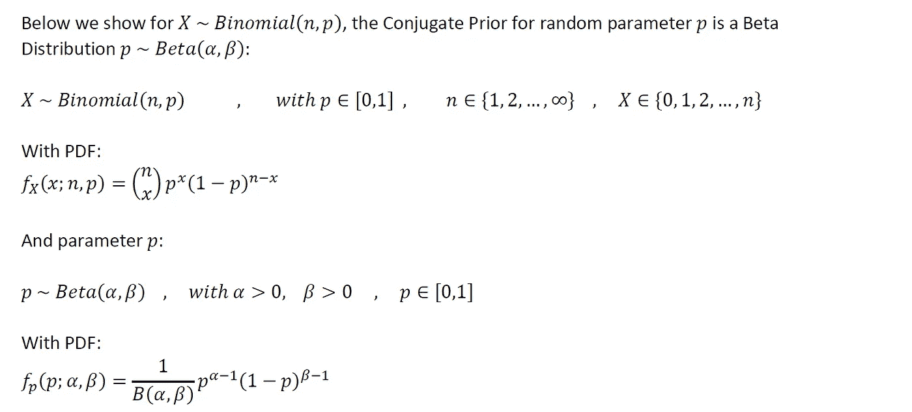
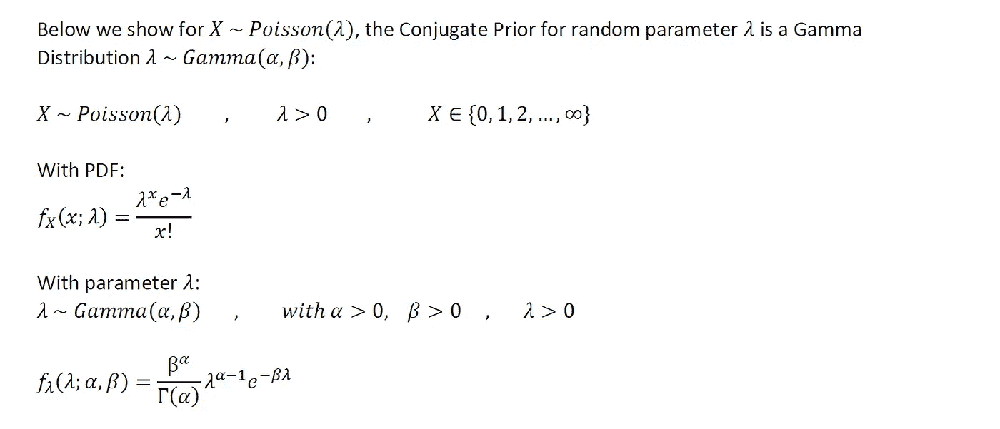

# 参数贝叶斯推理:数字抽样技术的实现与证明

> 原文：<https://towardsdatascience.com/parametric-bayesian-inference-implementation-of-numerical-sampling-techniques-with-proofs-d802e8c05b6d?source=collection_archive---------31----------------------->

## **接受/拒绝采样& MCMC Metropolis-Hastings 全计算模拟采样**

由[克里斯托弗·高尔](https://unsplash.com/@cgower?utm_source=medium&utm_medium=referral)在 [Unsplash](https://unsplash.com?utm_source=medium&utm_medium=referral) 上拍摄的照片

# 1:介绍和动机

在参数贝叶斯推理中，我们的目标是恢复感兴趣的参数的后验分布。通过“恢复”分布，这或者是指恢复后验分布的封闭解析形式(PDF、CDF、MGF 等)，或者是一种从后验分布中根据经验抽取样本的方法，之后可以根据经验进行数值构建。

作者图片

从上面我们可以看到，后验概率密度函数与概率密度函数乘以先验概率密度函数成正比:

作者图片

在此基础上，让我们再次看看后验概率密度函数的完整方程:

作者图片

挑战在于，即使我们有了可能性和先验的封闭形式表示，也很难整合分母。

在上面的术语中，分母中的积分是参数贝叶斯推理中的真正挑战。问题是，我们如何绕过这个积分问题，并且仍然恢复我们的后验分布？有分析方法和数值方法，我们可以避开这个积分问题；这些方法正是这篇文章将要讨论的内容，特别强调数值方法部分，以及探索这些技术的完整的计算模拟。

这篇文章的目录如下:

作者图片

说到这里，让我们开始吧！

# **2:分析方法:共轭先验**

解决积分问题的第一个策略是利用共轭先验作为θ上先验分布的选择。

假设我们感兴趣的是在给定观察数据的情况下恢复感兴趣的随机参数θ的后验分布。给定θ的性质和从中指定观察数据的分布的性质(其指示似然函数)，这个特定的θ可以具有“共轭先验”。共轭先验是一个特殊的分布族，通过它，如果先验被指定为属于这个参数族，那么在数学上保证后验将属于这个相同的分布族。

作者图片

通过这种方法，我们避免了在贝叶斯定理中直接积分分母，因为我们已经知道后验概率所属的分布族。

下面，我们提供证明，共轭先验为:

作者图片

## **二项分布随机变量的共轭先验:**

作者图片

上述声明的证明:

作者图片

## **泊松分布随机变量的共轭先验:**

作者图片

上述声明的证明:

作者图片

# 3:数值抽样方法

在*的第 2 节*中，我们介绍了共轭先验，这是一种分析策略，可以避开贝叶斯推理问题的贝叶斯定理分母中难以处理的积分。在个人计算和强大的科学计算软件开发之前，共轭先验在很长一段时间内是规避这个“棘手的积分”问题的唯一策略。

但是，假设我们现在有计算机来利用数值方法，也许有一种数值技术我可以用来恢复后验分布(而不是分析技术)？答案是肯定的，这也是我们在这一部分要解决的问题。

让我们通过贝叶斯定理再次看看我们对后验分布的定义:

作者图片

注意分母中的积分:

作者图片

这一项是观察数据 x 的边缘分布。换句话说，这个“分布”只是一个经验值，即一个标准化常数。这个归一化常数的目的是什么？好吧，回想一下后验需要一个有效的概率密度函数(PDF)。为了成为一个有效的 PDF，当在整个支持面上积分时，后验概率必须等于 1。因此，观察数据 X 的边缘分布充当归一化常数，其确保乘以先验的可能性被缩放为有效的 PDF。

作者图片

在第 2 节的*中，我们讨论了如何通过利用共轭先验来解析恢复后验概率。我们现在要讨论数值方法。*

假设我们没有后验概率的封闭解，但是我们有能力从中提取样本。假设我们从后面随机抽取一个样本，放在一边。然后另一个随机样本，另一个，另一个，把它们都放在一边。我们重复这个过程很多次，直到我们从后验样本中抽取了足够大的一组 ***m*** 样本。即使我们没有后验概率的封闭形式的解析解，如果我们把样本简单地绘制成直方图会怎么样呢？结果将是后验概率密度函数的经验重建！这实际上是“恢复”后验分布的一种形式。

关键还在于认识到，在收集样本后，为了根据经验构建后验概率直方图，我们需要通过经验归一化常数来调整数据。这个归一化常数将是 ***1/m*** ，其中 ***m*** 再次是我们抽取的样本数。因此，假设我们已经通过我们的经验归一化常数 ***1/m*** 归一化了我们的样本，我们不需要从后验本身抽取样本！相反，我们只需要从与后验相乘成比例的东西中抽取样本，即后验的核 ***k(theta)*** 。这种情况下的核 ***k(theta)*** 是来自贝叶斯定理的分子。

同样，后验概率的核只相当于贝叶斯定理中的分子。因此，我们有一个通用的技术，允许我们完全忽略分母和讨厌的积分！

## 3.1: **接受/拒绝抽样**

作者图片

作者图片

让我们证明上述公式是有效的:

作者图片

## 3.2:马尔可夫链蒙特卡罗(MCMC): Metropolis-Hastings 抽样

作者图片

作者图片

作者图片

作者图片

# 4:计算模拟

python 为接受/拒绝采样和 MCMC Metropolis-Hastings 提供了计算模拟。

我们从导入所需的库开始:

指定函数来模拟我们的数据集。具体地说，是由三种高斯分布混合而成的后验分布。

以及用于接受/拒绝采样和 MCMC Metropolis-Hastings 采样的函数。

现在，我们返回模拟数据集的“真实”后验分布:

接下来，我们进行接受/拒绝采样，从数值上恢复后验分布:

最后，我们进行 MCMC Metropolis-Hastings 采样，从数值上恢复后验分布:

从上面的结果可以看出，接受/拒绝抽样和 MCMC Metropolis-Hastings 在恢复“真实的”后验分布方面表现良好。

以上计算模拟的完整代码/笔记本，请看下面的 [**github 链接**](https://github.com/atrothman/Parametric_Bayesian_Inference-) 。

# 5:总结和结论

希望以上有见地。正如我在以前的一些文章中提到的，我认为没有足够的人花时间去做这些类型的练习。对我来说，这种基于理论的洞察力让我在实践中更容易使用方法。我个人的目标是鼓励该领域的其他人采取类似的方法。以后我会继续写类似的作品。请 [**订阅并关注我在**](https://anr248.medium.com/) 和 [**LinkedIn**](http://www.linkedin.com/in/andrew-rothman-49739630) 上的更新！