# 参数检验——t 检验

> 原文：<https://towardsdatascience.com/parametric-tests-the-t-test-c9b17faabfb0?source=collection_archive---------0----------------------->

## 假设检验

## t 测试的一站式商店——从理论到 python 实现


[GR Stocks](https://unsplash.com/@grstocks?utm_source=medium&utm_medium=referral) 在 [Unsplash](https://unsplash.com?utm_source=medium&utm_medium=referral) 上拍照

[在我之前的文章](https://medium.com/@shubhangihora/understanding-hypothesis-testing-65f9b3e9ab1f)中，我们讨论了假设检验的内容、方法和原因，并简要介绍了统计检验以及它们在帮助我们确定统计显著性方面的作用。在这篇文章和接下来的几篇文章中，我们将深入探讨统计测试——不同类型的测试、测试本身以及哪种测试应该用于哪种情况。

如前所述，统计测试是**统计方法，帮助我们拒绝或不拒绝我们的零假设**。它们基于概率分布，可以是单尾或双尾的，取决于我们选择的假设。

统计检验还有其他不同的方式，其中之一是基于他们对数据遵循的概率分布的假设。

*   **参数测试**是那些统计测试，其中**假设数据近似遵循正态分布**，以及其他假设(示例包括 z 测试、t 测试、ANOVA)。*重要提示—假设总体数据遵循正态分布，而不是您正在处理的样本数据。*
*   **非参数检验**是那些**没有对数据**的分布做任何假设的统计检验，因此也被称为无分布检验(例子包括卡方检验、曼-惠特尼 U 检验)。非参数检验基于不同数据点的等级。

每一个参数测试都有一个等价的非参数测试，这意味着对于你遇到的每一种类型的问题，在这两个类别中都会有一个测试来帮助你。

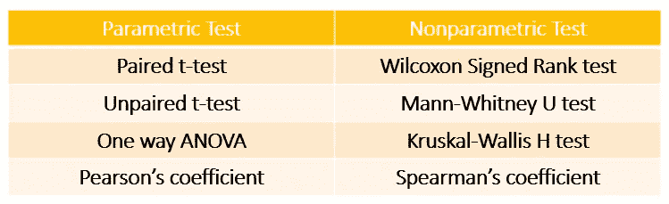

作者图片

然而，选择哪一套测试适合手头的问题并不是非黑即白的。如果您的数据不符合正态分布，非参数检验不一定是正确的选择。该决定取决于其他因素，如样本大小、您所拥有的数据类型、什么样的集中趋势度量最能代表数据等。如果样本量足够大，某些参数测试在非正态数据上表现很好，例如，如果样本量大于 20，并且数据不是正态的，那么单样本 t 检验仍然会对您有益。但是，如果中位数更好地代表了您的数据，那么您最好使用非参数检验。

在本文中，我们将关注参数测试——尤其是 t-测试。

> 参数检验是指假设样本数据来自一个服从概率分布(正态分布)的总体，并带有一组固定的参数。

常见的参数检验侧重于分析和比较数据的均值或方差。

平均值是描述数据集中趋势的最常用度量，但是它也受到异常值的严重影响。因此，分析您的数据并确定平均值是否是表示数据的最佳方式非常重要。如果是，那么参数测试是正确的方法！如果不是，并且中位数更好地代表了您的数据，那么非参数检验可能是更好的选择。

如上所述，参数测试有几个数据需要满足的假设:

1.  **正态性** —样本数据来自近似服从正态分布的总体
2.  **方差齐性** —样本数据来自具有相同方差的总体
3.  **独立性** —样本数据由独立的观察值组成，并且是随机抽样的
4.  **异常值** —样本数据不包含任何极端异常值

# 自由度。

在我们进入不同的统计测试之前，有一个重要的概念需要讨论——自由度。

> 自由度本质上是在测量统计参数时一组数据中可能变化的独立值的数量。

假设你喜欢每周六出门，你刚买了四套新衣服。你想每个周末都穿一套新衣服。在第一个星期六，四套衣服都没穿过，所以你可以挑任何一套。下周六你可以从三个中挑选，第三个周六你可以从两个中挑选。然而，在这个月的最后一个周六，你只剩下一套衣服，不管你想不想穿，你都必须穿，而在其他周六，你可以选择。

所以基本上，你有 4–1 = 3 个周六的时间自由选择服装——你的服装可以变化。

这就是自由度背后的思想。

关于数值和平均值，数值的总和必须等于样本量乘以平均值，即总和= n *平均值，其中 n 是样本量。因此，如果样本大小为 20，平均值为 40，则样本中所有观察值的总和必须为 800。前 19 个值可以是任何值，但是第 20 个值必须确保所有值的总和为 800，因此它没有变化的自由。因此自由度是 19。

自由度的公式是样本大小——您测量的参数数量。

# 比较意味着。

如果你想**比较两组的平均值**，那么可以选择的正确测试是 **z 测试和 t 测试。**

**单样本(单样本 z 检验或单样本 t 检验):**一组为样本，二组为总体。所以你基本上是在比较一个样本和总体的标准值。我们基本上是想看看样本是否来自总体，即它的行为是否与总体不同。

这方面的一个例子是我们在上一篇文章中讨论的[——已知去看牙医的患者的平均年龄是 18 岁，但我们假设它可能比这个年龄更大。样本必须从总体中随机选取，并且观察值必须相互独立。](https://medium.com/@shubhangihora/understanding-hypothesis-testing-65f9b3e9ab1f)

**双样本(双样本 z 检验和双样本 t 检验):**两组都是单独的样本。在单样本检验的情况下，两个样本都必须从总体中随机选取，并且观测值必须相互独立。

当涉及两个变量时，使用双样本检验。例如，比较两性在购物网站上的平均花费。一个样本是女性顾客，第二个样本是男性顾客。因为要比较平均值，所以测试中涉及的变量之一必须是数字变量(在购物网站上花费的钱是数字变量)。

重要提示:不要把单样本和双样本与单尾和双尾混淆！前者与被比较的样本数量有关，后者与你的替代假设是否具有方向性有关。可以进行单样本双尾检验。

但是，我们如何在 z 测试和 t 测试之间做出选择呢？通过观察样本大小和人口方差。

*   如果总体方差已知且样本量较大(大于或等于 30)，我们选择 z 检验
*   如果总体方差已知且样本量较小(小于 30)，我们可以进行 z 检验或 t 检验
*   如果总体方差未知且样本量较小，我们选择 t 检验
*   如果总体方差未知并且样本量很大，我们选择 t 检验

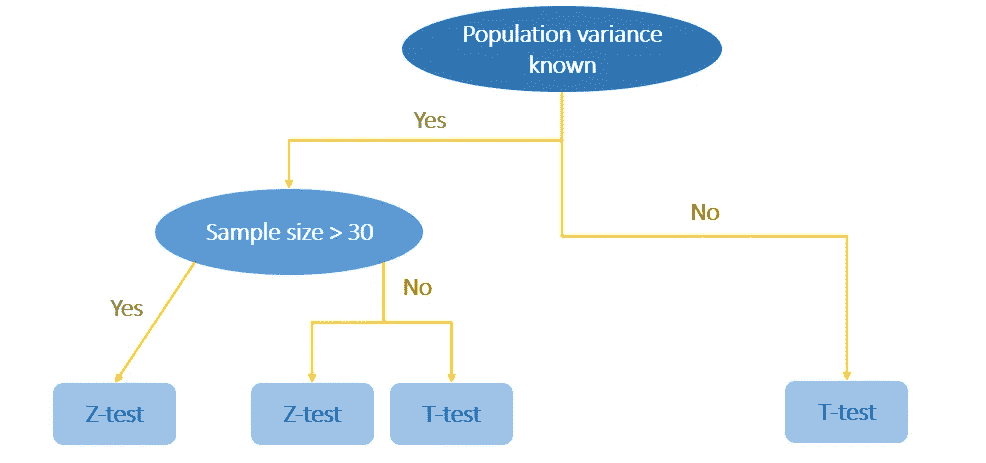

作者图片

# t 检验。

如上所述，t-检验与 z-检验非常相似，除非它适用于较小的样本，并且不需要知道总体方差。

> t 检验基于 t 分布，t 分布是一个像正态分布一样的钟形曲线，但是尾部更重。

随着样本量的增加，自由度也增加，t 分布变得类似于正态分布。它在平均值附近变得不那么偏斜和紧密(较轻的尾部)。为什么？我们一会儿就知道了。

有三种类型的 t 检验。上面已经介绍了两个——**单样本**和**双样本**。这两种都属于**‘不成对 t 检验’**的范畴，所以第三种 t 检验是**‘成对 t 检验’**。

成对和不成对的概念与样本有关。样品是一样的还是两个不同的样品？我们是在两个不同的组中监控一个变量还是在同一个组中？如果样本相同，则 t 检验应该配对，否则不配对。

例如，假设您想测试某种药物是否会提高女性的孕酮水平。

如果您拥有的数据是一组女性服药前的孕酮水平和同一组女性服药后的孕酮水平，那么您将进行配对 t 检验，因为样本是相同的。

如果你的数据是两组不同年龄组的妇女服药后的黄体酮水平，那么你将进行双样本不成对 t 检验，因为有两个不同的样本。

每个统计检验都有一个检验统计量，它帮助我们计算 p 值，然后决定是否拒绝零假设。在 t 检验的情况下，检验统计量称为 t 统计量。计算 t 统计量的公式根据您正在执行的 t 检验而有所不同，所以让我们仔细看看它们。

**下面所有例子中用到的代码和数据都可以在** [**这里**](https://github.com/shubhangihora/python-articles) **找到。**

## 单样本 t 检验。

印度女性的平均身高被记录为 158.5cm。今天印度女性的平均身高是否大于 158.5cm？

为了验证这个假设，我询问了 25 名女性的身高。

我的假设是—

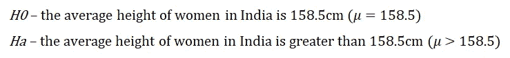

*   显著性水平为 0.05。
*   样本平均值为 162 厘米，样本标准偏差为 2.4 厘米
*   由于样本大小为 25，自由度将为 24(25–1)。
*   因为我将样本平均值与总体平均值(标准值)进行比较，所以这将是一个单样本测试。
*   由于我的假设有一个方向——样本平均高度大于总体平均高度——这将是一个单尾检验。

计算 t 统计量的公式为:

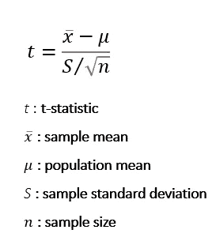

作者图片

所以我们的 t 统计量是

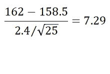

作者图片

接下来，我们需要在 t 统计值的表格中查找 t 分布的临界值，其中α为 0.05，自由度为 24 [。我们场景的临界值是 1.711。我们的 t 统计量大于临界值，所以可以拒绝零假设，得出印度女性平均身高大于 158.5 cm 的结论！](https://data-flair.training/blogs/wp-content/uploads/sites/2/2018/10/T-table.png)

虽然最好在假设检验中计算 p 值以拒绝或不拒绝零假设，但计算 t 统计的 p 值的公式有点棘手。在手动执行假设检验时，您可以使用 t 分布表值，或者只使用临界值来拒绝或不拒绝零假设。否则，使用计算器或 python 函数将有助于您获得 p 值。让我们看看如何！

我们首先将 csv 读入数据帧:

```
import pandas as pd
data = pd.read_csv("one-sample-t.csv")
data.head()
```

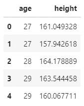

作者图片

我们有两栏——年龄和身高。对于这个单样本 t 检验，我们只需要身高，因为我们要将这个样本的平均身高与总体平均身高(158.5 厘米)进行比较

让我们检查高度栏的平均值和标准偏差:

```
data.height.mean()
>> 162.053526834564data.height.std()
>> 2.4128517286126048
```

t 检验的假设表明样本数据必须来自正态分布。我们可以通过使用概率图(也称为 QQ 图—分位数-分位数图)来检查身高列是否呈正态分布。简而言之，概率图是一种检查数据集是否遵循特定分布的图形方法。它实际上是两个数据集的图，一个是要检查其分布的数据，另一个是来自该分布本身的数据。在我们的例子中，一组数据将是高度列，分布将是正态分布。

```
import pylab
stats.probplot(data.height, dist="norm", plot=pylab)
pylab.show()
```

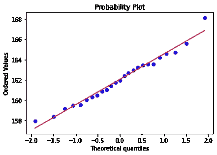

作者图片

红线代表正态分布，蓝点代表身高栏的数据。上图证实了身高列来自/遵循正态分布，因为身高数据点遵循正态分布线的路径。

现在，我们将使用 scipy 的 stats 方法执行单样本 t 检验。我们需要向它传递我们的数据和人口意味着:

```
stats.ttest_1samp(data.height,popmean=158.5)
>> Ttest_1sampResult(statistic=7.363748862859639, pvalue=1.32483697812078e-07)
```

p 值小的离谱！所以我们可以拒绝零假设。

## 双样本 t 检验。

印度女性的年龄和身高有关系吗？

为了验证这一假设，我询问了 50 名女性的年龄——25 名女性年龄在 27 至 30 岁之间(A 组)，25 名女性年龄在 37 至 40 岁之间(B 组)。

*   我的假设是—

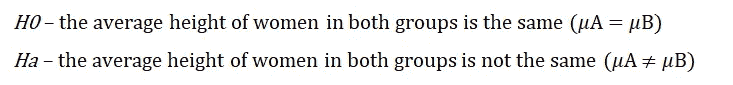

*   显著性水平为 0.05。
*   A 组的样本均值和标准差分别为 162 厘米和 2.4 厘米。
*   B 组的样本均值和标准差分别为 158.6 厘米和 3.4 厘米。
*   因为我在比较两个样本的平均值，所以这将是一个双样本测试。
*   由于我的假设是无方向性的，这将是一个双尾检验。

前面提到过，参数检验假设方差同质，即两个样本的方差应该相同。在这里提到的例子中，方差肯定是不一样的——A 组的标准差是 2.4 厘米，而 b 组的标准差是 3.4 厘米。这是否意味着我们不能执行双样本 t 检验？不，不是的！令人欣慰的是，t 检验有一个变体，允许不同的方差，它被称为**韦尔奇的 t 检验**。

当两个样本的方差相等时，用于计算 t 统计量的分母称为混合方差。如果两组的样本量不同，则公式为:

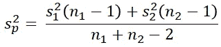

作者图片

如果两组的样本量相等，则公式如下:

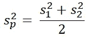

作者图片

它找出两组的共同方差，用于 t 统计公式。t 统计量的公式为:

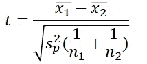

作者图片

然而，当两个样本的方差不相等时，分母比较两个方差，计算 t 统计量的公式为:

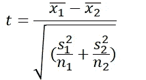

作者图片

此外，自由度的计算在两种测试之间也不同。如果当前示例中两组的方差相等，自由度将为 48(25+25–2；我们减去 2，因为我们测量两个参数——每个样本的平均值)。

在 Welch t-test 的情况下，自由度是分数，总是小于学生 t-test 的自由度，坦白地说，计算起来有点复杂。

由于我们的方差不相等，我们将执行韦尔奇的 t 检验。

所以我们的 t 统计量是:


作者图片

让我们也用 python 来做这件事。

```
import pandas as pd
df_a = pd.read_csv("one-sample-t.csv") # group A
df_b = pd.read_csv("two-sample-t.csv") # group B
```

A 组与我们用于单样本 t 检验的 csv 相同，因此我们已经知道它的均值和标准差。让我们对 b 组进行同样的检查。

```
df_b.height.mean()
>> 158.60704061997612df_b.height.std()
>> 3.42443022417948
```

现在我们进行 t 检验！要执行 Welch 的 t-test，我们只需将 equal_var 参数作为 False 传递。默认情况下，这是真的，所以如果我们进行学生的 t 检验，我们根本不需要通过它。

```
stats.ttest_ind(df_a.height, df_b.height, equal_var=False)
>> Ttest_indResult(statistic=4.113633648976651, pvalue=0.00017195968508873518)
```

p 值远小于 0.05，因此我们可以拒绝零假设。

## 配对 t 检验。

营养饮料 xyz 会增加女性身高吗？

为了验证这一假设，我测量了 25 名女性在开始喝营养饮料前和结束后的身高。

*   我的假设是-

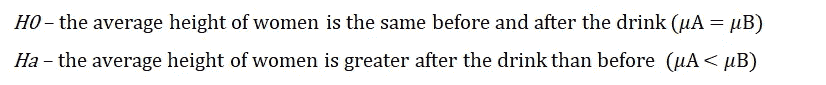

*   显著性水平为 0.05。
*   女性饮酒前的样本均值和标准差分别为 162 厘米和 2.4 厘米。
*   女性饮酒后的样本均值和标准差分别为 167 厘米和 3.4 厘米。
*   由于样本大小为 25，自由度将为 24(25–1)。
*   因为我比较的是同一样本的平均值，但中间有干预，所以这将是一个配对 t 检验。
*   因为我的假设是有方向性的，所以这将是一个单尾检验。

有趣的事实—配对 t 检验计算两组数据(相同样本，之前和之后)中配对观察值之间的差异，然后使用平均差异和平均标准偏差执行单样本 t 检验。

让我们直接用 python 实现它:

将 csv 读入数据帧。

```
import pandas as pd
data = pd.read_csv("paired-t.csv")
data.head()
```

使用 describe()方法检查 before 和 after 列的平均值和标准差。

```
data.describe()
```

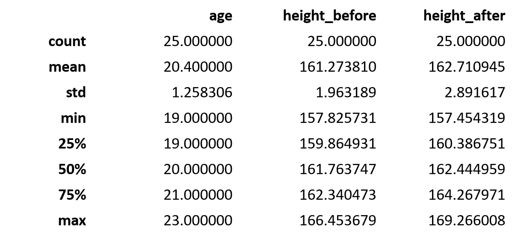

作者图片

使用 scipy stat 的 ttest_rel 方法执行配对 t 检验！我们在替代参数中传递“更大”,因为我们的替代假设是营养饮料后的平均身高将大于饮料前的身高。

```
stats.ttest_rel(data.height_before, data.height_after, alternative='greater')
>> Ttest_relResult(statistic=-1.9094338173992416, pvalue=0.9658844528005113)
```

p 值大于 0.05，因此我们不能拒绝零假设。

现在我们已经看到了所有类型的 t 检验及其计算 t 统计量的公式，我们可以理解为什么随着样本量的增加，t 分布变得类似于正态分布。所有不同的 t 检验都涉及样本的标准差/方差。这只是对总体方差的估计，因为它是未知的。由于 t-检验中的假设是样本数据来自服从正态分布的总体，因此随着样本大小的增加以及自由度的增加，方差的这种估计实际上是正确的(即，是总体的方差)的可能性更大。此外，样本量越大，就越接近总体。由于总体是正态分布的，所以具有更高自由度的更大样本量的 t 分布也类似于正态分布是有意义的。