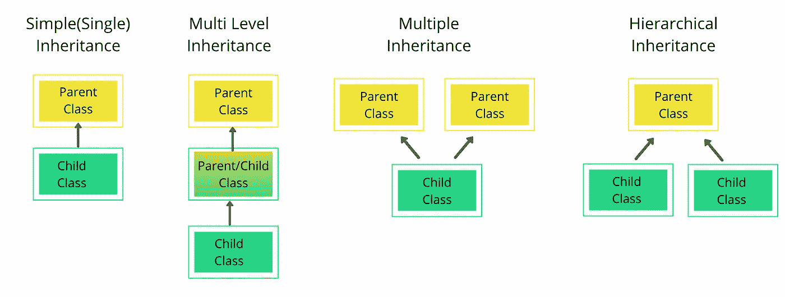

# Python 中的父母和孩子

> 原文：<https://towardsdatascience.com/parents-and-children-in-python-998540210987?source=collection_archive---------6----------------------->


照片由 [Unsplash](https://unsplash.com/s/photos/mother-duck?utm_source=unsplash&utm_medium=referral&utm_content=creditCopyText) 上的 [vivek kumar](https://unsplash.com/@vikceo?utm_source=unsplash&utm_medium=referral&utm_content=creditCopyText) 拍摄

## 继承:扩展类以产生新的类

您可能知道，在面向对象的编程语言中创建一个全功能的类是非常耗时的，因为真实的类执行许多复杂的任务。

在 Python 中，可以从现有的类(父类)中获取想要的特性来创建新的类(子类)。这个 Python 特性被称为**继承。**

通过继承，您可以

*   获取父类的特征，
*   改变你不需要的功能，
*   给你的子类增加新的特性。(派生类或子类)

因为您正在使用一个预先使用过的、经过测试的类，所以您不必在新类中投入太多的精力。子类继承了其父类的属性和功能。

如果我们有几个相似的类，我们可以在一个类中定义它们的公共功能，并定义这个父类的子类，在那里实现特定的功能。

# 三名数据专业人员


作者图片

我们有 3 名数据专家。他们都懂数学和统计学，SQL，还有 Python，R，Java 等一类的编程语言。

```
class Data_Scientist:
   def __init__(self, name, SQL):
      self.name = name
      self.SQL = SQL
   def knows_maths_stats(self):
      return True
   def knows_programming(self):
      return True

class Data_Analyst:
   def __init__(self, name, SQL):
      self.name = name
      self.SQL = SQL
   def knows_maths_stats(self):
      return True
   def knows_programming(self):
      return True 

class Data_Engineer:
   def __init__(self, name):
      self.name = name
      self.SQL = SQL
   def knows_maths_stats(self):
      return True
   def knows_programming(self):
      return True
```

我们可以定义一个父类“Data_Professional”和 Data_Professional 类的 3 个子类:Data_Analyst、Data_Scientist 和 Data_Engineer，而不是反复编写同一个类。

# 父类

我们继承的类称为**父类、超类或基类。**

```
class Data_Professional:
   def __init__(self, name, SQL):
      self.name = name
      self.SQL = SQL
   def knows_maths_stats(self):
      return True
   def knows_programming(self):
      return True
```

# 子类别

通过继承父类的功能创建的新类称为**子类、派生类或子类。子类的 __init__()函数覆盖了父类的 __init__()函数。**

## 从子类访问父类变量

Mary Smith 是一名数据科学家，精通数学和统计学、SQL 和 Python。

**1。定义子类**

```
class Data_Scientist(Data_Professional):
   def __init__(self, name, SQL):
      super().__init__(name, SQL)
```

**2。初始化 dt_sci 对象:**

```
dt_sci = Data_Scientist(“Mary Smith”, 9)
```

**3。打印 dt_sci 的特征:**

```
print(dt_sci.name, 
      dt_sci.SQL, 
      dt_sci.knows_maths_stats(),  
      dt_sci.knows_programming())Mary Smith 9 True True
```

## 空类具有其父类的属性

```
class Data_Engineer(Data_Professional):
   passdt_en = Data_Engineer(“Hyun-mi Tokko”, 9)print(dt_en.name, 
      dt_en.SQL, 
      dt_en.knows_maths_stats(),  
      dt_en.knows_programming())Hyun-mi Tokko 9 True True
```

## 覆盖类

```
class Data_Analyst(Data_Professional):
   def __init__(self, name, SQL):
      super().__init__(name, SQL)
   def knows_programming(self):
      return Falsedt_an = Data_Analyst(“Brinda Kumar”, 7)print(dt_an.name, 
      dt_an.SQL, 
      dt_an.knows_maths_stats(),  
      dt_an.knows_programming())Brinda Kumar 7 True False
```

# 检查子类和实例

## **issubclass()方法:**

内置函数 [issubclass(class1，class2)](https://docs.python.org/2/library/functions.html#issubclass) 询问一个类是否是另一个类的子类。

```
print(issubclass(Data_Analyst, Data_Professional))Trueprint(issubclass(Data_Professional, Data_Analyst))False
```

## **isinstance()方法**

内置函数 [isinstance(object，class)](https://docs.python.org/2/library/functions.html#isinstance) 询问对象是否是类的实例。

```
print(isinstance(dt_an, Data_Analyst))Trueprint(isinstance(dt_en, Data_Analyst))False
```

# 继承的类型

有几种类型的继承。这些是单一继承、多重继承、多级继承、层次继承和混合继承。其中的前四个如下图所示。混合遗传是这四种类型遗传的混合。上面的例子是一个混合继承的例子。



作者图片

# 继承的优势

继承提供了很多优势。通过使用父类和子类，

*   我们可以编写更多可重用的、灵活的代码，这些代码很容易被新开发人员扩展，
*   我们可以编写更有组织、结构化、可读性更强的代码，帮助我们更容易地调试和识别错误，
*   我们可以减少代码的重复和重复，我们可以把所有的公共属性和功能放到父类中，由子类访问它们。

# 结论

继承是面向对象编程(OOP)中最重要的概念之一。它允许我们基于一个现有的类或多个类创建新的类。我们将在接下来的博客中讨论多态、封装和抽象。

# 联系我

如果你想了解我的最新文章，请在[媒体](https://seymatas.medium.com/)上关注我。你可以在 [LinkedIn](https://www.linkedin.com/in/seyma-tas/) 上联系我，在**seymatas@gmail.com 给我发邮件！**

非常感谢您的任何建议和意见！