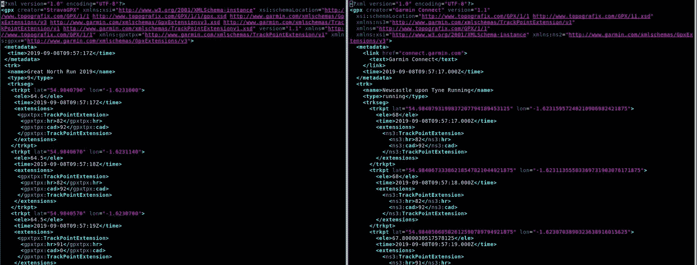
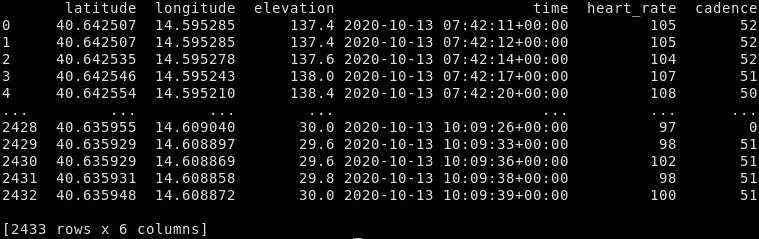
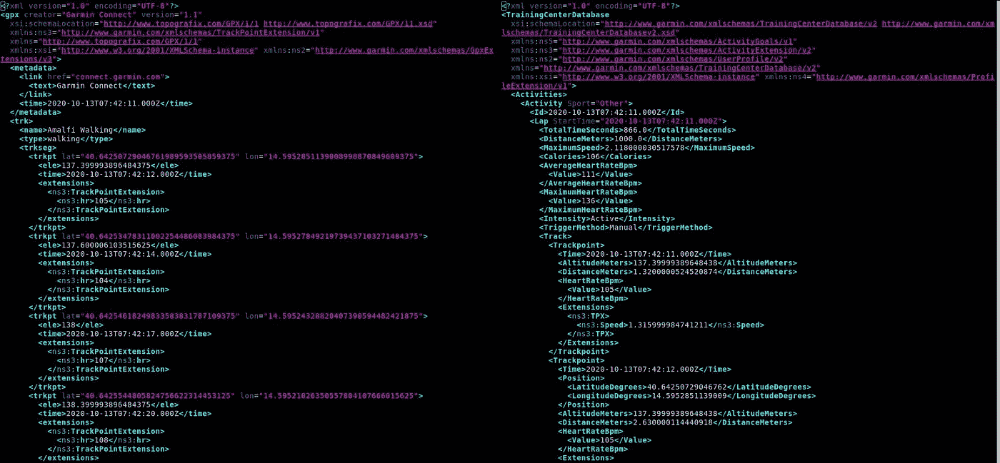
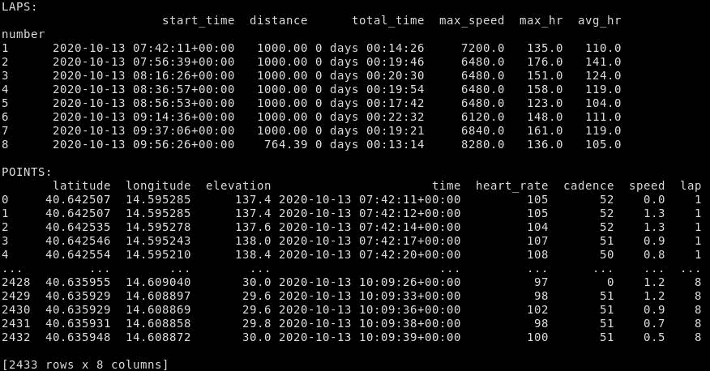
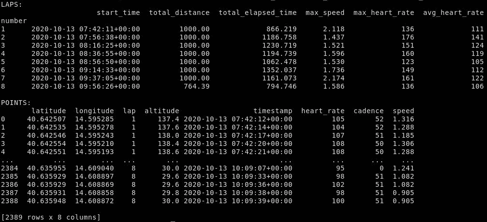

# 用 Python 解析健身跟踪器数据

> 原文：<https://towardsdatascience.com/parsing-fitness-tracker-data-with-python-a59e7dc17418?source=collection_archive---------1----------------------->

## 看看一些最常见的文件格式和有用的 Python 库


由 [Cameron Venti](https://unsplash.com/@ventiviews?utm_source=medium&utm_medium=referral) 在 [Unsplash](https://unsplash.com?utm_source=medium&utm_medium=referral) 拍摄的照片

# 介绍

现在，使用健身跟踪应用程序和设备(如 Garmin、FitBit、Strava 等)来跟踪您的锻炼非常普遍，尤其是跑步和骑自行车等有氧运动。有很多手机和网络应用程序可以让你以越来越复杂的方式查看和分析你的活动。其中一些应用是由设备制造商提供的(如 [Garmin Connect](https://connect.garmin.com/) )，而另一些则是独立于设备和制造商的，如 [Strava](https://www.strava.com/) 。

但也许你不想依赖你的设备制造商或第三方提供商来存储和访问你的数据。(例如，Garmin 的服务器[在 2020 年 7 月宕机](https://www.bbc.com/news/technology-53553576)数日，导致 Garmin 用户完全无法访问 Garmin Connect。)或者，你可能想用那些应用程序无法做到的方式来回顾和分析你的活动。

幸运的是，有了一些基本的编程技巧，自己解析和分析这些数据并不困难，唯一的限制就是你的想象力。在本文中，我们将讨论使用 Python 获取活动数据并解析它的基础知识。我们将研究存储和导出活动数据的最常见格式，并探索一些用于解析活动数据的有用 Python 库。还会有一些示例脚本来解析数据文件并使用数据构建`[pandas](https://pandas.pydata.org/)`数据帧(否则我们不会在这里讨论 pandas，阅读本文不需要熟悉 pandas——一些 Python 和 XML 的基础知识会有所帮助)。示例脚本可以在以下 GitHub repo 中找到(运行所需的最低 Python 版本是 3.6，依赖项可以在 [Pipfile](https://github.com/bunburya/fitness_tracker_data_parsing/blob/main/Pipfile) 中找到):

<https://github.com/bunburya/fitness_tracker_data_parsing>  

当我们说“活动数据”时，我们主要指的是 GPS 和时间数据，它们描述了一些基于运动的活动，如跑步、步行或骑自行车，以及您的设备可能提供的补充数据，如海拔、心率和节奏数据。

本文中描述的方法主要基于我对我的 Garmin vívoactive 3 手表(为了方便起见，我称之为 VA3)或我的旧款 Garmin Forerunner 30 手表(我称之为 FR30)记录的活动的研究，我主要用它们来记录跑步和步行。每个设备记录和导出数据的方式会有所不同，因此您的里程可能会有所不同，但我们将讨论的文件格式和库应该有助于与各种流行的跟踪设备和应用程序配合使用。

除非明确声明，否则我没有参与本文中讨论或链接的任何服务、软件或文章的开发。

# 如何获取数据

## 从应用程序导出

许多更受欢迎的应用程序都为您提供了将活动导出为常见文件格式的选项。例如，Strava 和 Garmin Connect 都允许您将活动导出为 GPX 和 TCX 格式，并下载原始源文件(可能是 FIT 文件)。Strava 的指令是[这里的](https://support.strava.com/hc/en-us/articles/216918437-Exporting-your-Data-and-Bulk-Export)和 Garmin Connect 的指令是[这里的](https://support.garmin.com/en-IE/?faq=W1TvTPW8JZ6LfJSfK512Q8)。当然，你需要有一个账号，并且已经将你的活动上传到相关 app。

如果你想分析很多活动，你可能想批量下载文件，而不是一个接一个地下载。并非所有应用程序都提供批量活动导出功能。然而，Strava、Garmin 和其他遵守[一般数据保护条例](https://ec.europa.eu/info/law/law-topic/data-protection/eu-data-protection-rules_en) (GDPR)的公司应该给你一个选项，下载他们掌握的所有关于你的个人数据，这将包括你的活动数据(以及其他数据)。看这里的[Strava 的](https://support.strava.com/hc/en-us/articles/216918437-Exporting-your-Data-and-Bulk-Export#Bulk)和这里的[Garmin 的](https://www.garmin.com/en-US/account/datamanagement/exportdata/)。您还可以找到第三方脚本，以更方便的方式批量下载您的活动，例如 Garmin Connect 的[Python 脚本](https://github.com/pe-st/garmin-connect-export)(任何此类脚本都可能会要求您提供用户名和密码，以便下载您的活动，因此请小心，只使用您信任的软件)。

对于 Strava 和 Garmin Connect 以外的应用程序，请咨询其常见问题或技术支持以了解其导出选项。

## 直接从设备

有些设备可以通过 USB 接口连接到您的电脑上，这样您就可以直接访问这些设备上的活动文件。这是否可能以及在哪里可以找到活动文件将取决于您的设备，因此如果有疑问，请查看设备制造商提供的常见问题解答或技术支持。例如，FR30 和 VA3 都有一个名为 GARMIN 的目录，其中包含一个名为 ACTIVITY 的目录。该目录包含作为 FIT 文件的活动数据。

# 如何解析数据

## 用 gpxpy 解析 GPX 文件

[GPS 交换格式](https://www.topografix.com/gpx.asp) (GPX)是一种开放的基于 XML 的格式，通常用于存储基于 GPS 的数据。在本文将要讨论的三种格式中，GPX 可能是最容易使用的。这是一种简单且记录良好的格式，并且有几种有用的工具和库可用于处理 GPX 数据。(另一方面，TCX 和 FIT 文件可以包含比 GPX 文件更多的活动信息。)我们将使用 Python 的`[gpxpy](https://github.com/tkrajina/gpxpy)`库来处理 GPX 文件。

但是首先，让我们看看 GPX 文件是什么样子的。举例来说，这里有一个截屏显示(前几行)并排的两个 GPX 文件，一个从 Strava 下载，另一个从 Garmin Connect 下载(但都是使用 my FR30 中相同的底层数据生成的)。



两个 GPX 档案:左边是斯特拉瓦；右边是 Garmin

在每个文件中，您可以看到根元素是一个`gpx`元素，有几个属性描述了 GPX 文件的创建者和其中使用的 [XML 名称空间](https://en.wikipedia.org/wiki/XML_namespace)。在`gpx`元素中有一个`metadata`元素，包含关于文件本身的元数据，还有一个`trk`元素表示“轨迹”，即“*描述路径*的有序点列表”。这大致对应于我们通常认为的单一活动(跑步、骑自行车、散步等)。

`trk`元素包含一些关于活动的元数据，比如它的名称和它的活动类型(稍后将详细介绍)，以及一个或多个`trkseg`元素，每个元素代表一个“轨道片段”，它是“*一个按顺序*逻辑连接的轨道点列表”。换句话说，一个`trkseg`应该包含*连续的* GPS 数据。如果你的活动只是打开你的 GPS，跑 10 公里，然后在完成后关闭你的 GPS，那么整个活动通常是一个单独的轨道段。然而，无论出于何种原因，如果您在活动中关闭并再次打开了 GPS(或者丢失了 GPS 功能，然后又恢复了)，则`trk`可能由多个`trkseg`元素组成。(至少，理论上是这样，根据[文档](https://www.topografix.com/GPX/1/1/#type_trksegType)；当我在跑步过程中暂停并重新启动我的 VA3 时，它似乎仍然将整个跑步过程表示为一个单独的赛道段。)

每个`trkseg`元素应该包含一个或多个(可能很多个)`trkpt`或“跟踪点”元素，每个元素代表由您的 GPS 设备检测到的单个(地理)点。这些点通常相隔几秒钟。

至少，`trkpt`必须包含纬度和经度数据(作为元素的属性`lat`和`lon`)，并且可以可选地包含时间和海拔(`ele`)数据，作为子元素(由健康跟踪器生成的数据很可能至少包含时间)。一个`trkpt`也可以包含一个`extensions`元素，它可以包含附加信息。在上面的例子中，扩展元素(Garmin 的[TrackPointExtension](https://www8.garmin.com/xmlschemas/TrackPointExtensionv1.xsd)(TPE)格式)用于存储 FR30 提供的心率和节奏数据。

我想指出上面显示的两个 GPX 文件之间的三个主要区别。首先，`trk`元素的【the Garmin 文件将其描述为“running ”,而 Strava 文件只是将其描述为“9”。没有标准化的方法来表示轨道的类型。Garmin 使用诸如“跑步”、“散步”、“徒步旅行”等词语。，而 Strava 使用数字代码，例如“4”代表徒步旅行，“9”代表跑步，“10”代表步行，等等。我找不到 Strava 数字代码到活动类型的全面映射。如果您想要查找特定活动类型的代码，您可以在 Strava 上编辑现有活动的活动类型(单击活动页面左侧的铅笔图标)，然后将其导出到 GPX，以检查`type`元素中的值。

其次，报告的轨迹点高程不同，这似乎令人惊讶，因为它们基于相同的基础数据。一些健身追踪器(似乎包括 FR30)要么不记录海拔数据，要么根据 GPS 信号进行非常不准确的记录。在这些情况下，Strava 和 Garmin 等应用程序使用自己的内部高程数据库和算法来生成自己的高程数据或调整设备记录的数据，以便给出更真实的读数(请参见此处的[了解 Strava 的更多信息](https://support.strava.com/hc/en-us/articles/216919447-Elevation-for-Your-Activity))。每个应用程序生成或调整高程数据的方法会略有不同，您将在此见证这种差异。

最后，您会注意到 Garmin 文件报告的纬度和经度数据要精确得多，有时会给出大约 30 个小数位的值，而 Strava 文件会给出 7 个小数位的值。Garmin 文件似乎反映了 FR30 报告的原始数据的精确度，而 Strava 似乎对数据进行了四舍五入。需要注意的是[精度不同于](https://en.wikipedia.org/wiki/Accuracy_and_precision)精度。报告纬度和经度到小数点后 30 位意味着真正的微观精度水平，而你的健身追踪器中的 GPS 可能最多精确到几米。因此，你的健身追踪器报告的所有额外精度并不是特别有用。但是，它可能会对活动的总记录距离(通过累加所有点之间的距离计算)产生微小但明显的影响，因此总距离可能会因数据的来源而略有不同。

所以，我们来看看`gpxpy`库。首先，确保它已安装:

`pip install gpxpy`

现在让我们在与 GPX 文件相同的目录中启动一个 Python 解释器(在本文的其余部分，我将数据用于一个与我们上面看到的不同的活动)。解析文件非常简单:

```
>>> import gpxpy
>>> with open('activity_strava.gpx') as f:
...     gpx = gpxpy.parse(f)
... 
>>> gpx
GPX(tracks=[GPXTrack(name='Morning Walk', segments=[GPXTrackSegment(points=[...])])])
```

你可以看到，在 GPX 文件对象上调用`gpxpy.parse`会给你一个`GPX`对象。这是一种反映 GPX 文件本身结构的数据结构。其中，它包含了一个`GPXTrack`对象的列表，每个对象代表一个轨迹。每个`GPXTrack`对象包含一些关于音轨的元数据和一个片段列表。

```
>>> len(gpx.tracks)
1
>>> track = gpx.tracks[0]
>>> track
GPXTrack(name='Morning Walk', segments=[GPXTrackSegment(points=[...])])
>>> track.type
'10'
>>> track.name
'Morning Walk'
>>> track.segments
[GPXTrackSegment(points=[...])]
```

每个`GPXTrackSegment`依次包含一个`GPXTrackPoint`对象列表，每个对象反映一个单独的跟踪点。

```
>>> segment = track.segments[0]
>>> len(segment.points)
2433
>>> random_point = segment.points[44]
>>> random_point
GPXTrackPoint(40.642868, 14.593911, elevation=147.2, time=datetime.datetime(2020, 10, 13, 7, 44, 13, tzinfo=SimpleTZ("Z")))
>>> random_point.latitude
40.642868
>>> random_point.longitude
14.593911
>>> random_point.elevation
147.2
>>> random_point.time
datetime.datetime(2020, 10, 13, 7, 44, 13, tzinfo=SimpleTZ("Z"))
```

以扩展名形式存储在 GPX 文件中的信息也可以被访问。在这种情况下，相关的 XML 元素(即 GPX 文件中的`extensions`元素的子元素)存储在一个列表中。

```
>>> random_point.extensions
[<Element {[http://www.garmin.com/xmlschemas/TrackPointExtension/v1}TrackPointExtension](http://www.garmin.com/xmlschemas/TrackPointExtension/v1}TrackPointExtension) at 0x7f32bcc93540>]
>>> tpe = random_point.extensions[0]
>>> for child in tpe:
...     print(child.tag, child.text)
... 
{[http://www.garmin.com/xmlschemas/TrackPointExtension/v1}hr](http://www.garmin.com/xmlschemas/TrackPointExtension/v1}hr) 134
{[http://www.garmin.com/xmlschemas/TrackPointExtension/v1}cad](http://www.garmin.com/xmlschemas/TrackPointExtension/v1}cad) 43
```

除了保存从底层 GPX 文件解析的数据之外，`GPXTrack`和`GPXTrackSegment`对象还有一些有用的方法来计算我们可能想知道的基于数据的东西。例如，您可以计算轨道或片段的总长度:

```
>>> segment.length_2d()  # ignoring elevation
8104.369313043303
>>> segment.length_3d()  # including elevation
8256.807195641411
```

或者关于移动时间或速度(米/秒)的数据:

```
>>> segment.get_moving_data()
MovingData(moving_time=7829.0, stopped_time=971.0, moving_distance=8096.192269756624, stopped_distance=160.6149258847903, max_speed=1.7427574692488983)
>>> segment.get_speed(44)  # The number of the point at which you want to measure speed
1.157300752926421
```

有各种其他方法可用于计算其他度量，以及调整或修改数据的方法，例如通过添加或删除点、分割段、平滑值等。您可以通过调用相关对象上的`help`来探索这些。

最后，[这里的](https://github.com/bunburya/fitness_tracker_data_parsing/blob/main/parse_gpx.py)是一个 Python 脚本，用于解析 GPX 文件并将一些关键数据放入熊猫数据帧。在我们的 GPX 文件中调用这个脚本:

`python3 parse_gpx.py activity_strava.gpx`

…将输出如下内容:



带有跟踪点数据的熊猫数据帧。

## 用 lxml 解析 TCX 文件

[培训中心 XML](https://en.wikipedia.org/wiki/Training_Center_XML) (TCX)格式是存储活动数据的另一种常见格式，由 Garmin 创建。要理解 GPX 和 TCX 之间的区别，最简单的方法是把这两个文件放在一起看:



GPX 的文件在左边；TCX 的文件在右边。

您可能会注意到的第一件事是，TCX 文件中的数据点被分组为“圈数”，每个`Lap`元素都有一些相关的有用数据，如一圈所用的总时间、消耗的卡路里、平均和最大心率等。什么构成“lap”取决于设备是如何配置的；在这种情况下，这项活动被分成 1000 米的“圈”或“分”跑。

您可能已经注意到的另一件事是，TCX 文件中的第一个`Trackpoint`元素包含高度、距离、心率和速度数据，但不包含纬度或经度数据。这种情况偶尔会发生，反映了设备记录的原始(拟合)数据的结构。我只能猜测发生这种情况是因为该数据(不依赖于 GPS)被单独报告给纬度和经度数据。因为 GPX 文件中的一个`trkpt`元素必须包含纬度和经度，所以 GPX 文件不可能单独记录海拔高度(etc)；它必须与一些纬度和经度数据相关联。因此，从 Garmin Connect 下载的 GPX 文件似乎只是忽略了那些没有纬度和经度数据的数据点，而从 Strava 下载的 GPX 文件似乎包含了它们，并使用下一个点的数据“填充”了缺少的纬度和经度数据。

除了以上几点，TCX 文件的结构与 GPX 文件的结构没有太大的不同。根元素是一个`TrainingCenterDatabase`元素，它包含一个`Activities`元素。该元素有一个或多个`Activity`元素，每个元素描述一个活动。除了一些元数据，`Activity`元素还包含许多`Lap`元素。每个`Lap`元素包含一些关于相关圈(或分段)的元数据，以及一个包含许多`Trackpoint`元素的`Track`元素，每个元素代表由设备报告的一个数据点，其中可能(也可能不)包含纬度和经度、高度、心率、步调、距离和速度数据。

我不知道有什么现成的 Python 库可以处理 TCX 文件，但是考虑到它只是一种 XML 文件，您可以使用`lxml`或 Python 的标准`xml`库来解析它。[这里的](https://github.com/bunburya/fitness_tracker_data_parsing/blob/main/parse_tcx.py)是一个 Python 脚本，它使用`lxml`库来解析一个 TCX 文件，并将一些关键数据放入一个 pandas DataFrame，类似于上面链接到 GPX 文件的那个。注意，我们还使用`python-dateutil`库来轻松解析 [ISO 8601](https://en.wikipedia.org/wiki/ISO_8601) 格式的时间戳。利用 TCX 文件中包含的额外信息，我们创建了一个包含单圈信息的额外数据帧。如下调用该脚本(确保您已经安装了`lxml`和`python-dateutil`):

`python3 parse_tcx.py activity_strava.tcx`

…会给你这样的东西:



熊猫数据帧与圈和跟踪点数据。

## 用 fitdecode 解析 FIT 文件

与基于 XML 的 GPX 和 TCX 格式不同，[灵活且可互操作的数据传输](https://developer.garmin.com/fit/protocol/) (FIT)协议是由 Garmin 创建的二进制格式。`[fitdecode](https://pypi.org/project/fitdecode/)`是一个解析 FIT 文件的 Python 库。这个库的文档在这里。它可以这样安装:

`pip install fitdecode`

`fitdecode`库允许你创建一个读取 FIT 文件的`FitReader`对象。然后，您可以遍历`FitReader`来依次访问 FIT 文件中的每个“帧”或数据块。根据底层数据记录的类型，每个帧由一个`FitHeader`、`FitDefinitionMessage`、`FitDataMessage`或`FitCRC`对象表示。`FitDataMessage`是我们感兴趣的对象，因为它是包含实际数据的对象。但是并不是每一个`FitDataMessage`都是相关的；其中许多可能只包含有关设备状态的数据或有关文件本身的元数据。出于目前的目的，我们正在寻找一个`FitDataMessage`，其中`name`属性为`lap`或`record`:

```
with fitdecode.FitReader('activity_garmin.fit') as fit_file:
    for frame in fit_file:
        if isinstance(frame, fitdecode.records.FitDataMessage):
            if frame.name == 'lap':
                # This frame contains data about a lap.

            elif frame.name == 'record':
                # This frame contains data about a "track point".
```

您可以检查给定帧的数据字段，如下所示:

```
for field in frame.fields:
    # field is a FieldData object
    print(field.name)
```

并且可以使用`FitDataMessage`对象的`has_field`、`get_field`和`get_value`方法来访问相关数据。

```
# Assuming the frame is a "record"
if frame.has_field('position_lat') and frame.has_field('position_long'):
    print('latitude:', frame.get_value('position_lat'))
    print('longitude:', frame.get_value('position_long'))

# Or you can provide a "fallback" argument to give you a default
# value if the field is not present:
print('non_existent_field:', frame.get_value('non_existent_field', fallback='field not present'))
```

上面的代码(如果在上下文中调用，其中`frame`是消息类型`record`的`FitDataMessage`对象，并且具有纬度和经度数据)将产生类似如下的输出:

```
latitude: 484805747
longitude: 174290634
non_existent_field: field not present
```

现在，你会注意到`latitude`和`longitude`被存储为整数。根据[这篇](https://gis.stackexchange.com/a/368905) StackOverflow 帖子，将这些整数转换成度数的方法是用它们除以`(2**32)/360`:

```
>>> 484805747 / ((2**32)/360)
40.63594828359783
>>> 174290634 / ((2**32)/360)
14.608872178941965
```

以下是 my VA3 生成的 FIT 文件中一些更有用的字段:

*   对于`lap`帧:`start_time`、`start_position_lat`、`start_position_long`、`total_elapsed_time`、`total_distance`、`total_calories`、`avg_speed`、`max_speed`、`total_ascent`、`total_descent`、`avg_heart_rate`、`max_heart_rate`、`avg_cadence`、`max_cadence`、`avg_power`、`max_power`
*   对于`record`帧:`timestamp`、`position_lat`、`position_long`、`distance`、`altitude`、`enhanced_altitude`、`speed`、`enhanced_speed`、`heart_rate`、`cadence`

还有其他的，不同的设备可能报告不同的数据，所以值得探索你自己的文件，看看你能找到什么。此外，并非每个字段都会始终存在，例如，正如我们在上一节中看到的，有时纬度和经度数据可能不会被报告。因此，使用`has_field`方法或者为`get_value`提供一个后备参数是一个很好的实践。

[这里的](https://github.com/bunburya/fitness_tracker_data_parsing/blob/main/parse_fit.py)是一个基本的脚本，它解析一个 FIT 文件并生成带有圈和轨迹点信息的 pandas 数据帧，类似于我在上一节中为 TCX 文件链接的脚本。



熊猫数据帧与圈和跟踪点数据。

# 接下来呢？

既然你已经知道了使用 Python 获取和解析你的健身追踪器数据的基本知识，那就看你想用它做什么了。你可能想做的事情之一是以某种方式可视化数据，使用`[matplotlib](https://matplotlib.org/)`、`[seaborn](https://seaborn.pydata.org/)`、`[plotly](https://plotly.com/)`或其他一些数据可视化库。

下面是一些您可能会感兴趣的文章和库:

*   [本文](/how-tracking-apps-analyse-your-gps-data-a-hands-on-tutorial-in-python-756d4db6715d)部分讨论了我们在本文中讨论过的内容，但继续讨论了绘制和转换 GPS 数据的基础知识，并对如何计算两点之间的距离进行了有益的讨论。
*   [本文](/build-interactive-gps-activity-maps-from-gpx-files-using-folium-cf9eebba1fe7)讨论如何使用[叶子](https://python-visualization.github.io/folium/)可视化 GPS 数据。
*   如果您的设备没有报告海拔数据，请查看与`gpxpy`出自同一作者的`[srtm.py](https://github.com/tkrajina/srtm.py)`，这将让您使用美国宇航局的[航天飞机雷达地形任务](https://www2.jpl.nasa.gov/srtm/)数据来查找海拔数据。

感谢阅读，希望这篇文章对你有所帮助！