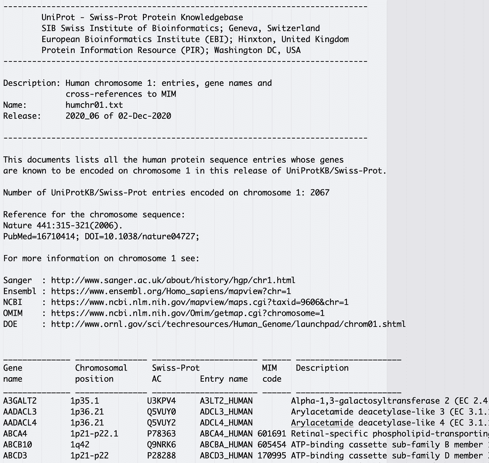
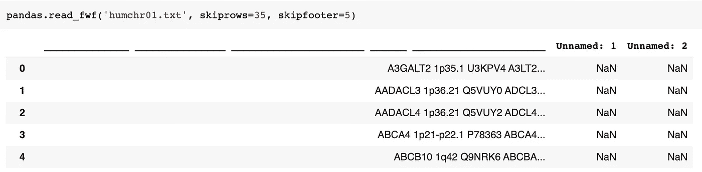
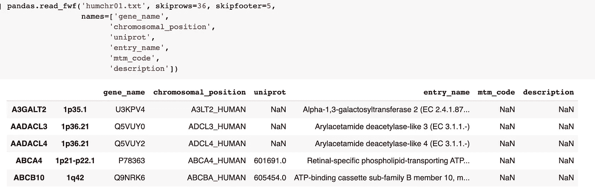
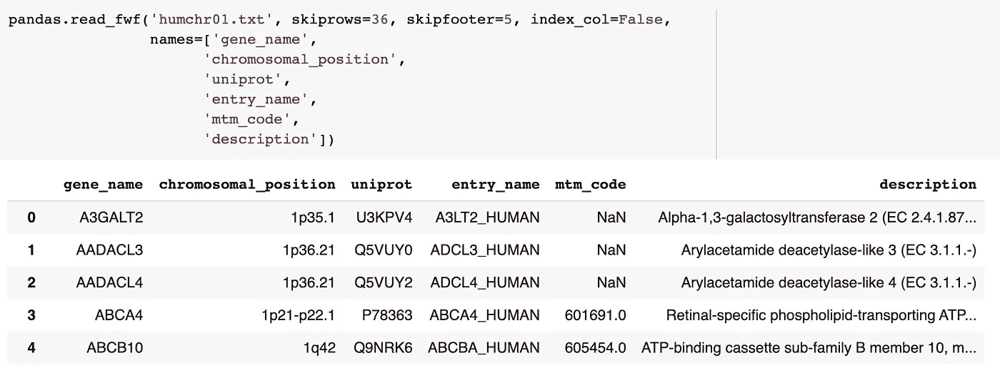
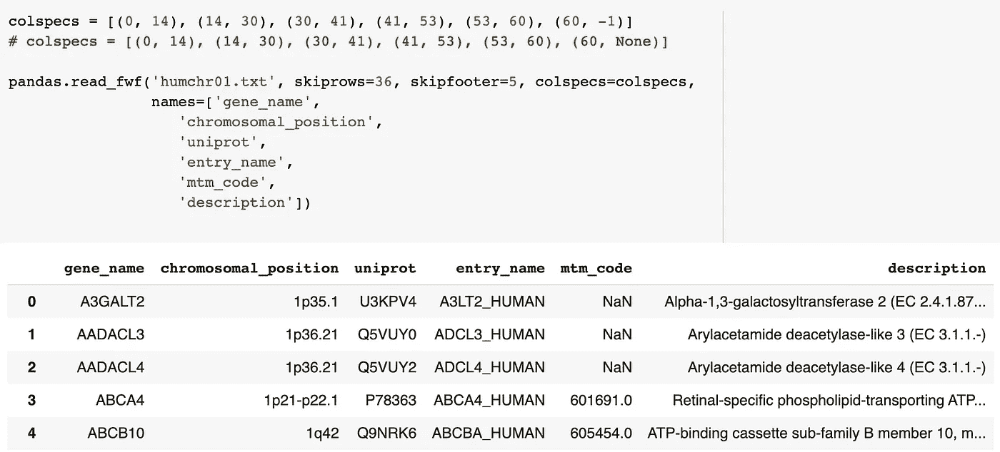

# 用 Pandas 解析固定宽度的文本文件

> 原文：<https://towardsdatascience.com/parsing-fixed-width-text-files-with-pandas-f1db8f737276?source=collection_archive---------2----------------------->

## [实践教程](https://towardsdatascience.com/tagged/hands-on-tutorials)

## 如何轻松地将固定宽度的文本文件读入 Pandas 数据帧


照片由[雷诺·卡尔](https://unsplash.com/@caarl)在 [Unsplash](https://unsplash.com/?utm_source=medium&utm_medium=referral) 上拍摄

# 什么是固定宽度文本文件？

固定宽度文件类似于 csv 文件，但不是使用分隔符，每个字段都有固定数量的字符。这将创建所有数据整齐排列的文件，当在文本编辑器中打开时，其外观类似于电子表格。如果您在文本编辑器中查看原始数据文件，这很方便，但是当您需要以编程方式处理数据时，这就不太理想了。

固定宽度文件有一些常见的怪癖要记住:

*   当值不消耗字段的总字符数时，使用填充字符来增加该字段的总字符数。
*   只要在整个文件中保持一致，任何字符都可以用作填充字符。空白是一种常见的填充字符。
*   字段中的值可以左对齐或右对齐，并且文件中所有字段的对齐方式必须一致。

此处提供了固定宽度文件的详细描述[。](https://www.softinterface.com/Convert-XLS/Features/Fixed-Width-Text-File-Definition.htm)

**注意**:固定宽度文件中的所有字段**不**需要有相同的字符数。例如:在一个有三个字段的文件中，第一个字段可以是 6 个字符，第二个是 20 个字符，最后一个是 9 个字符。

# 如何识别固定宽度的文本文件？

最初检查时，当空白用作填充字符时，固定宽度的文件看起来像制表符分隔的文件。如果你试图读取一个固定宽度的 csv 或 tsv 格式的文件并得到错误的结果，试着在文本编辑器中打开它。如果数据排列整齐，这可能是一个固定宽度的文件。许多文本编辑器还会给出光标位置的字符数，这使得在字符数中发现模式变得更加容易。

如果您的文件太大，不容易在文本编辑器中打开，有多种方法可以在命令行上将它的一部分采样到一个单独的较小的文件中。Unix/Linux 系统上的一个简单方法是`head`命令。下面的例子使用`head`和`-n 50`来读取`large_file.txt`的前 50 行，然后将它们复制到一个名为`first_50_rows.txt`的新文件中。

```
head -n 50 large_file.txt > first_50_rows.txt
```

# 让我们使用一个真实的示例文件

## UniProtKB 数据库

UniProt Knowledgebase (UniProtKB)是一个可免费访问的综合性数据库，包含了 CC-BY (4.0)许可下可用的蛋白质序列和注释数据。UniProtKB 的 Swiss-Prot 分支已经人工注释和审查了各种生物体的蛋白质信息。UniProt 数据的完整数据集可从 ftp.uniprot.org[下载。人类蛋白质的数据包含在一组**固定宽度的文本文件中:** `humchr01.txt` - `humchr22.txt`、`humchrx.txt`和`humchry.txt`。](http://ftp.uniprot.org/)

对于这个例子，我们不需要所有的 24 个文件，所以这里是指向集合中第一个文件的链接:

[https://FTP . uni prot . org/pub/databases/uni prot/current _ release/knowledge base/complete/docs/hum chr 01 . txt](https://ftp.uniprot.org/pub/databases/uniprot/current_release/knowledgebase/complete/docs/humchr01.txt)

## 在用熊猫阅读文件之前检查它

在文本编辑器中快速浏览一下该文件，可以看到一个我们不需要导入 6 个数据字段的大标题。



[humchr01.txt](https://ftp.uniprot.org/pub/databases/uniprot/current_release/knowledgebase/complete/docs/humchr01.txt) 开头的片段

固定宽度文件似乎不像许多其他数据文件格式那样常见，乍看起来它们可能像制表符分隔的文件。在尝试使用 Pandas 阅读文件之前，在一个好的文本编辑器中对文本文件进行视觉检查可以大大减少挫折感，并有助于突出格式模式。

## 使用 pandas.read_fwf()和默认参数

**注意**:这个例子的所有代码都是为 Python3.6 和 Pandas1.2.0 编写的

`[pandas.read_fwf()](https://pandas.pydata.org/pandas-docs/stable/reference/api/pandas.read_fwf.html)`的文档列出了 5 个参数:

`filepath_or_buffer`、`colspecs`、`widths`、`infer_nrows`和`**kwds`

两个`pandas.read_fwf()`参数`colspecs`和`infer_nrows`具有默认值，用于根据初始行的抽样推断列。

让我们利用`pandas.read_fwf()`的默认设置来获得整洁的数据帧。我们将把`colspecs`参数保留为它的默认值‘infer ’,这又利用了`infer_nrows`参数的默认值(100)。这两个默认值试图在数据的前 100 行(在任何跳过的行之后)中找到一个模式，并使用该模式将数据分成列。

## 基本文件清理

在我们的示例文件中，表格信息之前有几行文件头。我们需要在读取文件时跳过它们。

没有一个参数适合在读取文件时跳过行。那么我们该怎么做呢？我们利用`**kwds`参数。

便利的是，`pandas.read_fwf()`使用与`[pandas.read_table()](https://pandas.pydata.org/pandas-docs/stable/reference/api/pandas.read_table.html)`相同的`TextFileReader`上下文管理器。这与`**kwds`参数相结合，允许我们将`pandas.read_table()`的参数与`pandas.read_fwf()`一起使用。所以我们可以使用`skiprows`参数跳过示例文件中的前 35 行。类似地，我们可以使用`skipfooter`参数跳过示例文件的最后 5 行，其中包含不属于表格数据的页脚。

```
pandas.read_fwf('humchr01.txt', skiprows=35, skipfooter=5)
```

上面的尝试让数据帧有点混乱😔：



**注意**:因为我们对`colspecs`和`infer_nrows`使用默认值，所以我们不必声明它们。

这里的部分问题是，默认的`colspecs`参数试图根据前 100 行推断列宽，但是表格数据之前的行(文件中的第 36 行，显示在上面的列名中)实际上并不遵循数据表中的字符计数模式，所以推断的列宽变得混乱。

如果我们将`skiprows`设置为 36 而不是 35，我们会将第一行数据推入列名，这也会破坏推断的列宽。如果没有额外的清理工作，就没有胜利可言。让我们用`names`参数解决列名问题，看看是否有帮助。

**注意**:使用`names`参数意味着我们没有将文件中的一行分配给列名，因此我们作为用户必须确保考虑到这样一个事实，即`skiprows`必须从第一个数据行开始。所以在下一个例子中`skiprows`被设置为 36，但是在之前的例子中，当我们没有使用`names`参数时，它是 35。

```
pandas.read_fwf('humchr01.txt', skiprows=36, skipfooter=5, names=['gene_name', 'chromosomal_position', 'uniprot', 'entry_name', 'mtm_code', 'description'])
```



好多了，但还是有点乱。Pandas 推断列拆分是正确的，但是将前两个字段推到了索引中。让我们通过设置`index_col=False`来解决索引问题。

```
pandas.read_fwf('humchr01.txt', skiprows=36, skipfooter=5, index_col=False, names=['gene_name', 'chromosomal_position', 'uniprot', 'entry_name', 'mtm_code', 'description'])
```



看起来不错！列拆分正确，列名有意义，数据帧中的第一行数据与示例文件中的第一行数据相匹配。

我们依靠两个`pandas.read_fwf()`特定参数的默认设置来获得整洁的数据帧。`colspecs`参数保留其默认值“infer ”,它反过来利用`infer_nrows`参数的默认值，并在数据的前 100 行(跳过的行之后)中找到一个模式，并使用该模式将数据分成列。默认参数在这个示例文件中运行良好，但是我们也可以指定`colspecs`参数，而不是让 pandas 推断列。

# 使用 colspecs 手动设置字段宽度

就像上面的例子一样，我们需要从一些基本的清理开始。我们将在文件中放置页眉和页脚，并像前面一样设置列名。

下一步是用每个字段的间隔建立一个元组列表。下面的列表符合示例文件。

```
colspecs = [(0, 14), (14, 30), (30, 41), (41, 53), (53, 60), (60, -1)]
```

注意最后一个元组:(60，-1)。我们可以用-1 来表示最后一个索引值。或者，我们可以使用`None`而不是-1 来表示最后一个索引值。

**注意**:当使用`colspecs`时，元组不必是排除性的！如果需要，可以将最终列设置为重叠的元组。例如，如果您想要复制第一个字段:`colspecs = [(0, 14), (0, 14), ...`

```
pandas.read_fwf('humchr01.txt', skiprows=36, skipfooter=5, colspecs=colspecs, names=['gene_name', 'chromosomal_position', 'uniprot', 'entry_name', 'mtm_code', 'description'])
```



我们又一次获得了一个整洁的数据框架。这一次，我们使用`colspecs`参数明确声明了我们的字段开始和结束位置，而不是让 pandas 推断字段。

# 结论

用 Pandas 阅读固定宽度的文本文件既简单又容易。`pandas.read_fwf()`的默认参数在大多数情况下都有效，定制选项有据可查。熊猫图书馆有许多功能可以让[读取各种文件类型](https://pandas.pydata.org/pandas-docs/stable/user_guide/io.html)，而`pandas.read_fwf()`是一个需要记住的更有用的熊猫工具。