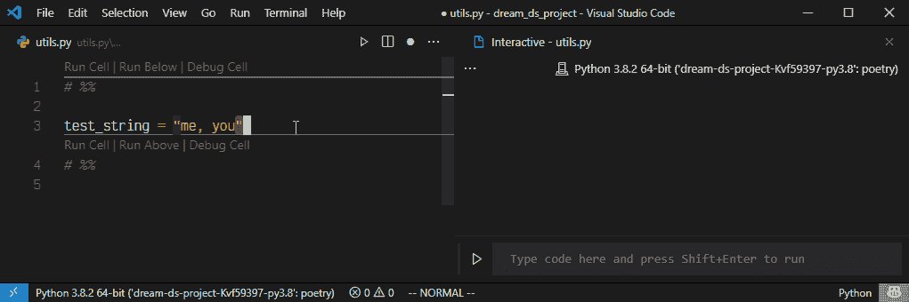
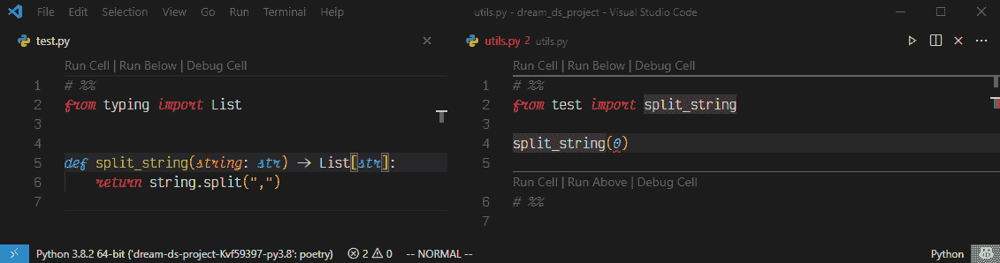

# 优化数据科学工作流程的指南

> 原文：<https://towardsdatascience.com/part-1-a-guide-for-optimizing-your-data-science-workflow-53add6481556?source=collection_archive---------20----------------------->

## [实践教程](https://towardsdatascience.com/tagged/hands-on-tutorials)，生产力

## 第 1 部分:用这些提高工作效率的技巧来强化你的工作流程。从 Jupyter 笔记本到 Python 文件和模块。


作者图片

本指南由两部分组成。我建议要么喝着咖啡跟着它走，要么一大块一大块地反复阅读，因为我会以*的令人麻木的*细节来回顾工作流程中的四个步骤，这样你就可以拿起它，定制它，让它成为你自己的。如果您对某一部分感兴趣，可以随意点击它向前跳(仅适用于桌面)。为此，我将从头到尾给出一个目录。

为了简洁起见，在这篇文章中我们将只讨论前两步，

[***第一步:*** *Jupyter 笔记本*](#ef9c)[***第二步:*** *Python 文件&模块*](#fb90)

建立工作流程是一件可怕的事情。没有一种解决方案适合所有人。从[制表符 vs 空格](https://thenewstack.io/spaces-vs-tabs-a-20-year-debate-and-now-this-what-the-hell-is-wrong-with-go/)开始，开发人员对他们的设置很挑剔，并对其他人的想法有强烈的意见。在这篇文章中，我回顾了如何优化我的工作流程。即使这不符合你的需要，你也可以把它的一点一滴收集起来，用你自己独特的方式组合起来。在一天结束的时候，开发人员的流动和生产力很重要，你应该努力去实现它。

VS 代码将用于设置工作流。尽管本文是针对 VS 代码的，但是您也可以将相同的思想应用到其他 IDE 中。

# 两个工作流程

典型的数据科学工作流程始于在 Jupyter 笔记本上开发代码和构建代码原型，然后将其转移到 python 文件和模块中。

## 大团队

如果你在一个大团队中工作，你的工作到此结束，你把你的代码交给开发人员，他们负责应用程序的归档和部署。

***数据科学家:*** *笔记本→ Python 文件/模块* ***开发运营:*** *Python 文件/模块→ Dockerize →部署*

## **中小型团队/副业项目**

但是如果你在一个中小型团队中工作，或者在你的副业项目中工作，你需要将你的应用程序 dockerize 并自己部署它。

***数据科学家:*** *笔记本→ Python 文件/模块→ Dockerize →部署*

无论你属于哪个阵营，你都可以从这个指南中获得一些技巧，并将其融入到你自己的工作流程中。

# 上下文开关程序

上下文切换是工作流的祸根。每当你切换环境/工具时，你会失去你的心流，需要时间来适应。尽可能避免切换上下文。在过去的几年里，我一直将 VS 代码作为 python 开发的日常驱动程序，并且卓有成效。

> 你在一个工具上花的时间越多，你就越擅长它。VS Code 拥有强大的社区、多语言支持、各种扩展和来自 MSFT 的支持。你最好向它过渡，宜早不宜迟。

# 初始设置

如果你想跟着做，确保你已经安装了 VS 代码。我将使用`pyenv`和`poetry`来设置项目。如果您需要参考资料，请查看我关于如何设置 python 环境的文章，

</best-practices-for-setting-up-a-python-environment-d4af439846a>  

```
>mkdir dream_ds_project
>cd dream_ds_project# Setting python version
dream_ds_project>pyenv local 3.8.2# Setting up poetry
dream_ds_project>poetry init
```

# 典型的数据科学代码编写工作流程

> 打开 jupyter 笔记本->编写大量工作 python 语句→用函数包装→将相关函数分组到类抽象中→python 文件中的相关类和函数→模块中的相关 python 文件


作者图片

## 目录:

[*Python 互动*](#332a)[*Jupyter 快捷方式*](#a57a)[*自动重新加载*](#524d)[*Pylance*](http://1cee)[*林挺*](#c0fc)[*格式化*](#d53a)

L et 不要自欺欺人了。这是大部分时间花在开发和构建代码原型上的地方。Jupyter 笔记本是一个很好的原型制作工具。除了快速运行一段代码和共享结果，笔记本在开发工作流程中效率不高。通常，开发从 jupyter 笔记本开始，然后复制到 python 文件中。

> 如果我们能两全其美呢？在开发过程中，使用笔记本特性(如快速运行)制作 python 代码的原型，然后使用 IDE 特性(如林挺、格式化、代码导航、版本控制和自动完成等)?

如果我们能做到这一点，我们就可以轻松地从第一步进入第二步。通常，jupyter 笔记本将用于原型制作，然后当您开始创建文件和模块时，代码将被转移到 IDE。VS 代码提供了这两种特性，你不需要切换工具。

## Python 交互式

VS Code 有一个不太为人知的特性叫做 [Python 交互式笔记本](https://code.visualstudio.com/docs/python/jupyter-support-py)。这允许您打开一个 python 文件，并使用`# %%`在文件上您想要的任何地方创建一个笔记本单元格。这样做的好处是，您仍然可以处理`.py`文件，同时获得 IDE 的所有好处。

让我们从安装包开始，

```
dream_ds_project>poetry shell# Install ipykernel as dev dependency
dream_ds_project>poetry add ipykernel --dev# Install prod dependency
dream_ds_project>poetry add fastpi uvicorn[standard]
```

当您在这种模式下运行代码时，会弹出一个新的 jupyter 笔记本窗口并为您运行代码。您的输出、图表和内容与您的代码是分开的。


Python 与 IDE 功能交互，如林挺、自动完成、文档参考以及 Jupyter 笔记本快速运行功能。(图片由作者提供)

## Jupyter 快捷方式

您可以将交互式笔记本的行为更改为类似于 Jupyter 笔记本的行为。作为一个笔记本用户，我已经习惯了使用键盘快捷键来运行一个单元，运行和前进。通过使用`keybindings.json`文件中的以下设置，您可以在 VSCode 中做完全相同的事情。

```
# For running the current cell
{
"key": "shift+enter",
"command": "jupyter.execSelectionInteractive",
"when": "editorTextFocus && editorLangId == 'python'"
},
# For running the cell and create a new cell below
{
"key": "ctrl+enter",
"command": "jupyter.runcurrentcelladvance",
"when": "editorTextFocus && editorLangId == 'python'"
}
```


Shift+Enter 运行当前单元格，Ctrl+Enter 运行当前单元格并前进。(图片由作者提供)

## 自动重新加载

一旦完成了函数的编写，就可以将块移动到不同的 python 文件中。唯一的问题是，如果你回去更新你的功能，jupyter 笔记本需要重新加载，以适应新的变化。`Autoreload`是一款出色的笔记本扩展，使笔记本无需重新加载即可自动获取这些更改。通过将这两行添加到您的`settings.json`文件中，您可以获得完全相同的特性。

```
# Jupyter notebook startup command
"jupyter.runStartupCommands": [
    "%load_ext autoreload\n%autoreload 2"
  ],
```

通过此设置，自动重新加载会自动添加到您的所有交互式笔记本中。


**string_split** 函数更新会立即反映出来，无需重新加载内核或重新导入。(图片由作者提供)

## 挂架

Pylance 是 VSCode 中最好的 python 语言服务器。在 VSCode 中，扩展提供语言支持，pylance 是支持 VSCode 中 python 特性的扩展。
它具有以下特征但不限于:

1.使用 pyright 的静态类型检查(类似于 mypy)
2。代码自动完成，参数建议，文档字符串
3。语义高亮和自动导入。



**1:** Pylance 自动导入 string_split 函数。 **2:** Pylance 使用类型提示自动生成文档字符串(图片由作者提供)

## 林挺

林挺对于动态编程语言来说是必不可少的。它有助于您尽早发现错误并维护代码标准。我使用 flake8、Mypy 和 pylance 的组合来验证每一个文件保存，保持我的代码没有 bug 并遵守代码标准。

*   **Flake8** Flake8 是一款风格引导工具，具有出色的插件支持。您可以通过在根目录中使用一个`setup.cfg`来实施您自己的标准和插件。你可以把规则添加到忽略部分，但是在你添加到这个列表时要严格，因为你不想打开大门。您还可以设置最大线路长度。
    **可读性**:代码可读性对于长期项目来说至关重要，并且是高度主观的。当在团队中工作时，你可以使用 flake8 插件系统来设置你的复杂性阈值，以便每个人都遵守它们。你可以安装 [radon](https://radon.readthedocs.io/en/latest/flake8.html) ，当你超过你设置的循环复杂度时，它会让你知道。类似地，你可以安装一个[表达式复杂度插件](https://pypi.org/project/flake8-expression-complexity/)来检查表达式复杂度是否超过限制。

```
[flake8]
*ignore* = E203, W503, E251, E501, E402, F601
*max-line-length* = 88
# Keep circular complexity in check
*radon-max-cc* = 10
# Keep expression complexity in check
*max-expression-complexity*=3
```

例如，对于下面的代码，当最大表达式复杂度超过 3 时，您将得到一个林挺警告。这将确保在编写代码时，可读性也受到密切监控。

```
open_file = *True* valid_file = *False* override_validitiy = *True* dummy_flag = *True**if* open_file *and* (valid_file or override_validitiy)*and* dummy_flag:
  *print*(*True*)dream_ds_project>flake8 --max-expression-complexity=3 test.py
test.py: ECE001 Expression is too complex (4.0 > 3)
```

*   Mypy 是 python 开发者工具箱中的一个优秀工具。它可以帮助你在错误发生之前就抓住它。一旦你开始在你的论点中加入类型提示，它就会工作得特别好，随着[在整个数据科学生态系统中得到越来越多的支持](https://numpy.org/doc/stable/reference/typing.html#module-numpy.typing)，你不能要求更多。



**1:** Mypy 使用来自 python 标准库的类型提示来正确地猜测 os.getenv 可能返回 null，从而主动捕捉 bug。 **2:** Mypy 使用用户定义的类型提示来正确通知 split_string 函数接受字符串输入。(图片由作者提供)

使用 pipx 在你的系统中安装 flake8 和 mypy 是一个[好主意。这样，您可以跨项目重用它们，并且只需安装一次。您可以使用 user `settings.json`文件中的以下设置指向 pipx 安装位置，](/best-practices-for-setting-up-a-python-environment-d4af439846a)

```
{
“python.linting.flake8Enabled”: *true*,
“python.linting.flake8Path”: “C:*\\*Users*\\*username*\\*.local*\\*pipx*\\*venvs*\\*flake8*\\*Scripts*\\*flake8.exe”,
“python.linting.mypyEnabled”: *true*,
“python.linting.mypyPath”: “C:*\\*Users*\\*username*\\*.local*\\*pipx*\\*venvs*\\*mypy*\\*Scripts*\\*mypy.exe”
}
```

通过 mypy、flake8 和 pylance 启用林挺，您甚至可以在原型开发期间安全地编写代码和捕获 bug。

## 格式化

*   [**黑色**](https://github.com/psf/black)格式化有助于在团队工作时维护代码格式化标准。你有没有让队友就 PR 的代码格式进行辩论？Black 是一个 python 工具，它使用一组预定义的规则自动格式化代码。这是一个*固执己见的*自动格式化库。黑色在开发过程中特别有用，因为它可以用一种易于阅读的格式分解复杂的语句。重新格式化是确定性的，因此具有相同设置的用户可以获得完全相同的格式化，而不管格式化在什么操作系统、IDE 或平台上运行。您可以使用 pipx 在您的机器上设置黑色。

*黑色格式化前，*

```
**def** very_important_function(template: str, *variables, file: os.PathLike, engine: str, header: bool = **True**, debug: bool = **False**):
    *"""Applies `variables` to the `template` and writes to `file`."""*
    **with** open(file, 'w') **as** f:
        ...
```

*黑色格式化后，*

```
**def** very_important_function(
    template: str,
    *variables,
    file: os.PathLike,
    engine: str,
    header: bool = **True**,
    debug: bool = **False**,
):
    *"""Applies `variables` to the `template` and writes to `file`."""*
    **with** open(file, "w") **as** f:
        ...
```

*   [**I-sort**](https://github.com/PyCQA/isort)黑色不会格式化你的导入。用户在没有任何顺序的情况下随意地将东西导入到项目中。i-sort(导入排序)通过在导入中提供层次结构，为这种混乱提供了一些秩序。它格式化导入的方式是 python 标准库导入，然后是第三方库导入，最后是用户定义的库导入。在每个类别中，导入进一步以升序排序。这有助于在有大量进口时快速识别进口。

*在 i-sort 之前，*

```
from my_lib import Object
import os
from my_lib import Object3
from my_lib import Object2
import sys
from third_party import lib15, lib1, lib2, lib3, lib4, lib5, lib6, lib7, lib8, lib9, lib10, lib11, lib12, lib13, lib14

import sys

from __future__ import absolute_import
from third_party import lib3

print("Hey")
print("yo")
```

*在 i-sort 之后，*

```
from __future__ import absolute_import# Python Standard library
import os
import sys # Third party library
from third_party import (lib1, lib2, lib3, lib4, lib5, lib6, lib7,    lib8,lib9, lib10, lib11, lib12, lib13, lib14, lib15) # User defined libarary/modules
from my_lib import Object, Object2, Object3

print("Hey")
print("yo")
```

在您的`setup.cfg`文件中使用该设置来配置 i-sort 以处理黑色。默认情况下，88 个字符的行配置为黑色。确保 flake8 和 i-sort 也配置为完全相同的设置。

```
[flake8]
*max-line-length* = 88
[isort]
*line_length* = 88
```


作者图片

## 目录:

[*Dotenv*](#f190)[*预提交*](#0b89)[*触摸键入*](#ca72)[*VIM*](#55d8)[*VS 代码扩展*](#cedf)

这是非常关键的一步，因为这是设计诸如函数、类和模块等抽象概念的地方。在这个步骤中，数据科学家可以从 python 开发人员的工作流程中学到很多东西。

## Dotenv

假设您有以下文件结构，

```
dream_ds_project
--dev # Jupyter notebook folder
  --notebook1.py
  --notebook2.py
--src # Source code folder
  --module1.py
  --module2.py
--.env # Environment variable file
--setup.cfg # Configuration file for python tools
```

你首先在 dev/notebook1.py 中构建一个函数`test_prototype`。然后你可以将这个函数移动到 src/module1.py 中。现在当你必须导入这个函数时，在根文件夹中的`.env`文件中设置`PYTHONPATH`,就像这样。

```
# Set pythonpath to a relative path. In this case it sets where .env # file is present as the root path
PYTHONPATH=.
```

现在您可以将 dev/notebook1.py 中的 test_prototype 导入为

```
from src.module1 import test_prototype
```

`.env`是一个特殊的文件。您可以使用它来存储敏感信息，如密码、密钥等。这不应该是 git 提交的一部分，应该保密。保留两份`.env`文件，一份用于生产，一份用于开发。

*生产。env 文件可能是这样的，*

```
MONGODB_USER=prod_user
MONGODB_PWD=prod_pwd
MONGODB_SERVER=prod.server.com
```

*反之发展。env 文件可能类似于，*

```
MONGODB_USER=dev_user
MONGODB_PWD=dev_pwd
MONGODB_SERVER=dev.server.com
```

您可以使用 [python-dotenv](https://github.com/theskumar/python-dotenv) 库将这些变量加载到您的环境中。在 python 代码中，可以像这样访问这些变量，

```
from dotenv import load_dotenv
import os# Call the function to read and load the .env file into local env
load_dotenv()print(os.getenv("MONGODB_SERVER"))
>>prod.server.com # For prod .env file
>>dev.server.com # For dev .env file
```

这有助于保持 prod 和 dev 的通用代码，只需替换。基于代码运行环境的 env 文件。

## 预提交

[预提交](https://pre-commit.com/)有助于验证您的 git 提交。它有助于维护一个清晰的 git 提交历史，并提供了一种在每次提交之前进行用户定义的验证的机制。它有一个强大的生态系统，并且有一个你能想到的大多数常见提交验证的插件。

**内置钩子:**
我最喜欢的一些内置预提交钩子是，

*   **detect-AWS-credentials**&**detect-private-key**确保提交中不包含意外的敏感信息。
*   **检查添加的大文件**以确保提交不包括超过 1MB 的文件大小，这可以使用`maxkb`参数来控制。我发现这非常有用，因为代码文件很少大于 1MB，这可以防止在数据科学工作流中意外提交大数据文件。
*   check-ast 确保代码在语法上是有效的 python 代码。

安装预提交，`poetry add pre-commit — dev` 创建一个`.pre-commit-config.yaml`文件，

```
repos:
- repo: [https://github.com/pre-commit/pre-commit-hooks](https://github.com/pre-commit/pre-commit-hooks)
  rev: v3.2.0
  hooks:
  - id: detect-aws-credentials
  - id: detect-private-key
  - id: check-added-large-files
    args: ['--maxkb=1000']
  - id: check-ast
```

插件:
在内置钩子之上，预提交也提供了对插件的支持。我最喜欢的一些插件是，

*   **黑色**确保所有提交文件的格式遵循黑色惯例。
*   **Mypy** 验证静态类型检查没有错误。
*   **Flake8** 确保遵守编码标准。
*   **pytest** 在提交之前确保所有的测试都通过。这对于小型项目特别有用，因为您没有 CI/CD 设置，测试可以在本地完成。

```
- repo: [https://github.com/psf/black](https://github.com/psf/black)
  rev: 20.8b1
  hooks:
  - id: black
    args: ['--check']
- repo: [https://github.com/pycqa/isort](https://github.com/pycqa/isort)
  rev: '5.6.3'
  hooks:
  - id: isort
    args: ['--profile', 'black', '--check-only']
- repo: [https://github.com/pre-commit/mirrors-mypy](https://github.com/pre-commit/mirrors-mypy)
  rev: v0.800
  hooks:
  - id: mypy
  - repo: [https://gitlab.com/pycqa/flake8](https://gitlab.com/pycqa/flake8)
  rev: '3.8.3'
  hooks:
  - id: flake8
    args: ['--config=setup.cfg']
- repo: local
  hooks:
  - id: pytest-check
    name: pytest-check
    entry: pytest
    language: system
    pass_filenames: *false* always_run: *true*
```

预提交仅读取文件并验证提交，它从不对文件执行格式化或任何写入操作。如果出现验证错误，它会取消提交，您可以在再次提交之前返回并修复错误。

*由于提交大型数据文件而导致的预提交失败示例*

```
dream_ds_project> git commit -m "precommit example - failure"
Detect AWS Credentials...................................................Passed
Detect Private Key.......................................................Passed
Check for added large files..............................................**Failed**
- hook id: check-added-large-files
- exit code: 1**all_data.json (18317 KB) exceeds 1000 KB.**Check python ast.........................(no files to check)Skipped
black....................................(no files to check)Skipped
mypy.....................................(no files to check)Skipped
flake8...................................(no files to check)Skipped
```

*预提交成功示例，*

```
dream_ds_project> git commit -m “precommit example — success”
Detect AWS Credentials……………………………………………Passed
Detect Private Key……………………………………………….Passed
Check for added large files……………………………………….Passed
Check python ast…………………………………………………Passed
black…………………………………………………………..Passed
mypy……………………………………………………………Passed
flake8………………………………………………………….Passed
[master] precommit example — success
 7 files changed, 54 insertions(+), 33 deletions(-)
```

## 触摸打字

触摸打字是一个基本的生产力技巧，适用于任何计算机任务。如果你花大量的时间在电脑前，这是至关重要的。只要每天练习几分钟，你就能达到显著的打字速度。

触摸输入对程序员来说至关重要，因为重点更多的是输入特殊字符，当你思考逻辑时，你不想把注意力集中在键盘上。Keybr 是一个非常棒的培训触摸打字的网站。


**1:** 我的平均触摸打字速度从大约 64 wpm 逐渐增加到大约 90wpm，有些测试的峰值为 110 wpm， **2:** 这是我在 mercurial python 代码库上进行的典型打字测试的结果，速度为 42 wpm，比触摸打字慢得多。(图片由作者提供)

除了触摸输入，编程还涉及到许多特殊字符，其中一些字符是语言特有的。出于这个原因，有一些网站可以让你练习并提高你的代码编写速度。如果你想练习从 Python 到 PHP 的任何编码语言，Typing.io 真的很棒。代码编写速度将比一般的触摸打字慢，因为它涉及到许多在英语散文中通常不使用的特殊字符。

## 精力

VIM 是程序员所有生产力工具之母。VIM 是一种学习曲线很陡的工具，但是一旦你掌握了它，你就离不开它了。VIM 使用户能够利用键盘快速浏览他们的代码库，编辑代码。如果你知道触摸输入并练习你的代码输入技巧，这将会更好。

只要看到 VIM 的可能性，就会激励你去学习它。下面，我提供了一系列 gif 来解释 VIM 如何简化您的工作流程。


**1。**无鼠标导航的快速跳转，后面是一个单词的重命名。 **2。**使用点运算符重复上一个动作。 **3。**使用 VIM 宏记录一系列 VIM 动作，并在多行上执行。(图片由作者提供)

VIM 也鼓励你不要使用箭头，因为使用它们将需要你重新定位你的手。VIM 鼓励保持在 f 和 j 的顶部，因此不要浪费时间移动和重新校准你的手。出于这个原因，我将所有 IDE 箭头的用法都配置为 VIM 的 j 和 k。

VIM 启发的键盘快捷键，不使用箭头导航。将此添加到您的`keybindings.json`，

```
# Move up and down jupyter notebook without arrows
{
"key": "ctrl+j",
"command": "jupyter.gotoNextCellInFile",
"when": "editorTextFocus && editorLangId == 'python'"
},
{
"key": "ctrl+k",
"command": "jupyter.gotoPrevCellInFile",
"when": "editorTextFocus && editorLangId == 'python'"
}# Workbench quick select without arrows
{
"key": "ctrl+j",
"command": "workbench.action.quickOpenSelectNext",
"when": "vim.active && inQuickOpen"
},
{
"key": "ctrl+k",
"command": "workbench.action.quickOpenSelectPrevious",
"when": "vim.active && inQuickOpen"
},# Loop through autosuggestions without arrows
{
"key": "ctrl+j",
"command": "selectNextSuggestion",
"when": "suggestWidgetVisible && vim.active"
},
{
"key": "ctrl+k",
"command": "selectPrevSuggestion",
"when": "suggestWidgetVisible && vim.active"
},# Loop through search window without arrows
{
"key": "ctrl+j",
"command": "search.action.focusNextSearchResult",
"when": "vim.active && searchViewletVisible"
},
{
"key": "ctrl+k",
"command": "search.action.focusPreviousSearchResult",
"when": "vim.active && searchViewletVisible"
},# Loop through multiple terminals with j and k
{
"key": "ctrl+shift+k",
"command": "workbench.action.terminal.focusNext"
},
{
"key": "ctrl+shift+j",
"command": "workbench.action.terminal.focusPrevious"
},
```

## VS 代码扩展

因为我们在笔记本上也使用了`.py`文件，所以所有常规的 python 扩展仍然可以在我们的笔记本开发过程中使用。下面列出了在这个阶段使用 VsCode 进行开发时要注意的一些扩展。

*   [**路径智能感知**](https://marketplace.visualstudio.com/items?itemName=christian-kohler.path-intellisense) 帮助自动完成路径。当你想读入一个 csv 文件来启动你的 jupyter 笔记本时，这是非常有用的。


csv 文件的智能感知自动完成路径。作者图片

*   [**Sourcery**](https://marketplace.visualstudio.com/items?itemName=sourcery.sourcery) 是一个漂亮的工具，它为重写代码提供建议，并为函数提供可读性度量。


**1。** Sourcery 重写代码以遵循 python 最佳实践。 **2。**源代码库显示了代码重写前后的可读性指标。(图片由作者提供)

*   [**Github copilot**](https://marketplace.visualstudio.com/items?itemName=GitHub.copilot)**，**一个聪明的 AI 插件，自动完成你的代码和功能。


**1。** Copilot 正在与第三方库进行模式匹配。 **2。**使用来自函数和参数命名的上下文的函数自动完成 **3。**使用当前范围前后的上下文自动完成。 **4。**使用类型提示进行自动完成。(图片由作者提供)

如果您想在工作流程中有效地使用 GitHub copilot，请查看我的文章，

</tips-for-using-github-copilot-in-everyday-python-programming-8ef9e91a9b47>  

如果你喜欢本文中 GIF 格式的代码，可以看看我写的关于如何自己设置它的文章，

<https://python.plainenglish.io/make-your-python-code-look-pretty-c65dc2ff2bfa>  

# 第二部分

请关注这篇文章第二部分的更新。

> 如果你喜欢这篇文章，并且想要更多这样的内容，请留下掌声，如果你有任何问题/建议来改进这个指南，请留下评论。