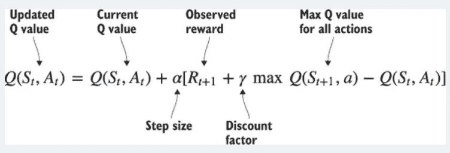
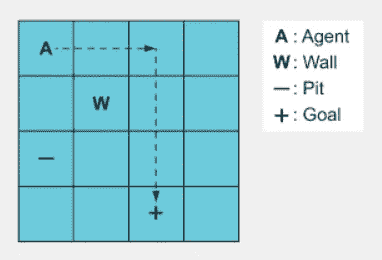
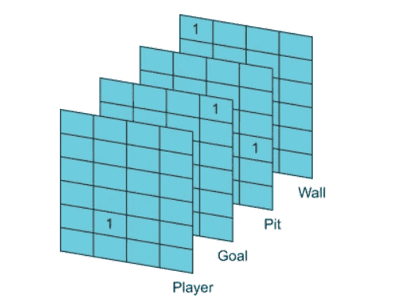
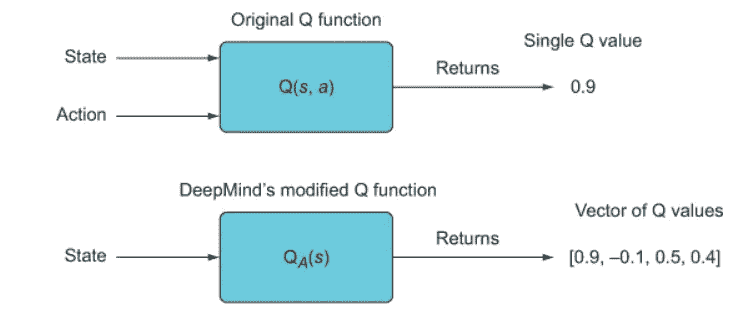
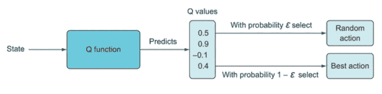
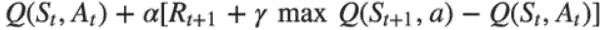
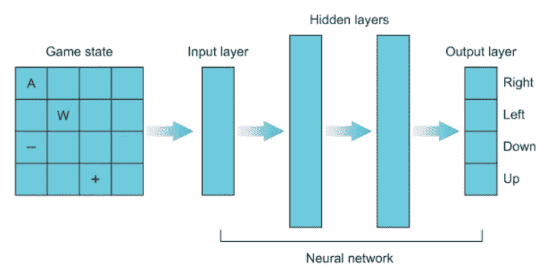
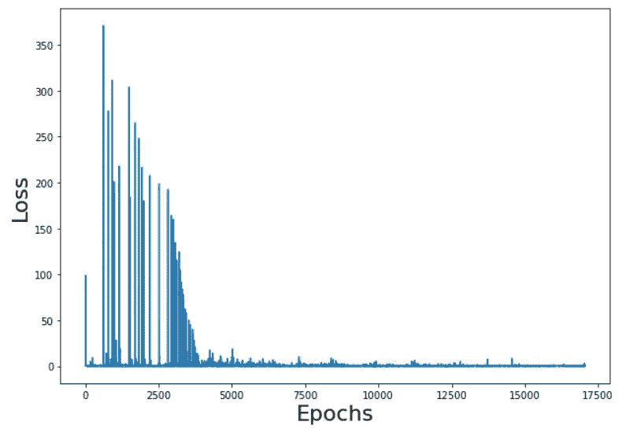
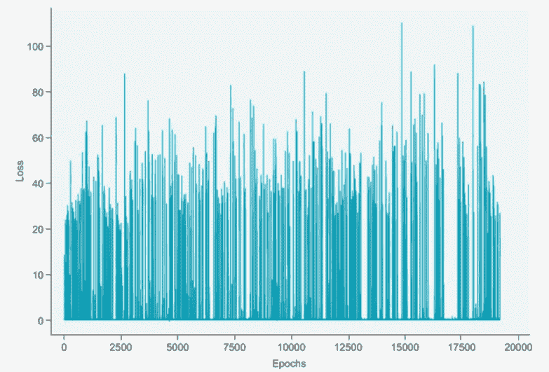

# 第 1 部分——构建深度 Q 网络来玩 grid world——deep mind 的深度 Q 网络

> 原文：<https://towardsdatascience.com/part-1-building-a-deep-q-network-to-play-gridworld-deepminds-deep-q-networks-78842007c631?source=collection_archive---------1----------------------->

> 在本文中，让我们构建一个类似于 DeepMind 的 Atari 代理的深度 Q 网络来玩 Gridworld 问题。我们将从零开始构建与 DeepMind 几乎相同的系统，以详细了解深度 Q 网络。我们将了解香草深 Q 网络的缺点，并想出聪明的方法来克服它们。

在我们之前的[文章](https://nandakishorej8.medium.com/deep-reinforcement-learning-hands-on-for-optimized-ad-placement-b402ffa47245)中，我们已经看到了如何构建一个简单的深度强化学习代理来帮助我们增加数字营销活动的收入。

2013 年，当 DeepMind 建立了一个代理来玩 Atari 游戏并能够击败当时的世界冠军时，深度强化学习被掀起。DeepMind 发表了一篇题为“用深度强化学习玩雅达利”的论文，概述了他们对一种旧算法的新方法，这种方法使他们有足够的性能以创纪录的水平玩七场雅达利 2600 游戏中的六场。他们使用的算法只分析了游戏中与人类相似的像素数据。他们使用的旧算法叫做 Q-learning。DeepMind 对旧算法进行了重大修改，以解决强化学习算法当时遇到的一些问题。

在这篇文章中，我们将理解和建立一个香草深度 Q 学习模型，并讨论它的缺点。稍后我们还将看到 DeepMind 用来克服 vanilla 算法局限性的技术。

***什么是 Q-learning？***

在我们上一篇[文章](https://nandakishorej8.medium.com/deep-reinforcement-learning-hands-on-for-optimized-ad-placement-b402ffa47245)中，当我们建立一个神经网络来优化广告投放问题时，我们实现了一种 Q 学习算法。Q-learning 的主要思想是，你的算法预测一个状态-动作对的值，然后你将这个预测与稍后某个时间观察到的累积奖励进行比较，并更新你的算法的参数，这样下次它就会做出更好的预测。Q-learning 更新规则如下所述



图 1 : Q 学习更新规则

上面的公式告诉我们，在时间 t 更新的 Q 值是当前的 Q 值和未来的预期 Q 值之和，假设我们从当前状态最优地玩。贴现因子(从 0 到 0.99)告诉我们未来的回报对我们采取当前行动有多重要

**什么是 GridWorld？**

图 2 中描述的 Gridworld 游戏展示了 Gridworld 的简单版本。代理(A)必须沿最短路径导航到目标方块(+)，并避免掉入坑中(–)



图 2: GridWorld 游戏

GridWorld 的状态是一个张量，表示网格上所有对象的位置。

我们的目标是训练一个神经网络从头开始玩 Gridworld。代理将有权访问该板的外观。有四种可能的动作，即向上、向下、向左和向右。基于代理采取的行动，将会收到奖励。每次移动获得-1 的奖励。任何导致掉落坑内或墙壁的行为将获得-10 的奖励。成功达成目标可获得+10 的正奖励。

下面是代理在玩 GridWorld 时采取的一系列步骤

1.  游戏的状态

我们在某个状态开始博弈，我们称之为 S( *t)* 。这个状态包含了我们所拥有的关于这个游戏的所有信息。对于我们的 Gridworld 示例，游戏状态表示为一个 4 × 4 × 4 张量。如下图 3 所示，它是 4 X 4 网格的 4 个部分



图 3 : 4X4X4 状态表示

每个网格片代表棋盘上单个对象的位置，包含一个 1，所有其他元素为 0。1 的位置表示该切片对象的位置。由于我们的神经网络代理将使用状态作为输入向量，因此我们的输入层将有 64 个神经元

2.获得期望值预测

在传统的 Q-学习算法中，状态 S( *t* )和坦诚动作被馈送到网络，并且它预测单个值的期望值。在我们的例子中，我们有 4 个可能的行动，网络应该预测期望值 4 次，每个行动作为一个输入。这只会增加网络的开销和处理时间。因此，DeepMind 有了一个想法，让网络预测所有行为的概率分布。随着这种变化，网络只需进行一次预测。但是这次输出向量将包含所有可能动作的概率分布。在我们的例子中，网络的输出是一个长度为 4 的向量。对应于最大概率的动作在任何特定状态下都可以被认为是最佳的。下图解释了这一变化



图 4:最初的 Q 函数接受一个状态-动作对，并返回该状态-动作对的值——一个单一的数字。DeepMind 使用了一个修改的向量值 Q 函数，该函数接受一个状态并返回一个状态-动作值向量，对于给定的输入状态，每个可能的动作都有一个向量值。向量值 Q 函数更有效，因为您只需对所有动作计算一次该函数。

3.选择最佳行动

一旦我们从网络中得到每个状态的概率分布的预测，我们需要选择一个要采取的行动。为此我们可以使用ε贪婪策略。对于ε-贪婪策略，我们选择ε的值，对于该概率，我们选择忽略预测概率的随机动作(探索)。对于概率 1-ε，我们将选择与最高预测 Q 值相关联的动作。



图 5:在ε-贪婪动作选择方法中，我们将ε参数设置为某个值，例如 0.1，并且利用该概率，我们将随机选择动作(完全忽略预测的 Q 值)，或者利用概率 1-ε= 0.9，我们将选择与最高预测的 Q 值相关联的动作。另一个有用的技术是从高ε值开始，比如 1，然后在训练迭代中慢慢递减。

一旦行动被选择为 A(t)，我们将在一个新的状态 S(t+1)中结束，观察到的回报为 R(t+1)。我们在 S(t)得到的期望值的预测就是预测的 Q(S(t)，A(t))。我们现在想更新我们的网络，让它知道采取了建议的行动后收到的实际奖励

4.在(t+1)获得奖励

现在，我们在 s(t+1)运行网络，得到我们称为 Q(S(t+1)，a)的期望值，并计算出我们需要采取的行动。明确地说，这是一个单一的值，它反映了给定我们的新状态和所有可能的动作的最高预测值 *Q* 。

5.更新网络

我们将使用一些损失函数(如均方误差)执行一次迭代训练，以最小化网络预测值与目标预测值之间的差异



对于第一次阅读的读者来说，上面的步骤可能会令人困惑(甚至当我第一次浏览这些概念时也感到困惑)。让我们开始编码，我相信混乱会被清除

我们来编码吧！！！

**创建 GridWorld 游戏**

您将在[这个](https://github.com/NandaKishoreJoshi/Reinforcement_Lerning/tree/main/RL_course/Ch3_Gridworld) GIT 存储库中找到两个名为 GridWorld.py 和 GridBoard.py 的文件。请下载它们并将它们保存在构建 RL 代理的同一个文件夹中。这些包含一些运行游戏实例的类。您可以通过下面的代码创建一个游戏实例

```
from Gridworld import Gridworld
game = Gridworld(size=4, mode='static')
```

有三种方法可以初始化电路板。第一种是静态初始化它，如上所示，这样棋盘上的对象在相同的预定位置被初始化。第二，你可以设置 mode='player ',这样只有玩家在棋盘上的随机位置被初始化。最后，你可以使用 mode='random '初始化它，这样所有的对象都是随机放置的(这对于算法来说更难学习)。我们最终会使用所有三个选项。在[这个](https://github.com/NandaKishoreJoshi/Reinforcement_Lerning/blob/main/RL_course/Ch3_Gridworld/Deep%20Q-Learning%20for%20GridWorld%20-%20Venilla%20model.ipynb) GIT 链接中可以找到更多关于移动和检查奖励的操作

**建立一个神经网络作为 Q 函数**

让我们建立一个神经网络作为 Q 函数。我们已经讨论了神经网络的输入和输出向量大小。我们的输入将是 4X4X4 向量(状态向量)，输出将是 4 元素向量，这是所有可能动作(上、下、左、右)的概率分布。



图 6:具有用作 Q 函数的两个隐藏层的神经网络

Pytorch 中神经网络的代码如下所示

```
import numpy as np
import torch
from Gridworld import Gridworld
import random
from matplotlib import pylab as plt

l1 = 64
l2 = 150
l3 = 100
l4 = 4

model = torch.nn.Sequential(
    torch.nn.Linear(l1, l2),
    torch.nn.ReLU(),
    torch.nn.Linear(l2, l3),
    torch.nn.ReLU(),
    torch.nn.Linear(l3,l4)
)
loss_fn = torch.nn.MSELoss()
learning_rate = 1e-3
optimizer = torch.optim.Adam(model.parameters(), lr=learning_rate)

gamma = 0.9
epsilon = 1.0
```

一旦神经网络准备就绪，我们需要创建一个训练循环来训练我们的 RL 代理，并使它按照图 1 中给出的 Q 学习公式进行学习。为此，我们遵循以下步骤

1.  为循环创建一个*来表示周期数*
2.  初始化 GridWorld 的状态
3.  创建一个 *while* 循环来监控游戏的情节
4.  向前运行 Q 网络以获得当前状态的评估 Q 值
5.  用贪婪的ε方法来选择行动
6.  采取上一步中决定的行动，以达到一个新的状态 s ’,回报为 r(t+1)
7.  在状态 s '运行 Q 网络向前，并收集最高的 Q 值，我们称之为 maxQ
8.  我们训练网络的目标值是*r(t*+1)+*γ** max*QA*(*S(t*+1))，其中γ(γ)是一个介于 0 和 1 之间的参数。如果在采取动作*后游戏结束，没有合法的 *s(t* +1)，那么*γ** max*QA*(*S(t*+1))无效，我们可以将其设置为 0。目标正好变成 *r(t* +1)。*
9.  假设我们有四个输出，我们只想更新(即训练)与我们刚刚采取的行动相关联的输出，我们的目标输出向量与第一次运行的输出向量相同，只是我们将与我们的行动相关联的一个输出更改为我们使用 Q-learning 公式计算的结果。
10.  在这一步训练模型，并重复步骤 2 到 9

上述步骤的代码如下所述

```
epochs = 1000
losses = []                                            1
for i in range(epochs):                                2
    game = Gridworld(size=4, mode='static')            3
    state_ = game.board.render_np().reshape(1,64) \ 
             + np.random.rand(1,64)/10.0               4
    state1 = torch.from_numpy(state_).float()          5
    status = 1                                         6
    while(status == 1):                                7
        qval = model(state1)                           8
        qval_ = qval.data.numpy()
        if (random.random() < epsilon):                9
            action_ = np.random.randint(0,4)
        else:
            action_ = np.argmax(qval_)

        action = action_set[action_]                   10
        game.makeMove(action)                          11
        state2_ = game.board.render_np().reshape(1,64) +
     np.random.rand(1,64)/10.0
        state2 = torch.from_numpy(state2_).float()     12
        reward = game.reward()
        with torch.no_grad():
            newQ = model(state2.reshape(1,64))
        maxQ = torch.max(newQ)                         13
        if reward == -1:                               14
            Y = reward + (gamma * maxQ)
        else:
            Y = reward
        Y = torch.Tensor([Y]).detach()
        X = qval.squeeze()[action_]                    15
        loss = loss_fn(X, Y)
        optimizer.zero_grad()
        loss.backward()
        losses.append(loss.item())
        optimizer.step()
        state1 = state2
        if reward != -1:                               16
            status = 0
    if epsilon > 0.1:                                  17
        epsilon -= (1/epochs)
```

1 创建一个列表来存储损失值，这样我们可以在以后绘制趋势图
2 主训练循环
3 对于每个时期，我们开始一个新游戏。
4 在我们创建游戏后，我们提取状态信息，并添加少量噪声。这样做是为了避免 ReLU 激活时发生的“死神经元”
5 将 numpy 数组转换为 PyTorch 张量，然后转换为 PyTorch 变量
6 使用状态变量来跟踪游戏是否仍在进行中
7 当游戏仍在进行时， 玩到结束，然后开始一个新的时期
8 向前运行 Q 网络以获得所有动作的预测 Q 值
9 使用ε-贪婪方法选择一个动作
10 将数字动作翻译成我们的 Gridworld 游戏期望的动作角色之一
11 在使用ε-贪婪方法选择一个动作之后，在移动之后采取动作
12， 获得游戏的新状态
13 找到根据新状态预测的最大 Q 值
14 计算目标 Q 值
15 创建 qval 数组的副本，然后更新与所采取的动作相对应的一个元素
16 如果奖励为–1，则游戏尚未赢或输，并且仍在进行中
17 在每个时期递减ε值

我们也行动起来。GridWorld 希望动作是字母形式的，比如 u 代表 up 等等。该字典将数字映射到相应的动作，如下所示

```
action_set = {
    0: 'u',
    1: 'd',
    2: 'l',
    3: 'r',
}
```

对上述网络进行 1000 个纪元的训练会给我们带来惊人的结果。一旦训练完毕，我们可以看到损失如下减少



图 7:静态环境下训练后各时期的损失减少

测试模型的代码如下所示。测试函数与 train 相同，只是我们没有将损失计算反向传播到模型中。我们只是向前运行模型以获得预测，并使用具有最大值的动作。

```
def test_model(model, mode='static', display=True):
    i = 0
    test_game = Gridworld(mode=mode)
    state_ = test_game.board.render_np().reshape(1,64) + np.random.rand(1,64)/10.0
    state = torch.from_numpy(state_).float()
    if display:
        print("Initial State:")
        print(test_game.display())
    status = 1
    while(status == 1):                1
        qval = model(state)
        qval_ = qval.data.numpy()
        action_ = np.argmax(qval_)     2
        action = action_set[action_]
        if display:
            print('Move #: %s; Taking action: %s' % (i, action))
        test_game.makeMove(action)
        state_ = test_game.board.render_np().reshape(1,64) + np.random.rand(1,64)/10.0
        state = torch.from_numpy(state_).float()
        if display:
            print(test_game.display())
        reward = test_game.reward()
        if reward != -1:
            if reward > 0:
                status = 2
                if display:
                    print("Game won! Reward: %s" % (reward,))
            else:
                status = 0
                if display:
                    print("Game LOST. Reward: %s" % (reward,))
        i += 1
        if (i > 15):
            if display:
                print("Game lost; too many moves.")
            break
    win = True if status == 2 else False
    return win
```

用静态模型运行上面的测试函数将会得到类似这样的结果

```
test_model(model, 'static')
Initial State:
[['+' '-' ' ' 'P']
 [' ' 'W' ' ' ' ']
 [' ' ' ' ' ' ' ']
 [' ' ' ' ' ' ' ']]
Move #: 0; Taking action: d
[['+' '-' ' ' ' ']
 [' ' 'W' ' ' 'P']
 [' ' ' ' ' ' ' ']
 [' ' ' ' ' ' ' ']]
Move #: 1; Taking action: d
[['+' '-' ' ' ' ']
 [' ' 'W' ' ' ' ']
 [' ' ' ' ' ' 'P']
 [' ' ' ' ' ' ' ']]
Move #: 2; Taking action: l
[['+' '-' ' ' ' ']
 [' ' 'W' ' ' ' ']
 [' ' ' ' 'P' ' ']
 [' ' ' ' ' ' ' ']]
Move #: 3; Taking action: l
[['+' '-' ' ' ' ']
 [' ' 'W' ' ' ' ']
 [' ' 'P' ' ' ' ']
 [' ' ' ' ' ' ' ']]
Move #: 4; Taking action: l
[['+' '-' ' ' ' ']
 [' ' 'W' ' ' ' ']
 ['P' ' ' ' ' ' ']
 [' ' ' ' ' ' ' ']]
Move #: 5; Taking action: u
[['+' '-' ' ' ' ']
 ['P' 'W' ' ' ' ']
 [' ' ' ' ' ' ' ']
 [' ' ' ' ' ' ' ']]
Move #: 6; Taking action: u
[['+' '-' ' ' ' ']
 [' ' 'W' ' ' ' ']
 [' ' ' ' ' ' ' ']
 [' ' ' ' ' ' ' ']]
Reward: 10
```

我们可以看到，在静态下，该模型表现非常好。但是在随机状态下性能不是很好

```
>>> testModel(model, 'random')
Initial State:
[[' ' '+' ' ' 'P']
 [' ' 'W' ' ' ' ']
 [' ' ' ' ' ' ' ']
 [' ' ' ' '-' ' ']]
Move #: 0; Taking action: d
[[' ' '+' ' ' ' ']
 [' ' 'W' ' ' 'P']
 [' ' ' ' ' ' ' ']
 [' ' ' ' '-' ' ']]
Move #: 1; Taking action: d
[[' ' '+' ' ' ' ']
 [' ' 'W' ' ' ' ']
 [' ' ' ' ' ' 'P']
 [' ' ' ' '-' ' ']]
Move #: 2; Taking action: l
[[' ' '+' ' ' ' ']
 [' ' 'W' ' ' ' ']
 [' ' ' ' 'P' ' ']
 [' ' ' ' '-' ' ']]
Move #: 3; Taking action: l
[[' ' '+' ' ' ' ']
 [' ' 'W' ' ' ' ']
 [' ' 'P' ' ' ' ']
 [' ' ' ' '-' ' ']]
Move #: 4; Taking action: l
[[' ' '+' ' ' ' ']
 [' ' 'W' ' ' ' ']
 ['P' ' ' ' ' ' ']
 [' ' ' ' '-' ' ']]
Move #: 5; Taking action: u
[[' ' '+' ' ' ' ']
 ['P' 'W' ' ' ' ']
 [' ' ' ' ' ' ' ']
 [' ' ' ' '-' ' ']]
Move #: 6; Taking action: u
[['P' '+' ' ' ' ']
 [' ' 'W' ' ' ' ']
 [' ' ' ' ' ' ' ']
 [' ' ' ' '-' ' ']]
Move #: 7; Taking action: d
[[' ' '+' ' ' ' ']
 ['P' 'W' ' ' ' ']
 [' ' ' ' ' ' ' ']
 [' ' ' ' '-' ' ']]

# we omitted the last several moves to save space

Game lost; too many moves.
```

我们看到，在随机模式下，代理人无法赢得游戏。在随机模式下训练模型也不太成功，导致损失图如下



图 8:在随机环境模式下训练模型的损失图

**哪里出了问题？**

我们能够在一个静态环境中训练我们的模型，每次模型在相同的位置看到物体、玩家和目标。但是当代理接受更复杂的初始化训练时，每次创建新的一集时，环境都会被随机初始化，它无法学习。这是 DeepMind 也面临的问题，并称之为“灾难性遗忘”。他们想出了一个非常简单但非常棒的方法来克服这个问题，这个方法被称为“经验重演”。

让我们在本文的下一部分[这里](https://nandakishorej8.medium.com/part-2-building-a-deep-q-network-to-play-gridworld-catastrophic-forgetting-and-experience-6b2b000910d7)详细了解问题和解决方案。

从 [GIT](https://github.com/NandaKishoreJoshi/Reinforcement_Lerning/blob/main/RL_course/Ch3_Gridworld/Part%201%20-%20Deep%20Q-Learning%20for%20GridWorld%20-%20Vanilla%20model.ipynb) 链接获取本文使用的完整代码

**到现在！！**

1.  我们从理解什么是 Q 学习和用于更新 Q 学习的公式开始这篇文章
2.  后来我们看到了 GridWorld 游戏，并定义了它的状态、动作和奖励。
3.  然后我们想出了一个强化学习的方法来赢得比赛
4.  我们学习了如何导入 GridWorld 环境和环境的各种模式
5.  设计并建立了一个神经网络作为 Q 函数。
6.  我们对 RL 代理进行了训练和测试，在解决静态网格世界问题上取得了很好的效果。但我们未能解决随机网格世界。
7.  我们知道问题是什么，并承诺在我们的下一篇文章中解决它

点击这里查看文章的第二部分:

<https://nandakishorej8.medium.com/part-2-building-a-deep-q-network-to-play-gridworld-catastrophic-forgetting-and-experience-6b2b000910d7> 