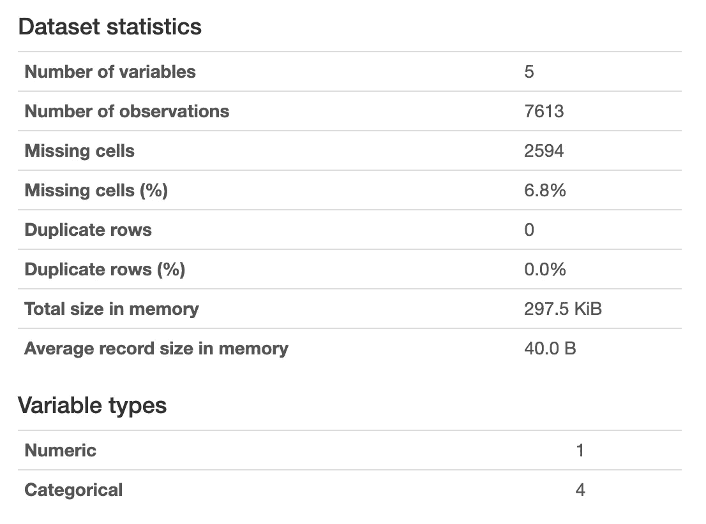
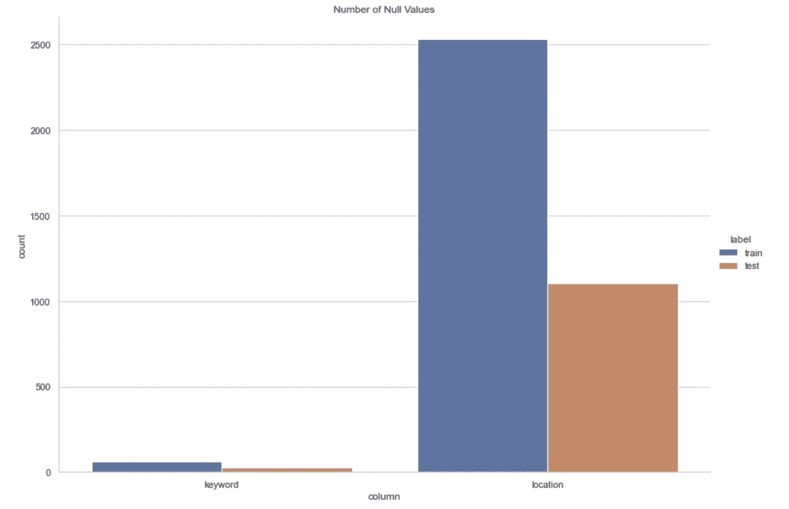
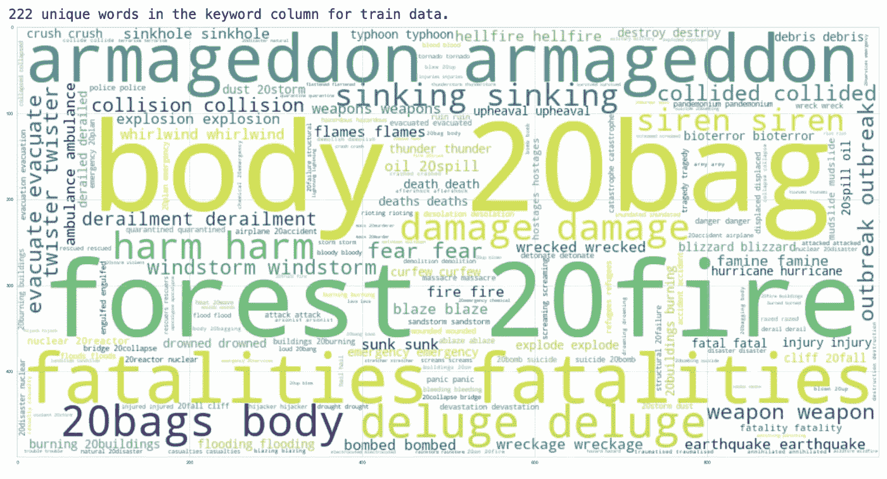
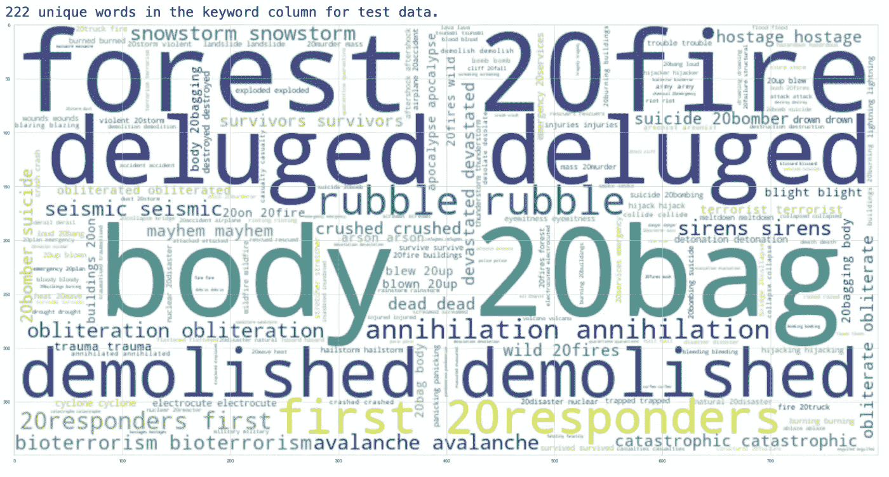
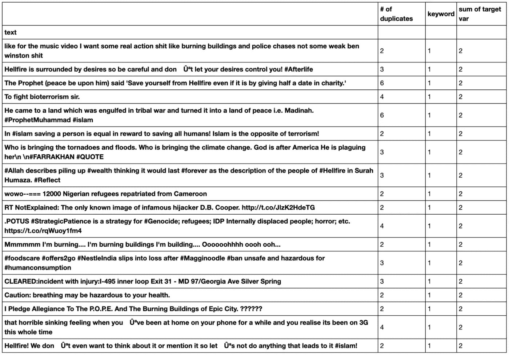

# BERT 需要干净的数据吗？第 1 部分:数据清理。

> 原文：<https://towardsdatascience.com/part-1-data-cleaning-does-bert-need-clean-data-6a50c9c6e9fd?source=collection_archive---------4----------------------->


一场可能会在推特上传播的灾难。照片由 [sippakorn yamkasikorn](https://unsplash.com/@sippakorn?utm_source=medium&utm_medium=referral) 在 [Unsplash](https://unsplash.com?utm_source=medium&utm_medium=referral) 拍摄。

## 以 84%的准确率检测灾难，并测试 NLP 方法，以找到为 BERT 清理数据的最佳方式。

> *如果我把碧昂斯的 Met Gala 礼服描述为“飓风”，那么飓风碧昂斯会成为一件东西吗？*

*对清理数据不感兴趣，只想了解不同级别的数据清理，以及这对 BERT 有何影响？跳到* [*第二部分*](https://medium.com/@Alexander.Bricken/does-bert-need-clean-data-part-2-classification-d29adf9f745a) *。*

# 介绍

在本文中，我们使用 Kaggle 上的[灾难推文竞赛](https://www.kaggle.com/c/nlp-getting-started/overview)数据集来学习典型的数据科学&机器学习实践，更具体地说是关于自然语言处理(NLP)。通过应用不同的文本清理方法，然后运行变压器的双向编码器表示(BERT)来预测常规推文中的灾难，我们可以比较模型，并查看文本清理对准确性的影响。最终结果是竞争中的前 50 名提交率约为 84%。

我希望你能通过阅读这篇文章了解以下内容:

*   通过执行以下操作探索典型的数据科学和机器学习实践:为机器学习导入、探索、清理和准备数据。
*   应用特定的 NLP 数据准备技术，例如通过创建元特征的特征工程和使用符号化的文本清理。
*   应用自然语言处理的最新语言模型 BERT，并找出 BERT 模型的最佳输入。

# 目标

这个项目的主要目标是区分指示世界灾难的推文和那些包含灾难词汇但关于灾难以外的其他事情的推文。这样做，我们可以理解输入文本影响 BERT 的方式；具体来说，如果文本或多或少被清理会有所不同！

这是一个很难解决的问题，因为很多“灾难词汇”经常被用来描述日常生活。例如，有人可能将鞋子描述为“火”,这可能会混淆我们的模型，导致我们没有注意到世界各地正在发生的实际火灾！


一只消防鞋。[文刚斋](https://unsplash.com/@wgzhai?utm_source=medium&utm_medium=referral)在 [Unsplash](https://unsplash.com?utm_source=medium&utm_medium=referral) 上的照片。

所以，事不宜迟，让我们开始研究解决这个令人兴奋的问题的方法吧！

# 方法

总而言之，这个项目被分成四个笔记本。第一本包含必要的数据准备，随后的笔记本(2，3，& 4)都是获得我们预测的不同方法。

**笔记本 1(资料准备):**

1.  导入库
2.  导入数据
3.  数据探索
4.  数据准备
5.  计算元特征

**笔记本 2(元特写 CNN):**

1.  导入准备好的数据
2.  标准化
3.  卷积神经网络
4.  模型评估和提交

**笔记本 3(大扫除伯特):**

1.  导入准备好的数据
2.  带有正则表达式的大量干净文本
3.  词汇化
4.  标记化
5.  伯特建模
6.  模型评估和提交

**笔记本 4(轻清洁伯特):**

1.  导入准备好的数据
2.  带有正则表达式的简洁文本
3.  标记化
4.  伯特建模
5.  模型评估和提交

注意:要查看该项目的完整代码，请在这里查看 GitHub 库。

# 数据准备

## 导入数据

为了导入我们的数据，我们在下载数据并将其放入正确的目录后编写以下内容:

```
raw_test_data = pd.read_csv("../data/raw/test.csv") 
raw_train_data = pd.read_csv("../data/raw/train.csv") # check your output by just running the following: 
raw_train_data
```

# 数据探索

为了探索我们的数据，我们使用熊猫图谱。这是一个有用的库，可以快速获得我们刚刚导入的数据的大量描述性统计数据。

```
profile = ProfileReport(raw_train_data, title="Pandas Profiling Report")profile.to_notebook_iframe()
```

这应该会在你的 Jupyter 笔记本上加载一个很好的小部件。它会给你提供一些很棒的描述性统计数据，比如这个！



熊猫图谱的输出。图片作者。

具体来说，通过使用 Pandas Profiling，我们可以检查数据集的一些基本特征:

*   训练数据集中目标变量的类别分布。这是一个 4342 (0)，3271 (1)的分裂。这种接近相等的分离对于训练我们的模型是可以的。
*   缺失数据。我们看到 location 和 keyword 列包含缺失的数据。这将在下面处理。
*   基数。我们的位置价值非常独特。这也在下面讨论和处理。

从这里，我们可以继续我们的数据准备和处理这些问题，我们已经强调了！

# 数据准备

`location`和`keyword`包含空值，如 pandas profiling 报告所示。

我们通过首先更深入地检查空值的数量来处理这个问题。

```
foo = [(raw_train_data[['keyword', 'location']].isnull().sum().values, raw_test_data[['keyword', 'location']].isnull().sum().values)]out = np.concatenate(foo).ravel()
null_counts = pd.DataFrame({
"column": ['keyword', 'location', 'keyword', 'location'],
"label": ['train', 'train', 'test', 'test'],
"count": out
})sns.catplot(x="column", y="count", data=null_counts, hue="label", kind="bar", height=8.27, aspect=11.7/8.27)
plt.title('Number of Null Values')
plt.show()
```



上面的代码输出的图形。这告诉我们在训练和测试数据集中跨关键字和位置列的 null 值的数量。图片作者。

Twitter 上的位置是由用户填充的，因此过于随意。唯一值太多，输入没有标准化。我们可以去掉这个特性。

```
# drop location data
clean_train_data = raw_train_data.drop(columns="location")
clean_test_data = raw_test_data.drop(columns="location")
```

另一方面，关键字作为一种识别灾难的方式是很有趣的。这是因为有些关键词确实只在特定的上下文中使用。

我们的关键词长什么样？我们可以为我们的训练和测试数据集输出单词云来检验这一点。



用于训练数据的词云。图片作者。



测试数据的词云。图片作者。

我们看到在治疗和控制中的关键词之间有很好的重叠。关键字只是查看数据的一种方式，如果我们只检查关键字，就没有足够的上下文来生成准确的预测。同样，因为我们正在实现一个 BERT 模型，它完全是关于一个单词在句子中的上下文，我们不想做任何事情，比如在相关 Tweet 的末尾添加关键字，以增加该单词的权重。

在我们的模型中利用关键词的一个聪明的方法是将关键词转换成情感分数。这样，我们就有了一个作为元特征的价值，而不会改变推文中包含的重要信息。我们通过使用 NLTK 库的内置的、预先训练好的情感分析器 VADER 来做到这一点。

```
# drop nan keyword rows in train dataset
clean_train_data = clean_train_data.dropna(subset=['keyword']).reset_index(drop=True)# we fill none into the Nan Values of the test dataset, to give 0 sentiment
clean_test_data['keyword'] = clean_test_data['keyword'].fillna("None")# collect keywords into arrays
train_keywords = clean_train_data['keyword']
test_keywords = clean_test_data['keyword']# use sentiment analyser
sia = SentimentIntensityAnalyzer()
train_keyword_sia = [sia.polarity_scores(i)['compound'] for i in train_keywords]
test_keyword_sia = [sia.polarity_scores(i)['compound'] for i in test_keywords]# update keyword column
clean_train_data['keyword'] = train_keyword_sia
clean_test_data['keyword'] = test_keyword_sia
```

最后，我们检查重复数据和相应的重复标签。

```
# check for duplicates using groupby
df_nondupes = clean_train_data.groupby(['text']).nunique().sort_values(by='target', ascending=False)# find duplicates with target > 1 as a way of flagging if they are duplicate
df_dupes = df_nondupes[df_nondupes['target'] > 1]
df_dupes.rename(columns={'id':'# of duplicates', 'target':'sum of target var'})
```

我们看到有一些重复。当训练我们的模型时，我们不希望有任何重复，因为它会使我们的输出产生偏差。如果它们也被贴上不同的标签，情况会特别糟糕。从输出中，我们可以看到它们是。这对于具有相同特征但不同标签的模型来说是额外的混淆。



副本表。“重复的数量”和“目标变量的总和”之间的差异表示标记不同的重复。图片作者。

如果我们遍历这些副本，我们可以手动分别标记它们，这样我们就保留了数据。这是必要的，因为它们中的一些被贴错标签并且是重复的。例如，第一行有三个副本，但其中两个的目标标签为 1，另一个的目标标签为 0。如上所述，通过`# of duplicates`与`sum of target var`的差异，可以在整个表格中看到这一点。

```
# take index which is the texts themselves
dupe_text_list = df_dupes.index dupe_text_list = list(dupe_text_list)# manually make label list to iterate
right_labels = [0,0,0,1,0,0,1,0,1,1,1,0,1,1,1,0,0,0]# drop duplicates except for one
clean_train_data = clean_train_data.drop_duplicates(subset=['text'], keep='last').reset_index(drop=True)# relabel duplicate rows
for i in range(len(dupe_text_list)):
clean_train_data.loc[clean_train_data['text'] == dupe_text_list[i], 'target'] = right_labels[i]
```

# 计算元特征

既然我们的数据已经清理和准备好了，我们就要开始有趣的事情了！

我们需要更多地了解我们的数据，并将其分离成更多的功能。通过思考我们可以产生的不同变量，这些变量可能有助于我们区分灾难和非灾难，我们可以在更多的特征上训练我们的模型。这将为我们的模型提供更多的可见性。考虑表示灾难的推文的最佳方式是，它们可能来自更高质量的来源，性质更严重。因此，遵循更严格的语法规则，充分报告情况，并分享链接。以下元特征，以及从关键词栏计算出的我们的情感得分，将代表我们正在寻找的推文类型(从[这里](https://www.kaggle.com/gunesevitan/nlp-with-disaster-tweets-eda-cleaning-and-bert)中精选)。

*   标签数(#)(假设(H):标签由普通用户而不是新闻机构使用)
*   `num_mentions` -提及次数(@) (H:普通用户可以使用更多标签，而不是新闻机构)
*   `num_words` -字数统计(H:推特上适当报道的字数比普通用户推特上的多)
*   `num_stop_words` -停用词的数量(H:通过新闻机构的适当语法使用更多停用词)
*   `num_urls` -网址数量(H:报道灾难的新闻机构共享的网址)
*   `avg_word_length` -单词的平均字符数(H:新闻机构使用的不缩写的较长单词)
*   `num_chars` -字符数(H:在新闻机构的推文中使用更多字符来报道完整的故事)
*   `num_punctuation` -标点符号计数(H:在符合正确语法的新闻机构推文中有更多标点符号)

我们使用这些代码来构建这些特性。

```
### num_hashtags 
clean_train_data['num_hashtags'] = clean_train_data['text'].apply(lambda x: len([c for c in str(x) if c == '#'])) clean_test_data['num_hashtags'] = clean_test_data['text'].apply(lambda x: len([c for c in str(x) if c == '#'])) ### num_mentions 
clean_train_data['num_mentions'] = clean_train_data['text'].apply(lambda x: len([c for c in str(x) if c == '@'])) clean_test_data['num_mentions'] = clean_test_data['text'].apply(lambda x: len([c for c in str(x) if c == '@'])) ### num_words 
clean_train_data['num_words'] = clean_train_data['text'].apply(lambda x: len(str(x).split())) clean_test_data['num_words'] = clean_test_data['text'].apply(lambda x: len(str(x).split())) ### num_stop_words 
clean_train_data['num_stop_words'] = clean_train_data['text'].apply(lambda x: len([w for w in str(x).lower().split() if w in STOPWORDS])) clean_test_data['num_stop_words'] = clean_test_data['text'].apply(lambda x: len([w for w in str(x).lower().split() if w in STOPWORDS])) ### num_urls 
clean_train_data['num_urls'] = clean_train_data['text'].apply(lambda x: len([w for w in str(x).lower().split() if 'http' in w or 'https' in w])) clean_test_data['num_urls'] = clean_test_data['text'].apply(lambda x: len([w for w in str(x).lower().split() if 'http' in w or 'https' in w])) ### avg_word_length 
clean_train_data['avg_word_length'] = clean_train_data['text'].apply(lambda x: np.mean([len(w) for w in str(x).split()])) clean_test_data['avg_word_length'] = clean_test_data['text'].apply(lambda x: np.mean([len(w) for w in str(x).split()])) ### num_chars 
clean_train_data['num_chars'] = clean_train_data['text'].apply(lambda x: len(str(x))) clean_test_data['num_chars'] = clean_test_data['text'].apply(lambda x: len(str(x))) ### num_punctuation 
clean_train_data['num_punctuation'] = clean_train_data['text'].apply(lambda x: len([c for c in str(x) if c in string.punctuation])) clean_test_data['num_punctuation'] = clean_test_data['text'].apply(lambda x: len([c for c in str(x) if c in string.punctuation]))
```

请记住，您可以编写 clean_train_data 并运行单元来查看我们当前的熊猫数据框架是什么样子的！

此时，我们已经从数据集中清除了空变量，计算了我们的元特征，并去除了错误标签和重复项。

我们应该保存我们的数据集。我们用泡菜来做这个！

```
# we save these as pickles
clean_train_data.to_pickle(“../data/pickles/clean_train_data.pkl”)
clean_test_data.to_pickle(“../data/pickles/clean_test_data.pkl”)
```

我们现在可以执行以下操作:

*   稍微清理一下文本数据，不要删除停用词或 Tweets 的其他上下文片段，然后运行 BERT。
*   彻底清理文本数据，删除停用词和其他可能混淆模型的功能，然后运行 BERT。
*   从文本数据中分离出元特征，并尝试运行 CNN。

从那里，我们可以适当地比较我们的模型的准确性。因为 BERT 是一种语言模型，它从两个方向利用句子的结构将每个输出元素连接到每个输入元素，并根据这种连接动态调整权重(这一过程称为注意力)，所以我的假设是较轻的预处理会做得更好。这是因为停用词和句子的其他语法特征可能有助于模型的注意力。换句话说，伯特避免给单词赋予独立于上下文的固定含义。相反，单词是由它们周围的单词定义的。

# 后续步骤

我们在哪里生成预测并了解更多关于 BERT、机器学习以及我们的数据清理过程如何影响结果的信息，请参见媒体上的[第 2 部分](https://medium.com/@Alexander.Bricken/does-bert-need-clean-data-part-2-classification-d29adf9f745a)或我个人网站上的[第 2 部分](https://bricken.co/nlp_disaster_tweets_2/)。

如果你喜欢这篇文章，请在[推特](https://twitter.com/abrickand)上关注我！我每天都在建造。

感谢阅读！

# 文献学

A.Pai，[什么是标记化？](https://www.analyticsvidhya.com/blog/2020/05/what-is-tokenization-nlp/)，(2020)，分析维迪亚

G.Evitan， [NLP 与灾难推文:EDA，清洁和 BERT](https://www.kaggle.com/gunesevitan/nlp-with-disaster-tweets-eda-cleaning-and-bert) ，(2019)，Kaggle 笔记本

G.Giacaglia，[变形金刚如何工作](/transformers-141e32e69591)，(2019)，走向数据科学

I A. Khalid，[用 Python 清理文本数据](/cleaning-text-data-with-python-b69b47b97b76)，(2020)，走向数据科学

J.Devlin 和 M-W. Chang，[谷歌人工智能博客:开源 BERT](https://ai.googleblog.com/2018/11/open-sourcing-bert-state-of-art-pre.html) ，(2018)，谷歌博客

J.朱，[班底模型对比](https://web.stanford.edu/class/archive/cs/cs224n/cs224n.1194/reports/default/15708284.pdf)，(未注明)，斯坦福大学

Kaggle 团队，[自然语言处理与灾难推文](https://www.kaggle.com/c/nlp-getting-started/overview) (2021)，Kaggle 竞赛

页（page 的缩写）普拉卡什，[伯特·托肯泽](https://www.analyticsvidhya.com/blog/2021/09/an-explanatory-guide-to-bert-tokenizer/)的解释性指南，(2021)，分析维迪亚

南蒂勒，[使用预训练手套向量的基础知识](https://medium.com/analytics-vidhya/basics-of-using-pre-trained-glove-vectors-in-python-d38905f356db)，(2019)，分析 Vidhya

维基百科， [F 分数](https://en.wikipedia.org/wiki/F-score)，(未注明)，维基百科