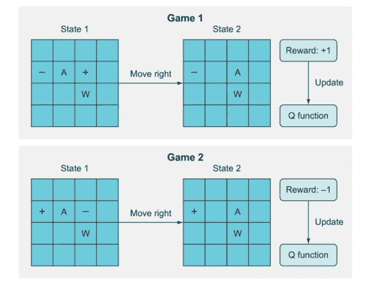
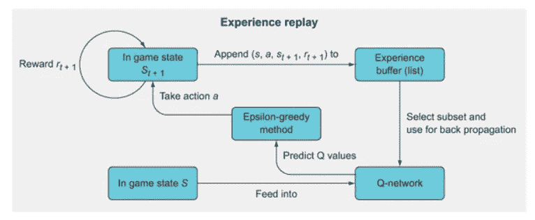
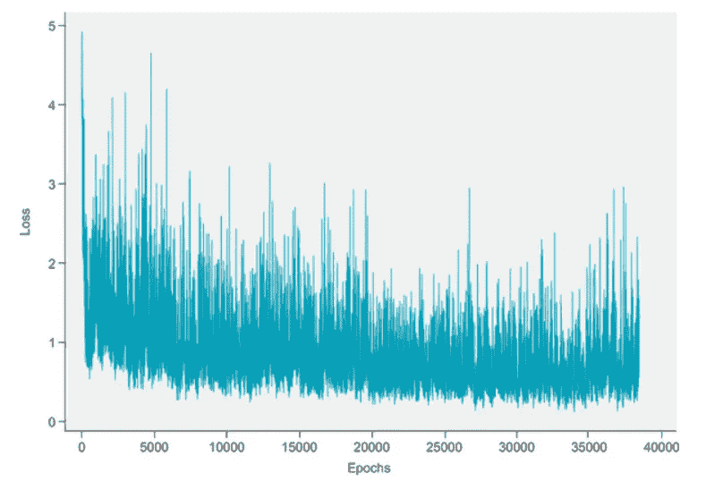

# 第二部分——构建深度 Q 网络玩 grid world——灾难性遗忘和经验重演

> 原文：<https://towardsdatascience.com/part-2-building-a-deep-q-network-to-play-gridworld-catastrophic-forgetting-and-experience-6b2b000910d7?source=collection_archive---------10----------------------->

> 在这篇文章中，我们来讨论一下普通 Q 学习模型中的问题:灾难性遗忘。我们将使用经验回放来解决这个问题，看看我们在玩 GridWorld 时所做的改进

欢迎来到深度 Q-网络教程的第二部分。这是[第一部](https://nandakishorej8.medium.com/part-1-building-a-deep-q-network-to-play-gridworld-deepminds-deep-q-networks-78842007c631)的延续。如果你还没有阅读第 1 部分，我强烈建议你通读一遍，因为这篇文章中的许多代码和解释将直接关系到那些已经在[第 1 部分](https://nandakishorej8.medium.com/part-1-building-a-deep-q-network-to-play-gridworld-deepminds-deep-q-networks-78842007c631)中解释过的。

**至今** [**第一部**](https://nandakishorej8.medium.com/part-1-building-a-deep-q-network-to-play-gridworld-deepminds-deep-q-networks-78842007c631) **！！**

1.  我们从理解什么是 Q 学习和用于更新 Q 学习的公式开始
2.  后来我们看到了 GridWorld 游戏，并定义了它的状态、动作和奖励。
3.  然后我们想出了一个强化学习的方法来赢得比赛
4.  我们学习了如何导入 GridWorld 环境和环境的各种模式
5.  设计并建立了一个神经网络作为 Q 函数。
6.  我们对 RL 代理进行了训练和测试，在解决静态网格世界问题上取得了很好的效果。但我们未能解决随机网格世界。
7.  我们了解问题所在，并承诺在本文中解决问题

**什么问题？？**

> 我们能够在静态环境中训练我们的模型，每次模型在相同的位置看到物体、玩家和目标。但是当代理接受更复杂的初始化训练时，每次创建新的一集时，环境都会被随机初始化，它无法学习。

上述问题的名称是灾难性遗忘。这是一个与基于梯度下降的训练相关的重要问题，当我们在游戏中的每个动作后反向移动时，我们称之为在线训练。

灾难性遗忘的想法是，当两个游戏状态非常相似，但却导致非常不同的结果时，Q 函数将变得“混乱”,无法知道该做什么。在下面的例子中，灾难性的遗忘发生了，因为 Q 函数从游戏 1 中得知向右移动会得到+1 的奖励，但是在游戏 2 中，看起来非常相似，向右移动后它会得到-1 的奖励。结果，该算法忘记了它先前学习的关于游戏 1 的内容，导致基本上根本没有显著的学习。



图 1:紧密相关的状态导致灾难性遗忘

灾难性遗忘的原因是我们在游戏的每一步棋后都在更新权重。在监督学习领域，我们通常没有这个问题，因为我们进行随机批量学习，直到我们迭代了训练数据的一些随机子集并计算了批量的总和或平均梯度，我们才更新我们的权重。这在目标上是平均的，并且稳定了学习。

我们能在 DQN 做吗？

是的，这就是所谓的*体验回放*。体验回放让我们在在线学习模式中批量更新。



图 2:体验回放

上图显示了经验重放的总体概况，这是一种缓解在线训练算法主要问题的方法:灾难性遗忘。其思想是通过存储过去的经验，然后使用这些经验的随机子集来更新 Q 网络，而不是仅使用单个最近的经验，来采用小型批处理。

体验回放涉及的步骤有

1.  在状态 *s* ，采取动作 *a* ，观察新状态 *s(t* +1)，奖励 *r(t* +1)。
2.  将此作为一个元组( *s* ， *a* ， *s(t* +1)， *r(t* +1))存储在一个列表中。
3.  继续在这个列表中存储每个经历，直到你把列表填充到一个特定的长度(这个由你来定义)。
4.  一旦体验回放内存被填满，随机选择一个子集(同样，您需要定义子集大小)。
5.  遍历这个子集并计算每个子集的值更新；将这些存储在一个目标数组中(如 *Y* ，并将每个内存的状态 *s* 存储在 *X* 中。
6.  使用 *X* 和 *Y* 作为小批量进行批量训练。对于数组已满的后续时期，只需覆盖经验重放内存数组中的旧值。

体验回放的实现如下图所示

```
from collections import deque
epochs = 5000
losses = []
mem_size = 1000        ***1***                                                     
batch_size = 200       ***2***                                                            
replay = deque(maxlen=mem_size)   ***3***                                             
max_moves = 50      ***4***                                                           
h = 0
for i in range(epochs):
    game = Gridworld(size=4, mode='random')
    state1_ = game.board.render_np().reshape(1,64) + np.random.rand(1,64)/100.0
    state1 = torch.from_numpy(state1_).float()
    status = 1
    mov = 0
    while(status == 1): 
        mov += 1
        qval = model(state1)     ***5***                                              
        qval_ = qval.data.numpy()
        if (random.random() < epsilon):         ***6***                               
            action_ = np.random.randint(0,4)
        else:
            action_ = np.argmax(qval_)

        action = action_set[action_]
        game.makeMove(action)
        state2_ = game.board.render_np().reshape(1,64) + np.random.rand(1,64)/100.0
        state2 = torch.from_numpy(state2_).float()
        reward = game.reward()
        done = True if reward > 0 else False
        exp =  (state1, action_, reward, state2, done)      ***7***                   
        replay.append(exp)                ***8***                                     
        state1 = state2
        if len(replay) > batch_size:     ***9***                                      
            minibatch = random.sample(replay, batch_size)     ***10***                 
            state1_batch = torch.cat([s1 for (s1,a,r,s2,d) in minibatch])      ***11***
            action_batch = torch.Tensor([a for (s1,a,r,s2,d) in minibatch])
            reward_batch = torch.Tensor([r for (s1,a,r,s2,d) in minibatch])
            state2_batch = torch.cat([s2 for (s1,a,r,s2,d) in minibatch])
            done_batch = torch.Tensor([d for (s1,a,r,s2,d) in minibatch])

            Q1 = model(state1_batch)        ***12***                                   
            with torch.no_grad():
                Q2 = model(state2_batch)       ***13***                                

            Y = reward_batch + gamma * ((1 - done_batch) * torch.max(Q2,dim=1)[0])      ***14***                                             
            X = \
            Q1.gather(dim=1,index=action_batch.long().unsqueeze(dim=1)).squeeze()
            loss = loss_fn(X, Y.detach())
            optimizer.zero_grad()
            loss.backward()
            losses.append(loss.item())
            optimizer.step()

        if reward != -1 or mov > max_moves:         ***15***                           
            status = 0
            mov = 0
losses = np.array(losses)
```

*   ***1*** 设置体验重放存储器的总容量
*   ***2*** 设置小批量
*   ***3*** 将内存重放创建为一个队列列表
*   ***4*** 设定游戏结束前的最大移动次数
*   ***5*** 使用ε贪婪策略选择一个动作
*   ***6*** 根据输入状态计算 Q 值，以选择一个动作
*   ***7*** 以元组的形式创建状态、奖励、动作和下一个状态的体验
*   ***8*** 将体验添加到体验回放列表中
*   ***9*** 如果重放列表至少与小批量一样长，则开始小批量训练
*   ***10*** 随机抽取重放列表的一个子集
*   ***11*** 将每个体验的组成部分分离成单独的小批量张量
*   ***12*** 重新计算小批量状态的 Q 值以获得梯度
*   ***13*** 计算小批量下一状态的 Q 值，但不计算梯度
*   ***14*** 计算我们希望 DQN 学习的目标 Q 值
*   ***15*** 如果游戏结束，重置状态和 mov 号

Y = reward_batch+gamma *(1—done_batch)* torch . max(Q2，dim=1)[0])中的 done _ batch 是一个布尔变量，它在游戏结束(一集结束)时将 reward _ batch 的权限设置为零

在随机模式下训练模型 5000 个纪元并运行游戏 1000 次后，我们能够赢得 90%的游戏，损失锁定如下



图 3:带有经验回复的损失图

从上面的数字我们可以看到，在训练中损失明显减少，而且我们有 90%的机会赢得比赛。我们必须明白，在游戏的某些状态下，赢是不可能的。所以 90%的胜率确实不错。

但是，我们仍然看到，在以后的时代，损失增加，趋势是非常不稳定的。这在深度强化学习(DRL)问题中很常见。我们称之为学习不稳定性。是的，有一个解决方案。

使用目标网络将解决学习不稳定的问题。我们将在第 3 部分中看到如何实现目标网络

这篇文章的代码可以在[这个](https://github.com/NandaKishoreJoshi/Reinforcement_Lerning/blob/main/RL_course/Ch3_Gridworld/Part%202%20-%20Deep%20Q-Learning%20for%20GridWorld%20-%20Experience%20replay.ipynb) GIT 链接中获得

**至今！！**

1.  我们学习了什么是灾难性遗忘，以及它如何影响 DQN 特工
2.  我们通过实施经验回复解决了灾难性遗忘
3.  DRL 学习不稳定。我们将在[第三部分](https://nandakishorej8.medium.com/part-3-building-a-deep-q-network-to-play-gridworld-learning-instability-and-target-networks-fb399cb42616)中看到如何实现目标网络来消除学习不稳定性

点击这里查看本文的第 1 部分:

[](https://nandakishorej8.medium.com/part-1-building-a-deep-q-network-to-play-gridworld-deepminds-deep-q-networks-78842007c631) [## 第 1 部分——构建深度 Q 网络来玩 grid world——deep mind 的深度 Q 网络

### 在本文中，让我们构建一个类似于 DeepMind 的 Atari 代理的深度 Q 网络来玩 Gridworld 问题。我们会…

nandakishorej8.medium.com](https://nandakishorej8.medium.com/part-1-building-a-deep-q-network-to-play-gridworld-deepminds-deep-q-networks-78842007c631) 

在这里查看这篇文章的第三部分:
[https://nandakishorej 8 . medium . com/Part-3-building-a-deep-q-network-to-play-grid world-learning-unstability-and-target-networks-FB 399 CB 42616](https://nandakishorej8.medium.com/part-3-building-a-deep-q-network-to-play-gridworld-learning-instability-and-target-networks-fb399cb42616)