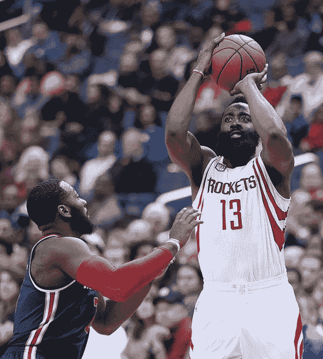
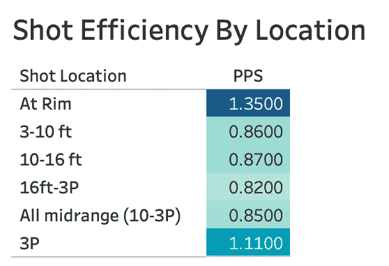
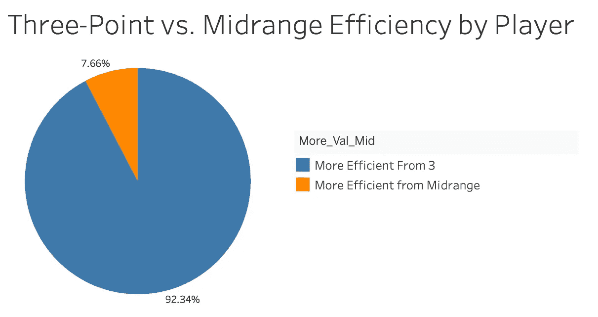
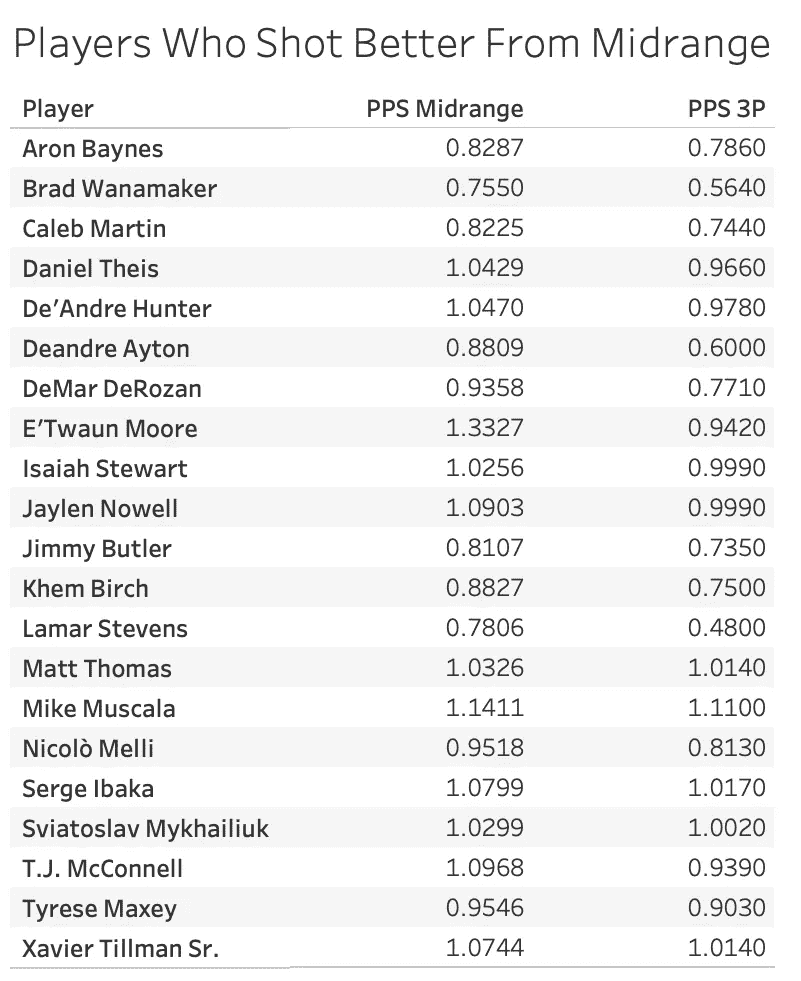
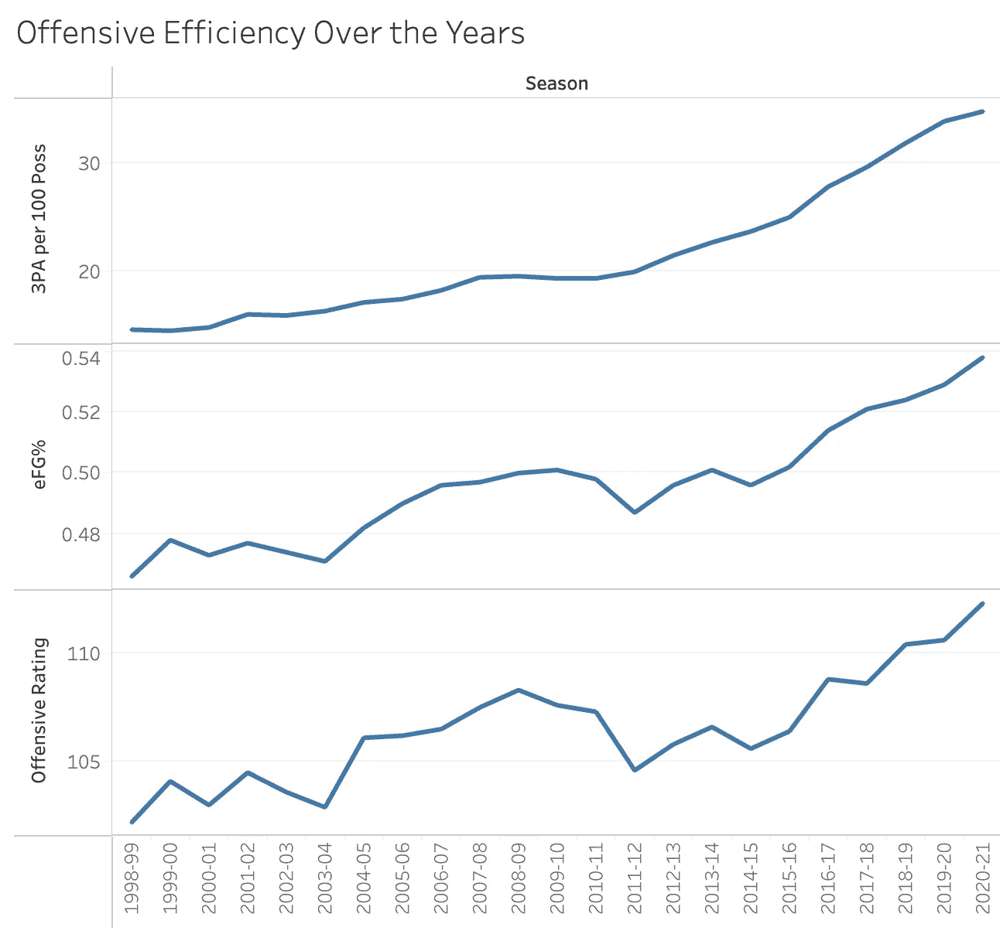

# 篮球分析，第 2 部分:投篮质量

> 原文：<https://towardsdatascience.com/part-2-shot-quality-5ab27fd63f5e?source=collection_archive---------13----------------------->

## 是的，3 比长 2 好，但这不是全部。

来自维基共享

所以我们已经到了你期待已久的时刻。在这篇文章中，我将解释为什么没有球员应该投中距离跳投。

我当然不会真的那么做。体育运动中很少有一成不变的事情。但是对于那些怀疑分析的人来说，我们将要讨论一个重要的争论点。到此结束时，对于为什么中距离投篮如此失宠，你应该有一些很好的答案了。但是我们的分析也将提出至少和它回答的一样多的问题。

# 数据怎么说？

让我们用最简单的方式来看这个问题。如果我们从 2020-2021 年 NBA 常规赛中取出所有投篮命中率，这些来自不同位置的投篮如何相互叠加？

突出显示使用 Tableau |作者图像创建的表格

在优化拍摄位置方面，有一个明显的赢家。离篮筐很近的投篮很好。但令人惊讶的是，当我们离开篮子时，效率下降的速度有多快。中距离跳投和篮下投篮(本质上是上篮和扣篮)的效率有着巨大的差异。

虽然三分球比中距离跳投稍微难一点(他们的 FG%更低)，但他们的效率更高。这也不是一个小差异。三分球平均每投 0.16 分(PPS)比平均中距离跳投更有效率。大多数 NBA 球队的节奏大约是每 48 分钟 100 次控球。所以在一场比赛中，我们期望一支只投中 3 分的球队比一支只投中 16 分的球队得分高。这是一个不容忽视的巨大差异。

# 有什么例外吗？

下一步我们可能要检验这个问题，看看是否有一些玩家逆势而为。在统计学中，我们喜欢把事物聚合在一起，然后取平均值。但是我们可以受益于更加精确。毕竟，有一些球员，我们认为是中端专家。所以让我们看看这些球员在中距离比在 3 距离时是否更有效率。

作者用 Tableau | Image 创建的饼图

我想看看在 2021 赛季，有多少球员在中距离投篮方面比三分球更有效率。我的样本只包括了至少有 100 个总进球数和 20 次中距离投篮和 3 分投篮的球员。在这 274 名球员中，只有 21 人的中距离投篮效率更高。这还不到所有玩家的 8%。其他球员在三分球范围内比在中距离范围内更有效率。是的，这包括像克里斯·保罗和科怀·伦纳德这样的优秀中距离射手。

作者用 Tableau | Image 创建的文本表格

因此，尽管对我们来说区别对待每个玩家很重要，但忽视仅基于少数玩家的压倒性证据并不是一个好主意。

# 这一切意味着什么

所有这些分析的最终目标是为决策提供信息。那么我们能从这些数据中得到什么呢？显而易见的答案是减少中距离跳投，增加上篮和三分球。但事情没那么简单。在一场篮球比赛中有两个队，另一个队想阻止你执行你的比赛。这意味着给定剧目的“最佳镜头”可能会根据上下文而变化。对方球队的防守方案是什么？谁在球场上？比赛还剩多少时间？比分是多少？这些都是玩家在决定拍摄哪些镜头或不拍摄时的相关问题。

看待镜头选择问题的一种方式是认识到效率并不存在于真空中。乔·哈里斯以场均 6.4 次出手的 47%的三分球率领先联盟。所以有人可能会说:“网队应该让他每次在球场上投三分球。”虽然这很有意思，但每个篮球迷都能直观地理解为什么这不会成功。乔·哈里斯如此高效的原因之一是他倾向于投好球，而不去管那些糟糕的球。除非球队在整体策略上做出一些重大改变，否则乔·哈里斯大幅增加投篮次数的唯一方法就是投更多糟糕的球。这反过来会降低他的整体效率。

所有这些都是为了说明我们从这个简单的分析中只能得到这么多。我们不能确切地告诉 NBA 的进攻应该如何运行，但我们可以根据我们看到的数据提出一些一般性的建议。

## 不要投长时间有争议的两分球

如果你已经读到这里，这一个应该是有意义的。长二型是最差的投篮类型，最差的长二型是面对防守者的投篮。除了深夜和比赛后期的情况，这些镜头最好保持原样(除非你的名字是凯文·杜兰特，在这种情况下，每个镜头都是开放的)。

## 外线球员应该切断长传，投 2 分球

三分球革命的很大一部分是强调间隔的概念。球队希望把优秀的射手放在场上，当他们无球时，让他们站在三分线外，而不是在三分线内。为什么？第一个原因基本上是我们整个分析的内容。我们宁愿争取三分，而不是两分。

但是还有一个原因。一般来说，你希望玩家尽可能分散。如果球员都挤在三分线内，那就更容易让对方防守。这使得持球者和低位球员更难获得空位投篮。但这也让射手们更难获得空位和保持空位。在 18 英尺的跳跃者身上比在 22 英尺的跳跃者身上要容易得多。

## 教练应该强调导致 3 分和上篮的方案

这个很明显。让你打好球的战术。

以下是我们根据这些数据无法得出的结论:

*   球员永远不应该投篮。
*   球员不应该练习投篮。
*   投篮不好的应该多投三分球。
*   即使在寒冷的时候，球队也应该继续从深处投篮。

其中一些问题可能值得研究，但它们不是我们已经完成的分析的结果。

三分球对改变 NBA 比赛起了很大作用。他们也帮助进攻提高了很多。很明显，3 和效率之间没有完美的关系。然而，三分尝试的急剧增加与 NBA 球队进攻效率的急剧增加相一致。

使用 Tableau |作者提供的图像创建的折线图

玩家跟踪数据无疑会给团队更多更好的工具来更深入地研究这个话题。此外，Thinking Basketball 最近[推出了一个很棒的视频](https://www.youtube.com/watch?v=mi2zD-5uu1o)，讨论了某些明星如何以及为什么仍然可以充分利用中距离投篮。

如果你想看看用于这种分析的 Python 代码，可以看看这个 [Jupyter 笔记本](https://github.com/sebasdarius/data_science_portfolio/blob/master/Intro_to_Basketball_Analytics/Part_2_Shot_Quality/Analysis.ipynb)。所有数据来自 Basketball-Reference.com。

感谢阅读！