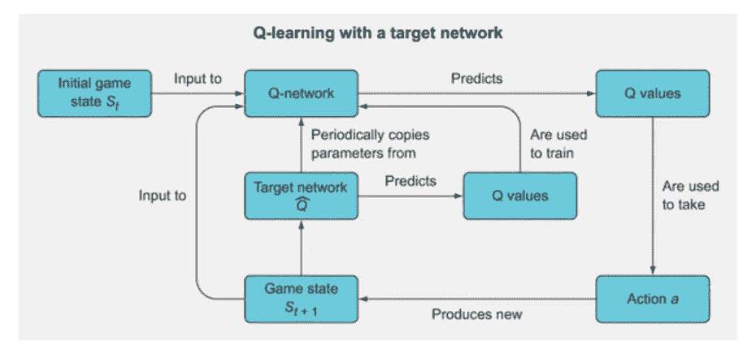
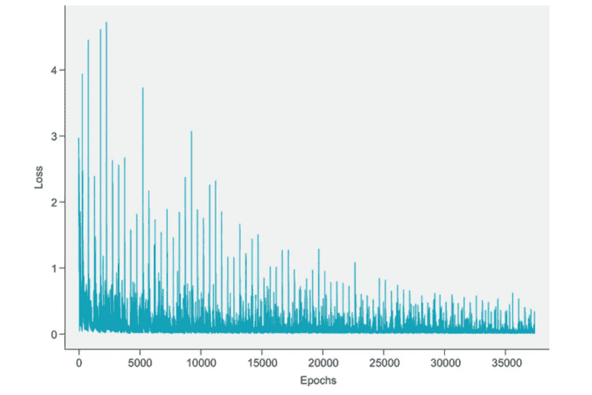

# 第 3 部分——构建深度 Q 网络来玩 grid world——学习不稳定性和目标网络

> 原文：<https://towardsdatascience.com/part-3-building-a-deep-q-network-to-play-gridworld-learning-instability-and-target-networks-fb399cb42616?source=collection_archive---------11----------------------->

> 在本文中，让我们了解什么是学习不稳定性，这是深度强化学习代理的一个常见问题。我们将通过实现目标网络来解决这个问题

欢迎来到深度 Q-网络教程的第三部分。这是[第一部分](https://nandakishorej8.medium.com/part-1-building-a-deep-q-network-to-play-gridworld-deepminds-deep-q-networks-78842007c631)和[第二部分](https://nandakishorej8.medium.com/part-2-building-a-deep-q-network-to-play-gridworld-catastrophic-forgetting-and-experience-6b2b000910d7)的延续。如果您还没有阅读这些，我强烈建议您阅读它们，因为本文中的许多代码和解释将与其中已经解释的直接相关。

**到目前为止的第一部分！！**

1.  我们从理解什么是 Q 学习和用于更新 Q 学习的公式开始
2.  后来我们看到了 GridWorld 游戏，并定义了它的状态、动作和奖励。
3.  然后我们想出了一个强化学习的方法来赢得比赛
4.  我们学习了如何导入 GridWorld 环境和环境的各种模式
5.  设计并建立了一个神经网络作为 Q 函数。
6.  我们对 RL 代理进行了训练和测试，在解决静态网格世界问题上取得了很好的效果。但我们未能解决随机网格世界。

**第二部！！**

1.  我们学习了什么是灾难性遗忘，以及它如何影响 DQN 特工
2.  我们通过实施经验回复解决了灾难性遗忘
3.  我们看到 DRL 学习不稳定。

在这篇文章中，我们将学习如何实现目标网络，以摆脱学习不稳定性

**什么是学习不稳定？？**

当 Q-network 的参数在每次移动后都被更新时，网络中存在不稳定的机会，因为奖励非常少(只有在赢或输时才会给出显著的奖励)。由于每一步都没有显著的回报，算法开始变得不稳定。

例如，在任何状态下，移动“向上”将赢得游戏，因此获得+10 作为奖励。我们的算法认为动作“向上”对于当前状态是好的，并更新其参数以预测该动作的高 Q 值。但是在下一场比赛中，网络预测高 Q 值为“向上”,这可能导致获得-10 奖励。现在我们的算法认为这个动作是坏的，并更新它的参数。然后一些游戏后来上升可以导致获胜。这将导致混乱，并且预测的 Q 值将永远不会满足于合理的稳定值。这与我们在上一篇文章中讨论的灾难性遗忘非常相似。

**设备一个重复的 Q-网络称为目标网络！！**

DeepMind 设计的解决方案是将 q 网络复制成两份，每份都有自己的模型参数:“常规”q 网络和一份名为*目标网络*(象征性地表示为 Q^-network，读作“q 帽子”)。在开始时，在任何训练之前，目标网络与 Q 网络是相同的，但是它自己的参数在如何更新方面落后于常规的 Q 网络。



图 1:目标网络的 Q 学习

上图显示了对目标网络的 Q-learning 的一般概述。这是普通 Q 学习算法的一个相当简单的扩展，除了你有第二个 Q 网络叫做目标网络，它的预测 Q 值被用来反向传播和训练主 Q 网络。目标网络的参数不被训练，但是它们周期性地与 Q 网络的参数同步。想法是使用目标网络的 Q 值来训练 Q 网络将提高训练的稳定性。

使用目标网络的步骤如下

1.  用参数(权重) *θ(Q)* 初始化 Q 网络(读作“θQ”)。
2.  将目标网络初始化为 Q 网络的副本，但具有单独的参数 *θ(T)* (读作“θT”)，并设置 *θ(T)* = *θ(Q)* 。
3.  使用ε贪婪方法选择具有 Q 网络的 Q 值的动作 a
4.  观察采取行动 a 后状态 s(t+1)的回报 r(t+1)
5.  如果剧集刚刚结束(即游戏是赢是输)，目标网络的 Q 值将被设置为 *r(t* +1)，否则将被设置为*r(t*+1)+*γ*max*Qθr*(*S(t*+1))
6.  通过 Q 网络反向传播目标网络的 Q 值。这里我们不使用 Q 网络的 Q 值，因为这会导致学习不稳定
7.  每 C 次迭代，用 Q-网络权重设置目标网络权重

让我们看看使用 PyTorch 实现目标网络

```
import copy

model = torch.nn.Sequential(
    torch.nn.Linear(l1, l2),
    torch.nn.ReLU(),
    torch.nn.Linear(l2, l3),
    torch.nn.ReLU(),
    torch.nn.Linear(l3,l4)
)

model2 = model2 = copy.deepcopy(model)        ***1***
model2.load_state_dict(model.state_dict())    ***2***
sync_freq = 50                                ***3***

loss_fn = torch.nn.MSELoss()
learning_rate = 1e-3
optimizer = torch.optim.Adam(model.parameters(), lr=learning_rate) 
```

*   ***1*** 通过制作原始 Q 网络模型的相同副本来创建第二个模型
*   ***2*** 复制原模型的参数
*   ***3*** 同步频率参数；每 50 步我们将把模型的参数复制到模型 2 中

让我们现在建立一个 DQN 与经验重放和目标网络

```
from collections import deque
epochs = 5000
losses = []
mem_size = 1000
batch_size = 200
replay = deque(maxlen=mem_size)
max_moves = 50
h = 0
sync_freq = 500                                    ***1***
j=0
for i in range(epochs):
    game = Gridworld(size=4, mode='random')
    state1_ = game.board.render_np().reshape(1,64) + np.random.rand(1,64)/100.0
    state1 = torch.from_numpy(state1_).float()
    status = 1
    mov = 0
    while(status == 1): 
        j+=1
        mov += 1
        qval = model(state1)
        qval_ = qval.data.numpy()
        if (random.random() < epsilon):
            action_ = np.random.randint(0,4)
        else:
            action_ = np.argmax(qval_)

        action = action_set[action_]
        game.makeMove(action)
        state2_ = game.board.render_np().reshape(1,64) + np.random.rand(1,64)/100.0
        state2 = torch.from_numpy(state2_).float()
        reward = game.reward()
        done = True if reward > 0 else False
        exp =  (state1, action_, reward, state2, done)
        replay.append(exp) 
        state1 = state2

        if len(replay) > batch_size:
            minibatch = random.sample(replay, batch_size)
            state1_batch = torch.cat([s1 for (s1,a,r,s2,d) in minibatch])
            action_batch = torch.Tensor([a for (s1,a,r,s2,d) in minibatch])
            reward_batch = torch.Tensor([r for (s1,a,r,s2,d) in minibatch])
            state2_batch = torch.cat([s2 for (s1,a,r,s2,d) in minibatch])
            done_batch = torch.Tensor([d for (s1,a,r,s2,d) in minibatch])
            Q1 = model(state1_batch) 
            with torch.no_grad():
                Q2 = model2(state2_batch)        ***2***
            Y = reward_batch + gamma * ((1-done_batch) * \
            torch.max(Q2,dim=1)[0])
            X = Q1.gather(dim=1,index=action_batch.long() \
            .unsqueeze(dim=1)).squeeze()
            loss = loss_fn(X, Y.detach())
            print(i, loss.item())
            clear_output(wait=True)
            optimizer.zero_grad()
            loss.backward()
            losses.append(loss.item())
            optimizer.step()

            if j % sync_freq == 0:               ***3***
                model2.load_state_dict(model.state_dict())
        if reward != -1 or mov > max_moves:
            status = 0
            mov = 0

losses = np.array(losses)
```

*   ***1*** 设置目标模型参数与主 DQN 同步的更新频率
*   ***2*** 使用目标网络获得下一状态的最大 Q 值
*   ***3*** 将主模型参数复制到目标网络

下面是目标网络的 DQN 的损失图



图 2:目标网络的损耗图

我们可以看到亏损有一个更稳定的下降趋势。试验超参数，例如经验重放缓冲区大小、批量大小、目标网络更新频率和学习速率。性能对这些超参数非常敏感。

当在 1000 个游戏上进行实验时，我们在准确率上比仅仅使用经验回放提高了 3%。现在准确率在 93%左右

这个项目的完整代码可以在这个 [GIT](https://github.com/NandaKishoreJoshi/Reinforcement_Lerning/blob/main/RL_course/Ch3_Gridworld/Part%203%20-%20Deep%20Q-learning%20for%20GridWorld%20-%20Complete%20code.ipynb) 链接中找到

点击这里查看本文的第 1 部分:

[https://nandakishorej 8 . medium . com/part-1-building-a-deep-q-network-to-play-grid world-deep minds-deep-q-networks-78842007 c631](https://nandakishorej8.medium.com/part-1-building-a-deep-q-network-to-play-gridworld-deepminds-deep-q-networks-78842007c631)

点击这里查看本文的第 2 部分:

[https://nandakishorej 8 . medium . com/part-2-building-a-deep-q-network-to-play-grid world-灾变-遗忘-体验-6b2b000910d7](https://nandakishorej8.medium.com/part-2-building-a-deep-q-network-to-play-gridworld-catastrophic-forgetting-and-experience-6b2b000910d7)