# 用 Spotify 构建歌曲推荐系统

> 原文：<https://towardsdatascience.com/part-iii-building-a-song-recommendation-system-with-spotify-cf76b52705e7?source=collection_archive---------3----------------------->

大卫·普帕扎在 [Unsplash](https://unsplash.com?utm_source=medium&utm_medium=referral) 上的照片

> 你有没有想过 Spotify 上的“推荐(基于播放列表中的内容)”部分是如何工作的？本文解决了部分谜团，并在此过程中构建了一个推荐。让我们来分解一下流媒体服务中的“推荐算法”。

# 语境

这是关于使用 Spotify 播放列表数据集建立自动播放列表延续(APC)算法的四篇文章系列中的一篇文章。在这里看到我队友之前和之后的文章。

1.  **第一部分** : [用 Python 从 Spotify 的 API 中提取歌曲数据](https://cameronwwatts.medium.com/extracting-song-data-from-the-spotify-api-using-python-b1e79388d50)
2.  **第二部分** : [EDA 和聚类](https://medium.com/p/6d755624f787/edit)
3.  **第三部分**:用 Spotify 搭建歌曲推荐系统
4.  **第四部分** : [用 Flask 部署 Spotify 推荐模型](https://medium.com/@yaremko.nazar/deploying-a-spotify-recommendation-model-with-flask-20007b76a20f)

现在我们已经学习了如何导入数据并在数据上构建聚类模型。我们现在来看看如何使用推荐系统来预测播放列表中的下一首歌曲。

# 介绍

当 **YouTubers** 在讨论最新的策略以获得更多的浏览量时，或者当你或你的朋友在**网飞**上比较“*推荐给你的*”列表时，你可能听说过“推荐系统(RS)”这个术语。简而言之，推荐系统 ***基于你自己的观看历史或者你和朋友作为一个集体观看历史，推荐人们可能喜欢的东西*** 。从一个非数据科学从业者的角度来看，这就是你需要了解的关于 RS 的全部内容…哦，但是你**是一个数据科学从业者**。如果是这样的话，我们需要更深入地挖掘推荐系统背后的思想和代码。

在我们深入研究 RS 和代码之前，让我们后退一步，澄清一些问题:

1.  *什么是推荐系统？* 正如我之前提到的，推荐算法的目标是基于用户的数据或基于整个用户数据库推荐或*预测用户可能喜欢的*项目。我们稍后会详细讨论如何做到这一点以及不同类型的推荐人，但现在，这里有一个概念性的管道来展示推荐一首歌曲的过程。

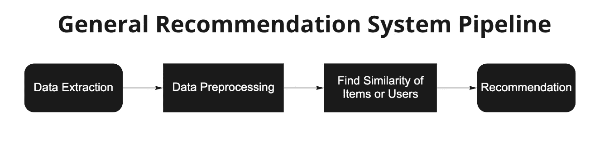

一般推荐系统管道。(图片由作者提供)

1.  *为什么要使用歌曲预测任务的推荐？另一个问题是为什么在歌曲预测任务中使用推荐系统。正如您在第二部分中读到的，可以使用基于聚类的算法来预测歌曲，但是，它缺乏向系统添加其他功能的灵活性，例如分类预测器。
    换句话说，基于聚类的算法是一种推荐系统。然而，与下面介绍的另外两种类型的 RS 相比，基于聚类的算法缺乏灵活性。事实上，*基于内容的过滤和协作过滤都可以将聚类结果包含到模型中，从而创建一个混合 RS。**

现在，让我简单介绍一下业界最常见的两个推荐系统。

# 推荐系统

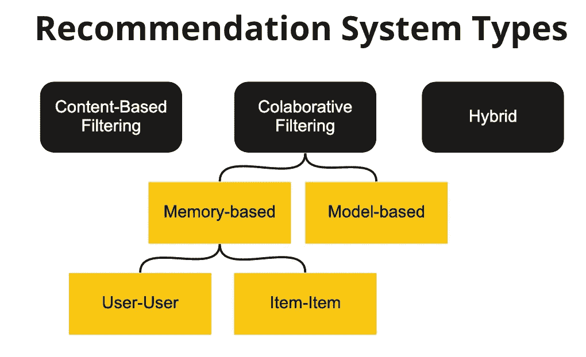

不同类型的推荐系统。(图片由作者提供)

根据应用过滤技术的对象，可以将粗糙集分为两类:基于内容的过滤和协同过滤。哇，这里有很多大词。让我解释一下。 ***过滤指的是“选择”*** *—* 我们选择的是彼此相似而非相异的特征。例如，从下面的话中:

> 你的单词包:猫、牛、鸟、桥

哪个单词是奇数？直观地，弹出“*桥*字样。*怎么来了？你可能会认为所有其他的动物都是一种动物。你也可以认为所有其他人都活着，所有其他人都有眼睛，等等。重点是:有一组独特的特征将*桥*与袋中的所有其他单词分开。*

现在，我们有了一个新词，*狗*，我们想知道什么词更接近包里的*狗*。很自然地，我们会说，“ ***狗*** *更类似于* ***猫*** *，* ***牛*** *，以及* ***鸟*** *，相比之下* ***桥*** ”如果有人问你原因，你会回答狗是一种动物，活着，有眼睛等等。

等等。这看起来很熟悉。是的，当你想要区分*桥*和袋子里的其他单词，或者准确地说，是**相同的特征集**时，你正在使用相同的过程。通过找到包中物品的相似之处，我们从本质上“过滤”了包中的*桥*。

瞧。您现在知道如何进行基于内容的过滤了！基于内容的过滤使用每个项目的特征来寻找相似性项目。通过对每个项目的相似程度进行评分，我们可以根据它与数据集中所有其他项目的相似程度来推荐一个项目。

在 Spotify 播放列表的上下文中，我们使用功能(响度、速度等。)来查找整个播放列表的平均分数。那么，我们推荐一首与播放列表评分相近，但不在播放列表中的歌曲。

> 基于内容的过滤:推荐与数据集中其他歌曲相似的歌曲。

> “但是，等等。你说的是另一种过滤。除了特征之外，还有什么不同的方法来选择和过滤包中的物品？”

好问题！根本就没有！另一种过滤不是过滤包里的物品，而是过滤包本身！迷茫？让我用同样的类比来解释:

现在，你的朋友带着另一袋单词进来，上面写着:

> 你朋友的话包:公路，隧道，钢铁，山羊。

使用我们之前的方法，我们可以看到，根据项目特征，新单词" *dog* "与你朋友的包相比，更类似于你的包，因为你包中的大多数单词是一种动物、有眼睛等。相比之下，你朋友的包里大部分都是没有生命的东西。

然而，有另一种方法来解决这个问题。如果你有一群朋友，他们有自己的词汇包，如下:

单词矩阵。(图片由作者提供)

如果单词在他们的包里，则值为“是”，否则为“否”。现在，我用红色表示“是”,蓝色表示“否”,并根据黑线将单词分成两部分。

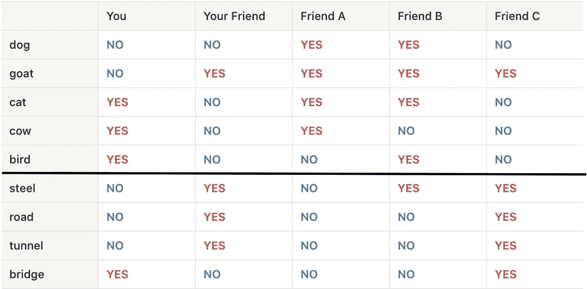

带注释的单词矩阵。(图片由作者提供)

我们看到黑线上面的字是动物，下面的字是无生命的物体。

现在，我不确定单词 *dog* 是否应该放在你或你朋友的包里，因为你们两个的包里都没有这个单词。为此，我进行了以下调查:

1.  我观察了你的朋友 A、B 和 C，看看他们的书包里都有什么单词。
2.  令人惊讶的是，我发现你和朋友 A 有 3 个不匹配，而你的朋友和朋友 c 只有 1 个不匹配。
3.  我检查了他们的包里有没有*狗*字样。
4.  朋友 A 有*狗*，朋友 C 没有*狗*。
5.  我把狗放在你的包里，而不是你朋友的。

我们看到，我们“ ***过滤了*** ”的数据是基于你和你朋友的共同点，或者换句话说， ***协作地*** 。您现在已经执行了**协同过滤(CF)** ！

因为你和你的朋友是包的主人，我们在你包里的物品中寻找相似之处，这种类型的协作过滤被称为**用户-用户 CF** ，重点放在用户之间持有的物品上。

在歌曲预测的上下文中，我们将查看每个播放列表中的歌曲的相似性，并且如果歌曲与另一个播放列表的相似性高并且该歌曲不在另一个播放列表中，则推荐一个播放列表中的歌曲。

> 协同过滤(CF):根据数据集中播放列表中歌曲的重叠部分推荐歌曲。

还有其他方法来进行协同过滤，包括**项目-项目 CF** 和更广泛的基于模型的伞状 CF**CF**，但是我们不会在本文中详细讨论。

*请参考 Abhijit Roy 的* [*这篇文章*](/introduction-to-recommender-systems-1-971bd274f421) *。*

# 履行

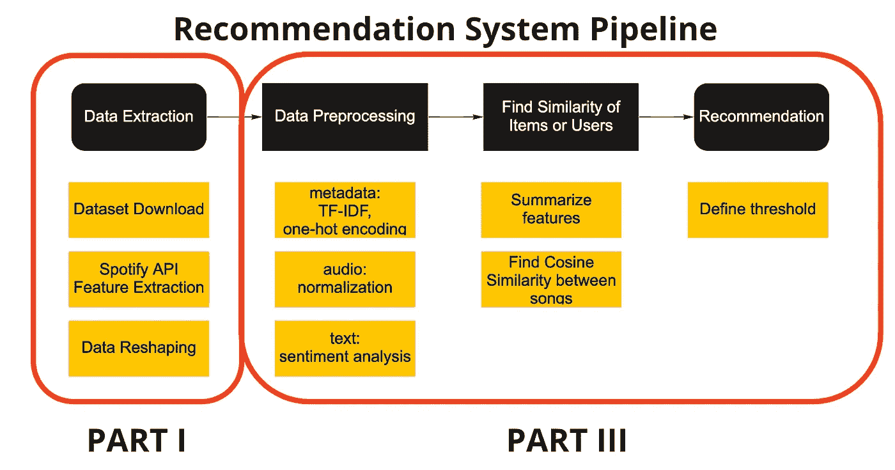

该项目的推荐系统管道。(图片由作者提供)

在这一节中，由于这个项目的限制，我将主要实现基于内容的过滤。

查看上面带注释的推荐系统管道，我们将首先根据从[第一部分](https://spotipy.readthedocs.io/en/2.19.0/)中清理的数据来查看 Spotify 数据的特征。然后，我们将进行特征工程，将数据处理成可以输入基于内容的过滤算法以及所使用的相似性度量的形式。最后，我们将很快讨论一些与模型相关的阈值和指标。

## 预处理

在提取任何特征之前，在导入提取的原始数据之后需要两个预处理步骤。

*   **数据选择**

数据选择程序包括两项任务。第一个是丢弃重复的歌曲。由于导入的数据最初是 Spotify 播放列表数据，因此删除多个播放列表之间存在的重复歌曲至关重要。该过程包括收集艺术家姓名和曲目标题，这样我们就不会意外删除同名但出自不同艺术家之手的歌曲。

这可以简单地通过 ***熊猫*** 数据帧操作来实现:

由于原始来源的数据丰富，我们希望在稍后的功能工程和推荐中选择与其他相关的功能(更多信息请参见[完整笔记本](https://github.com/enjuichang/PracticalDataScience-ENCA/blob/main/notebooks/content_based_recsys.ipynb))。这也是用 ***熊猫*** 进行的:

*   **列表拼接**

在选择了有用的数据后，由于 dataframe 的导入格式，我们需要将`genres`列转换回列表。

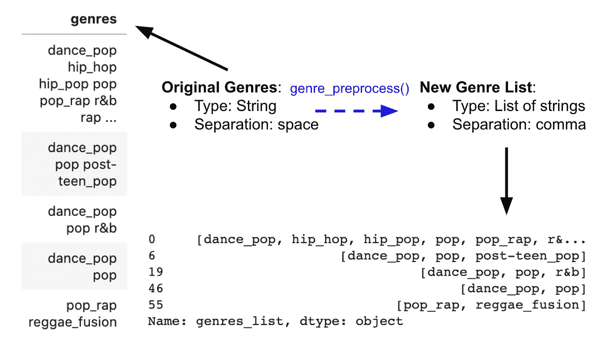

列表串联。图片作者。

这是通过使用`split()`功能完成的:

## 特征

下一步是对各种数据进行特征工程。我们可以根据数据的来源将数据中的变量分为三种类型，即元数据、音频数据和文本数据。

*   **元数据**

元数据指的是与歌曲相关的属性，而不是歌曲本身(例如，流行度和流派)。在这个项目中，我用两种方式处理元数据。

对于流派数据，我使用了 **one-hot encoding** ，这是一种将分类数据转换成机器可读特征的常用技术。这是通过将每个类别转换成一个列来实现的，这样每个类别可以表示为真或假。

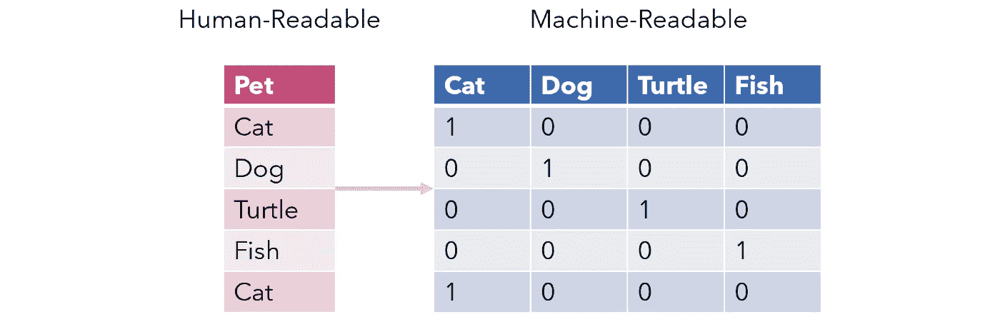

一键编码示例。图片由[安德烈·叶](https://andre-ye.medium.com/?source=post_page-----bbb0fba89809-----------------------------------)在[走向数据科学](/stop-one-hot-encoding-your-categorical-variables-bbb0fba89809)拍摄。

这可以使用 ***熊猫*** 包来执行:

然而，Spotify 中的流派分布并不均衡，一些流派更加流行，而另一些流派则更加模糊。此外，一个艺术家或曲目可以与多个流派相关联。因此，我们需要权衡每一个流派的重要性，以防止过分看重特定流派而低估其他流派。

因此， **TF-IDF 度量**被引入并应用于类型数据。TF-IDF，也称为词频-逆文档频率，是一种对一组文档中的词进行量化的工具。TF-IDF 的目标是显示一个词在文档和语料库中的重要性。计算 TF-IDF 的一般公式为:

*   **词频(TF)** :一个词在每个文档中出现的次数除以文档中的总字数。
*   **逆文档频率(IDF)** :文档频率的对数值。文档频率是出现一个术语的文档总数。

这样做的目的是找到不仅在每个文档中重要，而且在整个语料库中也很重要的单词。取对数值是为了降低大 N 的影响，大 N 会导致与 TF 相比非常大的 IDF。TF 关注的是一个单词在文档中的重要性，而 IDF 关注的是一个单词在文档中的重要性。

在这个项目中，文档类似于歌曲。因此，我们正在计算每首歌曲中最突出的流派及其在歌曲中的流行程度，以确定流派的权重。这比简单的一键编码好得多，因为没有权重来确定每个流派的重要性和广泛程度，导致不常见流派的权重过大。

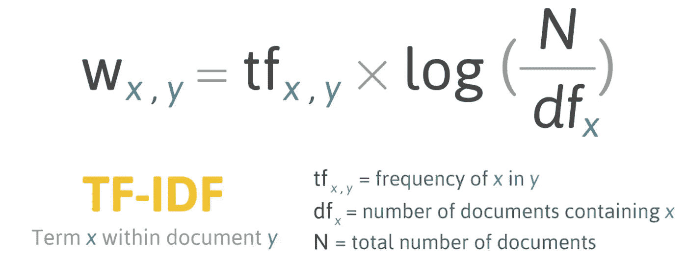

TF-IDF 公式。图片由[泰德·梅](https://ted-mei.medium.com/demystify-tf-idf-in-indexing-and-ranking-5c3ae88c3fa0)提供。

为了实现这一点，我们使用了来自 ***scikit learn*** 的 *TfidfVectorizer()* 函数。

对于流行度数据，我把它当作一个连续变量，只有**把**归一化到 0 到 1 之间。这个想法是流行的歌曲很可能被喜欢流行歌曲的人听到，而不太流行的歌曲很可能被有相同品味的人听到。

这是通过 ***scikit learn*** 中的***minmax scaler()***函数完成的:

*   **音频**

音频数据是指使用 Spotify API 提取的歌曲的音频特征。例如，响度、速度、可跳舞性、能量、语速、声学、乐器性、活跃度、效价和持续时间。在这个项目中，我对这些数据进行的唯一操作是根据每个变量的最大值和最小值进行标准化。

此外，还对其他几个音频特征进行了一键编码，比如音轨的*键*。这种方法的限制类似于一键编码——我们不知道人们是否平等地看待不同的键。通过假设每个键的权重相等，不太可能从数学上获得数据的最佳表示。因此，可能需要调整超参数来改善预测。

*   **正文**

我最终使用的唯一文本特征是曲目名称。我进行了**情感分析**，找到了曲目名称的*极性*和*主观性*。

*   **主观性** (0，1):文中包含的个人观点和事实信息的多少。
*   **极性** (-1，1):表示否定的强烈或明确的情感程度。

情感分析的目标是从音轨中提取额外的特征。通过这样做，我们可以通过文本信息提取情感数据和其他音频特征。例如，如果播放列表的歌曲标题的总体情绪是积极的，那么这可以用来推荐积极的歌曲。然而，由于标题的长度较短，这两个指标无法产生最佳结果。因此，这两个指标的权重被评为低。

为了进行情感分析，使用了 ***TextBlob .情操*** :

现在，我们将每种特征工程方法结合成一个功能，并将数据输出到一个大的特征数据框架中:

## 过程

在提取了每首歌曲的所有数据之后，我们现在讨论执行基于内容的过滤算法的过程。该算法分两步实现。每当有人输入新的播放列表查询时，都需要这两个步骤:

*   **播放列表摘要**

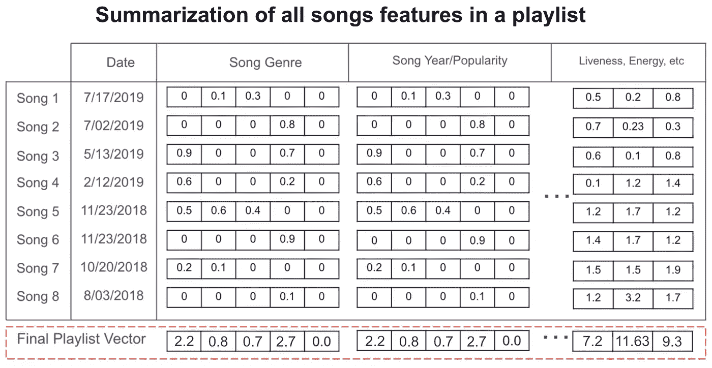

总结流程图。图片由 [Madhav Thaker](https://github.com/madhavthaker/spotify-recommendation-system/blob/main/spotify-recommendation-engine.ipynb) 和修改作者提供。

在这一步中，我们希望将播放列表中的所有歌曲汇总到一个向量中，该向量可以与数据集中的所有其他歌曲进行比较，以找到它们的相似性。

首先，我们需要导入一个 ***播放列表数据帧*** 。数据帧中唯一需要的是*轨道 id* 。有了*曲目 id* 数据，我们可以首先区分播放列表中的歌曲和不在播放列表中的歌曲。从播放列表中排除歌曲很重要，因为我们不想推荐现有的歌曲。

然后，我们根据上一节中生成的数据集找到这些歌曲的特征。因此，重要的是我们的**数据集包括尽可能多的歌曲**，以降低在此步骤中 ***与播放列表*** 中的歌曲不匹配的可能性。

最后，我们将播放列表中每首歌曲的所有特征值加在一起作为摘要向量。

> 换句话说，这个向量描述了整个播放列表，就好像它是一首歌一样。

*   **相似性和推荐**

在检索播放列表概括向量和非播放列表歌曲之后，我们可以找到数据库中的每首歌曲和播放列表之间的相似性。选择的相似性度量是**余弦相似性**。

余弦相似度是一个衡量向量之间相似性的数学值。想象我们的歌曲向量仅仅是二维的，视觉表示看起来类似于下图。

余弦相似性度量插图。图片由 [DeepAI](https://deepai.org/machine-learning-glossary-and-terms/cosine-similarity) 提供。

一旦这两个向量大体上指向相同的方向，那么它们是相似的。这也是为什么我没有找到歌曲的意思，只是简单地把它们加起来。在我们的情况下，歌曲向量是超多维的，所以我们不能用图表很好地说明它。然而，数学直觉仍然是一样的。

形式上，数学公式可以表示为:

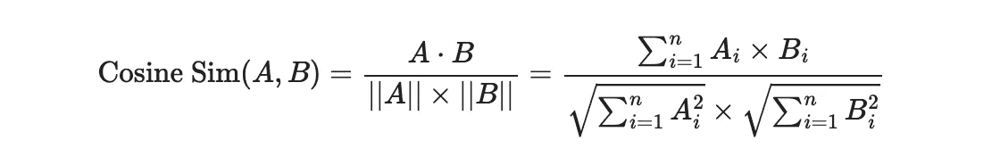

在我们的代码中，我们使用了来自`scikit learn`的`cosine_similarity()`函数来测量每首歌曲和摘要播放列表向量之间的相似性。

这样做的一个很大的优点是整个算法的时间复杂度等于一个矩阵乘法，因为我们正在执行每个行向量(歌曲)和概括的播放列表特征的列向量之间的余弦相似性度量。

# 结果

这种模式最大的一个问题是，几乎没有衡量推荐好坏的指标。因为在这个项目中，第二部分采用了基于聚类的方法。我们决定比较这两个建议，看看是否有任何共识。

## 比较

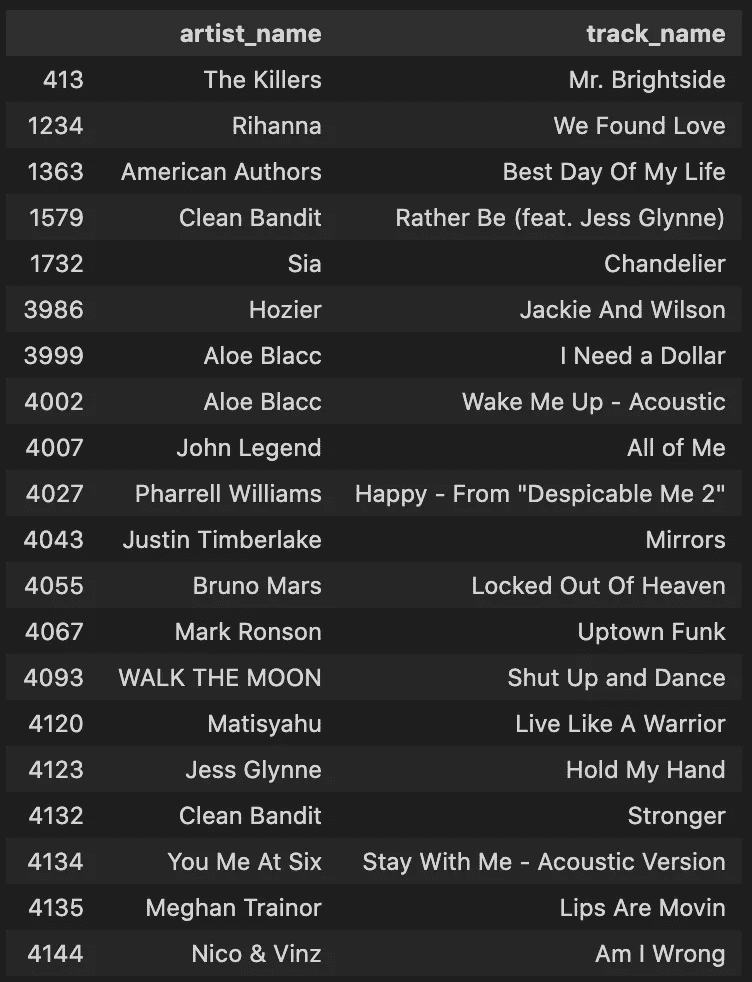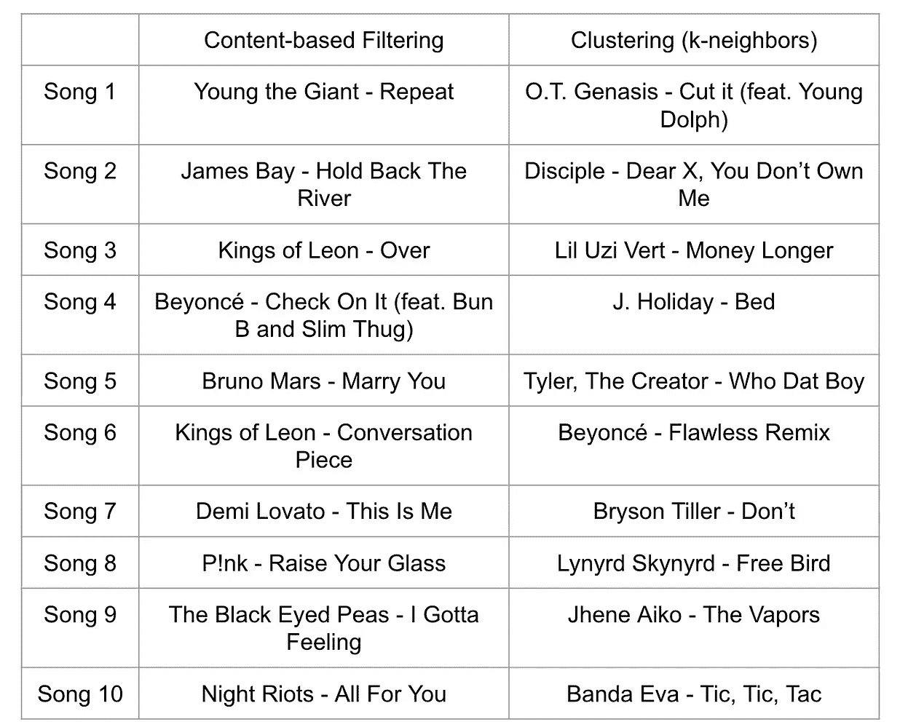

妈妈播放列表前 20 首歌(左)和两种推荐算法的推荐结果(右)。图片由作者提供。

为了比较不同推荐系统的结果，我们找到了这个名为“妈妈的播放列表”的播放列表，并将数据输入到我们不同的引擎中。(左上图显示了妈妈播放列表中的前 20 首歌曲)

从上图中，我们看到结果非常不同。这里，这两种方法是基于内容的过滤方法和使用 K-最近邻的聚类方法。关于后者的更多信息，请阅读本系列的第二部分。我们看到，在所有的列表中，唯一的相似之处是碧昂斯出现在其中的两个列表中——然而，歌曲并不匹配。结果的差异可能表明两种可能性。最有可能的原因是这两款机型都表现不佳。这可能是因为数据集大小、缺少超参数调整或模型约束。但是，也有一种可能，其中一个型号的性能最好，而另一个型号的性能跟不上。不管是哪种情况，这都显示了没有合适的度量来训练模型的问题，从而导致缺乏可以帮助改进模型的衡量成功的技术。

最后，这也显示了大型科技公司在推荐系统领域的优势。在开源环境中，如果不部署和接收用户的反馈，就很难衡量系统的成功。在歌曲推荐方面，这可以是将推荐的歌曲添加到他们的播放列表中的用户数量。通过查看指标，我们可以执行 A/B 测试，以查看哪个模型或参数执行得最好，并相应地更新模型。然而，理解推荐系统会给你在这个领域取得成功打下坚实的基础。希望在读完这篇文章后，你会更加清楚地了解这个声名狼藉但却必不可少的“推荐算法”的黑箱。

# 摘要

在本文中，我们首先学习了推荐系统的基础知识，包括基于内容的过滤和协同过滤这两种常用方法。然后，我们从零开始使用 Spotify 播放列表数据构建了一个基于内容的过滤推荐系统。这包括特征预处理、特征生成和推荐建模的过程。我们还讨论了每个部分的一些约束条件，以表明该方法可以进一步优化，以获得更好的结果。最后，我们将该推荐与其他歌曲推荐系统进行了比较，特别是聚类方法，并看到了在开源环境中衡量推荐系统成功的困难。

在构建模型之后，如果不知道如何部署它，就不能对它做任何事情！如果你想了解这个模型的部署过程，请阅读我的队友在[系列](https://medium.com/@enjui.chang/enhance-your-playlists-with-machine-learning-spotify-automatic-playlist-continuation-2aae2c926e77)中关于[模型部署](https://medium.com/@yaremko.nazar/deploying-a-spotify-recommendation-model-with-flask-20007b76a20f)的部分。

# 参考

*   [Github 上的全笔记本](https://github.com/enjuichang/PracticalDataScience-ENCA/blob/main/notebooks/content_based_recsys.ipynb)
*   [完整的项目 Github 库](https://github.com/enjuichang/PracticalDataScience-ENCA)
*   谷歌开发者，[基于内容的过滤](https://developers.google.com/machine-learning/recommendation/content-based/basics) (2021)
*   A.罗伊，[推荐系统介绍- 1:基于内容的过滤和协作过滤](/introduction-to-recommender-systems-1-971bd274f421) (2020)，迈向数据科学
*   米（meter 的缩写））Thaker， [Spotify 推荐系统](https://github.com/madhavthaker/spotify-recommendation-system) (2020)，在 Github 上
*   W.Scott， [TF-IDF 在真实世界数据集上用 python 从头开始。](/tf-idf-for-document-ranking-from-scratch-in-python-on-real-world-dataset-796d339a4089) (2019)，走向数据科学
*   页（page 的缩写）Shah，[使用 TextBlob](/my-absolute-go-to-for-sentiment-analysis-textblob-3ac3a11d524) (2020)进行情感分析，迈向数据科学
*   Spotipy， [spotipy 文档](https://spotipy.readthedocs.io/en/2.19.0/)(未注明)