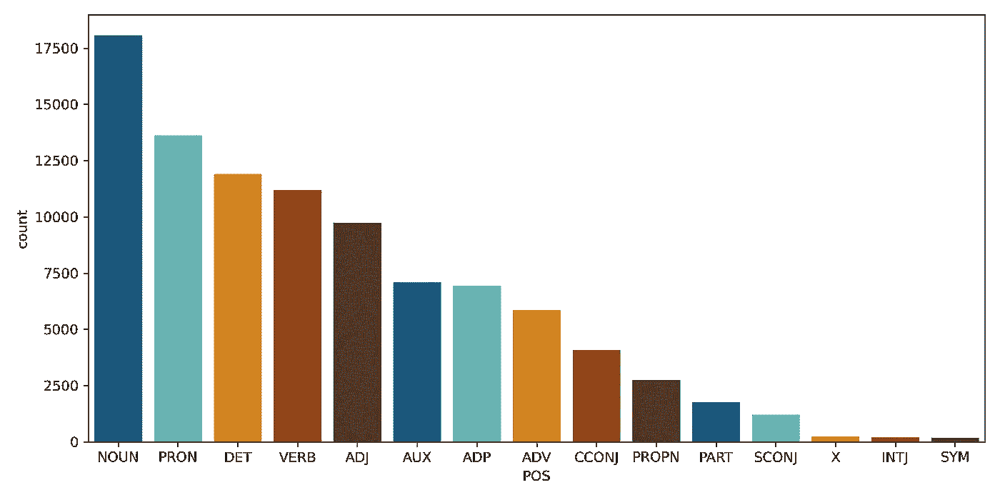

# 词性标注快速指南

> 原文：<https://towardsdatascience.com/part-of-speech-tagging-514c25fd7882?source=collection_archive---------12----------------------->

## 利用 NLP 的这一重要组成部分来执行客户意见分析


亚历山大·佩莱斯在 [Unsplash](https://unsplash.com?utm_source=medium&utm_medium=referral) 上拍摄的照片

# 什么是词类？

词性是描述单词语法功能的一种方式。在自然语言处理(NLP)中，词性是语言模型和解释文本的基本构件。虽然在 NLP 的高级功能中使用了 POS 标签，但是理解它们本身是很重要的，并且可以在文本分析中利用它们达到有用的目的。

英语中有八种(有时是九种)不同的词类被普遍定义为**。[布特学院](https://www.butte.edu/departments/cas/tipsheets/grammar/parts_of_speech.html)介绍以下定义:**

> 名词:名词是一个人、地方、事物或想法的名称。
> **代词**:代词是用来代替名词的词。
> **动词**:动词表示动作或存在。
> **形容词**:形容词修饰或描述名词或代词。副词:副词修饰或描述一个动词、一个形容词或另一个副词。
> **介词**:介词是放在名词或代词前的词，构成短语，修饰句子中的另一个词。
> **连词**:连词连接单词、短语或从句。
> **感叹词**:感叹词是用来表达情感的词。
> **限定词或冠词**:表示确定(the)或不确定(A，an)的语法标记。这些并不总是被认为是词性，但通常包含在词性标注库中。

# 词性标注的基础

让我们从一些简单的例子开始，这些例子使用了三个常见的 Python 库:NLTK、TextBlob 和 Spacy。我们将为每一个做绝对的基础，并比较结果。

从导入所有需要的库开始。

```
import nltk

from textblob import TextBlob
from textblob.taggers import PatternTagger

import spacy
```

在我们的例子中，我们将使用两个带有一个常用词的句子， *book* ，这个词可以是名词也可以是动词，来测试词性标注在上下文中的表现。

*   请帮我订一张去加州的机票
*   *我读了一本非常好的书*

# NLTK

先说 Python 中 NLP 最常见的库；自然语言工具包或 **NLTK** 。

```
tokenized_sent = nltk.sent_tokenize("Please book my flight to California")
[nltk.pos_tag(nltk.word_tokenize(word)) for word in tokenized_sent]
```

```
[[('Please', 'NNP'),
  ('book', 'NN'),
  ('my', 'PRP$'),
  ('flight', 'NN'),
  ('to', 'TO'),
  ('California', 'NNP')]]
```

```
tokenized_sent = nltk.sent_tokenize("I read a very good book")
[nltk.pos_tag(nltk.word_tokenize(word)) for word in tokenized_sent]
```

```
[[('I', 'PRP'),
  ('read', 'VBP'),
  ('a', 'DT'),
  ('very', 'RB'),
  ('good', 'JJ'),
  ('book', 'NN')]]
```

我们在这里注意到的是，在大多数情况下， **NLTK** 正确地识别了上下文中的单词；然而，在我们的第一句话中，有几个错误，如 *Please* 被标记为*专有名词(NNP)* 和 *book* 被标记为*名词(NN)* ，而它应该是一个*动词(VB)* 。

**注意:**关于标签含义的列表，请参见 [Penn Treebank 项目](https://www.ling.upenn.edu/courses/Fall_2003/ling001/penn_treebank_pos.html)。

# 文本 Blob

让我们试试另一个名为 **TextBlob** 的库，它提供了一个简单的 API 来执行标准的自然语言处理(NLP)任务。这是 NLP 库的一个非常好的 Pythonic 实现，简化了一些常见的 NLP 任务。 **TextBlob** 做的大部分事情是*包装 NLTK* 和其他流行的 NLP 库，使它们更容易使用。

```
blob = TextBlob("Please book my flight to California", pos_tagger=PatternTagger())
blob.tags
```

```
[('Please', 'VB'),
 ('book', 'NN'),
 ('my', 'PRP$'),
 ('flight', 'NN'),
 ('to', 'TO'),
 ('California', 'NNP')]
```

```
blob = TextBlob("I read a very good book", pos_tagger=PatternTagger())
blob.tags
```

```
[('I', 'PRP'),
 ('read', 'VB'),
 ('a', 'DT'),
 ('very', 'RB'),
 ('good', 'JJ'),
 ('book', 'NN')]
```

注意在 Blob 的初始化中使用了`PatternTagger`。默认情况下使用 NLTK 的 tagger，产生与上面相同的结果。这允许我们尝试不同的 POS Tagger 并检查其性能。我们可以看到 **TextBlob** 这次正确地将 *Please* 识别为*动词*但在第一句中仍然遗漏了 *Book* 为*动词*。

# 空间

Spacy 是这三款中最现代、最先进的。它对于大量的 NLP 任务来说非常健壮，如果需要更多的能力，还可以进行定制。这是我目前最喜欢的 NLP 库，让我们用我们的句子来看看吧。

```
doc = nlp("Please book my flight to California")
for token in doc:
    print(token.text, token.pos_)
```

```
Please INTJ
book VERB
my PRON
flight NOUN
to ADP
California PROPN
```

```
doc = nlp("I read a very good book")
for token in doc:
    print(token.text, token.pos_)
```

```
I PRON
read VERB
a DET
very ADV
good ADJ
book NOUN
```

我们在这里看到 **Spacy** 正确地标记了我们所有的单词，它将 *Please* 识别为一个*感叹词*而不是一个*动词*，后者更准确，并且在第一句中还将 *Book* 识别为一个*动词*。

这些库各有利弊。我相信你应该从 NLTK 开始理解它是如何工作的，特别是因为它对不同的语料库有如此强大的支持。当你想要简单的处理几个 NLP 任务时，TextBlob 是很棒的，当你想要一个最健壮的 NLP 库时，text blob**Spacy**是很棒的。

看看这个伟大的自然语言系列 [NLTK 和 Python](https://pythonprogramming.net/tokenizing-words-sentences-nltk-tutorial/)来自*PythonProgramming.net*。

# 用词类分析客户之声

NLP 执行的最常见的任务之一是分析来自各种来源的客户反馈，并确定客户对您的产品或服务的评价。这种类型的分析称为**客户分析之声**或 **VOC** 。

有许多方法可以进行 VOC 分析。从*情感分析*到*话题建模*，你可以使用的一种方法是词性标注来缩小*客户在谈论什么*以及*他们如何谈论你的产品和服务。*

用于分析的文本可以来自调查回复、支持票、脸书评论、推文、聊天对话、电子邮件、电话记录和在线评论。假设您有一个客户评论集。你可能想确定的事情之一是人们正在谈论的所有**产品**。您可能在数据库中有一个完美的产品分类，但是如果您没有达到您需要的粒度级别呢？对于这个例子，我们将使用 Kaggle 上[女装电商服装评论](https://www.kaggle.com/nicapotato/womens-ecommerce-clothing-reviews)的数据集。

导入数据集后，我们可以为所有单词及其 POS 标签创建一个新的**数据帧**。下面的函数获取每个评论并确定每个单词的 POS 标签；一个**重要的**区别，因为我们得到了句子中每个单词的*上下文*，正如我们在上面看到的，这对于关联哪个 POS 标签有很大的区别。

```
def pos_tag(text):
    df = pd.DataFrame(columns = ['WORD', 'POS'])
    doc = nlp(text)
    for token in doc:
        df = df.append({'WORD': token.text, 'POS': token.pos_}, ignore_index=True)
    return df
```

接下来，我们可以对评论的子集运行该函数。由于我们使用的是单个单词，数量可能是数百万，我们很可能不需要整个数据集。

```
# Take a random sample of reviews
df2 = df.sample(10000, random_state=42).copy()
# Create an empty dataframe to store the results
df_pos = pd.DataFrame(columns = ['WORD', 'POS'])
# Iterate through the reviews and append each POS tag to the dataframe
df_pos = pos_tag(df2['Review Text'].to_string())
df_pos.shape
```

```
(144498, 2)
```

接下来，我们可以对每个 POS 标签进行分组和计数，以查看使用频率最高的标签。

```
df_top_pos = df_pos.groupby('POS')['POS'].count().\
    reset_index(name='count').sort_values(['count'],ascending=False).head(15)
```



作者图片

太好了！我们有很多标签和单词。然而，这些标签本身并不能告诉我们太多，只能让我们看到不同标签的分布情况。然而，现在我们可以使用我们的标签来提取可能代表**产品**的词，而不是那些代表我们评论中其他词的词。为此，我们可以只过滤**名词**。

```
df_nn = df_pos[df_pos['POS'] == 'NOUN'].copy()
df_nn.groupby('WORD')['WORD'].count().reset_index(name='count').\
    sort_values(['count'], ascending=False).head(10)
```

```
 WORD  COUNT
667     dress   1779
2062      top   1176
1764    shirt    463
1971  sweater    437
453     color    383
1807     size    312
765    fabric    287
1922    store    274
1822    skirt    256
1416    pants    246
```

看那个！我们有这个评论子集中使用的前 15 个词，其中大多数看起来像产品类别。如果我们现在查看相同评论子集的顶级形容词会怎么样？

```
df_adj = df_pos[df_pos['POS'] == 'ADJ'].copy()
df_adj.groupby('WORD')['WORD'].count().reset_index(name='count').\
    sort_values(['count'], ascending=False).head(15)
```

```
 WORD  COUNT
400        great    481
144    beautiful    405
248         cute    398
784         soft    321
218  comfortable    272
632      perfect    243
585         nice    196
776        small    176
41         Great    149
666       pretty    146
394     gorgeous    144
511       little    142
611        other    142
523       lovely    125
349   flattering    122
```

忠太🎉！描述*顾客如何*谈论我们产品的最常用词。我们有很多积极的词汇，但也有一些词汇可能值得研究。像*小号*和*小号*这样的东西潜在地说明了尺码问题，有些衣服不太合身。产品经理可以利用这些信息，更深入地研究提到这个词的评论。

如上所述，还有其他可能更好的方法来分析文本，比如情感分析和主题建模。然而，这是一种在实际用例中应用 POS 标记的有趣方式，甚至可以与其他 NLP 工具结合使用，以帮助您最大限度地利用客户的反馈。

这个分析的所有代码都可以在 [GitHub](https://github.com/broepke/POS) 上获得。

如果你喜欢阅读这样的故事，并想支持我成为一名作家，可以考虑报名成为一名媒体成员。一个月 5 美元，让你可以无限制地访问成千上万篇文章。如果你使用[我的链接](https://medium.com/@broepke/membership)注册，我会赚一小笔佣金，不需要你额外付费。

# 参考

[维基百科上的词性](https://en.wikipedia.org/wiki/Part_of_speech)

[标注在自然语言处理中有哪些应用？](https://www.quora.com/What-are-the-applications-of-tagging-in-NLP)

[八种词性](https://www.butte.edu/departments/cas/tipsheets/grammar/parts_of_speech.html)